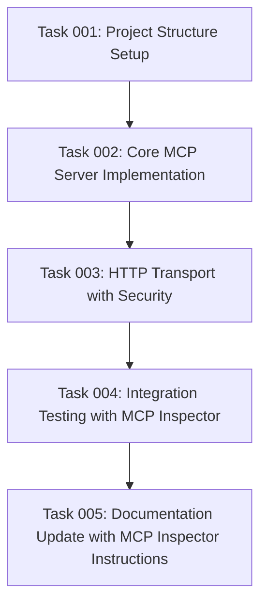

# Plan: Basic MCP Server Foundation

## Original Work Order

> Setup the basic MCP server, as described by @.ai/task-manager/docs/specs/01--basic-mcp-server.md
> Make sure to keep the current project setup & tooling (even fix it if broken).

## Executive Summary

This plan establishes the foundational **MCP Server** with HTTP streamable transport capabilities,
providing the core infrastructure for all subsequent features. The implementation will create a
working **MCP Server** that accepts connections from **MCP Clients** via HTTP protocol and handles
basic JSON-RPC 2.0 communications while maintaining the current project's minimal architecture (336
lines vs 6000 lines approach).

The approach leverages the existing project structure and tooling while rebuilding the missing
source implementation. We'll create a minimal but complete MCP server that focuses on the essential
protocol requirements: HTTP transport with Server-Sent Events, session management, CORS support, and
DNS rebinding protection.

Key benefits include establishing a robust foundation for future Drupal integration features while
maintaining the project's philosophy of radical simplification over enterprise complexity.

## Context

### Current State

The project repository contains a complete package.json setup with proper MCP SDK dependencies,
TypeScript configuration, and development tooling, but is missing the actual source implementation.
The configuration indicates this was previously a "minimal Drupal MCP Server" with 336 lines versus
a 6000-line enterprise version. The existing .env file shows OAuth 2.0 configuration for Drupal
integration, and the .mcp.json file contains proper MCP server configuration for npm run dev
execution.

Current limitations include:

- No src/ directory or source files exist
- npm run build and npm run dev fail due to missing source implementation
- Dependencies are installed but no actual MCP server code exists
- Project documentation indicates sophisticated OAuth + Drupal features but no implementation

### Target State

A functional **MCP Server** that starts successfully, accepts **MCP Client** connections over HTTP,
and provides basic health check functionality. The server will implement the complete MCP protocol
foundation including:

- HTTP streamable transport with Server-Sent Events
- Unique session ID generation and management
- JSON-RPC 2.0 message handling
- CORS configuration for browser-based clients
- DNS rebinding protection
- Compatibility with MCP Inspector for validation

### Background

This is the first phase of rebuilding a sophisticated Drupal MCP integration server. The original
implementation philosophy emphasizes minimal viable implementation over enterprise complexity. The
project aims to provide identical functionality to a 6000-line enterprise system with dramatically
simplified code. Future phases will add OAuth authentication and Drupal-specific tools, but this
foundation phase focuses solely on the MCP protocol essentials.

## Technical Implementation Approach

### Core MCP Server Infrastructure

**Objective**: Create the basic MCP server class that handles protocol initialization, capability
negotiation, and connection management.

The implementation will use the @modelcontextprotocol/sdk directly, creating a minimal server class
that registers basic capabilities and handles the JSON-RPC 2.0 protocol. The server will implement
the standard MCP initialization handshake, capability reporting, and maintain session state in
memory as specified in the requirements.

### HTTP Transport Implementation

**Objective**: Implement HTTP streamable transport with proper security measures and session
management.

Using Express.js as specified in the requirements, we'll create HTTP endpoints that handle MCP
client connections. The implementation will support both single HTTP responses and Server-Sent
Events for streaming communications. Security features include CORS configuration, origin header
validation, localhost binding, and DNS rebinding protection. Session IDs will be generated using
Node.js native crypto support and maintained in server memory.

### Development Tooling Integration

**Objective**: Ensure the server works seamlessly with existing project development and build
processes.

The implementation will integrate with the existing TypeScript configuration, npm scripts (dev,
build, start), and MCP configuration in .mcp.json. We'll maintain the project's ES2022 target and
ESNext module system while ensuring compatibility with tsx for development and tsc for production
builds.

## Risk Considerations and Mitigation Strategies

### Technical Risks

- **MCP SDK Compatibility**: The @modelcontextprotocol/sdk version may have breaking changes from
  documentation examples
  - **Mitigation**: Test with actual SDK API documentation and use TypeScript for compile-time
    validation

- **HTTP Transport Complexity**: Implementing streamable HTTP transport with SSE may introduce
  connection handling issues
  - **Mitigation**: Start with simple HTTP responses, then incrementally add SSE streaming
    capabilities

### Implementation Risks

- **Session Management Memory Leaks**: In-memory session storage could cause memory issues with many
  clients
  - **Mitigation**: Implement session timeout and cleanup mechanisms, monitor memory usage patterns

- **Security Configuration Gaps**: CORS and DNS rebinding protection may be incorrectly configured
  - **Mitigation**: Follow MCP specification security guidelines exactly, test with MCP Inspector
    validation

### Quality Risks

- **MCP Protocol Compliance**: Server may not fully comply with JSON-RPC 2.0 or MCP specification
  requirements
  - **Mitigation**: Use MCP Inspector for comprehensive protocol validation and compliance testing

## Success Criteria

### Primary Success Criteria

1. **MCP Server starts successfully** and listens on configured port (default 3000)
2. **MCP Inspector connection succeeds** and validates basic protocol compliance
3. **Session management works correctly** with unique ID generation and proper cleanup
4. **HTTP transport functions properly** with both request/response and SSE patterns

### Quality Assurance Metrics

1. **TypeScript compilation succeeds** without errors using npm run build
2. **Development server runs** successfully using npm run dev
3. **MCP Inspector validation passes** all basic protocol checks
4. **Health check endpoint responds correctly** to MCP client requests

## Resource Requirements

### Development Skills

- TypeScript and Node.js expertise for server implementation
- JSON-RPC 2.0 protocol understanding for message handling
- HTTP/SSE streaming knowledge for transport implementation
- MCP specification familiarity for protocol compliance

### Technical Infrastructure

- @modelcontextprotocol/sdk for core MCP functionality
- Express.js for HTTP server framework
- Node.js 18+ with native crypto support for session management
- TypeScript 5.9+ for type-safe development environment
- MCP Inspector for protocol validation and testing

## Implementation Order

1. **Project Structure Setup**: Create src/ directory and basic file structure following existing
   tsconfig paths
2. **Core MCP Server**: Implement basic server class with MCP SDK integration and capability
   registration
3. **HTTP Transport Layer**: Add Express.js server with basic endpoint handling and CORS
   configuration
4. **Session Management**: Implement in-memory session storage with unique ID generation and cleanup
5. **Streamable Transport**: Add Server-Sent Events support for streaming MCP communications
6. **Security Features**: Implement DNS rebinding protection and origin validation
7. **Integration Testing**: Validate with MCP Inspector and existing npm scripts
8. **Documentation Update**: Add MCP Inspector usage instructions to README.md for testing and
   validation

## Notes

This foundation deliberately excludes OAuth authentication and Drupal-specific functionality to
maintain focus on core MCP protocol requirements. Future phases will build upon this foundation to
add the sophisticated Drupal integration features described in the project documentation.

The README.md will be updated to include clear instructions for using the MCP Inspector to validate
the server implementation, ensuring developers can easily test protocol compliance and debug
connection issues.

## Task Dependencies

## Execution Blueprint

**Validation Gates:**

- Reference: `/config/hooks/POST_PHASE.md`

### Phase 1: Foundation Setup

**Parallel Tasks:**

- Task 001: Project Structure Setup

### Phase 2: Core Implementation

**Parallel Tasks:**

- Task 002: Core MCP Server Implementation (depends on: 001)

### Phase 3: Transport Layer

**Parallel Tasks:**

- Task 003: HTTP Transport with Security (depends on: 002)

### Phase 4: Validation

**Parallel Tasks:**

- Task 004: Integration Testing with MCP Inspector (depends on: 003)

### Phase 5: Documentation

**Parallel Tasks:**

- Task 005: Documentation Update with MCP Inspector Instructions (depends on: 004)

### Post-phase Actions

Each phase completion will be validated through compilation success, runtime functionality, and
protocol compliance before proceeding to the next phase.

### Execution Summary

- Total Phases: 5
- Total Tasks: 5
- Maximum Parallelism: 1 task (sequential execution)
- Critical Path Length: 5 phases

Use @plan-01--basic-mcp-server-foundation.md for additional context.
