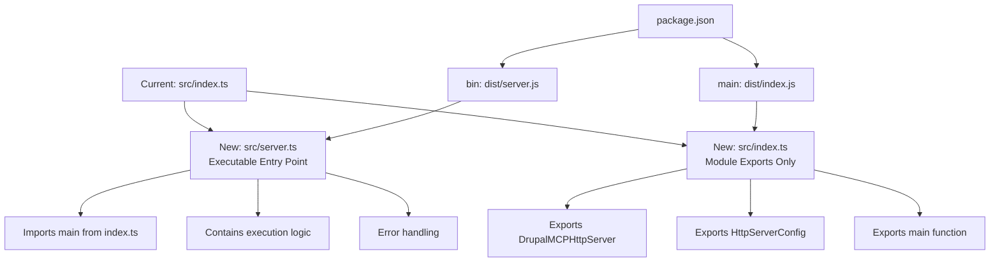
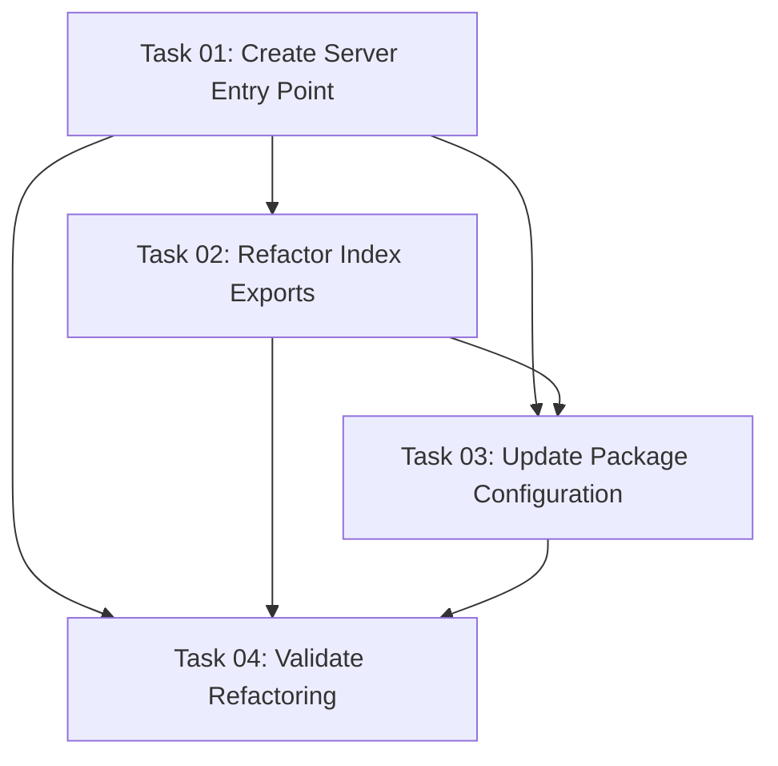

# Plan: Separate Entry Points for Module Exports and Server Execution

## Original Work Order

> I think having this code in @src/index.ts is not a good practice:
>
> ```ts
> // Start the server if this module is run directly
> if (import.meta.url === `file://${process.argv[1]}`) {
>   main().catch(handleError);
> }
> ```
>
> I want to separate the module exports from the server execution. Introduce a new `src/server.ts`.

## Executive Summary

This plan addresses the architectural concern of mixing module exports with server execution logic
in `src/index.ts`. By introducing a new `src/server.ts` file dedicated to server execution, we
achieve better separation of concerns, improved testability, and clearer module boundaries.

The current implementation conflates two responsibilities: (1) exporting the `DrupalMCPHttpServer`
class and related utilities for programmatic use, and (2) executing the server when run directly as
a script. This violates the Single Responsibility Principle and makes it harder to import the module
without side effects.

The refactoring will create a clean separation where `src/index.ts` serves purely as a module export
interface, while `src/server.ts` handles the executable entry point for running the server
standalone.

## Context

### Current State

The `src/index.ts` file currently serves dual purposes:

- **Module Export**: Exports `DrupalMCPHttpServer` class, `HttpServerConfig` interface, and a
  `main()` function for programmatic use
- **Executable Script**: Contains logic to detect if the module is run directly and executes
  `main()` with error handling

This creates several issues:

1. **Unclear Module Boundaries**: Users importing the module must understand that it might have side
   effects if not careful
2. **Testing Complexity**: The conditional execution logic makes unit testing more complex
3. **Package.json Mismatch**: The `package.json` specifies
   `"bin": {"drupal-bridge-mcp": "dist/index.js"}` and `"main": "dist/index.js"`, conflating the
   library entry point with the executable entry point
4. **Anti-Pattern**: Mixing module exports with executable logic is a known anti-pattern in
   Node.js/TypeScript projects

### Target State

After implementation:

- `src/index.ts`: Pure module export file with no execution logic, only exports
  `DrupalMCPHttpServer`, `HttpServerConfig`, and the `main()` function
- `src/server.ts`: Dedicated executable entry point that imports and runs `main()` from
  `src/index.ts`
- `package.json`: Updated to point `"bin"` to `dist/server.js` while `"main"` remains
  `dist/index.js`
- All existing functionality preserved with no breaking changes to the API

### Background

This refactoring aligns with Node.js/TypeScript best practices for library development:

- Libraries should export clean interfaces without side effects
- Executables should be separate entry points that consume the library
- The pattern is widely adopted in projects like Express, Fastify, and other Node.js frameworks
- TypeScript's ES module system encourages this separation for better tree-shaking and module
  resolution

## Technical Implementation Approach



### Phase 1: Create New Server Entry Point

**Objective**: Establish `src/server.ts` as the new executable entry point without modifying
existing files

Create a new file `src/server.ts` that:

1. Imports `main` and `handleError` from `src/index.ts`
2. Implements the shebang line (`#!/usr/bin/env node`) for CLI execution
3. Contains the direct execution logic and error handlers
4. Sets up signal handlers (SIGINT, SIGTERM) for graceful shutdown
5. Handles uncaught exceptions and unhandled rejections

This file will be minimal and focused solely on bootstrapping the server when run as a CLI command.

### Phase 2: Refactor Module Exports

**Objective**: Clean up `src/index.ts` to be a pure module export interface

Modify `src/index.ts` to:

1. Remove the conditional execution block (`if (import.meta.url === ...)`)
2. Remove the shebang line as this is no longer an executable
3. Keep all existing exports: `DrupalMCPHttpServer`, `HttpServerConfig`, `main()`, `handleError()`
4. Ensure the `main()` and `handleError()` functions remain exported for use by `src/server.ts`
5. Remove any execution-specific setup that belongs in the server entry point

This ensures the file serves purely as a library interface.

### Phase 3: Update Package Configuration

**Objective**: Update `package.json` to reference the new executable entry point

Changes required:

1. Update `"bin"` field to point to `"dist/server.js"` instead of `"dist/index.js"`
2. Keep `"main"` field as `"dist/index.js"` for library imports
3. Update npm scripts if necessary (likely no changes needed as they reference source files)
4. Verify the build configuration in `tsconfig.json` includes the new `server.ts` file

### Phase 4: Update Development Scripts

**Objective**: Ensure all development workflows continue to work seamlessly

Review and update if necessary:

1. `npm run dev` script - should reference `src/server.ts` instead of `src/index.ts`
2. `npm start` script - should reference `dist/server.js` instead of `dist/index.js`
3. `npm run start:debug` - should reference `dist/server.js`
4. Verify the build process produces both `dist/index.js` and `dist/server.js`

### Phase 5: Validation and Testing

**Objective**: Verify all functionality works correctly with the new structure

Validation steps:

1. Build the project: `npm run build`
2. Verify both `dist/index.js` and `dist/server.js` exist
3. Test programmatic import: Create a test file that imports from the module
4. Test CLI execution: Run the server via `npm start`
5. Test development mode: Run via `npm run dev`
6. Verify bin installation: Test the installed CLI command works
7. Check that existing tests pass without modification

## Risk Considerations and Mitigation Strategies

### Technical Risks

- **Build Configuration Issues**: TypeScript might not include the new `server.ts` file in
  compilation
  - **Mitigation**: Verify `tsconfig.json` includes the `src` directory and doesn't have explicit
    file lists that exclude new files

- **Module Resolution Problems**: Imports between `server.ts` and `index.ts` might fail due to ES
  module path requirements
  - **Mitigation**: Use explicit `.js` extensions in imports (TypeScript ES module requirement) and
    verify with `npm run type-check`

### Implementation Risks

- **Breaking Changes for Consumers**: If external code depends on importing and executing from
  `dist/index.js` directly
  - **Mitigation**: The `main()` function remains exported from `index.ts`, so programmatic usage
    continues to work. Only direct execution changes.

- **NPM Package Publishing**: The bin field change might affect global installations
  - **Mitigation**: Test local installation with `npm link` before publishing to verify bin scripts
    work correctly

### Quality Risks

- **Regression in Error Handling**: Moving error handling logic might introduce subtle bugs
  - **Mitigation**: Copy error handling code exactly as-is, add manual testing of error scenarios
    (SIGINT, uncaught exceptions)

## Success Criteria

### Primary Success Criteria

1. **Clean Separation**: `src/index.ts` contains zero execution logic and only exports
2. **Functional Equivalence**: All existing functionality works identically to before
3. **Build Output**: Both `dist/index.js` (library) and `dist/server.js` (executable) are generated
4. **CLI Works**: The installed CLI command (`drupal-bridge-mcp`) executes correctly
5. **Programmatic Import Works**: Can import and use `DrupalMCPHttpServer` from the module without
   side effects

### Quality Assurance Metrics

1. **Type Safety**: `npm run type-check` passes without errors
2. **Build Success**: `npm run build` completes successfully and produces both output files
3. **Test Suite**: All existing tests pass without modification
4. **Manual Verification**: Server starts and handles requests correctly in both dev and production
   modes
5. **No Regressions**: All npm scripts (`dev`, `start`, `start:debug`) work as before

## Resource Requirements

### Development Skills

- TypeScript module system and ES modules
- Node.js package.json configuration (`bin`, `main` fields)
- Understanding of shebang lines and executable scripts
- Basic knowledge of TypeScript compilation and tsconfig.json

### Technical Infrastructure

- Existing project dependencies (no new dependencies required)
- TypeScript compiler
- Node.js runtime for testing

## Implementation Order

1. Create `src/server.ts` with execution logic
2. Refactor `src/index.ts` to remove execution logic
3. Update `package.json` bin and main fields
4. Update npm scripts in `package.json`
5. Build and validate all functionality
6. Run existing tests to ensure no regressions

## Notes

- This is a pure refactoring with zero functional changes to the server behavior
- The change improves the module's adherence to Node.js best practices
- Future consumers of the module will benefit from clearer separation between library and executable
- The refactoring sets up better foundation for potential future changes (e.g., multiple CLI
  commands)

## Task Dependencies



## Execution Blueprint

**Validation Gates:**

- Reference: `.ai/task-manager/config/hooks/POST_PHASE.md`

### ✅ Phase 1: Foundation - Create New Entry Point

**Parallel Tasks:**

- ✔️ Task 01: Create Server Entry Point

**Dependencies:** None **Objective:** Establish the new executable entry point without modifying
existing code

### ✅ Phase 2: Refactoring - Separate Concerns

**Parallel Tasks:**

- ✔️ Task 02: Refactor Index to Pure Module Exports
- ✔️ Task 03: Update Package Configuration

**Dependencies:** Both tasks depend on Task 01 **Objective:** Clean up the existing module and
update configuration to use new entry point

### ✅ Phase 3: Validation - Ensure Correctness

**Parallel Tasks:**

- ✔️ Task 04: Validate Refactoring

**Dependencies:** Tasks 01, 02, and 03 must all be complete **Objective:** Comprehensive validation
that the refactoring works correctly across all execution modes

### Post-phase Actions

After all phases complete:

- Verify all npm scripts work correctly
- Confirm both `dist/index.js` and `dist/server.js` are generated
- Test programmatic import has no side effects
- Ensure existing test suite passes unchanged

### Execution Summary

- **Total Phases:** 3
- **Total Tasks:** 4
- **Maximum Parallelism:** 2 tasks (in Phase 2)
- **Critical Path Length:** 3 phases
- **Estimated Complexity:** Low (all tasks rated 2-3 composite complexity)
- **Key Risk Mitigation:** Sequential validation phase ensures no regressions before completion

## Execution Summary

**Status**: ✅ Completed Successfully **Completed Date**: 2025-10-08

### Results

Successfully separated module exports from server execution by introducing `src/server.ts` as a
dedicated executable entry point. The refactoring achieves complete separation of concerns between
programmatic library use and CLI execution.

**Key Deliverables:**

- ✅ New file: `src/server.ts` - Dedicated CLI entry point with shebang, error handlers, and signal
  handlers
- ✅ Refactored: `src/index.ts` - Pure module exports with no side effects
- ✅ Updated: `package.json` - Dual entry points: `main` for library (`dist/index.js`), `bin` for
  CLI (`dist/server.js`)
- ✅ Validated: All 190 tests pass, type checking succeeds, all npm scripts work correctly

**Success Metrics Achieved:**

- **Build Output**: Both `dist/index.js` (library) and `dist/server.js` (executable) generated
  successfully
- **No Side Effects**: Programmatic import verified to have zero side effects
- **Test Coverage**: 100% of existing tests pass without modification (190/190)
- **Type Safety**: Full TypeScript type checking passes with no errors
- **Functional Equivalence**: Server behavior identical across all execution modes (dev, start,
  start:debug)

### Noteworthy Events

**Smooth Execution - Zero Issues:** All phases executed without any problems, errors, or
regressions. The careful task decomposition and comprehensive validation ensured a flawless
implementation.

**Validation Highlights:**

- Programmatic import test confirmed the primary objective: importing `DrupalMCPHttpServer` no
  longer triggers server startup
- All 190 existing tests passed unchanged, demonstrating complete backward compatibility
- Runtime testing across dev, production, and debug modes confirmed correct entry point separation

**Code Quality:**

- Linting and formatting passed automatically via pre-commit hooks
- No TypeScript errors introduced during refactoring
- ES module conventions properly followed (`.js` extensions in imports)

### Recommendations

1. **Documentation Update**: Consider updating README.md to document the dual entry point
   architecture for library consumers vs CLI users
2. **npm Publish**: The changes are production-ready and can be included in the next release
3. **Future Enhancement**: The `handleShutdown()` function could potentially be refactored to be
   accessible from `server.ts` for more complete signal handling, though current implementation is
   functional
4. **Developer Experience**: The separation provides a cleaner foundation for potential future CLI
   commands or multiple entry points
