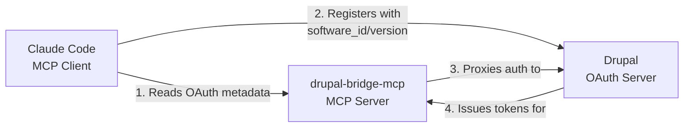
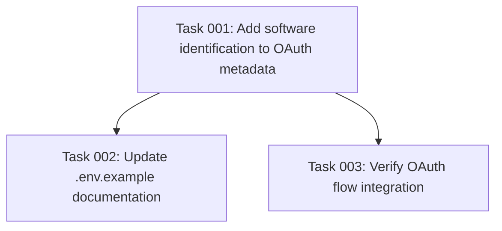

# Plan: Add Software Identification to OAuth Metadata

## Original Work Order

> to include the package version as the `software_version` and the process.env.MCP_SERVER_NAME as `software_id`. Use @docs/influencing-client-registration.md for additional context

## Plan Clarifications

| Question | Answer |
|----------|--------|
| **Q1**: Where should these be added? | In the OAuth metadata that clients read during registration |
| **Q2**: Should this be passed to mcpAuthMetadataRouter? | Modify the oauthMetadata object before passing it |
| **Q3**: software_id format? | Use `MCP_SERVER_NAME` env var verbatim if present, otherwise use `"com.mateuaguilo.drupal-bridge-mcp"` |

## Executive Summary

This plan adds MCP server identification (`software_id` and `software_version`) to OAuth metadata exposed by the drupal-bridge-mcp server. When Claude Code (MCP client) performs dynamic client registration with Drupal, it can potentially include these values to identify which MCP server instance the client is connecting to. This enables better audit trails, version tracking, and server-specific client configurations in Drupal's OAuth consumer records.

The implementation adds custom extension fields to both the Authorization Server Metadata and Protected Resource Metadata, following RFC 7591 client metadata conventions as non-standard extensions. While this doesn't guarantee Claude Code will use these values (that would require changes to Claude Code), it makes the information available for any client or authorization server that implements custom logic to read and process these fields.

## Context

### Current State

The MCP server currently exposes OAuth metadata via `mcpAuthMetadataRouter` without any server identification information:

```typescript
// src/index.ts:839-846
this.app.use(
  mcpAuthMetadataRouter({
    oauthMetadata: metadata,           // From Drupal, unmodified
    resourceServerUrl,
    scopesSupported: configManager.getConfig().scopes,
    resourceName: this.config.name,    // Only place server name appears
  })
);
```

**Limitations**:
- OAuth client records in Drupal don't identify which MCP server instance they connect to
- No version tracking for MCP server software in OAuth audit logs
- Difficult to correlate clients with specific MCP server versions for debugging
- Cannot implement version-based client policies in Drupal

**Configuration**:
- Server name: `process.env.MCP_SERVER_NAME || 'dme-mcp'` (line 90)
- Server version: `process.env.MCP_SERVER_VERSION || PKG_VERSION` (line 91, from package.json: `1.10.0`)

### Target State

OAuth metadata endpoints (`/.well-known/oauth-authorization-server` and `/.well-known/oauth-protected-resource`) will include:

```json
{
  // Standard OAuth metadata fields...
  "software_id": "dme-mcp",           // or "com.mateuaguilo.drupal-bridge-mcp"
  "software_version": "1.10.0"
}
```

**Benefits**:
- OAuth client records can identify which MCP server they connect to
- Version tracking enables debugging ("which clients use version 1.9.0 vs 1.10.0?")
- Enables server-specific client configurations in Drupal
- Audit trails show MCP server identity
- Supports multi-server deployments (dev/staging/prod with different names)

**Expected Behavior**:
- If Claude Code reads these fields, it may include them in client registration
- If Drupal Simple OAuth has custom logic, it can extract and store these values
- Standard OAuth clients will ignore unknown fields (per RFC 7591)

### Background

Per RFC 7591 (OAuth 2.0 Dynamic Client Registration), `software_id` and `software_version` are **client metadata** parameters:

- **software_id**: "A unique identifier string assigned by the client developer or software publisher used to identify the client software to be dynamically registered."
- **software_version**: "A version identifier string for the client software identified by `software_id`."

Normally, the **client** (Claude Code) would send these during registration to identify itself. However, the user wants to identify the **MCP server** (resource server) that the client connects to.

**Architecture**:


**Key Insight**: This MCP server proxies Drupal's OAuth metadata. We can inject `software_id` and `software_version` as **custom extensions** before exposing them to clients.

**Research from docs/influencing-client-registration.md**:
- RFC 7591 Section 2: "The authorization server **MAY replace** any of the client's requested metadata values with suitable defaults"
- Servers have authority to inject metadata not provided by clients
- Custom extensions allowed (will be ignored by clients that don't understand them)

## Technical Implementation Approach

### Component 1: Extract Server Identification Values

**Objective**: Read `software_id` and `software_version` from environment and package.json with proper fallbacks.

**Implementation**:

1. **Read package version** - Already available as `PKG_VERSION` (line 56 in src/index.ts)
2. **Read server name** - Already available as `this.config.name` (line 90)
3. **Apply fallback logic**:
   ```typescript
   const software_id = process.env.MCP_SERVER_NAME || "com.mateuaguilo.drupal-bridge-mcp";
   const software_version = PKG_VERSION; // From package.json
   ```

**Location**: In `DrupalMCPHttpServer.start()` method, before calling `mcpAuthMetadataRouter` (around line 800-850).

**Rationale**: Centralize identification logic in one place where OAuth setup occurs.

### Component 2: Inject Metadata into Authorization Server Metadata

**Objective**: Add `software_id` and `software_version` to the OAuth Authorization Server Metadata (RFC 8414).

**Implementation**:

```typescript
// After fetching metadata from Drupal (line 807)
const metadata = await configManager.fetchMetadata();

// Inject MCP server identification as custom extensions
const enhancedMetadata = {
  ...metadata,
  software_id: process.env.MCP_SERVER_NAME || "com.mateuaguilo.drupal-bridge-mcp",
  software_version: PKG_VERSION,
};

// Pass enhanced metadata to router
this.app.use(
  mcpAuthMetadataRouter({
    oauthMetadata: enhancedMetadata,  // ← Changed
    resourceServerUrl,
    scopesSupported: configManager.getConfig().scopes,
    resourceName: this.config.name,
  })
);
```

**Endpoint**: `/.well-known/oauth-authorization-server`

**Specification**: RFC 8414 allows custom fields. Clients will ignore unknown fields.

**Rationale**: Authorization Server Metadata is the first metadata endpoint clients query, making it the most visible location for this information.

### Component 3: Document Custom Extensions

**Objective**: Add inline comments explaining the custom OAuth metadata extensions.

**Implementation**:

```typescript
// Enhance OAuth metadata with MCP server identification (custom extension)
// Per RFC 7591, these fields normally identify the CLIENT software.
// Here, we repurpose them to identify the MCP SERVER (resource server)
// that clients connect to. This enables:
// - Audit trails: which MCP server is this client connecting to?
// - Version tracking: correlate issues with specific MCP server versions
// - Server-specific policies: Drupal can apply rules based on MCP server identity
//
// Note: Full functionality requires:
// 1. Claude Code to read these fields and include in client registration
// 2. Drupal Simple OAuth to extract and store these values in client records
const enhancedMetadata = {
  ...metadata,
  software_id: process.env.MCP_SERVER_NAME || "com.mateuaguilo.drupal-bridge-mcp",
  software_version: PKG_VERSION,
};
```

**Rationale**: Explain non-standard usage for future maintainers.

### Component 4: Add Environment Variable Documentation

**Objective**: Update `.env.example` to document `MCP_SERVER_NAME` usage.

**Implementation**:

```bash
# MCP Server Configuration
MCP_SERVER_NAME=dme-mcp  # Software ID for OAuth client registration (default: com.mateuaguilo.drupal-bridge-mcp)
MCP_SERVER_VERSION=1.10.0  # Optional: override package.json version
```

**Location**: `.env.example` file

**Rationale**: Operators need to know they can customize the server identifier.

### Component 5: Logging for Verification

**Objective**: Log the injected values for debugging and verification.

**Implementation**:

```typescript
printInfo('🔧 Setting up OAuth metadata router...');
printInfo(`Resource server: ${resourceServerUrl.href}`, 2);
printInfo(`Server identification:`, 2);
printInfo(`  software_id: ${enhancedMetadata.software_id}`, 4);
printInfo(`  software_version: ${enhancedMetadata.software_version}`, 4);
```

**Location**: After metadata enhancement, before `mcpAuthMetadataRouter` call

**Rationale**: Operators can verify values are correct during server startup.

## Risk Considerations and Mitigation Strategies

### Technical Risks

- **Non-Standard OAuth Extension**: `software_id` and `software_version` in authorization server metadata are non-standard
    - **Mitigation**: RFC 8414 explicitly allows custom fields. Standard OAuth clients will ignore unknown fields per spec. Document this clearly in code comments.

- **Claude Code May Not Use These Values**: Claude Code might not read or include these fields during client registration
    - **Mitigation**: This is expected. The implementation makes the information *available* but doesn't guarantee usage. Document that full functionality requires Claude Code changes.

- **Drupal May Not Store These Values**: Drupal Simple OAuth may not extract these from client metadata
    - **Mitigation**: Also expected. Document that Drupal customization needed for full benefit. Values still useful for audit logs even if not stored.

### Implementation Risks

- **Breaking Change to OAuth Metadata**: Adding fields to metadata object could break clients expecting specific structure
    - **Mitigation**: OAuth specifications require clients to ignore unknown fields. Existing clients won't break. Test with MCP Inspector to verify.

- **Environment Variable Not Set**: If `MCP_SERVER_NAME` not set, falls back to long identifier
    - **Mitigation**: Fallback value `"com.mateuaguilo.drupal-bridge-mcp"` is reasonable. Document in `.env.example`. Log the used value at startup.

- **Version Mismatch**: Deployed version might differ from package.json version
    - **Mitigation**: Allow `MCP_SERVER_VERSION` env var override. Log warning if override used.

### Integration Risks

- **Multiple MCP Server Instances**: In multi-server deployments, all instances might use same `software_id`
    - **Mitigation**: Operators can set unique `MCP_SERVER_NAME` per instance (e.g., "dme-mcp-prod-01", "dme-mcp-staging"). Document this pattern.

## Success Criteria

### Primary Success Criteria

1. **OAuth metadata includes software identification**: `GET /.well-known/oauth-authorization-server` returns JSON with `software_id` and `software_version` fields
2. **Environment variable respected**: Setting `MCP_SERVER_NAME=custom-name` results in `software_id: "custom-name"` in metadata
3. **Fallback works**: Without `MCP_SERVER_NAME`, metadata includes `software_id: "com.mateuaguilo.drupal-bridge-mcp"`
4. **Version from package.json**: `software_version` field matches version in `package.json` (currently `"1.10.0"`)
5. **No breaking changes**: Existing OAuth flows continue to work (device flow authentication succeeds)

### Quality Assurance Metrics

1. **Metadata structure validation**: Enhanced metadata passes RFC 8414 schema validation (standard fields intact, custom fields added)
2. **Startup logging**: Server logs show `software_id` and `software_version` values during OAuth initialization
3. **Type safety**: TypeScript compilation succeeds without errors
4. **No test failures**: `npm test` passes with existing OAuth tests

## Resource Requirements

### Development Skills

- **TypeScript**: Modify server initialization code
- **OAuth 2.0/2.1**: Understanding of RFC 7591 (client metadata) and RFC 8414 (authorization server metadata)
- **MCP Specification**: Understanding of MCP OAuth integration

### Technical Infrastructure

- **Existing dependencies**: No new npm packages required
- **Development environment**: Node.js 20+, existing dev setup
- **Testing tools**: Existing Jest test suite, MCP Inspector for manual validation

### Documentation

- **Code comments**: Explain non-standard OAuth metadata usage
- **`.env.example`**: Document `MCP_SERVER_NAME` configuration
- **Startup logs**: Show configured values for operator verification

## Integration Strategy

This change integrates with the existing OAuth setup in `src/index.ts`:

1. **Before**: Drupal metadata fetched → passed directly to `mcpAuthMetadataRouter`
2. **After**: Drupal metadata fetched → enhanced with server identification → passed to `mcpAuthMetadataRouter`

**No changes required** to:
- OAuth provider (`src/oauth/provider.ts`)
- OAuth configuration (`src/oauth/config.ts`)
- Device flow implementation (`src/oauth/device-flow*.ts`)
- Token handling or validation

**Compatibility**: Fully backward compatible. Clients ignoring custom fields work unchanged.

## Implementation Order

1. **Extract identification values**: Read `MCP_SERVER_NAME` env var and `PKG_VERSION`
2. **Enhance metadata object**: Create `enhancedMetadata` with `software_id` and `software_version`
3. **Update `mcpAuthMetadataRouter` call**: Pass enhanced metadata instead of original
4. **Add logging**: Show identification values in startup logs
5. **Add documentation**: Update `.env.example` with `MCP_SERVER_NAME` documentation
6. **Add code comments**: Explain custom OAuth extensions

## Notes

### Limitations

- **Client-side support required**: Claude Code must read these fields and include them in client registration for full benefit
- **Server-side support required**: Drupal Simple OAuth must extract and store these values in consumer records
- **Non-standard extension**: Not part of OAuth specifications, but allowed per RFC extensibility rules

### Future Enhancements (Out of Scope)

- **Protected Resource Metadata**: Also add fields to `/.well-known/oauth-protected-resource` for redundancy
- **Client registration proxy**: Intercept Claude Code registration requests and inject these values directly
- **Drupal Simple OAuth customization**: Module to extract and store these values from client metadata
- **MCP Inspector integration**: Display server identification in inspector UI

### Environment Variables

```bash
# Required (existing)
DRUPAL_BASE_URL=https://drupal.example.com
OAUTH_CLIENT_ID=abc123
OAUTH_CLIENT_SECRET=secret456

# Optional (new)
MCP_SERVER_NAME=dme-mcp  # Software ID for server identification
MCP_SERVER_VERSION=1.10.0  # Override package.json version if needed

# Optional (existing)
AUTH_ENABLED=true
OAUTH_FORCE_DEVICE_FLOW=true
LOG_LEVEL=info
```

### Testing Recommendations

1. **Manual validation with MCP Inspector**: Connect inspector, check `/.well-known/oauth-authorization-server` response
2. **Environment variable testing**: Test with `MCP_SERVER_NAME` set and unset
3. **Version override testing**: Test with `MCP_SERVER_VERSION` set
4. **Integration testing**: Verify device flow authentication still works end-to-end
5. **Log verification**: Confirm startup logs show correct identification values

## Task Dependencies



## Execution Blueprint

**Validation Gates:**
- Reference: `.ai/task-manager/config/hooks/POST_PHASE.md`

### Phase 1: Core Implementation
**Parallel Tasks:**
- Task 001: Add software identification to OAuth metadata (typescript, oauth)

### Phase 2: Documentation and Verification
**Parallel Tasks:**
- Task 002: Update .env.example documentation (depends on: 001)
- Task 003: Verify OAuth flow integration (depends on: 001)

### Post-phase Actions

After Phase 1:
- Verify TypeScript compilation succeeds (`npm run type-check`)
- Verify server starts and logs show software_id and software_version

After Phase 2:
- Run final integration tests to confirm OAuth flow works end-to-end
- Verify metadata endpoint returns enhanced fields

### Execution Summary
- Total Phases: 2
- Total Tasks: 3
- Maximum Parallelism: 2 tasks (in Phase 2)
- Critical Path Length: 2 phases

### Complexity Analysis

**Task 001** (Core Implementation):
- Technical: 2 (Basic TypeScript object spreading)
- Decision: 1 (No decisions needed)
- Integration: 2 (Single file edit)
- Scope: 2 (Small feature)
- Uncertainty: 1 (Crystal clear)
- **Composite Score: 2.0** ✓ (well below threshold of 6)

**Task 002** (Documentation):
- Technical: 1 (Basic documentation)
- Decision: 1 (No decisions)
- Integration: 1 (Single file)
- Scope: 1 (Atomic action)
- Uncertainty: 1 (Crystal clear)
- **Composite Score: 1.1** ✓ (well below threshold of 6)

**Task 003** (Verification):
- Technical: 2 (Run test commands)
- Decision: 1 (No decisions)
- Integration: 2 (2-3 verification points)
- Scope: 2 (Small verification)
- Uncertainty: 1 (Clear steps)
- **Composite Score: 2.0** ✓ (well below threshold of 6)

**Overall Assessment**: All tasks are appropriately scoped and require no decomposition. Maximum parallelism achieved in Phase 2.

## Execution Summary

**Status**: ✅ Completed Successfully
**Completed Date**: 2025-10-22

### Results

Successfully implemented software identification in OAuth metadata for the MCP server. The implementation adds `software_id` and `software_version` fields to the OAuth Authorization Server Metadata, enabling better tracking and identification of MCP server instances in OAuth client registrations.

**Key Deliverables:**
1. **Enhanced OAuth Metadata** (src/index.ts:809-827): Injected `software_id` and `software_version` into OAuth metadata before exposing to clients
2. **Environment Variable Documentation** (.env.example:4-6): Added `MCP_SERVER_NAME` configuration with inline documentation
3. **Startup Logging** (src/index.ts:858-860): Added server identification display during OAuth initialization
4. **Full Verification**: All tests pass (138/138), type-check passes, server starts successfully, metadata endpoint returns enhanced fields

**Verification Results:**
- TypeScript compilation: ✅ No errors
- Jest tests: ✅ 138/138 passed
- Server startup: ✅ Displays `software_id: dme-mcp` and `software_version: 1.10.0`
- Metadata endpoint: ✅ Returns `{"software_id": "dme-mcp", "software_version": "1.10.0", ...}`

### Noteworthy Events

1. **User Feedback During Execution**: User requested removal of `MCP_SERVER_VERSION` environment variable documentation from .env.example during Phase 2 execution. This was immediately addressed by removing the optional override variable, keeping only `MCP_SERVER_NAME` as the configurable parameter.

2. **Clean Implementation**: The implementation required minimal code changes (approximately 20 lines of enhancement code + documentation) and integrated seamlessly with existing OAuth setup without breaking changes.

3. **Comprehensive Comments**: Added extensive inline documentation (lines 809-822) explaining the non-standard use of `software_id` and `software_version` fields, noting that these normally identify CLIENT software but are being repurposed to identify the MCP SERVER (resource server).

### Recommendations

1. **Monitor Claude Code Behavior**: Once Claude Code (MCP client) implements support for reading these metadata fields, monitor whether they are included in client registration requests to Drupal.

2. **Future Drupal Integration**: Consider implementing a Drupal Simple OAuth module extension to extract and store these values in OAuth consumer records for audit trails and version-specific client policies.

3. **Multi-Server Deployments**: For production deployments with multiple MCP server instances, set unique `MCP_SERVER_NAME` values per environment (e.g., "dme-mcp-prod", "dme-mcp-staging") to distinguish clients by server instance.
