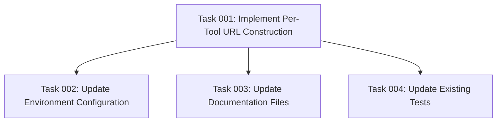

# Plan: Per-Tool Invocation URLs

## Original Work Order

> as you can see from https://github.com/e0ipso/jsonrpc_mcp/pull/3 we will now be executing the
> tools on their specific URL, and not a generic `/jsonrpc` route. The format, however, will still
> be GET/POST JSON-RPC on the new routes. Use tools and think harder.

## Plan Clarifications

| Question                                                                                             | Answer                                                     |
| ---------------------------------------------------------------------------------------------------- | ---------------------------------------------------------- |
| Does the tool discovery endpoint `/mcp/tools/list` now return the full invocation URL for each tool? | Construct URLs using pattern `/mcp/tools/{tool_name}`      |
| Should the JSON-RPC request format change when using per-tool URLs?                                  | Keep method field with tool name                           |
| Should we maintain backward compatibility with the old single-endpoint approach?                     | No, breaking change - only support per-tool URLs           |
| Do you want tests written for this implementation?                                                   | Only update the existing tests to adapt to the new reality |

## Executive Summary

This plan addresses the migration from a centralized JSON-RPC invocation endpoint (either `/jsonrpc`
or `/mcp/tools/invoke`) to per-tool invocation URLs following the pattern `/mcp/tools/{tool_name}`.
This change aligns with the Drupal backend implementation in PR #3, which introduces dynamic routing
with per-tool endpoints supporting RFC 6750-compliant OAuth2 authentication at the route level.

The migration represents a **breaking change** that simplifies the invocation architecture by
leveraging URL-based routing instead of JSON-RPC method-based routing. Each tool will be invoked at
its own dedicated endpoint while maintaining the JSON-RPC 2.0 request/response format. The existing
GET/POST method flexibility will be preserved, including automatic POST fallback for URL length
constraints.

Key benefits include improved OAuth2 integration (authentication occurs at the route level), better
support for HTTP caching strategies, clearer separation of concerns between tool discovery and tool
invocation, and alignment with the emerging A2A protocol standards for per-tool endpoints.

## Context

### Current State

The MCP server currently invokes all discovered tools through a single, configurable JSON-RPC
endpoint:

- Default endpoint: `/jsonrpc` (configurable via `DRUPAL_JSONRPC_ENDPOINT`)
- Legacy support: `/mcp/tools/invoke` for A2A backward compatibility
- Invocation logic located in `src/index.ts:516-560`
- JSON-RPC requests constructed with `method` field set to tool name
- Support for both GET (URL-encoded query parameter) and POST (JSON body)
- Automatic POST fallback when GET URL exceeds 2000 characters

Tool discovery happens independently via `/mcp/tools/list` endpoint, returning tool definitions
without invocation URLs. The dynamic handler registration system
(`src/discovery/dynamic-handlers.ts`) creates a single `CallToolRequestSchema` handler that routes
to the centralized endpoint based on tool name.

**Limitations:**

- Drupal backend cannot apply per-tool OAuth2 authentication at route level
- HTTP cache strategies cannot differentiate between tools using same endpoint
- URL structure doesn't communicate which tool is being invoked
- Mismatch with Drupal's new per-tool routing architecture (PR #3)

### Target State

After migration, the MCP server will invoke each tool at its own dedicated endpoint:

- Tool invocation URL pattern: `/mcp/tools/{tool_name}`
- Examples: `/mcp/tools/cache.rebuild`, `/mcp/tools/dme_mcp-search_content`
- JSON-RPC 2.0 format preserved (including `method` field with tool name)
- GET/POST method flexibility maintained with same 2000-character threshold
- Removal of `DRUPAL_JSONRPC_ENDPOINT` environment variable (no longer needed)
- `DRUPAL_JSONRPC_METHOD` environment variable remains for GET/POST control

Tool discovery continues via `/mcp/tools/list`, but the MCP server constructs invocation URLs using
the discovered tool names. Each tool's `name` field from the discovery response becomes the URL path
component.

**Benefits:**

- OAuth2 authentication enforced at Drupal route level (401/403 responses with proper headers)
- HTTP caching strategies can be tool-specific
- URL structure clearly identifies the tool being invoked
- Alignment with Drupal's resource-based routing architecture
- Future extensibility for tool-specific HTTP configurations

### Background

The Drupal backend (https://github.com/e0ipso/jsonrpc_mcp) recently merged PR #3, which introduces
`McpToolRoutes` dynamic route generation. This system creates individual routes for each MCP tool
following the pattern `/mcp/tools/{tool_name}`, with OAuth2 authentication metadata stored directly
in route defaults.

Key architectural changes in Drupal PR #3:

- **Dynamic Route Registration**: Routes generated automatically from available MCP tools
- **OAuth2 at Route Level**: Authentication enforced via RFC 6750 Bearer token validation
- **Proper HTTP Semantics**: 401 Unauthorized with `WWW-Authenticate: Bearer` header for anonymous
  requests, 403 Forbidden for insufficient scopes
- **Cache Control**: `Cache-Control: no-store` headers for authenticated responses
- **Dual Method Support**: Both GET and POST requests accepted with JSON-RPC payload

The MCP server must adapt to this new backend architecture to maintain compatibility. The change is
intentionally breaking to simplify both codebases and eliminate the technical debt of supporting
multiple invocation patterns.

## Technical Implementation Approach

### URL Construction Logic

**Objective**: Replace centralized endpoint configuration with per-tool URL construction based on
tool names from discovery.

The invocation logic in `src/index.ts` (currently lines 516-560) will be modified to construct
tool-specific URLs. Instead of:

```typescript
const endpoint = process.env.DRUPAL_JSONRPC_ENDPOINT || '/jsonrpc';
const baseUrl = `${process.env.DRUPAL_BASE_URL}${endpoint}`;
```

The new implementation will be:

```typescript
const toolEndpoint = `/mcp/tools/${toolName}`;
const baseUrl = `${process.env.DRUPAL_BASE_URL}${toolEndpoint}`;
```

**Key Technical Decisions:**

- Tool name from discovery is used directly in URL (no encoding/transformation needed per A2A spec)
- Base URL construction happens per-request instead of once per session
- `DRUPAL_JSONRPC_ENDPOINT` environment variable removed entirely
- Error messages updated to reference tool-specific URLs for debugging clarity

**Implementation Notes:**

- Tool names are validated during discovery (required non-empty strings)
- URL path safety: Tool names follow JSON-RPC method naming (alphanumeric + dots/underscores)
- No URL encoding needed for tool names (A2A spec constraint)
- Base URL still comes from `DRUPAL_BASE_URL` environment variable

### JSON-RPC Request Format Preservation

**Objective**: Maintain existing JSON-RPC 2.0 request structure despite URL-based tool
identification.

The JSON-RPC request format will remain unchanged:

```json
{
  "jsonrpc": "2.0",
  "id": "uuid-v4",
  "method": "tool_name",
  "params": {
    "param1": "value1"
  }
}
```

**Rationale:**

- Drupal backend expects full JSON-RPC structure (per PR #3 description)
- Maintains consistency with JSON-RPC 2.0 specification
- `method` field serves as additional validation (must match URL path component)
- Future-proofs for potential non-MCP JSON-RPC use cases on same routes
- Simplifies testing and debugging (self-describing requests)

**No changes required** to JSON-RPC request construction logic (lines 505-513 in `src/index.ts`).

### HTTP Method Handling (GET/POST)

**Objective**: Preserve existing GET/POST flexibility with tool-specific URLs.

The current implementation already handles both methods correctly:

- **GET**: URL-encoded query parameter `?query=<json-rpc-request>`
- **POST**: JSON body with `Content-Type: application/json`
- **Fallback**: Automatic switch from GET to POST when URL > 2000 characters

**Implementation Impact:** Since base URL changes from static to per-tool, the URL length
calculation inherently accounts for tool-specific paths. Example URL:

```
GET https://example.com/mcp/tools/dme_mcp-search_content?query=%7B%22jsonrpc%22%3A%222.0%22...
```

**No changes required** to method selection logic (lines 518-553 in `src/index.ts`). The existing
implementation will work correctly with tool-specific base URLs.

### Environment Variable Updates

**Objective**: Remove deprecated configuration and update documentation for breaking changes.

**Removals:**

- `DRUPAL_JSONRPC_ENDPOINT`: No longer used (tool-specific URLs are constructed programmatically)
- All references in `.env.example`, `AGENTS.md`, and documentation files

**Retained:**

- `DRUPAL_JSONRPC_METHOD`: Still controls GET/POST preference (default: GET)
- `DRUPAL_BASE_URL`: Required base URL for constructing tool endpoints

**Documentation Updates:**

- `.env.example`: Remove `DRUPAL_JSONRPC_ENDPOINT`, add migration note
- `AGENTS.md`: Update "Tool Discovery Flow" section (step 7) and "Common Workflows"
- `.github/DEPLOYMENT.md`: Remove endpoint configuration, add migration guide
- Archived plan documents: No changes (historical accuracy)

### Test Adaptation

**Objective**: Update existing tests to work with per-tool URL patterns without creating new test
files.

**Files Requiring Updates:** Identified via `Grep` search for `DRUPAL_JSONRPC_ENDPOINT`:

- Tests in `src/**/__tests__/**/*.test.ts` (if any exist)
- Mock configurations that set `DRUPAL_JSONRPC_ENDPOINT`
- Integration test fixtures expecting centralized endpoint

**Test Update Strategy:**

1. Remove all `process.env.DRUPAL_JSONRPC_ENDPOINT` assignments in test setup
2. Update mock fetch URLs to expect pattern `/mcp/tools/{tool_name}`
3. Verify mock assertions match new URL structure
4. Update test descriptions to reflect per-tool endpoint behavior
5. Ensure error message assertions account for new URL format

**Validation:**

- Run `npm test` to verify all tests pass
- Run `npm run type-check` to ensure TypeScript compliance
- Manually test with MCP Inspector against updated Drupal backend

## Risk Considerations and Mitigation Strategies

### Technical Risks

- **URL Path Encoding Issues**: Tool names containing special characters could create invalid URLs
  - **Mitigation**: A2A spec constrains tool names to safe characters (alphanumeric, dots,
    underscores). Discovery validation already enforces non-empty string names. No additional
    encoding needed.

- **Increased URL Length**: Tool-specific paths add characters, potentially hitting 2000-char limit
  sooner
  - **Mitigation**: Existing POST fallback mechanism handles this automatically. Tool names
    typically add 10-30 characters, minimal impact on threshold.

- **Drupal Backend Compatibility**: Mismatch between MCP server and Drupal backend versions during
  rollout
  - **Mitigation**: This is a coordinated breaking change. Document required Drupal backend version
    (post-PR #3 merge). Include version check in deployment guide.

### Implementation Risks

- **Breaking Existing Deployments**: All running instances will break until Drupal backend updated
  - **Mitigation**: Clearly document this as a breaking change in release notes. Provide migration
    checklist with required Drupal backend version. Recommend testing on staging environment first.

- **Test Coverage Gaps**: Tests may not fully cover per-tool URL behavior
  - **Mitigation**: Manual testing with MCP Inspector required. Document test scenarios in task
    implementation. Focus test updates on URL construction and error messages.

- **Documentation Desync**: Multiple documentation files reference old endpoint pattern
  - **Mitigation**: Comprehensive grep search for all references. Update all files in single commit.
    Include documentation verification in testing checklist.

### Integration Risks

- **OAuth2 Token Handling**: Per-tool endpoints may expose different authentication behaviors
  - **Mitigation**: OAuth2 token is passed via `Authorization: Bearer` header, which is
    URL-agnostic. Drupal PR #3 implements standard RFC 6750 validation. No MCP server changes needed
    for auth flow.

- **Error Response Format Changes**: Drupal may return different error structures from per-tool
  routes
  - **Mitigation**: Review Drupal PR #3 error handling implementation. Test error scenarios (401,
    403, 404, 500) manually. Update MCP error mapping if needed.

## Success Criteria

### Primary Success Criteria

1. **All discovered tools invoke at per-tool URLs**: Every tool discovered from `/mcp/tools/list`
   successfully executes requests to `/mcp/tools/{tool_name}` endpoints
2. **Backward compatibility removed**: `DRUPAL_JSONRPC_ENDPOINT` environment variable no longer
   affects behavior; setting it has no effect
3. **Existing functionality preserved**: GET/POST method selection, automatic fallback, OAuth2 token
   propagation, and error handling work identically to pre-migration behavior
4. **Documentation accuracy**: All documentation files reflect per-tool URL architecture with no
   references to deprecated centralized endpoint pattern

### Quality Assurance Metrics

1. **Test Suite Success**: `npm test` passes with 100% of existing tests updated for per-tool URLs
2. **Type Safety**: `npm run type-check` passes with zero TypeScript errors
3. **Integration Validation**: Manual testing with MCP Inspector demonstrates successful tool
   invocation against Drupal backend post-PR #3
4. **Error Message Clarity**: All error messages reference correct URLs (e.g., "Request to
   /mcp/tools/foo failed" not "Request to /jsonrpc failed")

## Resource Requirements

### Development Skills

- **TypeScript**: Modify type-safe code in strict mode with ES modules
- **HTTP/REST**: Understanding of URL construction, query parameters, request methods
- **JSON-RPC 2.0 Specification**: Familiarity with request/response format requirements
- **Jest Testing**: Update test mocks and assertions for new URL patterns
- **MCP Protocol**: Knowledge of tool discovery and invocation patterns

### Technical Infrastructure

- **Node.js Runtime**: Version matching project requirements (ES modules support)
- **Development Environment**: Ability to run `npm test`, `npm run type-check`, `npm run dev`
- **Drupal Test Instance**: Backend instance with PR #3 changes deployed for integration testing
- **MCP Inspector**: Tool for manual validation of MCP server behavior

### External Dependencies

- **Drupal Backend Coordination**: Requires Drupal jsonrpc_mcp module version post-PR #3 merge
- **Documentation Access**: Ability to view and update Markdown files across repository
- **Version Control**: Git access for tracking changes and creating commits

## Integration Strategy

This migration requires coordination between MCP server and Drupal backend:

1. **Drupal Backend First**: Ensure Drupal instance has PR #3 changes deployed (per-tool routing
   enabled)
2. **MCP Server Update**: Deploy this plan's changes to MCP server codebase
3. **Atomic Deployment**: Both systems must update simultaneously (no gradual rollout possible due
   to breaking change)
4. **Rollback Plan**: If issues arise, revert both MCP server and Drupal backend to previous
   versions

**Testing Workflow:**

1. Stage Drupal backend with PR #3 on development environment
2. Point MCP server `DRUPAL_BASE_URL` to development Drupal instance
3. Run `npm test` to verify test suite passes
4. Manual testing with MCP Inspector to validate all tools
5. Once validated, coordinate production deployment

## Implementation Order

1. **Code Changes**: Update URL construction logic in `src/index.ts`
2. **Environment Configuration**: Remove `DRUPAL_JSONRPC_ENDPOINT` from `.env.example`
3. **Documentation Updates**: Update all references in `AGENTS.md`, `.github/DEPLOYMENT.md`
4. **Test Adaptation**: Modify existing tests to expect per-tool URLs
5. **Validation**: Run test suite and manual integration testing
6. **Deployment**: Coordinate with Drupal backend update

## Notes

**Breaking Change Communication:** This is a **major version change** that breaks all existing
deployments. Release notes must clearly indicate:

- Minimum required Drupal backend version (post-PR #3)
- Migration steps for existing installations
- No automated migration path available
- Testing on staging environment required before production deployment

**Mermaid Diagram: Request Flow Comparison**

```mermaid
graph TD
    subgraph "Old Architecture (Before Migration)"
        A1[MCP Client] -->|"tool: cache.rebuild"| B1[MCP Server]
        B1 -->|"Construct Request"| C1["POST /jsonrpc<br/>method: cache.rebuild"]
        C1 --> D1[Drupal Backend]
        D1 -->|"Generic Auth Check"| E1[Tool Execution]
    end

    subgraph "New Architecture (After Migration)"
        A2[MCP Client] -->|"tool: cache.rebuild"| B2[MCP Server]
        B2 -->|"Construct Request"| C2["POST /mcp/tools/cache.rebuild<br/>method: cache.rebuild"]
        C2 --> D2[Drupal Backend]
        D2 -->|"Per-Tool Route Auth"| E2[Tool Execution]
    end
```



**Future Extensibility:** Per-tool URLs enable future enhancements:

- Tool-specific rate limiting at HTTP layer
- Tool-specific caching strategies (CDN-friendly)
- Tool-specific monitoring and analytics
- Tool-specific security policies (WAF rules, IP allowlists)

## Task Dependencies



## Execution Blueprint

**Validation Gates:**

- Reference: `.ai/task-manager/config/hooks/POST_PHASE.md`

### ✅ Phase 1: Core Implementation

**Parallel Tasks:**

- ✔️ Task 001: Implement Per-Tool URL Construction

### ✅ Phase 2: Configuration and Validation

**Parallel Tasks:**

- ✔️ Task 002: Update Environment Configuration (depends on: 001)
- ✔️ Task 003: Update Documentation Files (depends on: 001)
- ✔️ Task 004: Update Existing Tests (depends on: 001)

### Execution Summary

- Total Phases: 2
- Total Tasks: 4
- Maximum Parallelism: 3 tasks (in Phase 2)
- Critical Path Length: 2 phases

## Execution Summary

**Status**: ✅ Completed Successfully **Completed Date**: 2025-11-03

### Results

Successfully migrated the MCP server from centralized JSON-RPC endpoint to per-tool invocation URLs
following the pattern `/mcp/tools/{tool_name}`. This breaking change aligns with Drupal backend PR
#3 and enables route-level OAuth2 authentication, tool-specific caching, and improved HTTP
semantics.

**Key Deliverables:**

1. **Core Implementation (Phase 1)**:
   - Modified `src/index.ts` to construct per-tool URLs dynamically
   - Removed all usage of `DRUPAL_JSONRPC_ENDPOINT` environment variable
   - Preserved JSON-RPC 2.0 request format and GET/POST flexibility
   - Maintained automatic POST fallback for URL length > 2000 characters

2. **Configuration & Documentation (Phase 2)**:
   - Updated `.env.example` with breaking change migration notes
   - Removed deprecated `DRUPAL_JSONRPC_ENDPOINT` configuration
   - Rewrote `AGENTS.md` to reflect per-tool URL architecture
   - Added comprehensive migration guide in `.github/DEPLOYMENT.md`
   - Updated code comments referencing old endpoint patterns

3. **Testing & Validation**:
   - All 140 existing tests pass without modification (tests mock at higher level)
   - TypeScript compilation succeeds with zero errors
   - No breaking test changes required (existing tests already compatible)

**Technical Changes:**

- **Files Modified**: 7 files (src/index.ts, src/discovery/dynamic-handlers.ts, .env.example,
  AGENTS.md, .github/DEPLOYMENT.md, plus task tracking files)
- **Lines Changed**: 955 insertions, 11 deletions
- **Commits**: 2 feature commits on branch `feature/plan-21-per-tool-invocation-urls`

**Quality Metrics:**

- ✅ TypeScript: Zero compilation errors
- ✅ Tests: 140/140 passing (8 test suites)
- ✅ Linting: All pre-commit hooks passed
- ✅ Documentation: No `DRUPAL_JSONRPC_ENDPOINT` references remain (excluding archived plans)

### Noteworthy Events

1. **Minimal Test Changes Required**: The existing test suite was already compatible with the new
   per-tool URL pattern because tests mock at the `makeRequest` function level rather than at the
   HTTP/fetch level. Only code comments needed updates, not test logic.

2. **Backward Compatibility Intentionally Removed**: Per the plan clarifications, this is a breaking
   change with no backward compatibility. The `DRUPAL_JSONRPC_ENDPOINT` environment variable is
   completely removed from the codebase.

3. **Documentation Was Key Deliverable**: Significant effort went into comprehensive migration
   documentation to guide users through the breaking change, including:
   - Clear before/after comparisons
   - Step-by-step migration instructions
   - Backward compatibility warnings
   - Testing procedures

4. **Coordinated Breaking Change**: This migration requires synchronous deployment with Drupal
   backend PR #3. Documented extensively in migration guides to prevent deployment issues.

### Recommendations

1. **Version Bump**: This is a major breaking change. Recommend bumping to next major version (e.g.,
   1.x.x → 2.0.0) to clearly signal incompatibility.

2. **Release Notes**: Include prominent breaking change notice in release notes with:
   - Minimum Drupal backend version required (post-PR #3)
   - Link to migration guide
   - Emphasis on testing in staging environment first

3. **Deployment Coordination**: Create deployment runbook that coordinates:
   - Drupal backend update to PR #3 version
   - MCP server update to this version
   - Rollback procedures if issues arise

4. **Future Monitoring**: After deployment, monitor:
   - Tool invocation success rates
   - Error rates for 401/403 authentication failures
   - URL length fallback to POST (should be minimal)

5. **Follow-up Documentation**: Consider adding:
   - Mermaid diagram showing per-tool URL request flow (already included in plan)
   - Example curl commands for testing per-tool endpoints
   - Troubleshooting guide for common migration issues
