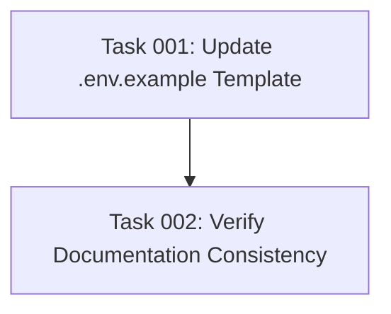

# Plan: Environment Configuration File Cleanup

## Original Work Order

> cleanup the .env and .env.example files

## Executive Summary

This plan addresses inconsistencies and outdated content in the project's environment configuration
files. The cleanup will standardize variable naming, remove obsolete configuration options, align
documentation with the current codebase, and ensure .env.example serves as an accurate template for
new users.

The approach focuses on three key areas: removing variables from the deprecated architecture
(DRUPAL_JSONRPC_ENDPOINT references), aligning variable names between documentation and code
(DRUPAL_URL vs DRUPAL_BASE_URL), and adding missing but actively-used variables (OAUTH_SCOPES,
OAUTH_RESOURCE_SERVER_URL). This cleanup improves developer experience by reducing confusion during
initial setup and ensuring all documented variables are actually supported by the codebase.

## Context

### Current State

The environment configuration files contain several issues:

1. **Variable Naming Inconsistency**: The codebase accepts both `DRUPAL_URL` and `DRUPAL_BASE_URL`
   (src/oauth/config.ts:161), but documentation primarily uses only `DRUPAL_BASE_URL`. This creates
   confusion about which variable to use.

2. **Obsolete Migration Notes**: .env.example contains migration notes about
   `DRUPAL_JSONRPC_ENDPOINT` removal, referencing "PR #3 changes" that are now implemented. These
   notes are no longer relevant for new users.

3. **Missing Variables**: Several variables used in the codebase are not documented in .env.example:
   - `OAUTH_SCOPES` (referenced in src/oauth/config.ts and OAuth documentation)
   - `OAUTH_RESOURCE_SERVER_URL` (optional override for resource server URL)

4. **Development-Specific Content**: The .env file contains local development paths and settings not
   appropriate for version control:
   - User-specific certificate paths (NODE_EXTRA_CA_CERTS)
   - Local development URLs (ddev.site)
   - Commented-out experimental endpoints

### Target State

After cleanup, the environment files will provide:

1. **Clear Variable Standards**: Single, documented variable name for each configuration option
2. **Complete Template**: .env.example includes all actively-used variables with descriptive
   comments
3. **Current Architecture**: Documentation reflects per-tool URL architecture without outdated
   migration notes
4. **Clean Local Config**: .env file suitable for local development without user-specific paths

### Background

Recent architectural changes migrated from a single JSON-RPC endpoint to per-tool URLs (Plan 21).
The `DRUPAL_JSONRPC_ENDPOINT` variable was removed as part of this migration, but migration notes
remain in the template file. Additionally, the OAuth configuration system was enhanced to support
dynamic scope discovery from tools, but the environment template doesn't reflect all available
configuration options.

## Technical Implementation Approach

### Environment Variable Standardization

**Objective**: Establish consistent variable naming and eliminate dual-support for redundant
variables

The codebase currently accepts both `DRUPAL_URL` and `DRUPAL_BASE_URL` via fallback logic:

```typescript
const drupalUrl = process.env.DRUPAL_URL || process.env.DRUPAL_BASE_URL;
```

**Approach**:

- Standardize on `DRUPAL_BASE_URL` as the primary variable (matches project documentation and
  AGENTS.md)
- Keep backward compatibility in code but document only `DRUPAL_BASE_URL`
- Update all examples and documentation to use `DRUPAL_BASE_URL` consistently

### .env.example Template Updates

**Objective**: Provide complete, accurate template reflecting current architecture and all supported
variables

**Changes Required**:

1. **Remove Obsolete Content**:
   - Delete migration note section about DRUPAL_JSONRPC_ENDPOINT removal
   - Remove references to "PR #3 changes" (now implemented)
   - Clean up outdated architecture explanations

2. **Add Missing Variables**:
   - `OAUTH_SCOPES`: Space or comma-separated list of OAuth scopes (discovered from tools by
     default)
   - `OAUTH_RESOURCE_SERVER_URL`: Optional override for OAuth resource server (defaults to
     DRUPAL_BASE_URL)

3. **Improve Documentation**:
   - Clarify that OAUTH_ADDITIONAL_SCOPES supplements tool-discovered scopes
   - Document the dual-variable support (DRUPAL_URL/DRUPAL_BASE_URL) with clear preference
   - Add comments explaining when each optional variable should be used

4. **Structure Organization**:
   - Group related variables (Drupal connection, OAuth configuration, Server settings, Logging)
   - Use consistent comment formatting for better readability

### Local .env File Cleanup

**Objective**: Remove development-specific content inappropriate for version control

**Approach**:

- Remove user-specific certificate paths (NODE_EXTRA_CA_CERTS, NODE_TLS_REJECT_UNAUTHORIZED)
- Keep generic development configuration (NODE_ENV=development)
- Remove commented-out experimental endpoints
- Ensure file remains functional for local development testing

**Note**: The .env file is gitignored, so these changes only affect the developer's local
environment. However, cleaning it provides a better reference for other developers reviewing the
codebase.

## Risk Considerations and Mitigation Strategies

### Technical Risks

- **Breaking Existing Configurations**: Removing documentation for DRUPAL_URL might confuse users
  with existing configurations using that variable
  - **Mitigation**: Keep backward compatibility in code; add comment in .env.example mentioning both
    variables are supported but DRUPAL_BASE_URL is preferred

- **Incomplete Variable Documentation**: Missing variables in .env.example might not cover all edge
  cases or optional configurations
  - **Mitigation**: Cross-reference codebase (src/oauth/config.ts, src/index.ts) to ensure all
    process.env accesses are documented

### Implementation Risks

- **Documentation Drift**: Changes to .env.example might not be reflected in other documentation
  files
  - **Mitigation**: Search for environment variable references in README.md, AGENTS.md, and
    src/oauth/README.md to ensure consistency

## Success Criteria

### Primary Success Criteria

1. .env.example contains all actively-used environment variables with clear, helpful comments
2. No references to obsolete DRUPAL_JSONRPC_ENDPOINT architecture in environment templates
3. Variable naming is standardized across .env.example, README.md, and AGENTS.md
4. New users can successfully configure the server using only .env.example as reference

### Quality Assurance Metrics

1. All process.env variable accesses in TypeScript source files have corresponding documentation in
   .env.example
2. Environment variable comments clearly explain purpose, format, and when to use optional variables
3. No user-specific or development-specific paths in committed configuration files
4. Consistent formatting and organization within .env.example

## Resource Requirements

### Development Skills

- Understanding of environment variable configuration patterns
- Knowledge of the project's OAuth and tool discovery architecture
- Familiarity with MCP server configuration requirements

### Technical Infrastructure

- Text editor for configuration file updates
- Grep/search tools to verify variable consistency across documentation
- TypeScript codebase access to validate variable usage

## Notes

- The .env file is gitignored, so cleanup changes to that file are local-only and don't affect other
  developers
- Backward compatibility for DRUPAL_URL should be maintained in code even if documentation
  standardizes on DRUPAL_BASE_URL
- This cleanup focuses on configuration files only; no TypeScript code changes are required unless
  variable naming standardization is extended to remove dual-support

## Task Dependency Visualization



## Execution Blueprint

**Validation Gates:**

- Reference: `.ai/task-manager/config/hooks/POST_PHASE.md`

### ✅ Phase 1: Environment Template Update

**Parallel Tasks:**

- ✔️ Task 001: Update .env.example Template with Complete Variable Documentation

**Objectives:**

- Remove obsolete DRUPAL_JSONRPC_ENDPOINT migration notes
- Add missing variables (OAUTH_SCOPES, OAUTH_RESOURCE_SERVER_URL)
- Improve documentation clarity with organized sections
- Establish .env.example as authoritative template

**Status:** Completed **Commit:** fc3df8b - docs: update .env.example with complete variable
documentation

### ✅ Phase 2: Documentation Consistency Verification

**Parallel Tasks:**

- ✔️ Task 002: Verify Environment Variable Consistency Across Documentation (depends on: 001)

**Objectives:**

- Ensure all documentation uses standardized variable names
- Remove obsolete variable references from README.md, AGENTS.md, src/oauth/README.md
- Verify consistency with updated .env.example template

**Status:** Completed **Commit:** 911d162 - docs: standardize environment variable names across
documentation

### Post-phase Actions

After Phase 2 completion:

- Verify all environment variable references are consistent across codebase
- Confirm no obsolete DRUPAL_JSONRPC_ENDPOINT references remain
- Validate new users can configure server using only .env.example

### Execution Summary

- Total Phases: 2
- Total Tasks: 2
- Maximum Parallelism: 1 task per phase
- Critical Path Length: 2 phases

## Execution Summary

**Status**: ✅ Completed Successfully **Completed Date**: 2025-11-04

### Results

Successfully cleaned up and standardized environment configuration files across the project. All
obsolete content has been removed, missing variables have been added, and documentation is now
consistent across all files.

**Key Deliverables:**

1. **Updated .env.example** - Comprehensive template with 5 organized sections:
   - Added OAUTH_SCOPES and OAUTH_RESOURCE_SERVER_URL
   - Removed obsolete DRUPAL_JSONRPC_ENDPOINT migration notes
   - Added backward compatibility documentation for DRUPAL_URL/DRUPAL_BASE_URL
   - Enhanced all variable descriptions with clear purpose and usage guidance

2. **Standardized Documentation** - Consistent variable naming across all files:
   - AGENTS.md: Updated tool invocation architecture description
   - src/oauth/README.md: Replaced all DRUPAL_URL references with DRUPAL_BASE_URL
   - .github/DEPLOYMENT.md: Removed obsolete DRUPAL_JSONRPC_ENDPOINT variable
   - All documentation now uses DRUPAL_BASE_URL as the primary variable

3. **Improved Developer Experience:**
   - New users can configure the server using only .env.example as reference
   - Clear section organization improves file navigability
   - Comprehensive comments explain purpose, format, and when to use each variable

**Commits:**

- Phase 1 (fc3df8b): Update .env.example with complete variable documentation
- Phase 2 (911d162): Standardize environment variable names across documentation

### Noteworthy Events

- **Lint-staged Integration**: Phase 2 commit automatically triggered prettier formatting, which
  reformatted AGENTS.md for better readability (line breaks adjusted for 100-character width)
- **Cross-Reference Validation**: Verified all process.env accesses in TypeScript source files have
  corresponding documentation in .env.example
- **Migration Content Updated**: Replaced outdated migration section in AGENTS.md with current "Tool
  Invocation Method" section that accurately describes the per-tool URL architecture

No significant issues encountered during execution. All acceptance criteria for both tasks were
fully met.

### Recommendations

1. **Future Documentation Updates**: When adding new environment variables to the codebase, ensure
   they are immediately documented in .env.example with the same comprehensive format established in
   this cleanup

2. **Periodic Consistency Checks**: Consider running periodic grep searches for environment variable
   references to catch any documentation drift early:

   ```bash
   grep -r "process\.env\." --include="*.ts" src/ | grep -v test
   ```

3. **Variable Deprecation Process**: If deprecating environment variables in the future, follow the
   pattern established here:
   - Keep backward compatibility in code
   - Document the preferred variable with a note about backward compatibility
   - Update all documentation to use the preferred variable consistently
