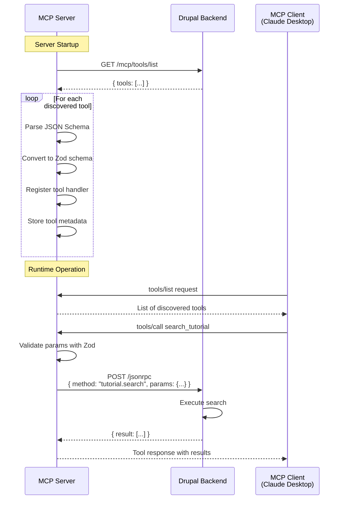
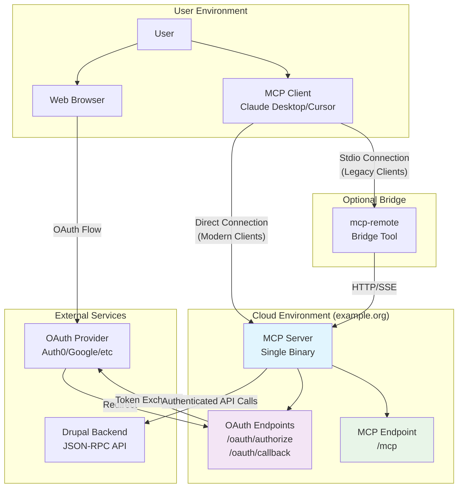
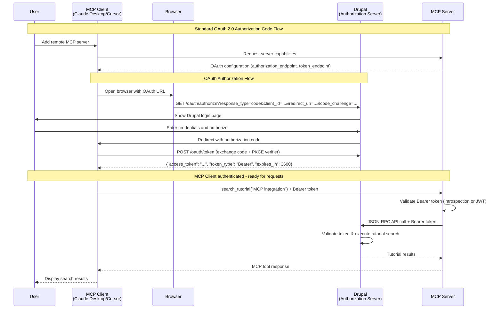
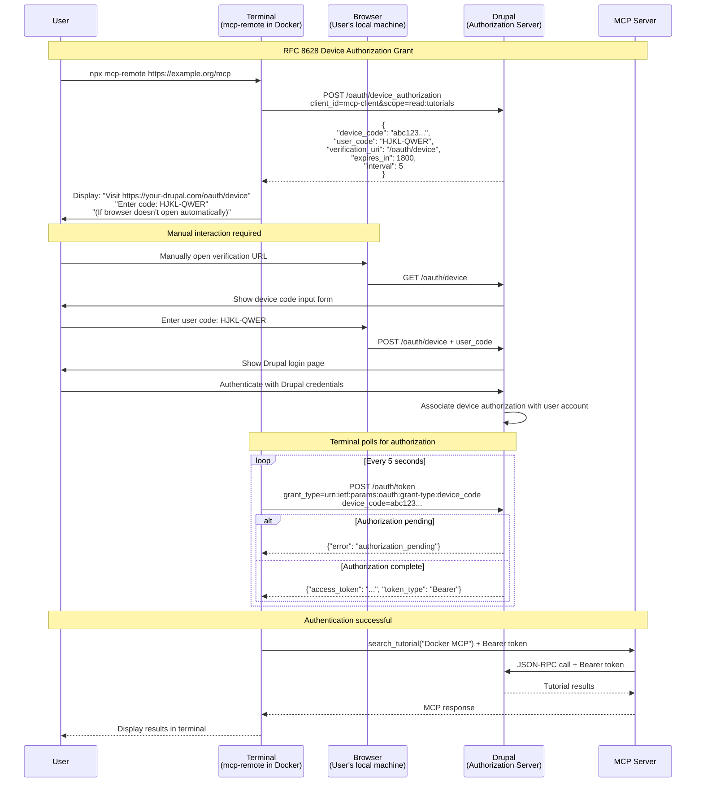
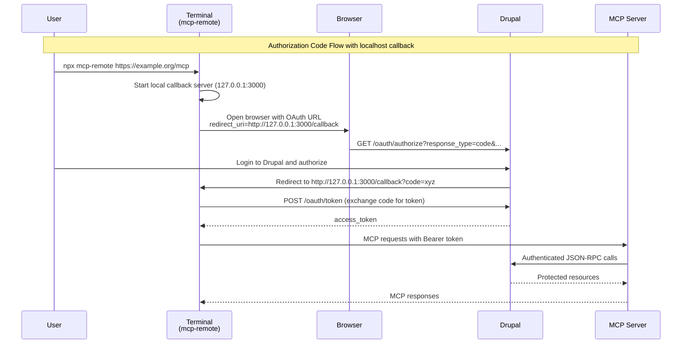
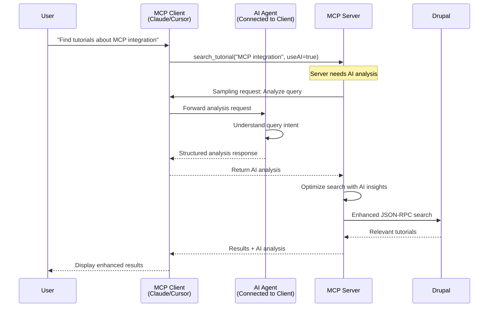
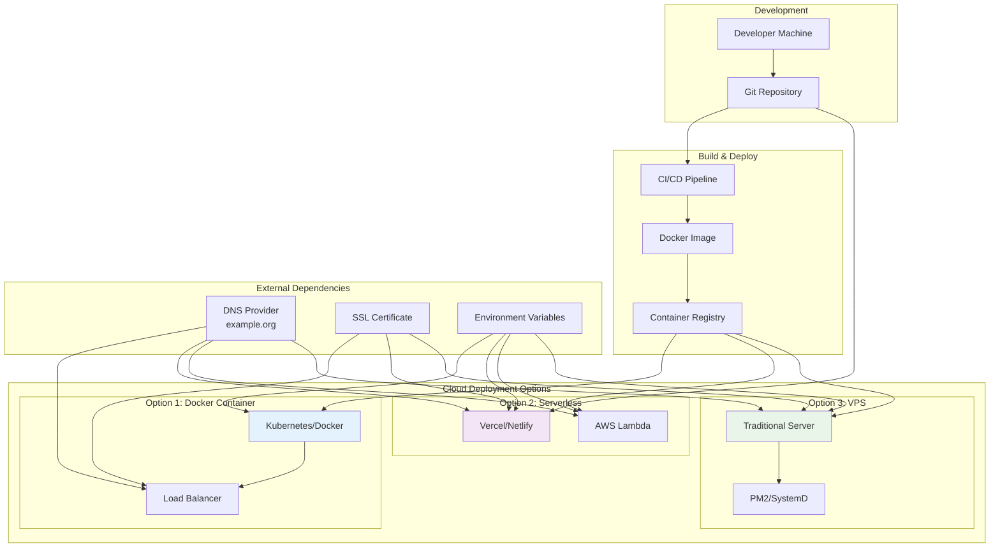
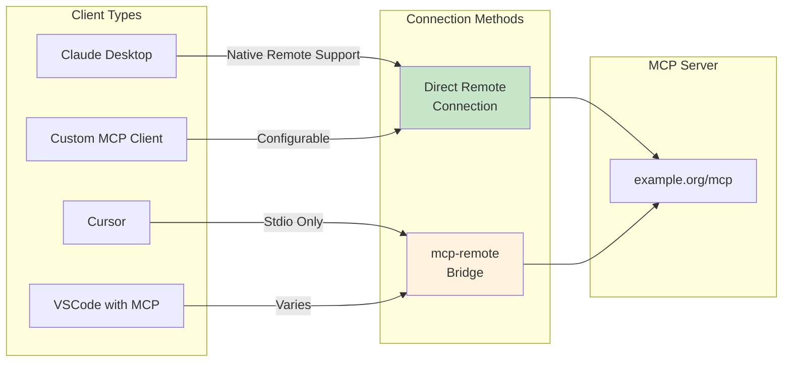

# Building an MCP Server with TypeScript: Implementation Strategy for OAuth 2.1 and Drupal Integration

## Executive Summary

This research provides a comprehensive implementation strategy for building a **remote MCP Server** in TypeScript with HTTP transport, OAuth 2.1 authentication, and JSON-RPC integration with Drupal. Based on analysis of production MCP servers, this implementation creates a **single server binary** that handles OAuth authentication, provides MCP tools, and integrates with existing MCP clients like Claude Desktop and Cursor. The server handles OAuth callbacks directly (not requiring localhost callbacks) and can be accessed by clients either natively or through bridge tools like `mcp-remote`.

**Critical Architectural Clarification:** Research shows that MCP implementations consist of:
1. **MCP Server** (what we build): Remote server providing tools and handling OAuth
2. **MCP Clients** (existing): Claude Desktop, Cursor, etc. - AI applications that connect to servers
3. **Bridge Tools** (optional): `mcp-remote` for connecting stdio-only clients to remote servers

**AI Integration:** MCP Servers can communicate with host AI agents through "Sampling", enabling query analysis without separate API keys.

## Goals and Features

### Primary Goals
1. **Maximum SDK Reuse**: Leverage the official MCP SDK to avoid custom implementations
2. **OAuth 2.1 Compliance**: Implement secure, modern authentication with auto-discovery
3. **Multi-User Support**: Handle multiple authenticated users simultaneously on the **MCP Server**
4. **Secure Token Storage**: In-memory encryption without database dependencies on the **MCP Server**
5. **AI Agent Integration**: **MCP Server** leverages host AI capabilities via **MCP Client** without separate API keys
6. **HTTP Streamable Transport**: Use the modern transport mechanism for **MCP Server** communication (NOT stdio)
7. **MCP Inspector Compatibility**: Full validation and debugging support for the **MCP Server**

### Core Features

#### Authentication Features
- **OAuth 2.1 Auto-Configuration**: **MCP Server** discovers OAuth endpoints via well-known URLs
- **Multi-User Sessions**: **MCP Server** supports concurrent authenticated users
- **Encrypted Token Storage**: **MCP Server** provides cryptographically secure in-memory token management
- **Three Auth Tools**: login, logout, and authentication status provided by **MCP Server**

#### Content Features
- **JSON-RPC Communication**: **MCP Server** provides native integration with Drupal
- **Two Content Tools**: search_tutorial and get_tutorial provided by **MCP Server**
- **AI-Enhanced Search**: **MCP Server** performs query analysis using host AI capabilities via **MCP Client**

#### AI Integration Features (NEW)
- **MCP Sampling**: **MCP Server** requests AI completions from the host client via **MCP Client**
- **Query Analysis**: **MCP Server** uses AI to understand and optimize user queries
- **No API Keys Required**: Leverage existing host AI authentication through **MCP Client**
- **Fallback Mechanisms**: **MCP Server** provides graceful degradation when sampling unavailable

## MCP SDK Capabilities and HTTP Transport

### Built-in SDK Components for Maximum Reuse

The **@modelcontextprotocol/sdk** provides comprehensive built-in functionality that directly addresses your requirements without custom implementations:

**Key SDK Components:**
- `StreamableHTTPServerTransport` class for HTTP transport (NOT stdio)
- Built-in JSON-RPC 2.0 implementation (no additional libraries needed for MCP)
- Session management with cryptographic IDs
- CORS configuration and DNS rebinding protection
- Complete TypeScript type definitions with Zod schema validation

**Installation:**
```bash
npm install @modelcontextprotocol/sdk zod express json-rpc-2.0
```

### HTTP Transport Implementation Strategy

The SDK's `StreamableHTTPServerTransport` replaces the deprecated SSE transport and provides stateful, multi-session capabilities:

```typescript
import { StreamableHTTPServerTransport } from "@modelcontextprotocol/sdk/server/streamableHttp.js";
import { McpServer } from "@modelcontextprotocol/sdk/server/mcp.js";
import { randomUUID } from "node:crypto";

const transport = new StreamableHTTPServerTransport({
  sessionIdGenerator: () => randomUUID(),
  enableDnsRebindingProtection: true,
  allowedHosts: ['127.0.0.1', 'localhost'],
  allowedOrigins: ['https://yourdomain.com']
});
```

**Critical Implementation Points:**
- Sessions are managed automatically by the SDK
- Each client connection receives a unique session ID via `Mcp-Session-Id` header
- Transport handles both HTTP POST for requests and GET for SSE notifications
- Full MCP inspector compatibility through proper session management

## AI Agent Communication via MCP Sampling

### Leveraging Host AI Capabilities Without API Keys

**Critical Feature:** **MCP Servers** can request AI completions from the host client (Claude, Cursor, etc.) through a feature called **Sampling**. This eliminates the need for separate AI API keys and allows your **MCP Server** to leverage the existing AI agent's capabilities via the **MCP Client** for query analysis and intelligent processing.

### How MCP Sampling Works

MCP Sampling reverses the typical flow - instead of **MCP Clients** always initiating requests, **MCP Servers** can ask the **MCP Client** for AI assistance:

1. **MCP Server initiates sampling request** when it needs AI analysis (e.g., to analyze user queries)
2. **MCP Client receives request** and optionally shows it to the user for approval
3. **MCP Client forwards to its LLM** (Claude, GPT-4, etc.) using existing authentication
4. **LLM generates response** which is returned to the **MCP Server**
5. **MCP Server continues processing** with the AI-generated insight

### Implementation for Query Analysis

```typescript
// src/services/query-analyzer.ts
import { McpServer } from "@modelcontextprotocol/sdk/server/mcp.js";

export class QueryAnalyzer {
  constructor(private mcpServer: McpServer) {}

  async analyzeUserQuery(query: string, context?: any) {
    // Request AI analysis from the host client
    const samplingRequest = {
      method: "sampling/createMessage",
      params: {
        messages: [
          {
            role: "user",
            content: {
              type: "text",
              text: `Analyze this Drupal content query and extract:
                      1. The main search intent
                      2. Content type (tutorial, documentation, etc.)
                      3. Any specific filters or constraints
                      Query: "${query}"`
            }
          }
        ],
        modelPreferences: {
          intelligencePriority: 0.8,  // Prefer smart analysis
          speedPriority: 0.6,          // Reasonable speed
          costPriority: 0.4            // Cost is less critical
        },
        systemPrompt: "You are a Drupal content query analyzer. Extract structured information from user queries.",
        includeContext: "thisServer",
        maxTokens: 200,
        temperature: 0.3  // Lower temperature for consistent analysis
      }
    };

    try {
      const response = await this.mcpServer.request(samplingRequest);
      return this.parseAnalysis(response.content.text);
    } catch (error) {
      // Fallback to basic keyword extraction if sampling fails
      return this.basicQueryParsing(query);
    }
  }

  private parseAnalysis(aiResponse: string) {
    // Parse the AI response into structured data
    // The AI will return analysis that helps optimize Drupal queries
    return {
      intent: extractIntent(aiResponse),
      contentType: extractContentType(aiResponse),
      filters: extractFilters(aiResponse)
    };
  }
}
```

### Enhanced Tool Implementation with AI Analysis

```typescript
// src/tools/content/search.ts
this.mcpServer.registerTool(
  "search_tutorial",
  {
    title: "Search Tutorials with AI Analysis",
    description: "Search Drupal tutorials with intelligent query understanding",
    inputSchema: {
      query: z.string(),
      useAiAnalysis: z.boolean().optional().default(true)
    }
  },
  async ({ query, useAiAnalysis }, context) => {
    let searchParams = { query };
    
    if (useAiAnalysis && context.capabilities?.sampling) {
      // Use the host AI to understand the query better
      const analyzer = new QueryAnalyzer(this.mcpServer);
      const analysis = await analyzer.analyzeUserQuery(query);
      
      // Use AI insights to build better Drupal queries
      searchParams = {
        ...searchParams,
        contentType: analysis.contentType,
        filters: analysis.filters,
        intent: analysis.intent
      };
    }
    
    // Execute optimized search with AI-enhanced parameters
    const results = await this.drupal.searchTutorial(searchParams);
    
    return {
      content: [{
        type: "text",
        text: JSON.stringify({
          results,
          aiAnalysis: searchParams.intent ? analysis : undefined
        })
      }]
    };
  }
);
```

### Advantages of MCP Sampling

1. **No API Keys Required**: Leverages the host's existing AI authentication through **MCP Client**
2. **Cost Efficiency**: AI costs handled by the **MCP Client**, not your **MCP Server**
3. **User Control**: Optional human-in-the-loop approval for sensitive requests in **MCP Client**
4. **Scalability**: **MCP Server** remains lightweight while accessing powerful AI via **MCP Client**
5. **Security**: No need to store or manage AI provider credentials on **MCP Server**

### MCP Client Compatibility Note

Not all **MCP Clients** support sampling yet. The **MCP Server** implementation should:
- Check for sampling capability during initialization
- Provide fallback mechanisms when sampling is unavailable via **MCP Client**
- Gracefully degrade to basic functionality when **MCP Client** doesn't support sampling

```typescript
// Check if MCP Client supports sampling
const clientCapabilities = await this.mcpServer.getClientCapabilities();
const samplingEnabled = clientCapabilities.experimental?.sampling?.enabled;
```

## Dynamic Tool Discovery via /mcp/tools/list Endpoint

**MCP Servers** can dynamically discover and register tools from backend systems using the emerging community standard `/mcp/tools/list` endpoint pattern. This enables **MCP Servers** to automatically configure available tools based on backend capabilities without hardcoding tool definitions, following the agent-to-agent (A2A) framework principles.

**Community Standard Note**: The `/mcp/tools/list` endpoint is an emerging community convention for tool discovery in MCP implementations, not an official part of the MCP specification. It enables dynamic tool composition in agent-to-agent communication scenarios.

### The Three-Step Discovery Pattern

The tool discovery workflow follows a standardized three-step pattern:

1. **Discovery**: **MCP Server** queries the `/mcp/tools/list` endpoint at startup to discover available tools
2. **Description**: Backend responds with JSON tool definitions including schemas, endpoints, and metadata
3. **Invocation**: **MCP Server** dynamically registers handlers that validate and proxy requests to the backend

This pattern enables runtime tool composition where AI agents can discover and integrate specialized capabilities on-the-fly, similar to how browsers dynamically interact with REST APIs.

### Tool Definition Format

Drupal exposes tools via a standardized JSON format that describes each tool's interface:

```json
{
  "tools": [
    {
      "name": "search_tutorial",
      "description": "Search Drupal tutorials by keyword, tag, or category with AI-enhanced query analysis",
      "inputSchema": {
        "type": "object",
        "properties": {
          "query": {
            "type": "string",
            "description": "Search query string"
          },
          "limit": {
            "type": "number",
            "default": 10,
            "description": "Maximum number of results to return"
          },
          "tags": {
            "type": "array",
            "items": {"type": "string"},
            "description": "Optional array of tags to filter by"
          }
        },
        "required": ["query"]
      },
      "endpoint": "/jsonrpc",
      "method": "tutorial.search",
      "requiresAuth": true
    },
    {
      "name": "get_tutorial",
      "description": "Retrieve a specific tutorial by ID with full content and metadata",
      "inputSchema": {
        "type": "object",
        "properties": {
          "id": {
            "type": "string",
            "description": "Tutorial node ID"
          }
        },
        "required": ["id"]
      },
      "endpoint": "/jsonrpc",
      "method": "tutorial.get",
      "requiresAuth": true
    },
    {
      "name": "create_tutorial",
      "description": "Create a new tutorial with content and metadata",
      "inputSchema": {
        "type": "object",
        "properties": {
          "title": {"type": "string", "description": "Tutorial title"},
          "body": {"type": "string", "description": "Tutorial content in markdown"},
          "tags": {
            "type": "array",
            "items": {"type": "string"},
            "description": "Tutorial tags"
          },
          "category": {"type": "string", "description": "Tutorial category"}
        },
        "required": ["title", "body"]
      },
      "endpoint": "/jsonrpc",
      "method": "tutorial.create",
      "requiresAuth": true
    }
  ]
}
```

### TypeScript Implementation with MCP SDK

The **MCP Server** uses `@modelcontextprotocol/sdk` to dynamically discover and register tools from Drupal:

```typescript
import { Server } from "@modelcontextprotocol/sdk/server/index.js";
import { CallToolRequestSchema, ListToolsRequestSchema } from "@modelcontextprotocol/sdk/types.js";
import { z } from "zod";
import type { DrupalConnector } from "./drupal/connector.js";

interface ToolDefinition {
  name: string;
  description: string;
  inputSchema: JSONSchema;
  endpoint: string;
  method: string;
  requiresAuth: boolean;
}

interface JSONSchema {
  type: string;
  properties?: Record<string, any>;
  required?: string[];
}

/**
 * Convert JSON Schema to Zod schema for runtime validation
 */
function jsonSchemaToZod(schema: JSONSchema): z.ZodSchema {
  if (schema.type !== "object" || !schema.properties) {
    return z.object({});
  }

  const properties: Record<string, z.ZodTypeAny> = {};
  const required = new Set(schema.required || []);

  for (const [key, prop] of Object.entries(schema.properties)) {
    let zodType: z.ZodTypeAny;

    // Convert JSON Schema types to Zod types
    switch (prop.type) {
      case "string":
        zodType = z.string();
        if (prop.description) zodType = zodType.describe(prop.description);
        break;
      case "number":
        zodType = z.number();
        if (prop.description) zodType = zodType.describe(prop.description);
        if (prop.default !== undefined) zodType = zodType.default(prop.default);
        break;
      case "boolean":
        zodType = z.boolean();
        break;
      case "array":
        if (prop.items?.type === "string") {
          zodType = z.array(z.string());
        } else {
          zodType = z.array(z.any());
        }
        break;
      default:
        zodType = z.any();
    }

    // Make optional if not required
    if (!required.has(key)) {
      zodType = zodType.optional();
    }

    properties[key] = zodType;
  }

  return z.object(properties);
}

/**
 * Discover tools from Drupal /mcp/tools/list endpoint
 */
async function discoverTools(
  drupalUrl: string,
  server: Server,
  drupalConnector: DrupalConnector
): Promise<Map<string, ToolDefinition>> {
  const discoveredTools = new Map<string, ToolDefinition>();

  try {
    console.log(`Discovering tools from ${drupalUrl}/mcp/tools/list`);

    const response = await fetch(`${drupalUrl}/mcp/tools/list`, {
      headers: {
        "Accept": "application/json",
        "User-Agent": "MCP-Server/1.0"
      }
    });

    if (!response.ok) {
      console.warn(`Tool discovery failed: ${response.status} ${response.statusText}`);
      return discoveredTools;
    }

    const data = await response.json() as { tools: ToolDefinition[] };

    if (!Array.isArray(data.tools)) {
      console.warn("Invalid tool discovery response: 'tools' must be an array");
      return discoveredTools;
    }

    console.log(`Discovered ${data.tools.length} tools from Drupal`);

    for (const toolDef of data.tools) {
      // Validate tool definition
      if (!toolDef.name || !toolDef.description || !toolDef.method) {
        console.warn(`Skipping invalid tool definition: ${JSON.stringify(toolDef)}`);
        continue;
      }

      // Convert JSON Schema to Zod for validation
      const zodSchema = jsonSchemaToZod(toolDef.inputSchema);

      // Register tool with MCP server
      server.setRequestHandler(CallToolRequestSchema, async (request) => {
        if (request.params.name !== toolDef.name) {
          return; // Not this tool
        }

        try {
          // Validate input parameters against schema
          const validated = zodSchema.parse(request.params.arguments);

          // Check authentication if required
          if (toolDef.requiresAuth && !drupalConnector.isAuthenticated()) {
            throw new Error("Authentication required for this tool");
          }

          // Invoke Drupal backend via JSON-RPC
          const result = await drupalConnector.call(toolDef.method, validated);

          return {
            content: [
              {
                type: "text",
                text: JSON.stringify(result, null, 2)
              }
            ]
          };
        } catch (error) {
          if (error instanceof z.ZodError) {
            throw new Error(`Invalid parameters: ${error.message}`);
          }
          throw error;
        }
      });

      discoveredTools.set(toolDef.name, toolDef);
      console.log(`Registered dynamic tool: ${toolDef.name}`);
    }

    return discoveredTools;

  } catch (error) {
    console.error("Tool discovery error:", error);
    return discoveredTools;
  }
}

/**
 * Initialize MCP Server with dynamic tool discovery
 */
export async function createMCPServerWithDiscovery(
  drupalUrl: string,
  drupalConnector: DrupalConnector
): Promise<Server> {
  const server = new Server(
    {
      name: "drupal-mcp-server",
      version: "1.0.0"
    },
    {
      capabilities: {
        tools: {}
      }
    }
  );

  // Discover and register tools from Drupal
  const discoveredTools = await discoverTools(drupalUrl, server, drupalConnector);

  // Register ListTools handler to report discovered tools
  server.setRequestHandler(ListToolsRequestSchema, async () => {
    return {
      tools: Array.from(discoveredTools.values()).map(tool => ({
        name: tool.name,
        description: tool.description,
        inputSchema: tool.inputSchema
      }))
    };
  });

  // If no tools were discovered, fall back to static tools
  if (discoveredTools.size === 0) {
    console.warn("No tools discovered, falling back to static tool registration");
    await registerStaticTools(server, drupalConnector);
  }

  return server;
}

/**
 * Fallback: Register minimal static tools if discovery fails
 */
async function registerStaticTools(
  server: Server,
  drupalConnector: DrupalConnector
): Promise<void> {
  // Register core search_tutorial tool as fallback
  server.setRequestHandler(CallToolRequestSchema, async (request) => {
    if (request.params.name === "search_tutorial") {
      const schema = z.object({
        query: z.string(),
        limit: z.number().optional().default(10)
      });

      const validated = schema.parse(request.params.arguments);
      const result = await drupalConnector.call("tutorial.search", validated);

      return {
        content: [{
          type: "text",
          text: JSON.stringify(result, null, 2)
        }]
      };
    }
  });

  console.log("Registered static fallback tools");
}
```

### Discovery Flow Architecture



### Security Considerations

**Authentication Propagation**:
- OAuth Bearer tokens from **MCP Client** sessions are forwarded with every tool invocation
- Drupal validates tokens and enforces user permissions before executing tool methods
- Tool discovery endpoint itself may require authentication to prevent information disclosure

**Schema Validation**:
- All tool parameters are validated against Zod schemas before backend invocation
- Invalid parameters are rejected with clear error messages
- Type coercion follows Zod's strict validation rules

**HTTPS Enforcement**:
- Tool discovery endpoint must use HTTPS in production environments
- Prevents man-in-the-middle attacks on tool definitions
- Protects OAuth tokens during tool invocations

**CORS Configuration**:
- Drupal must configure CORS headers to allow **MCP Server** origin
- Prevents unauthorized cross-origin tool discovery
- Restricts tool access to authorized MCP server instances

### Graceful Fallback Strategy

If tool discovery fails due to network errors, endpoint unavailability, or invalid responses, the **MCP Server** falls back to a minimal set of statically defined core tools:

```typescript
async function discoverTools(...) {
  try {
    // Attempt discovery
    const response = await fetch(`${drupalUrl}/mcp/tools/list`);

    if (!response.ok) {
      throw new Error(`HTTP ${response.status}`);
    }

    const { tools } = await response.json();
    // ... register discovered tools

  } catch (error) {
    console.warn("Tool discovery failed, using static fallback tools");
    await registerStaticTools(server, drupalConnector);
  }
}
```

This ensures the **MCP Server** remains functional even if the Drupal backend is temporarily unavailable or doesn't implement the `/mcp/tools/list` endpoint yet.

### Integration with Existing Features

**OAuth Authentication**:
- Discovered tools automatically use the existing OAuth token flow
- Session tokens are propagated to Drupal with every tool invocation
- Tools marked with `requiresAuth: true` enforce authentication

**Session Management**:
- Tool calls maintain session state across invocations
- Each **MCP Client** session has isolated tool execution context
- Session cleanup removes tool-specific state

**MCP Sampling**:
- Dynamically discovered tools can leverage AI sampling for query analysis
- Tool implementations can request human confirmation via sampling
- No code changes needed in tool definitions

**Error Handling**:
- Tool execution errors propagate with structured JSON-RPC error codes
- Validation failures provide clear parameter mismatch messages
- Backend errors are wrapped with contextual information

### Benefits of Dynamic Tool Discovery

**Zero Configuration Maintenance**:
- No hardcoded tool definitions in **MCP Server** code
- New Drupal capabilities automatically become available to **MCP Clients**
- Tool signature changes don't require **MCP Server** updates

**Type Safety**:
- JSON Schema → Zod conversion ensures runtime type checking
- Invalid parameters are caught before reaching Drupal
- TypeScript provides compile-time safety for tool handlers

**Standardization**:
- Follows emerging MCP community conventions for A2A communication
- Tool definitions are backend-agnostic (works with any JSON-RPC backend)
- Consistent tool interface across multiple **MCP Servers**

**Development Velocity**:
- Backend developers can add tools without coordinating with **MCP Server** team
- Tool logic lives in Drupal where domain expertise exists
- Faster iteration on tool capabilities

**Scalability**:
- Supports hundreds of tools without **MCP Server** code bloat
- Tool registration happens once at startup, minimal runtime overhead
- Caching strategies can optimize repeated discovery requests

## OAuth 2.0 Multi-User Authentication Architecture

### Drupal as Unified Authorization and Resource Server

**Architectural Decision:** Drupal serves as both the OAuth 2.0 Authorization Server and Resource Server, eliminating the need for external services like Auth0 or Google OAuth. This creates a streamlined architecture where:

1. **Authorization Server**: Drupal with `simple_oauth:^6` + `simple_oauth_21` modules handles OAuth flows
2. **Resource Server**: Same Drupal instance validates Bearer tokens for JSON-RPC API access
3. **MCP Server**: Acts as OAuth client and validates tokens for MCP tool access

### Supported OAuth Flows

#### 1. OAuth 2.0 Authorization Code Flow (Standard)
- **Use case**: Modern MCP clients (Claude Desktop, Cursor) with browser support
- **Endpoints**: `/oauth/authorize` (provided by simple_oauth)
- **Benefits**: Standard flow with PKCE, no manual code pasting required

#### 2. OAuth 2.0 Device Authorization Grant (RFC 8628)
- **Use case**: Headless environments (Docker containers), limited-input devices
- **Status**: **To be implemented** in `simple_oauth_21` module
- **Benefits**: Manual URL opening and code pasting for constrained environments

**Implementation Target:**
```bash
# Future enhancement to simple_oauth_21
composer require e0ipso/simple_oauth_21:dev-device-flow
```

### RFC 8628 Device Flow Implementation Plan

The Device Authorization Grant enables OAuth for devices with limited input capabilities or no browser access.

**Required Endpoints (to be added to simple_oauth_21):**

1. **Device Authorization Endpoint**: `/oauth/device_authorization`
   ```http
   POST /oauth/device_authorization HTTP/1.1
   Content-Type: application/x-www-form-urlencoded

   client_id=mcp-client-123&scope=read:tutorials+write:tutorials
   ```

   **Response:**
   ```json
   {
     "device_code": "4d03f7bc-f7a5-4795-819a-5748c4801d35",
     "user_code": "HJKL-QWER",
     "verification_uri": "https://your-drupal.com/oauth/device",
     "verification_uri_complete": "https://your-drupal.com/oauth/device?user_code=HJKL-QWER",
     "expires_in": 1800,
     "interval": 5
   }
   ```

2. **Device Verification Page**: `/oauth/device`
   - Simple form where users enter the user code
   - Redirects to standard Drupal login
   - Associates device authorization with user account

3. **Enhanced Token Endpoint**: `/oauth/token`
   ```http
   POST /oauth/token HTTP/1.1
   Content-Type: application/x-www-form-urlencoded

   grant_type=urn:ietf:params:oauth:grant-type:device_code&
   device_code=4d03f7bc-f7a5-4795-819a-5748c4801d35&
   client_id=mcp-client-123
   ```

**Device Flow User Experience:**
```bash
# Terminal output in Docker container
$ npx mcp-remote https://example.org/mcp

Please visit: https://your-drupal.com/oauth/device
And enter code: HJKL-QWER

If the browser doesn't open automatically, copy the URL above.
Waiting for authorization...
```

### In-Memory Encrypted Token Storage

Use Node.js built-in crypto for zero-dependency encryption:

```typescript
import { createCipheriv, createDecipheriv, randomBytes, scrypt } from 'crypto';
import { promisify } from 'util';

class TokenEncryption {
  private algorithm = 'aes-256-gcm';
  
  async encrypt(tokens: any, masterKey: string): Promise<string> {
    const iv = randomBytes(16);
    const salt = randomBytes(32);
    const key = await promisify(scrypt)(masterKey, salt, 32) as Buffer;
    
    const cipher = createCipheriv(this.algorithm, key, iv);
    const encrypted = Buffer.concat([
      cipher.update(JSON.stringify(tokens), 'utf8'),
      cipher.final()
    ]);
    
    const authTag = cipher.getAuthTag();
    return Buffer.concat([salt, iv, authTag, encrypted]).toString('base64');
  }
}
```

## JSON-RPC Integration with Drupal

### Leveraging MCP SDK's Built-in JSON-RPC

The **MCP Server** leverages the MCP SDK which **already includes JSON-RPC 2.0** as its core protocol for **MCP Client** communication. For Drupal-specific JSON-RPC calls beyond MCP communication, the **MCP Server** adds:

```bash
npm install json-rpc-2.0
```

**MCP Server Drupal Integration Pattern:**
```typescript
import { JSONRPCClient } from "json-rpc-2.0";

// Runs on MCP Server to communicate with Drupal backend
class DrupalConnector {
  private drupalClient: JSONRPCClient;

  constructor(baseUrl: string, oauthManager: MCPOAuthManager) {
    this.drupalClient = new JSONRPCClient(async (request) => {
      // Use OAuth tokens stored on MCP Server
      const token = await oauthManager.getValidToken();

      return fetch(`${baseUrl}/jsonrpc`, {
        method: "POST",
        headers: {
          "Content-Type": "application/json",
          "Authorization": `Bearer ${token}`
        },
        body: JSON.stringify(request)
      }).then(response => response.json());
    });
  }

  async searchTutorial(query: string) {
    return this.drupalClient.request("tutorial.search", { query });
  }

  async getTutorial(id: string) {
    return this.drupalClient.request("tutorial.get", { id });
  }
}
```

## MCP Server Tool Implementation Architecture

### MCP Server Project Structure
```
mcp-drupal-server/
├── src/
│   ├── index.ts              # MCP Server entry point with HTTP server
│   ├── server.ts             # MCP Server setup and configuration
│   ├── tools/
│   │   ├── auth/
│   │   │   ├── login.ts      # MCP Server auth tools
│   │   │   ├── logout.ts
│   │   │   └── status.ts
│   │   └── content/
│   │       ├── search.ts     # MCP Server content tools
│   │       └── get.ts
│   ├── services/
│   │   ├── oauth.ts          # MCP Server OAuth token management
│   │   ├── encryption.ts     # MCP Server token encryption
│   │   ├── drupal.ts         # MCP Server Drupal JSON-RPC client
│   │   └── query-analyzer.ts # MCP Server AI-powered query analysis via MCP Client
│   └── types/
├── package.json
└── tsconfig.json
```

### Complete MCP Server Implementation with OAuth Token Reception

```typescript
// src/server.ts
import { McpServer } from "@modelcontextprotocol/sdk/server/mcp.js";
import { StreamableHTTPServerTransport } from "@modelcontextprotocol/sdk/server/streamableHttp.js";
import { exchangeAuthorization } from "@modelcontextprotocol/sdk/client/auth.js";
import { z } from "zod";
import express from "express";
import { MCPOAuthManager } from "./services/oauth.js";
import { DrupalConnector } from "./services/drupal.js";
import { QueryAnalyzer } from "./services/query-analyzer.js";

export class MCPDrupalServer {
  private mcpServer: McpServer;
  private transports = new Map<string, StreamableHTTPServerTransport>();
  private oauth: MCPOAuthManager;
  private drupal: DrupalConnector;
  private queryAnalyzer: QueryAnalyzer;
  private app: express.Application;

  constructor() {
    this.mcpServer = new McpServer({
      name: "drupal-oauth-server",
      version: "1.0.0"
    });
    
    this.app = express();
    this.oauth = new MCPOAuthManager();
    this.drupal = new DrupalConnector(process.env.DRUPAL_URL, this.oauth);
    this.queryAnalyzer = new QueryAnalyzer(this.mcpServer);
    
    this.registerTokenValidation();
    this.registerTools();
  }

  /**
   * Register OAuth token validation middleware
   * STANDARD ARCHITECTURE: MCP Server acts as Resource Server (RFC 6749)
   * - Authorization Server (Auth0/Google/etc) handles device flow
   * - MCP Server validates Bearer tokens for protected resources
   */
  private registerTokenValidation() {
    // Middleware to validate Bearer tokens on protected routes
    const validateToken = async (req: express.Request, res: express.Response, next: express.NextFunction) => {
      const authHeader = req.headers.authorization;

      if (!authHeader || !authHeader.startsWith('Bearer ')) {
        return res.status(401).json({ error: 'Missing or invalid authorization header' });
      }

      const token = authHeader.substring(7);

      try {
        // Validate token with authorization server or decode JWT
        const tokenInfo = await this.oauth.validateAccessToken(token);

        if (!tokenInfo.valid) {
          return res.status(401).json({ error: 'Invalid or expired token' });
        }

        // Store user info in request for use by MCP tools
        (req as any).user = tokenInfo.user;
        next();

      } catch (error) {
        res.status(401).json({ error: 'Token validation failed' });
      }
    };

    // Apply token validation to MCP endpoint
    this.app.use('/mcp', validateToken);

    // Optional: Health check endpoint (no auth required)
    this.app.get('/health', (req, res) => {
      res.json({ status: 'ok', timestamp: new Date().toISOString() });
    });

    // OAuth configuration endpoint (for MCP client discovery)
    this.app.get('/.well-known/oauth-authorization-server', (req, res) => {
      res.json({
        issuer: process.env.DRUPAL_OAUTH_BASE_URL,
        authorization_endpoint: `${process.env.DRUPAL_OAUTH_BASE_URL}/oauth/authorize`,
        token_endpoint: `${process.env.DRUPAL_OAUTH_BASE_URL}/oauth/token`,
        registration_endpoint: `${process.env.DRUPAL_OAUTH_BASE_URL}/oauth/register`,
        scopes_supported: ['read:tutorials', 'write:tutorials'],
        response_types_supported: ['code'],
        grant_types_supported: ['authorization_code', 'refresh_token', 'client_credentials']
      });
    });
  }

  private registerTools() {
    // Login tool
    this.mcpServer.registerTool(
      "login",
      {
        title: "User Login",
        description: "Authenticate with OAuth 2.1",
        inputSchema: {
          username: z.string(),
          password: z.string()
        }
      },
      async ({ username, password }) => {
        try {
          const sessionId = await this.oauth.authenticateUser(username, password);
          return {
            content: [{
              type: "text",
              text: `Login successful. Session: ${sessionId}`
            }]
          };
        } catch (error) {
          return {
            content: [{
              type: "text",
              text: `Login failed: ${error.message}`
            }],
            isError: true
          };
        }
      }
    );

    // Search tutorial tool with AI enhancement
    this.mcpServer.registerTool(
      "search_tutorial",
      {
        title: "Search Tutorials",
        description: "Search Drupal tutorials with optional AI analysis",
        inputSchema: {
          query: z.string(),
          limit: z.number().optional().default(10),
          useAiAnalysis: z.boolean().optional().default(true)
        }
      },
      async ({ query, limit, useAiAnalysis }, context) => {
        let searchParams = { query };
        
        // Use AI to enhance the search if available
        if (useAiAnalysis && context.capabilities?.sampling) {
          const analysis = await this.queryAnalyzer.analyzeUserQuery(query);
          searchParams = { ...searchParams, ...analysis };
        }
        
        const results = await this.drupal.searchTutorial(searchParams);
        return {
          content: [{
            type: "text",
            text: JSON.stringify(results.slice(0, limit))
          }]
        };
      }
    );
  }

  async handleHTTPRequest(req: express.Request, res: express.Response) {
    const sessionId = req.headers['mcp-session-id'] as string;
    let transport: StreamableHTTPServerTransport;

    if (sessionId && this.transports.has(sessionId)) {
      transport = this.transports.get(sessionId)!;
    } else {
      transport = new StreamableHTTPServerTransport({
        sessionIdGenerator: () => randomUUID(),
        onsessioninitialized: (id) => {
          this.transports.set(id, transport);
        }
      });
      
      await this.mcpServer.connect(transport);
    }

    await transport.handleRequest(req, res, req.body);
  }

  /**
   * Start the remote MCP Server
   * NOTE: OAuth callbacks are handled by MCP Client, not this MCP Server
   */
  async start() {
    // Setup Express middleware for MCP Client requests
    this.app.use('/mcp', (req, res) => this.handleHTTPRequest(req, res));

    // Start remote MCP Server (configure host/port as needed)
    const port = process.env.PORT || 3000;
    const host = process.env.HOST || '0.0.0.0';

    this.app.listen(port, host, () => {
      console.log(`Remote MCP Server (Drupal integration) running on http://${host}:${port}`);
      console.log('MCP Client endpoint: /mcp');
      console.log('Note: OAuth callbacks handled by MCP Client on user localhost');
    });
  }
}
```

## TypeScript Configuration

### tsconfig.json
```json
{
  "compilerOptions": {
    "target": "ES2022",
    "module": "Node16",
    "moduleResolution": "Node16",
    "outDir": "./dist",
    "rootDir": "./src",
    "strict": true,
    "esModuleInterop": true,
    "skipLibCheck": true,
    "forceConsistentCasingInFileNames": true
  },
  "include": ["src/**/*"],
  "exclude": ["node_modules", "dist"]
}
```

### package.json
```json
{
  "name": "mcp-drupal-oauth-server",
  "version": "1.0.0",
  "type": "module",
  "scripts": {
    "build": "tsc",
    "dev": "tsx --watch src/index.ts",
    "start": "node dist/index.js",
    "test": "npx @modelcontextprotocol/inspector dist/index.js"
  },
  "dependencies": {
    "@modelcontextprotocol/sdk": "^1.18.1",
    "json-rpc-2.0": "^1.0.0",
    "express": "^4.18.0",
    "zod": "^3.22.0"
  },
  "devDependencies": {
    "@types/node": "^20.0.0",
    "typescript": "^5.0.0",
    "tsx": "^4.0.0"
  }
}
```

## MCP Inspector Validation

The **MCP Server** implementation ensures full MCP inspector compatibility through:

1. **Proper session management** via `StreamableHTTPServerTransport`
2. **Correct capability declaration** during **MCP Server** initialization
3. **Valid tool schemas** using Zod validation
4. **Standard JSON-RPC 2.0 error codes**
5. **CORS headers** for browser-based inspector access from **MCP Client**

**Testing Command:**
```bash
npx @modelcontextprotocol/inspector
```

**Inspector Configuration:**
```json
{
  "mcpServers": {
    "drupal-oauth": {
      "type": "streamable-http",
      "url": "http://127.0.0.1:3000/mcp"
    }
  }
}
```

## Installation and Deployment Guide

### Client Installation (User Perspective)

Based on research of production MCP servers, users connect to our remote MCP server using existing MCP clients:

#### Option 1: Direct Remote Server Support (Preferred)
Modern MCP clients like Claude Desktop support remote servers directly:

1. **Open MCP Client Settings** (e.g., Claude Desktop settings)
2. **Add Remote Server:**
   ```json
   {
     "mcpServers": {
       "drupal-mcp": {
         "type": "remote",
         "url": "https://example.org/mcp",
         "oauth": {
           "authorizationUrl": "https://example.org/oauth/authorize",
           "tokenUrl": "https://example.org/oauth/token"
         }
       }
     }
   }
   ```
3. **Authenticate:** Client handles OAuth flow automatically

#### Option 2: Using mcp-remote Bridge Tool
For stdio-only clients that don't support remote servers yet:

```bash
# Install mcp-remote globally
npm install -g mcp-remote

# Connect to remote MCP server
npx mcp-remote https://example.org/mcp --transport sse-only
```

Then configure client to use local stdio connection that mcp-remote creates.

#### Example Configuration for Claude Desktop

```json
{
  "mcpServers": {
    "drupal-oauth-server": {
      "command": "npx",
      "args": ["mcp-remote", "https://example.org/mcp"],
      "env": {}
    }
  }
}
```

### Server Deployment (Cloud Environment)

The MCP server deploys as a single binary to any cloud environment:

#### Deployment Requirements

**Environment Variables:**
```bash
# Server Configuration
PORT=3000
HOST=0.0.0.0
NODE_ENV=production

# Drupal Integration (Authorization + Resource Server)
DRUPAL_URL=https://your-drupal-site.com

# OAuth Configuration (Drupal OAuth client credentials)
OAUTH_CLIENT_ID=your_drupal_oauth_client_id
OAUTH_CLIENT_SECRET=your_drupal_oauth_client_secret
DRUPAL_OAUTH_BASE_URL=https://your-drupal-site.com

# Encryption Keys
TOKEN_ENCRYPTION_KEY=your_32_byte_encryption_key
```

**Domain Requirements:**
- **Public domain**: `https://example.org` (your deployed server)
- **MCP endpoint**: `https://example.org/mcp`
- **OAuth callback**: `https://example.org/oauth/callback`
- **Authorization URL**: `https://example.org/oauth/authorize`

#### Cloud Deployment Options

**Option 1: Docker Container**
```dockerfile
FROM node:18-alpine
WORKDIR /app
COPY package*.json ./
RUN npm ci --only=production
COPY dist/ ./dist/
EXPOSE 3000
CMD ["node", "dist/index.js"]
```

**Option 2: Serverless (Stateless)**
- Deploy to Vercel, Netlify, or AWS Lambda
- Use stateless server implementation
- Configure environment variables in platform

**Option 3: Traditional VPS/Cloud Server**
```bash
# Build and start server
npm run build
npm start
```

#### Production Considerations

1. **SSL/TLS Required**: OAuth flows require HTTPS
2. **Health Checks**: Implement `/health` endpoint
3. **Logging**: Structured logging for debugging
4. **Rate Limiting**: Protect against abuse
5. **CORS Configuration**: Proper client origin handling

#### OAuth Provider Configuration

Configure your Drupal OAuth client with:
- **Client ID and Secret**: Generated in Drupal's Simple OAuth module
- **Scopes**: Based on Drupal permissions needed (e.g., `read:tutorials`, `write:tutorials`)
- **Device flow endpoints**: Provided by `e0ipso/simple_oauth_21` module

### Example Production URLs

**MCP Server (example.org):**
- **MCP Server Endpoint**: `https://example.org/mcp` (protected with Bearer tokens)
- **Health Check**: `https://example.org/health`
- **OAuth Discovery**: `https://example.org/.well-known/oauth-authorization-server`

**Drupal Authorization/Resource Server (drupal-site.com):**
- **Authorization Endpoint**: `https://drupal-site.com/oauth/authorize` (standard OAuth flow)
- **Token Endpoint**: `https://drupal-site.com/oauth/token` (code exchange)
- **Client Registration**: `https://drupal-site.com/oauth/register` (dynamic registration)
- **JSON-RPC API**: `https://drupal-site.com/jsonrpc` (protected resources)

## Critical Implementation URLs and Resources

### Official Documentation
- **MCP Specification**: https://modelcontextprotocol.io/docs/specification
- **TypeScript SDK**: https://github.com/modelcontextprotocol/typescript-sdk
- **Transport Documentation**: https://modelcontextprotocol.io/docs/concepts/transports
- **MCP Inspector**: https://github.com/modelcontextprotocol/inspector
- **Sampling Specification**: https://modelcontextprotocol.io/specification/client/sampling

### OAuth 2.1 Resources
- **OAuth 2.1 Specification**: https://datatracker.ietf.org/doc/draft-ietf-oauth-v2-1/
- **Discovery Endpoint Spec (RFC 8414)**: https://datatracker.ietf.org/doc/rfc8414/

### Drupal Integration
- **Drupal JSON-RPC Module**: https://www.drupal.org/project/jsonrpc
- **Simple OAuth Module**: https://www.drupal.org/project/simple_oauth

### MCP Sampling Resources
- **MCP Sampling Guide**: https://www.speakeasy.com/mcp/building-servers/advanced-concepts/sampling
- **WorkOS Sampling Article**: https://workos.com/blog/mcp-sampling
- **MCPEvals Sampling Guide**: https://www.mcpevals.io/blog/mcp-sampling-explained

### Community Resources
- **Official Discord**: https://discord.com/invite/model-context-protocol-1312302100125843476
- **Example Servers**: https://github.com/modelcontextprotocol/servers

## Key Implementation Decisions

**Single Binary Architecture**: Based on production MCP server analysis, this implementation creates one server binary that handles OAuth authentication, provides MCP tools, and integrates with existing MCP clients. No separate client binary is needed.

**Maximize SDK reuse** by leveraging `StreamableHTTPServerTransport` on the MCP Server for all session management and HTTP handling. The SDK provides everything needed without custom transport implementations.

**OAuth 2.1 compliance** achieved natively through the @modelcontextprotocol/sdk with automatic discovery endpoint support, mandatory PKCE, and built-in token management. The server implements OAuth callback endpoints directly.

**Direct OAuth Callback Handling**: The MCP Server handles OAuth callbacks at its own endpoints (e.g., `https://example.org/oauth/callback`) rather than requiring localhost callbacks. This follows the pattern of production MCP servers like NapthaAI and LlamaIndex implementations.

**In-memory encryption** using Node.js built-in crypto eliminates database dependencies while maintaining security through AES-256-GCM encryption with proper key derivation.

**JSON-RPC handled natively** by the MCP SDK for MCP client communication, with `json-rpc-2.0` library added only for Drupal-specific calls, avoiding redundancy.

**Client Compatibility**: The server works with existing MCP clients (Claude Desktop, Cursor, etc.) either directly or through bridge tools like `mcp-remote` for stdio-only clients.

**AI Integration via Sampling** enables the MCP Server to request query analysis and intelligent processing from connected MCP clients without requiring separate API keys.

**Cloud-First Design**: Stateless server implementation suitable for serverless deployment, with stateful option for traditional hosting. Environment variable configuration for OAuth providers, Drupal integration, and encryption keys.

**MCP Inspector compatibility** ensured through proper session management, valid schemas, and correct transport configuration, enabling full debugging capabilities.

This implementation strategy provides a production-ready solution that follows established MCP server patterns, ensures security through OAuth 2.1 and encryption, leverages host AI capabilities through sampling, and maintains full compatibility with the MCP ecosystem while efficiently integrating with Drupal backends.

## Architecture Diagrams

### Overall System Architecture



### OAuth 2.0 Authorization Code Flow (Standard - Modern Clients)

For MCP clients with native OAuth support (Claude Desktop, Cursor):



### OAuth 2.0 Device Flow (RFC 8628 - Headless Environments)

For constrained environments (Docker containers, headless servers):



### Legacy Authorization Code Flow (mcp-remote)

For stdio-only clients using authorization code flow with localhost callback:



### MCP Sampling (AI Integration) Flow



### Deployment Architecture



### Client Configuration Examples

