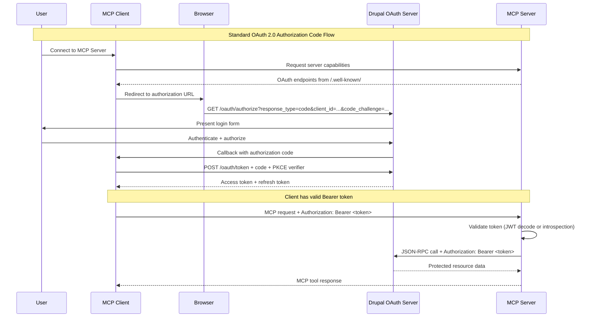
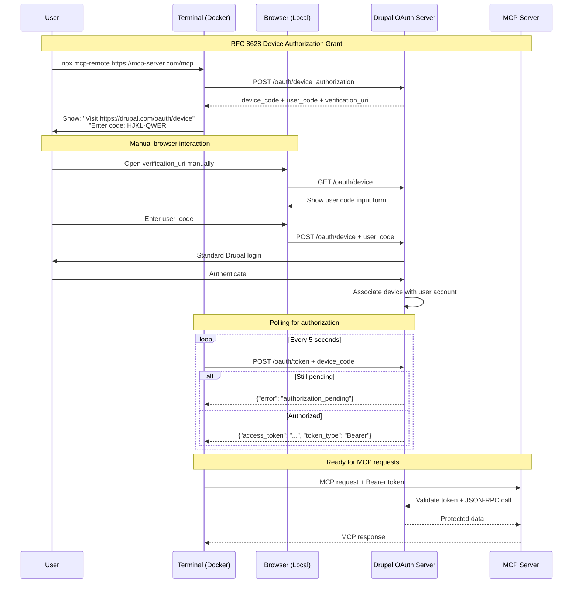

# 02: OAuth 2.0 Authentication System

## Overview

Implement OAuth 2.0 compliant authentication using Drupal as both Authorization Server and Resource Server, supporting secure user authentication for the MCP Server. This phase enables the MCP Server to validate Bearer tokens and make authenticated requests to Drupal's JSON-RPC API, supporting both standard OAuth flows for modern clients and device flow for headless environments.

## User-Facing Features

- **Multiple OAuth Flows**: Support for Authorization Code flow (standard) and Device Authorization Grant (RFC 8628) for different environments
- **Drupal Integration**: Direct authentication against Drupal user accounts with role-based access control
- **Bearer Token Validation**: MCP Server validates OAuth tokens for secure tool access
- **Headless Support**: Device flow enables authentication in Docker containers and constrained environments
- **Auto-Discovery**: Automatic OAuth endpoint discovery via Drupal's well-known metadata endpoints

## Functional Capabilities

- **MCP Server** validates Bearer tokens from Drupal OAuth server
- **MCP Server** makes authenticated JSON-RPC calls to Drupal using Bearer tokens
- **Drupal** handles OAuth authorization flows and token issuance
- **Drupal** validates tokens for protected resource access
- **Multi-user sessions** with token isolation per MCP client connection
- **Token refresh** handling for long-lived sessions

## Architecture Overview

### Role Definitions

- **Drupal**: OAuth 2.0 Authorization Server + Resource Server
- **MCP Server**: OAuth-protected service that validates Bearer tokens
- **MCP Clients**: OAuth clients (Claude Desktop, mcp-remote, etc.)

### Supported OAuth Flows

#### 1. Authorization Code Flow (Standard)
- **Use Case**: Modern MCP clients with browser support
- **Endpoints**: `/oauth/authorize`, `/oauth/token` (provided by simple_oauth)
- **Features**: PKCE, automatic browser handling, secure callback

#### 2. Device Authorization Grant (RFC 8628)
- **Use Case**: Headless environments, Docker containers, limited input devices
- **Status**: **Implementation required** in simple_oauth_21 module
- **Features**: Manual URL opening, code pasting, polling for authorization

## Technical Stack Requirements

### Drupal OAuth Server Dependencies

**Required Modules:**
```bash
# Core OAuth 2.0 support
composer require drupal/simple_oauth:^6.0

# OAuth 2.1 compliance and RFC extensions
composer require e0ipso/simple_oauth_21:^2.0

# Future: Device Flow support (to be implemented)
composer require e0ipso/simple_oauth_21:dev-device-flow
```

**Module Configuration:**
- `simple_oauth`: Provides `/oauth/authorize`, `/oauth/token`, `/oauth/register`
- `simple_oauth_pkce`: Enforces PKCE for security
- `simple_oauth_server_metadata`: Provides `/.well-known/oauth-authorization-server`
- `simple_oauth_client_registration`: Dynamic client registration (RFC 7591)

### MCP Server Dependencies

```bash
# OAuth token validation
npm install @modelcontextprotocol/sdk
npm install express jsonwebtoken node-fetch

# Optional: Token introspection
npm install oauth2-token-introspection
```

## Authentication Flows

### Flow 1: OAuth 2.0 Authorization Code Flow

**Target Users**: Modern MCP clients (Claude Desktop, Cursor)



**Key HTTP Requests:**

1. **Authorization Request:**
   ```http
   GET /oauth/authorize?response_type=code&client_id=mcp-client&redirect_uri=https://client.example.com/callback&code_challenge=ABC123&code_challenge_method=S256&scope=read:tutorials+write:tutorials&state=xyz HTTP/1.1
   Host: your-drupal-site.com
   ```

2. **Token Exchange:**
   ```http
   POST /oauth/token HTTP/1.1
   Host: your-drupal-site.com
   Content-Type: application/x-www-form-urlencoded

   grant_type=authorization_code&code=abc123&redirect_uri=https://client.example.com/callback&client_id=mcp-client&code_verifier=def456
   ```

3. **Token Response:**
   ```json
   {
     "access_token": "eyJhbGciOiJSUzI1NiIsInR5cCI6IkpXVCJ9...",
     "token_type": "Bearer",
     "expires_in": 3600,
     "refresh_token": "1/jk3/refresh_token_here",
     "scope": "read:tutorials write:tutorials"
   }
   ```

### Flow 2: OAuth 2.0 Device Authorization Grant (RFC 8628)

**Target Users**: Headless environments, Docker containers, CI/CD pipelines



**Device Flow HTTP Requests:**

1. **Device Authorization Request:**
   ```http
   POST /oauth/device_authorization HTTP/1.1
   Host: your-drupal-site.com
   Content-Type: application/x-www-form-urlencoded

   client_id=mcp-terminal-client&scope=read:tutorials+write:tutorials
   ```

2. **Device Authorization Response:**
   ```json
   {
     "device_code": "4d03f7bc-f7a5-4795-819a-5748c4801d35",
     "user_code": "HJKL-QWER",
     "verification_uri": "https://your-drupal-site.com/oauth/device",
     "verification_uri_complete": "https://your-drupal-site.com/oauth/device?user_code=HJKL-QWER",
     "expires_in": 1800,
     "interval": 5
   }
   ```

3. **Token Polling:**
   ```http
   POST /oauth/token HTTP/1.1
   Host: your-drupal-site.com
   Content-Type: application/x-www-form-urlencoded

   grant_type=urn:ietf:params:oauth:grant-type:device_code&device_code=4d03f7bc-f7a5-4795-819a-5748c4801d35&client_id=mcp-terminal-client
   ```

4. **Polling Responses:**
   ```json
   // Still pending
   {"error": "authorization_pending", "error_description": "User has not authorized yet"}

   // Success
   {"access_token": "...", "token_type": "Bearer", "expires_in": 3600}
   ```

## MCP Server Implementation

### Bearer Token Validation Middleware

```typescript
import express from 'express';
import jwt from 'jsonwebtoken';

class MCPServerAuth {
  private app: express.Application;

  constructor() {
    this.app = express();
    this.setupTokenValidation();
  }

  private setupTokenValidation() {
    // Token validation middleware for MCP endpoints
    const validateBearerToken = async (req: express.Request, res: express.Response, next: express.NextFunction) => {
      const authHeader = req.headers.authorization;

      if (!authHeader?.startsWith('Bearer ')) {
        return res.status(401).json({
          error: 'missing_authorization',
          error_description: 'Bearer token required'
        });
      }

      const token = authHeader.substring(7);

      try {
        // Option 1: JWT verification (if using JWT tokens)
        const decoded = jwt.verify(token, process.env.DRUPAL_JWT_PUBLIC_KEY!);
        (req as any).user = decoded;

        // Option 2: Token introspection (if using opaque tokens)
        // const introspectionResult = await this.introspectToken(token);
        // if (!introspectionResult.active) {
        //   return res.status(401).json({ error: 'invalid_token' });
        // }

        next();
      } catch (error) {
        return res.status(401).json({
          error: 'invalid_token',
          error_description: 'Token validation failed'
        });
      }
    };

    // Apply validation to MCP endpoints
    this.app.use('/mcp', validateBearerToken);
  }

  // Token introspection for opaque tokens
  private async introspectToken(token: string): Promise<any> {
    const response = await fetch(`${process.env.DRUPAL_URL}/oauth/introspect`, {
      method: 'POST',
      headers: {
        'Content-Type': 'application/x-www-form-urlencoded',
        'Authorization': `Basic ${Buffer.from(`${process.env.OAUTH_CLIENT_ID}:${process.env.OAUTH_CLIENT_SECRET}`).toString('base64')}`
      },
      body: new URLSearchParams({ token })
    });

    return response.json();
  }
}
```

### OAuth Discovery Endpoint

```typescript
// Provide OAuth server metadata for MCP clients
app.get('/.well-known/oauth-authorization-server', (req, res) => {
  res.json({
    issuer: process.env.DRUPAL_URL,
    authorization_endpoint: `${process.env.DRUPAL_URL}/oauth/authorize`,
    token_endpoint: `${process.env.DRUPAL_URL}/oauth/token`,
    device_authorization_endpoint: `${process.env.DRUPAL_URL}/oauth/device_authorization`, // Future
    registration_endpoint: `${process.env.DRUPAL_URL}/oauth/register`,
    scopes_supported: ['read:tutorials', 'write:tutorials'],
    response_types_supported: ['code'],
    grant_types_supported: [
      'authorization_code',
      'refresh_token',
      'client_credentials',
      'urn:ietf:params:oauth:grant-type:device_code' // Future
    ],
    code_challenge_methods_supported: ['S256'],
    token_endpoint_auth_methods_supported: ['client_secret_basic', 'client_secret_post']
  });
});
```

## RFC 8628 Device Flow Implementation Requirements

### Drupal Module Enhancement (simple_oauth_21)

**New Routes Required:**
```yaml
# simple_oauth_21.routing.yml (additions needed)

simple_oauth_device_authorization:
  path: '/oauth/device_authorization'
  defaults:
    _controller: '\Drupal\simple_oauth_21\Controller\DeviceAuthorizationController::authorize'
  methods: [POST]
  requirements:
    _access: 'TRUE'

simple_oauth_device_verification:
  path: '/oauth/device'
  defaults:
    _controller: '\Drupal\simple_oauth_21\Controller\DeviceAuthorizationController::verify'
  methods: [GET, POST]
  requirements:
    _access: 'TRUE'
```

**Controller Implementation Outline:**
```php
<?php

namespace Drupal\simple_oauth_21\Controller;

class DeviceAuthorizationController {

  public function authorize() {
    // Generate device_code and user_code
    // Store in device_authorization entity
    // Return JSON response per RFC 8628
  }

  public function verify() {
    // GET: Show user code input form
    // POST: Validate user_code and redirect to /oauth/authorize
  }
}
```

**Database Schema:**
```sql
-- Device authorization storage
CREATE TABLE device_authorization (
  id INT AUTO_INCREMENT PRIMARY KEY,
  device_code VARCHAR(128) UNIQUE NOT NULL,
  user_code VARCHAR(16) UNIQUE NOT NULL,
  client_id VARCHAR(128) NOT NULL,
  scope TEXT,
  expires_at DATETIME NOT NULL,
  user_id INT NULL,
  created_at DATETIME DEFAULT CURRENT_TIMESTAMP
);
```

## Security Considerations

### Token Security
- **PKCE Required**: All authorization code flows must use PKCE (S256 method)
- **Token Lifetime**: Access tokens expire in 1 hour, refresh tokens in 30 days
- **Scope Limitation**: Tokens limited to requested scopes (read:tutorials, write:tutorials)
- **Token Revocation**: Support for token revocation via `/oauth/revoke`

### Device Flow Security
- **User Code Entropy**: Use high-entropy user codes (8+ characters, alphanumeric)
- **Device Code Security**: 128-character random device codes
- **Rate Limiting**: Limit verification attempts and token polling
- **Expiration**: Device codes expire in 30 minutes

### MCP Server Security
- **Token Validation**: Always validate Bearer tokens before processing MCP requests
- **HTTPS Required**: All OAuth flows require HTTPS in production
- **Session Isolation**: Separate token storage per MCP client session

## Environment Configuration

```bash
# MCP Server Environment Variables
DRUPAL_URL=https://your-drupal-site.com
OAUTH_CLIENT_ID=mcp-server-client
OAUTH_CLIENT_SECRET=your-client-secret
DRUPAL_JWT_PUBLIC_KEY=/path/to/jwt-public.key

# Optional: Token introspection credentials
OAUTH_INTROSPECTION_CLIENT_ID=introspection-client
OAUTH_INTROSPECTION_CLIENT_SECRET=introspection-secret
```

## Success Criteria

- **Standard Flow**: Modern MCP clients can authenticate via Authorization Code flow
- **Device Flow**: Terminal clients can authenticate via Device Authorization Grant
- **Token Validation**: MCP Server properly validates Bearer tokens from Drupal
- **Protected Resources**: Authenticated requests to Drupal JSON-RPC API work correctly
- **Error Handling**: Clear error messages for authentication failures
- **Security**: PKCE enforced, tokens properly scoped and validated

## Implementation Phases

### Phase 1: Authorization Code Flow (Available Now)
- [x] Drupal simple_oauth configured
- [x] MCP Server token validation
- [x] Bearer token support for JSON-RPC calls
- [x] OAuth discovery endpoint

### Phase 2: Device Flow Support (Implementation Required)
- [ ] Implement RFC 8628 endpoints in simple_oauth_21
- [ ] Device authorization controller
- [ ] User code verification UI
- [ ] Token polling support
- [ ] Database schema for device authorizations

### Phase 3: Production Hardening
- [ ] Token introspection support
- [ ] Rate limiting and abuse prevention
- [ ] Comprehensive error handling
- [ ] Security audit and testing

## Relevant Resources

### RFC Standards
- **[RFC 6749](https://datatracker.ietf.org/doc/html/rfc6749)**: OAuth 2.0 Authorization Framework
- **[RFC 8628](https://datatracker.ietf.org/doc/html/rfc8628)**: OAuth 2.0 Device Authorization Grant
- **[RFC 7636](https://datatracker.ietf.org/doc/html/rfc7636)**: PKCE for OAuth Public Clients
- **[RFC 8414](https://datatracker.ietf.org/doc/html/rfc8414)**: OAuth 2.0 Authorization Server Metadata

### Drupal Resources
- **[Simple OAuth Module](https://www.drupal.org/project/simple_oauth)**: drupal/simple_oauth:^6.0
- **[Simple OAuth 2.1](https://packagist.org/packages/e0ipso/simple_oauth_21)**: OAuth 2.1 compliance
- **[Drupal OAuth Documentation](https://www.drupal.org/docs/contributed-modules/simple-oauth)**

### Implementation Examples
- **[RFC 8628 Examples](https://docs.authlib.org/en/latest/specs/rfc8628.html)**: Authlib device flow implementation
- **[Google Device Flow](https://developers.google.com/identity/protocols/oauth2/limited-input-device)**: Production device flow example
- **[Microsoft Device Flow](https://learn.microsoft.com/en-us/entra/identity-platform/v2-oauth2-device-code)**: Enterprise device flow patterns