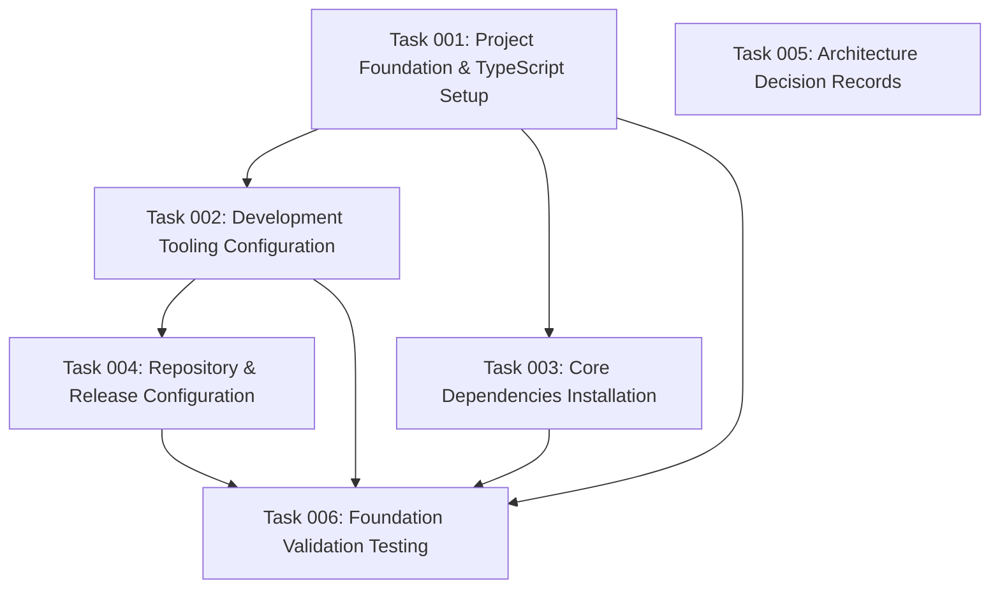

# Project Foundation & Tooling Setup

## Executive Summary

This plan establishes the foundational infrastructure for a Node.js/TypeScript MCP (Model Context Protocol) server project. The setup includes modern development tooling, standardized code quality enforcement, automated versioning, and proper repository configuration to support the technical requirements of an MCP server that will integrate with Drupal via OAuth and JSON-RPC.

## Project Context

**Target Application**: MCP Server for Drupalize.me RAG Enhancement
**Core Technologies**: Node.js, TypeScript, MCP Protocol, OAuth 2.0, PostgreSQL
**Deployment Platform**: Railway with PostgreSQL database
**Integration Points**: Drupal JSON-RPC, Simple OAuth, SSE transport

## Architecture Documentation Review

Before implementing the project foundation, thoroughly review the comprehensive architecture documentation in the `@architecture/` directory:

- `@architecture/project-summary.md` - Complete project overview and roadmap
- `@architecture/simplified-mvp-architecture.md` - MVP architecture without caching complexity  
- `@architecture/final-technical-specifications.md` - Complete technical implementation guide
- `@architecture/authentication-analysis.md` - OAuth 2.0 integration patterns
- `@architecture/component-diagrams.md` - System interaction diagrams

This documentation provides essential context for technology choices, architectural decisions, and integration patterns that inform the foundation setup.

## Technical Foundation Requirements

### Core Dependencies
- **MCP Protocol**: `@modelcontextprotocol/sdk` for MCP server implementation
- **Authentication**: OAuth 2.0 client libraries for Drupal integration
- **Database**: PostgreSQL client (`pg`) with TypeScript definitions
- **Transport**: HTTP/SSE server capabilities for MCP communication
- **JSON-RPC**: Client library for Drupal API integration

### Development Standards
- **TypeScript**: Strict mode with modern ES features
- **Code Quality**: ESLint with TypeScript rules, Prettier formatting
- **Git Hooks**: Husky for pre-commit quality enforcement
- **Testing**: Jest for unit and integration testing
- **Versioning**: Semantic-release for automated version management
- **Documentation**: TSDoc for code documentation

## Implementation Approach

### Phase 1: Core Project Structure
- Initialize Node.js project with proper package.json configuration
- Configure TypeScript with strict compiler options and path mapping
- Establish standardized directory structure for MCP server architecture
- Set up build pipeline with development and production configurations

### Phase 2: Development Tooling Integration  
- Configure ESLint with TypeScript parser and recommended rules
- Set up Prettier with consistent formatting standards
- Integrate Husky for Git hook automation
- Configure lint-staged for pre-commit quality checks
- Establish Jest testing environment with TypeScript support

### Phase 3: Package Management & Dependencies
- Install and configure core MCP server dependencies
- Add OAuth 2.0 client libraries for authentication flow
- Set up PostgreSQL client with connection pooling
- Include HTTP/SSE server dependencies for transport layer
- Configure development dependencies for build and quality tools

### Phase 4: Repository Configuration
- Initialize Git repository with appropriate .gitignore
- Configure GitHub repository with proper README and documentation
- Set up semantic-release for automated version management
- Establish branch protection and contribution guidelines
- Configure issue templates and pull request workflows

## Success Criteria

### Development Environment
- ✅ TypeScript project compiles without errors
- ✅ All linting rules pass with zero warnings
- ✅ Prettier formatting is consistent across all files
- ✅ Pre-commit hooks enforce code quality standards
- ✅ Test framework is configured and operational

### Project Structure
- ✅ Clear separation of concerns with organized directory structure
- ✅ Proper TypeScript configuration with strict type checking
- ✅ All necessary dependencies installed and configured
- ✅ Build scripts for development and production environments
- ✅ Documentation framework established

### Quality Assurance
- ✅ Code formatting automatically enforced via Prettier
- ✅ TypeScript strict mode validates all code
- ✅ ESLint catches common errors and enforces best practices
- ✅ Git hooks prevent commits that don't meet quality standards
- ✅ Automated testing environment ready for implementation

### Repository Management
- ✅ GitHub repository properly configured
- ✅ Semantic versioning with automated releases
- ✅ Clear contribution guidelines and templates
- ✅ Appropriate .gitignore excludes unnecessary files
- ✅ README provides clear project overview and setup instructions

## Risk Considerations

### Dependency Management
**Risk**: Version conflicts between MCP SDK and other dependencies
**Mitigation**: Pin specific versions, use npm-check-updates for managed upgrades, maintain compatibility matrix

### Configuration Complexity
**Risk**: Over-complex tooling setup that impedes development velocity
**Mitigation**: Use standard configurations where possible, document all custom settings, provide simple npm scripts for common tasks

### TypeScript Configuration
**Risk**: Overly strict TypeScript settings that slow initial development
**Mitigation**: Start with recommended TypeScript settings, gradually increase strictness, provide clear compiler error guidance

## Resource Requirements

### Development Tools
- Node.js v18+ (LTS version for stability)
- npm or yarn for package management
- VS Code or similar TypeScript-aware editor
- Git for version control

### Knowledge Areas
- Node.js ecosystem and package management
- TypeScript configuration and compilation
- Modern JavaScript/ES6+ features
- Git workflow and semantic versioning
- Code quality tools (ESLint, Prettier)

### Time Allocation
- **Project Initialization**: 4-6 hours
- **Tooling Configuration**: 6-8 hours  
- **Dependency Setup**: 4-6 hours
- **Repository Configuration**: 2-4 hours
- **Testing & Validation**: 4-6 hours

**Total Estimated Time**: 20-30 hours over 1-2 weeks

## Implementation Dependencies

### Prerequisites
- Access to target repository (GitHub)
- Understanding of MCP server requirements
- Knowledge of target deployment environment (Railway)

### External Dependencies
- npm registry access for package installation
- GitHub repository creation permissions
- Understanding of Drupal integration requirements

## Quality Standards

### Code Standards
- TypeScript strict mode compliance
- ESLint error-free code
- Prettier-formatted consistency
- 100% TypeScript coverage (no `any` types without justification)

### Documentation Standards
- Clear README with setup instructions
- TSDoc comments for all public interfaces
- Configuration file documentation
- Contributing guidelines for team development

### Testing Standards
- Jest test framework configured
- Test directory structure established
- Example test cases for validation
- Coverage reporting configured (target: >80%)

## Architecture Decision Records (ADRs)

During implementation of this plan, create ADRs to document significant architectural and tooling decisions:

- **ADR-001**: Technology Stack Selection (Node.js/TypeScript rationale)
- **ADR-002**: Development Tooling Choices (ESLint, Prettier, Husky configuration)
- **ADR-003**: Project Structure and Build Pipeline Design

These ADRs should be created in the `@architecture/adr/` directory following the established format and numbering sequence.

This foundation will enable efficient development of the MCP server while maintaining high code quality standards and supporting the technical architecture requirements for Drupal integration.

## Task Dependency Visualization

## Execution Blueprint

**Validation Gates:**
- Reference: `@.ai/task-manager/VALIDATION_GATES.md`

### Phase 1: Foundation & Documentation
**Parallel Tasks:**
- Task 001: Project Foundation & TypeScript Setup
- Task 005: Architecture Decision Records

### Phase 2: Tooling & Dependencies  
**Parallel Tasks:**
- Task 002: Development Tooling Configuration (depends on: 001)
- Task 003: Core Dependencies Installation (depends on: 001)

### Phase 3: Repository Configuration
**Parallel Tasks:**
- Task 004: Repository & Release Configuration (depends on: 002)

### Phase 4: Validation
**Parallel Tasks:**
- Task 006: Foundation Validation Testing (depends on: 001, 002, 003, 004)

### Post-phase Actions
After each phase completion, validation gates must pass before proceeding to the next phase.

### Execution Summary
- Total Phases: 4
- Total Tasks: 6
- Maximum Parallelism: 2 tasks (in Phase 1 and 2)
- Critical Path Length: 4 phases