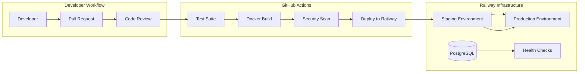
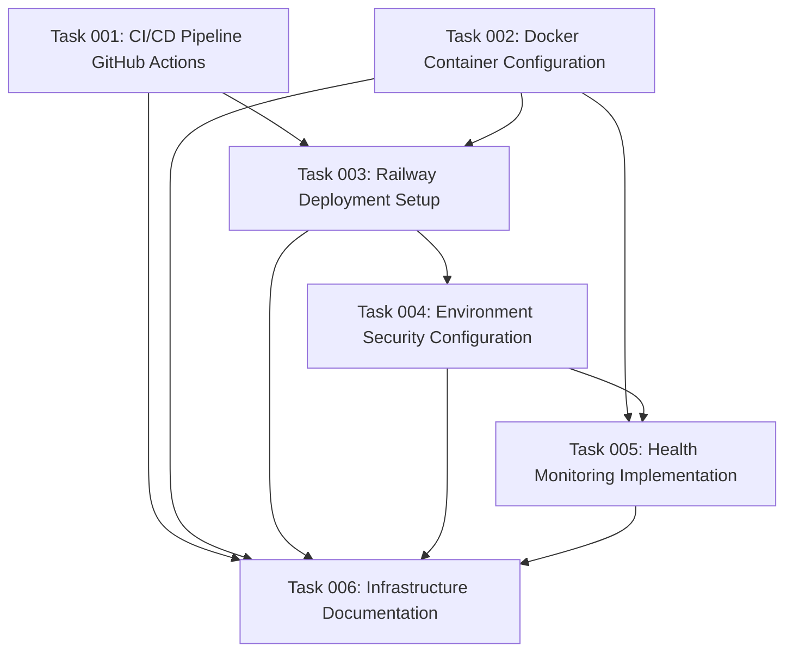

# Plan 2: CI/CD & Deployment Infrastructure

## Overview

This plan establishes a comprehensive CI/CD pipeline and deployment infrastructure for the MCP
(Model Context Protocol) server that connects to Drupalize.me's Drupal installation for RAG
(Retrieval Augmented Generation) system enhancement. The infrastructure must support the technical
requirements specified in the architecture documentation, including OAuth integration, PostgreSQL
database, and SSE-based MCP protocol communication.

## Context & Architecture Integration

Based on the architecture documentation in `/architecture/`, this MCP server has specific technical
requirements:

- **Technology Stack**: Node.js/TypeScript server with PostgreSQL database
- **Authentication**: OAuth 2.0 Authorization Code Grant flow with Drupal Simple OAuth module
- **Transport**: Server-Sent Events (SSE) for MCP protocol communication
- **Integration**: Direct JSON-RPC API calls to Drupalize.me Drupal installation
- **Deployment Target**: Railway platform for cloud hosting
- **Performance Requirements**: Sub-200ms content retrieval with graceful error handling

## Goals

1. **Automated Testing & Quality**: Comprehensive test suite with automated execution
2. **Containerized Deployment**: Docker-based deployment with multi-stage builds
3. **Cloud Infrastructure**: Railway deployment with proper environment management
4. **Monitoring & Observability**: Health checks, logging, and performance monitoring
5. **Security & Compliance**: Secure secret management and vulnerability scanning
6. **Developer Experience**: Streamlined deployment workflow with proper staging

## Technical Specifications

### CI/CD Pipeline Architecture

### Container Architecture

Based on the MCP server architecture, the Docker setup must support:

- **Base Image**: Node.js 20 Alpine for security and performance
- **Multi-stage Build**: Development dependencies separate from production
- **Health Checks**: Built-in health endpoint monitoring
- **Environment Variables**: Secure handling of OAuth secrets and database credentials
- **Port Configuration**: SSE endpoint on configurable port (default 3000)

### Deployment Environments

1. **Development**: Local development with Docker Compose
2. **Staging**: Railway environment with full Drupal integration testing
3. **Production**: Railway production environment with monitoring and alerting

## Implementation Tasks

### Phase 1: Foundation & Testing (Week 1)

1. **GitHub Actions Workflow Setup**
   - Configure test automation pipeline
   - Set up Node.js and PostgreSQL test environment
   - Implement test reporting and coverage analysis

2. **Docker Container Configuration**
   - Create multi-stage Dockerfile optimized for MCP server
   - Implement health check endpoints
   - Configure container security best practices

### Phase 2: Deployment Infrastructure (Week 2)

3. **Railway Platform Setup**
   - Configure Railway deployment with PostgreSQL addon
   - Set up staging and production environments
   - Implement automated deployments from main branch

4. **Environment Variable Management**
   - Secure OAuth client credentials handling
   - Database connection string management
   - Drupal API endpoint configuration

### Phase 3: Monitoring & Operations (Week 3)

5. **Health Checks & Monitoring**
   - Implement comprehensive health check endpoints
   - Set up application performance monitoring
   - Configure database connection monitoring

6. **Security & Compliance**
   - Implement vulnerability scanning in CI pipeline
   - Set up secret rotation policies
   - Configure security headers and HTTPS enforcement

## Architecture Decision Records (ADRs)

This plan will create the following ADRs to document infrastructure decisions:

- **ADR-004**: CI/CD Pipeline Architecture and Tool Selection
- **ADR-005**: Container Strategy and Docker Configuration
- **ADR-006**: Cloud Deployment Platform Selection (Railway)
- **ADR-007**: Monitoring and Observability Strategy
- **ADR-008**: Environment Management and Secret Handling

## Success Criteria

### Automated Quality Assurance

- [ ] 100% of commits trigger automated testing
- [ ] Test coverage reporting integrated into PR workflow
- [ ] Security vulnerability scanning passes before deployment
- [ ] Code quality gates prevent deployment of failing builds

### Deployment Reliability

- [ ] Zero-downtime deployments to production
- [ ] Automatic rollback on deployment failure
- [ ] Database migrations handled safely
- [ ] Environment-specific configuration management

### Monitoring & Observability

- [ ] Health check endpoints report system status
- [ ] Application performance metrics tracked
- [ ] Database connection health monitored
- [ ] OAuth token refresh success rate tracked

### Developer Experience

- [ ] Simple pull request workflow triggers full CI/CD
- [ ] Staging environment automatically updated for testing
- [ ] Clear deployment status visibility
- [ ] Easy access to logs and monitoring dashboards

## Risk Assessment & Mitigation

### High-Priority Risks

1. **OAuth Integration Complexity**: Mitigated by comprehensive staging environment testing with
   real Drupal integration
2. **Railway Platform Dependencies**: Mitigated by infrastructure-as-code approach and documented
   deployment procedures
3. **Database Migration Safety**: Mitigated by automated backup procedures and rollback capabilities
4. **Secret Management Security**: Mitigated by proper secret rotation and access controls

### Medium-Priority Risks

1. **Build Performance**: Mitigated by Docker layer caching and optimized build processes
2. **Monitoring Overhead**: Mitigated by selective metric collection focusing on critical
   performance indicators
3. **Deployment Complexity**: Mitigated by gradual rollout strategy and comprehensive documentation

## Integration Requirements

### Drupal Integration Testing

- OAuth authorization flow testing in staging environment
- JSON-RPC API connectivity validation
- Content transformation pipeline verification

### MCP Protocol Compliance

- SSE transport layer health monitoring
- Tool registration and discovery validation
- Protocol message format compliance testing

### Performance Benchmarking

- Response time measurement for content retrieval (target < 200ms)
- OAuth token refresh performance validation
- Database query optimization verification

## Documentation Deliverables

1. **Deployment Guide**: Step-by-step deployment instructions
2. **Monitoring Runbook**: Operational procedures for monitoring and alerting
3. **Troubleshooting Guide**: Common issues and resolution procedures
4. **Security Procedures**: Secret management and security best practices
5. **Architecture Decision Records**: Formal documentation of infrastructure choices

This plan establishes the foundational infrastructure necessary to support the MCP server's
technical architecture while ensuring reliability, security, and maintainability for the
Drupalize.me RAG enhancement system.

## Task Dependency Visualization

## Execution Blueprint

**Validation Gates:**

- Reference: `@.ai/task-manager/VALIDATION_GATES.md`

### Phase 1: Foundation Setup

**Parallel Tasks:**

- Task 001: CI/CD Pipeline GitHub Actions
- Task 002: Docker Container Configuration

### Phase 2: Cloud Deployment

**Parallel Tasks:**

- Task 003: Railway Deployment Setup (depends on: 001, 002)

### Phase 3: Security & Operations

**Parallel Tasks:**

- Task 004: Environment Security Configuration (depends on: 003)
- Task 005: Health Monitoring Implementation (depends on: 002, 004)

### Phase 4: Documentation

**Parallel Tasks:**

- Task 006: Infrastructure Documentation (depends on: 001, 002, 003, 004, 005)

### Post-phase Actions

After each phase completion, validation gates must pass before proceeding to the next phase.

### Execution Summary

- Total Phases: 4
- Total Tasks: 6
- Maximum Parallelism: 2 tasks (in Phase 1 and 3)
- Critical Path Length: 4 phases
