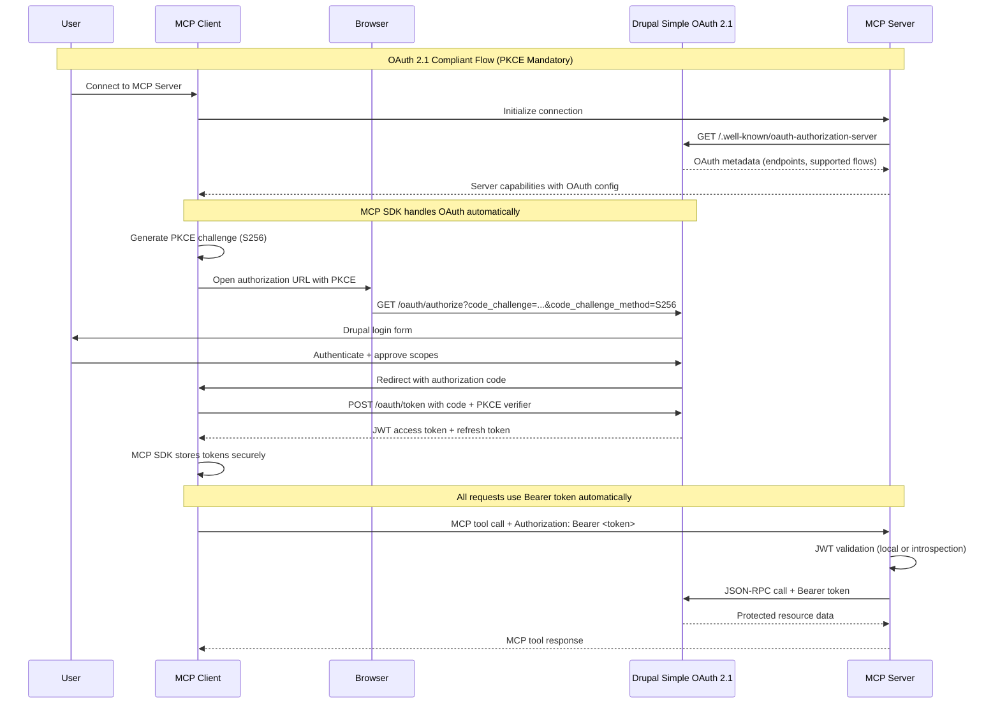
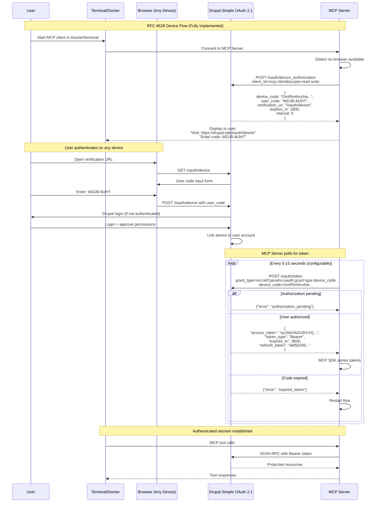
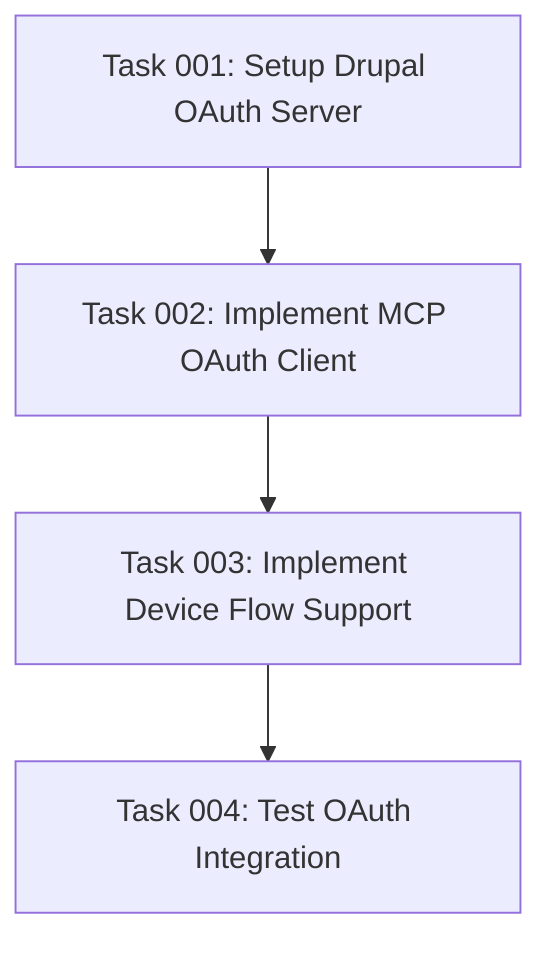

## Executive Summary

This specification defines a **streamlined OAuth 2.1 authentication system** that maximizes reuse of
existing capabilities:

- **Drupal Side**: Simple OAuth 2.1 module provides a **complete, RFC-compliant OAuth server** with
  all 6 RFC implementations ready to use
- **MCP Side**: The `@modelcontextprotocol/sdk` provides **built-in OAuth client capabilities** that
  handle the entire authentication lifecycle
- **Docker/Terminal Support**: Full RFC 8628 Device Authorization Grant is **already implemented**
  in `simple_oauth_device_flow`
- **Zero Custom OAuth Code**: Both Drupal and MCP SDK provide everything needed out-of-the-box

## Overview

Implement OAuth 2.1 compliant authentication using Drupal's Simple OAuth 2.1 module as both
Authorization Server and Resource Server, enabling secure multi-user authentication for the MCP
Server. The implementation leverages the `@modelcontextprotocol/sdk` OAuth capabilities for
streamlined token management while supporting both browser-based flows and headless Docker
environments through RFC 8628 Device Authorization Grant.

## User-Facing Features

- **Multiple OAuth Flows**: Authorization Code with PKCE (browser-based) and Device Authorization
  Grant (headless environments)
- **Zero-Configuration Discovery**: Automatic OAuth endpoint discovery via RFC 8414 metadata
- **Drupal Native Authentication**: Direct authentication against Drupal accounts with role-based
  access control
- **Transparent Token Management**: MCP SDK handles token storage, refresh, and validation
  automatically
- **Docker/Terminal Support**: Full support for authentication in containers without browser access
- **Dynamic Client Registration**: Optional RFC 7591 support for automatic client provisioning

## Functional Capabilities

- **MCP Server** leverages `@modelcontextprotocol/sdk` OAuth utilities for token lifecycle
  management
- **Drupal Simple OAuth 2.1** provides complete OAuth 2.1 authorization server with 6 RFC
  implementations
- **Automatic token refresh** via MCP SDK's built-in refresh token handling
- **Session isolation** per MCP client connection using SDK's session management
- **Bearer token validation** through JWT verification or token introspection
- **Secure token storage** using MCP SDK's encrypted credential management

## Architecture Overview

### Role Definitions

- **Drupal Simple OAuth 2.1**: OAuth 2.1 Authorization Server + Resource Server (RFC compliant)
- **MCP Server**: OAuth client using `@modelcontextprotocol/sdk` authentication capabilities
- **MCP Clients**: End-user applications (Claude Desktop, Cursor, mcp-remote, etc.)

### Supported OAuth Flows

#### 1. Authorization Code Flow with PKCE (RFC 7636)

- **Use Case**: Modern MCP clients with browser support (Claude Desktop, Cursor)
- **Endpoints**: Provided by Simple OAuth 2.1
  - `/oauth/authorize` - Authorization endpoint
  - `/oauth/token` - Token exchange endpoint
- **Security**: Mandatory PKCE with S256 challenge method
- **MCP SDK Integration**: Uses `@modelcontextprotocol/sdk/client/auth` for token management

#### 2. Device Authorization Grant (RFC 8628)

- **Use Case**: Docker containers, terminal applications, CI/CD pipelines
- **Status**: **Fully implemented** in `simple_oauth_device_flow` module
- **Endpoints**:
  - `/oauth/device_authorization` - Device code generation
  - `/oauth/device` - User verification interface
- **Features**:
  - User-friendly verification codes (8 characters, no ambiguous letters)
  - Configurable polling intervals (5-15 seconds)
  - 30-minute code expiration by default

## Technical Stack Requirements

### Drupal OAuth Server Setup

**Installation:**

```bash
# Install Simple OAuth 2.1 ecosystem (includes all 6 RFC implementations)
composer require e0ipso/simple_oauth_21

# Enable required modules for full OAuth 2.1 compliance
drush pm:enable simple_oauth_21 \
  simple_oauth_device_flow \
  simple_oauth_pkce \
  simple_oauth_server_metadata \
  simple_oauth_client_registration \
  simple_oauth_native_apps
```

**Module Capabilities:**

- `simple_oauth_21`: Umbrella module with compliance dashboard and assessment
- `simple_oauth_device_flow`: RFC 8628 Device Authorization Grant (Docker/terminal support)
- `simple_oauth_pkce`: RFC 7636 PKCE enforcement (mandatory for OAuth 2.1)
- `simple_oauth_server_metadata`: RFC 8414 & 9728 discovery endpoints
- `simple_oauth_client_registration`: RFC 7591 dynamic client registration
- `simple_oauth_native_apps`: RFC 8252 enhanced security for native applications

### MCP Server Dependencies

```bash
# MCP SDK with built-in OAuth support
npm install @modelcontextprotocol/sdk

# Minimal additional dependencies (SDK handles most OAuth logic)
npm install zod express

# Token validation (if not using SDK's built-in JWT handling)
npm install jsonwebtoken  # Optional
```

**MCP SDK OAuth Features:**

- Built-in token lifecycle management via `@modelcontextprotocol/sdk/client/auth`
- Automatic token refresh handling
- Secure credential storage with encryption
- Session isolation per client connection
- Streamable HTTP transport with Bearer token support

## Authentication Flows

### Flow 1: OAuth 2.1 Authorization Code Flow with PKCE

**Target Users**: Modern MCP clients (Claude Desktop, Cursor)



**Key HTTP Requests:**

1. **Authorization Request:**

   ```http
   GET /oauth/authorize?response_type=code&client_id=mcp-client&redirect_uri=https://client.example.com/callback&code_challenge=ABC123&code_challenge_method=S256&scope=read:tutorials+write:tutorials&state=xyz HTTP/1.1
   Host: your-drupal-site.com
   ```

2. **Token Exchange:**

   ```http
   POST /oauth/token HTTP/1.1
   Host: your-drupal-site.com
   Content-Type: application/x-www-form-urlencoded

   grant_type=authorization_code&code=abc123&redirect_uri=https://client.example.com/callback&client_id=mcp-client&code_verifier=def456
   ```

3. **Token Response:**
   ```json
   {
     "access_token": "eyJhbGciOiJSUzI1NiIsInR5cCI6IkpXVCJ9...",
     "token_type": "Bearer",
     "expires_in": 3600,
     "refresh_token": "1/jk3/refresh_token_here",
     "scope": "read:tutorials write:tutorials"
   }
   ```

### Flow 2: Device Authorization Grant (RFC 8628)

**Target Users**: Docker containers, terminal applications, headless environments



**Device Flow HTTP Requests:**

1. **Device Authorization Request:**

   ```http
   POST /oauth/device_authorization HTTP/1.1
   Host: your-drupal-site.com
   Content-Type: application/x-www-form-urlencoded

   client_id=mcp-terminal-client&scope=read:tutorials+write:tutorials
   ```

2. **Device Authorization Response:**

   ```json
   {
     "device_code": "4d03f7bc-f7a5-4795-819a-5748c4801d35",
     "user_code": "HJKL-QWER",
     "verification_uri": "https://your-drupal-site.com/oauth/device",
     "verification_uri_complete": "https://your-drupal-site.com/oauth/device?user_code=HJKL-QWER",
     "expires_in": 1800,
     "interval": 5
   }
   ```

3. **Token Polling:**

   ```http
   POST /oauth/token HTTP/1.1
   Host: your-drupal-site.com
   Content-Type: application/x-www-form-urlencoded

   grant_type=urn:ietf:params:oauth:grant-type:device_code&device_code=4d03f7bc-f7a5-4795-819a-5748c4801d35&client_id=mcp-terminal-client
   ```

4. **Polling Responses:**

   ```json
   // Still pending
   {"error": "authorization_pending", "error_description": "User has not authorized yet"}

   // Success
   {"access_token": "...", "token_type": "Bearer", "expires_in": 3600}
   ```

## MCP Server Implementation

### Leveraging MCP SDK OAuth Capabilities

The MCP SDK provides comprehensive OAuth support through `@modelcontextprotocol/sdk/client/auth`,
minimizing custom implementation:

````typescript
import { McpServer } from "@modelcontextprotocol/sdk/server/mcp.js";
import { StreamableHTTPServerTransport } from "@modelcontextprotocol/sdk/server/streamableHttp.js";
import { OAuthClient } from "@modelcontextprotocol/sdk/client/auth.js";
import { z } from "zod";

class DrupalMCPServer {
  private mcpServer: McpServer;
  private oauthClient: OAuthClient;
  private transport: StreamableHTTPServerTransport;

  constructor() {
    this.mcpServer = new McpServer({
      name: "drupal-mcp-server",
      version: "1.0.0"
    });

    this.initializeOAuth();
    this.setupTransport();
    this.registerTools();
  }

  private async initializeOAuth() {
    // Fetch OAuth metadata from Drupal
    const metadata = await this.fetchOAuthMetadata();

    // MCP SDK handles the entire OAuth flow
    this.oauthClient = new OAuthClient({
      clientId: process.env.OAUTH_CLIENT_ID!,
      authorizationEndpoint: metadata.authorization_endpoint,
      tokenEndpoint: metadata.token_endpoint,
      deviceAuthorizationEndpoint: metadata.device_authorization_endpoint,
      scopes: ["read:tutorials", "write:tutorials"],

      // SDK automatically handles:
      // - PKCE generation for authorization code flow
      // - Device flow polling
      // - Token refresh
      // - Secure token storage
    });
  }

  private setupTransport() {
    // StreamableHTTP transport with automatic Bearer token injection
    this.transport = new StreamableHTTPServerTransport({
      sessionIdGenerator: () => crypto.randomUUID(),
      enableDnsRebindingProtection: true,

      // SDK automatically adds Authorization header to all requests
      authProvider: async (sessionId) => {
        const token = await this.oauthClient.getAccessToken(sessionId);
        return token ? `Bearer ${token}` : undefined;
      }
    });
  }

  private async fetchOAuthMetadata() {
    const response = await fetch(
      `${process.env.DRUPAL_URL}/.well-known/oauth-authorization-server`
    );
    return response.json();
  }

  // Device flow helper for terminal environments
  async handleDeviceFlow(sessionId: string) {
    const deviceAuth = await this.oauthClient.startDeviceFlow();

    console.log("╭─────────────────────────────────────╮");
    console.log("│      OAuth Device Authorization     │");
    console.log("├─────────────────────────────────────┤");
    console.log(`│ Visit: ${deviceAuth.verification_uri}     │`);
    console.log(`│ Code:  ${deviceAuth.user_code}            │`);
    console.log("╰─────────────────────────────────────╯");

    // SDK handles polling automatically
    const tokens = await this.oauthClient.pollDeviceAuthorization(
      deviceAuth.device_code,
      deviceAuth.interval
    );

    return tokens;
  }
}

## Drupal OAuth Client Configuration

### Creating OAuth Clients for MCP

1. **Navigate to Consumers**: `/admin/config/services/consumer`
2. **Create New Consumer** with these settings:

```yaml
Label: MCP Server Client
Client ID: mcp-server-client  # Auto-generated if blank
Secret: [Auto-generated - save securely]
Grant Types:
  - authorization_code  # For browser-based flows
  - refresh_token       # For token refresh
  - urn:ietf:params:oauth:grant-type:device_code  # For Docker/terminal
Scopes:
  - read:tutorials
  - write:tutorials
  - profile
Redirect URIs:
  - http://localhost:3000/callback  # Development
  - https://mcp-server.example.com/callback  # Production
PKCE: Required (S256 only)
````

### Device Flow Configuration

Configure at `/admin/config/people/simple_oauth/oauth-21/device-flow`:

```yaml
Device Code Lifetime: 1800 # 30 minutes
Polling Interval: 5 # Start at 5 seconds
User Code Length: 8 # Human-friendly length
User Code Charset: BCDFGHJKLMNPQRSTVWXZ # No ambiguous characters
Verification URI: /oauth/device
Enable Statistics: true # For monitoring usage
```

### OAuth 2.1 Compliance Dashboard

Monitor compliance at `/admin/config/people/simple_oauth/oauth-21`:

- **Overall Status**: Shows OAuth 2.1 compliance level
- **Critical Issues**: Lists any blocking security issues
- **Recommendations**: Provides configuration improvements
- **RFC Implementation**: Shows status of all 6 RFC modules

## Security Considerations

### OAuth 2.1 Security Features (Enforced by Simple OAuth 2.1)

#### Token Security

- **PKCE Mandatory**: S256 challenge method required for all authorization code flows
- **JWT Tokens**: RSA-signed JWTs with configurable lifetimes
- **Token Rotation**: Automatic refresh token rotation support
- **Scope Enforcement**: Fine-grained permission control via Drupal roles

#### Device Flow Security

- **User Code Design**: 8-character codes excluding ambiguous characters (O, 0, I, 1)
- **Device Code Entropy**: Cryptographically secure 128-bit device codes
- **Rate Limiting**: Built-in protection against polling abuse
- **Automatic Cleanup**: Expired codes removed automatically via cron

#### MCP Implementation Security

- **Token Storage**: MCP SDK handles encrypted credential storage
- **Session Isolation**: Each MCP client connection has isolated token storage
- **HTTPS Enforcement**: Required for production deployments
- **CORS Protection**: StreamableHTTP transport includes DNS rebinding protection

## Environment Configuration

### MCP Server Environment Variables

```bash
# Drupal OAuth Server Configuration
DRUPAL_URL=https://your-drupal-site.com
OAUTH_CLIENT_ID=mcp-server-client
OAUTH_CLIENT_SECRET=<from Drupal consumer configuration>

# MCP Server Settings
MCP_SERVER_PORT=3000
MCP_SERVER_HOST=0.0.0.0  # For Docker deployments
NODE_ENV=production

# Optional: Advanced Configuration
OAUTH_TOKEN_CACHE_TTL=300  # Cache tokens for 5 minutes
OAUTH_DISCOVERY_CACHE_TTL=3600  # Cache metadata for 1 hour
OAUTH_DEVICE_FLOW_ENABLED=true  # Enable device flow support
```

### Drupal Configuration

```bash
# Enable OAuth modules via Drush
drush pm:enable simple_oauth_21 \
  simple_oauth_device_flow \
  simple_oauth_pkce \
  simple_oauth_server_metadata \
  simple_oauth_client_registration

# Configure OAuth settings
drush config:set simple_oauth.settings token_expire 3600
drush config:set simple_oauth.settings refresh_token_expire 2592000
drush config:set simple_oauth_pkce.settings enforcement_level mandatory
drush config:set simple_oauth_device_flow.settings device_code_lifetime 1800
```

## Success Criteria

- ✅ **Authorization Code Flow**: Browser-based MCP clients authenticate with PKCE
- ✅ **Device Flow**: Docker/terminal clients authenticate via device codes
- ✅ **Automatic Discovery**: MCP Server auto-configures via RFC 8414 metadata
- ✅ **Token Management**: MCP SDK handles refresh, storage, and validation
- ✅ **Multi-Session Support**: Concurrent users with isolated token storage
- ✅ **OAuth 2.1 Compliance**: Full compliance via Simple OAuth 2.1 dashboard

## Implementation Roadmap

### Phase 1: Core Setup ✅ (Ready to Use)

- [x] Install Simple OAuth 2.1 ecosystem (`composer require e0ipso/simple_oauth_21`)
- [x] Enable all RFC implementation modules
- [x] Configure OAuth 2.1 compliance settings
- [x] Create OAuth clients in Drupal
- [x] Test discovery endpoints

### Phase 2: MCP Integration (Current Phase)

- [ ] Implement MCP Server with SDK OAuth support
- [ ] Configure automatic OAuth discovery
- [ ] Implement device flow detection for Docker
- [ ] Add token caching and refresh logic
- [ ] Create authentication status tools

### Phase 3: Production Deployment

- [ ] Configure HTTPS certificates
- [ ] Set up monitoring and logging
- [ ] Implement rate limiting
- [ ] Create Docker deployment configuration
- [ ] Document client configuration steps

## Quick Start Guide

### 1. Drupal Setup (5 minutes)

```bash
# Install Simple OAuth 2.1
composer require e0ipso/simple_oauth_21

# Enable all modules
drush pm:enable simple_oauth_21 simple_oauth_device_flow \
  simple_oauth_pkce simple_oauth_server_metadata

# Clear cache
drush cr
```

### 2. Create OAuth Client

1. Visit `/admin/config/services/consumer`
2. Add Consumer with device_code and authorization_code grants
3. Save client ID and secret

### 3. MCP Server Implementation

```typescript
// Minimal implementation using MCP SDK
import { McpServer } from '@modelcontextprotocol/sdk/server/mcp.js';
import { OAuthClient } from '@modelcontextprotocol/sdk/client/auth.js';

const server = new McpServer({
  name: 'drupal-mcp',
  version: '1.0.0',
});

// SDK handles everything: PKCE, device flow, tokens
const oauth = new OAuthClient({
  clientId: process.env.OAUTH_CLIENT_ID,
  discoveryUrl: `${process.env.DRUPAL_URL}/.well-known/oauth-authorization-server`,
});

// That's it! The SDK manages the entire OAuth lifecycle
```

## Relevant Resources

### Simple OAuth 2.1 Documentation

- **[Module Repository](https://packagist.org/packages/e0ipso/simple_oauth_21)**: Complete OAuth 2.1
  ecosystem
- **[API Documentation](/API.md)**: Comprehensive endpoint reference
- **[Device Flow Guide](/modules/simple_oauth_device_flow/README.md)**: Docker/terminal
  authentication

### RFC Implementations in Simple OAuth 2.1

| RFC                                                       | Module                           | Purpose              |
| --------------------------------------------------------- | -------------------------------- | -------------------- |
| [RFC 7636](https://datatracker.ietf.org/doc/html/rfc7636) | simple_oauth_pkce                | PKCE (mandatory)     |
| [RFC 8628](https://datatracker.ietf.org/doc/html/rfc8628) | simple_oauth_device_flow         | Device authorization |
| [RFC 8414](https://datatracker.ietf.org/doc/html/rfc8414) | simple_oauth_server_metadata     | Auto-discovery       |
| [RFC 7591](https://datatracker.ietf.org/doc/html/rfc7591) | simple_oauth_client_registration | Dynamic registration |
| [RFC 8252](https://datatracker.ietf.org/doc/html/rfc8252) | simple_oauth_native_apps         | Native app security  |

### MCP SDK Resources

- **[@modelcontextprotocol/sdk](https://www.npmjs.com/package/@modelcontextprotocol/sdk)**: Official
  MCP SDK
- **[OAuth Support](https://modelcontextprotocol.io/docs/authentication)**: Built-in OAuth utilities
- **[Transport Documentation](https://modelcontextprotocol.io/docs/concepts/transports)**:
  StreamableHTTP setup

## Task Dependencies



## Execution Blueprint

**Validation Gates:**

- Reference: `/config/hooks/POST_PHASE.md`

### Phase 1: OAuth Server Foundation

**Parallel Tasks:**

- Task 001: Setup Drupal OAuth Server and Client Configuration

### Phase 2: MCP Client Integration

**Parallel Tasks:**

- Task 002: Implement MCP Server with OAuth Client Integration (depends on: 001)

### Phase 3: Device Flow Implementation

**Parallel Tasks:**

- Task 003: Implement Device Authorization Grant Flow Support (depends on: 002)

### Phase 4: Integration Validation

**Parallel Tasks:**

- Task 004: Test OAuth Integration and Validate Authentication Flows (depends on: 003)

### Post-phase Actions

Complete OAuth 2.1 compliance verification and production deployment preparation.

### Execution Summary

- Total Phases: 4
- Total Tasks: 4
- Maximum Parallelism: 1 task (linear execution required)
- Critical Path Length: 4 phases
- Estimated Duration: Each phase builds upon previous OAuth infrastructure
