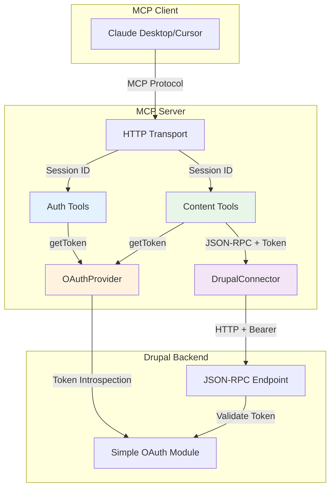
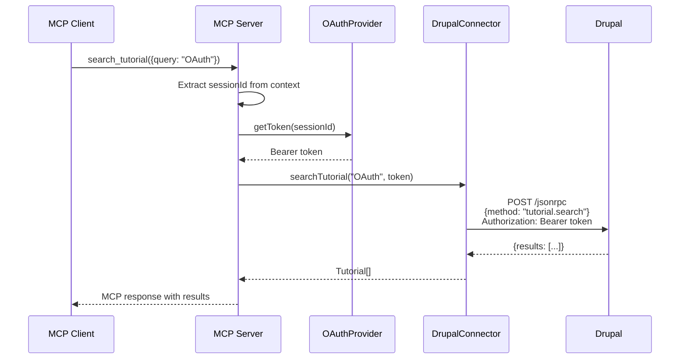
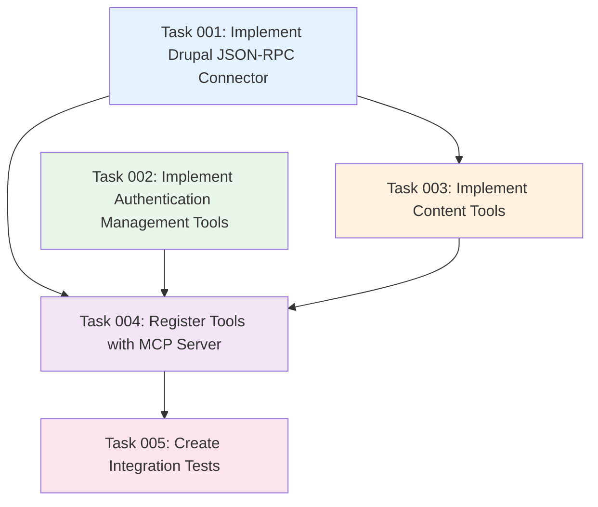

# Plan: Drupal Content Integration via JSON-RPC

## Original Work Order

> inspect @.ai/task-manager/docs/specs/03--drupal-integration.md and crate a plan. Add context from
> @.ai/task-manager/docs/aspirations.md but only for the tasks in
> @.ai/task-manager/docs/specs/03--drupal-integration.md . Make sure the plan only includes what is
> pertinent for this MCP server, no Drupal development (that is handled elsewhere). Ask
> clarification questions if something is not clear.

## Plan Clarifications

| Question                          | Answer                                      | Impact                                             |
| --------------------------------- | ------------------------------------------- | -------------------------------------------------- |
| JSON-RPC Library                  | Add `json-rpc-2.0` as dependency            | Standard library for Drupal JSON-RPC communication |
| Authentication tools              | Implement login, logout, status tools       | Extend OAuth implementation with user-facing tools |
| AI-Enhanced Search (MCP Sampling) | Defer to future enhancement                 | Keep plan focused on core content retrieval        |
| Content Types                     | Start with tutorials only                   | Simplify initial implementation, expand later      |
| Pagination                        | Drupal handles limits server-side           | No client-side pagination logic needed             |
| Error Handling                    | Use MCP error codes or descriptive messages | Standard MCP protocol error handling               |
| Token Management                  | Session-based (Option A)                    | Reuse existing OAuth session infrastructure        |
| Testing                           | Mock Drupal responses, minimal unit tests   | Focus on integration test coverage                 |

## Executive Summary

This plan implements **JSON-RPC integration** between the MCP Server and Drupal backend, enabling
MCP clients to search and retrieve tutorial content through authenticated API calls. The
implementation builds upon the OAuth 2.1 authentication system from Plan 02, using session-based
token management to secure all Drupal communications.

The solution provides **five MCP tools**: three authentication tools (`auth_login`, `auth_logout`,
`auth_status`) and two content tools (`search_tutorial`, `get_tutorial`). All tools leverage the
existing OAuth provider for token management and use the `json-rpc-2.0` library for standardized
Drupal API communication.

This implementation focuses on **tutorial content only** as the initial scope, with a design that
allows future expansion to support documentation topics, courses, videos, and guides. AI-enhanced
search capabilities (MCP Sampling) are intentionally deferred to a future enhancement (Plan 04) to
maintain focus on core functionality.

## Context

### Current State

The MCP Server currently has:

- ✅ **OAuth 2.1 Authentication** (Plan 02): Complete RFC-compliant device flow and token management
- ✅ **Session Management**: `OAuthProvider` with session-based token storage
- ✅ **HTTP Transport**: StreamableHTTP server with Bearer token support
- ❌ **No Drupal Integration**: No tools for accessing Drupal content
- ❌ **No JSON-RPC Client**: No mechanism for making JSON-RPC calls

**Key Infrastructure from Plan 02:**

- `src/oauth/provider.ts` - OAuth token management with `getToken(sessionId)` method
- `src/oauth/config.ts` - OAuth metadata discovery and configuration
- `src/server-http.ts` - HTTP MCP server with session handling

### Target State

After completion, the MCP Server will provide:

- ✅ **JSON-RPC Client**: Configured Drupal connector using `json-rpc-2.0` library
- ✅ **Authentication Tools**: User-facing tools to manage OAuth sessions
- ✅ **Content Search**: `search_tutorial` tool with keyword queries and filtering
- ✅ **Content Retrieval**: `get_tutorial` tool for fetching specific tutorials by ID
- ✅ **Session-Based Security**: All Drupal requests authenticated via OAuth Bearer tokens
- ✅ **Error Handling**: MCP-compliant error responses for auth failures and missing content

### Background

The Drupal backend exposes content through JSON-RPC endpoints at `/jsonrpc`, protected by OAuth 2.1
authentication (Simple OAuth module). The MCP Server acts as an OAuth client and resource consumer,
translating MCP tool calls into authenticated JSON-RPC requests.

**Drupal JSON-RPC Methods (Assumed):**

- `tutorial.search` - Search tutorials with query parameters
- `tutorial.get` - Retrieve tutorial by ID

**Architecture Pattern:**

```
MCP Client → MCP Server Tool → Session Token Lookup → JSON-RPC Call → Drupal Backend
```

## Technical Implementation Approach

### Component 1: JSON-RPC Drupal Connector

**Objective**: Create a reusable Drupal API client that handles JSON-RPC communication with OAuth
authentication.

**Implementation Details:**

Create `src/drupal/connector.ts` that:

- Uses `json-rpc-2.0` library's `JSONRPCClient` for standards-compliant communication
- Accepts OAuth token as parameter for each request
- Constructs authenticated fetch requests with Bearer tokens
- Handles JSON-RPC errors and maps them to MCP error codes
- Provides type-safe method wrappers for `tutorial.search` and `tutorial.get`

**Key Design Decisions:**

- **Stateless Client**: No internal token storage; tokens passed as parameters
- **Error Mapping**: JSON-RPC errors (401, 403, 404) mapped to `McpError` types
- **Base URL Configuration**: Drupal URL from `process.env.DRUPAL_BASE_URL`
- **Type Safety**: Use Zod schemas to validate Drupal API responses

**Example Structure:**

```typescript
class DrupalConnector {
  private client: JSONRPCClient;

  constructor(baseUrl: string) {
    this.client = new JSONRPCClient(request => this.makeAuthenticatedRequest(request, token));
  }

  async searchTutorial(query: string, token: string): Promise<Tutorial[]>;
  async getTutorial(id: string, token: string): Promise<Tutorial>;
}
```

### Component 2: Authentication Management Tools

**Objective**: Provide user-facing MCP tools to manage OAuth authentication sessions.

**Implementation Details:**

Create three tools in `src/tools/auth/`:

1. **`auth_login`** (`login.ts`):
   - Triggers device flow authentication via `OAuthProvider`
   - Displays verification URL and user code to MCP client
   - Polls for token and stores in session
   - Returns success message with session information

2. **`auth_logout`** (`logout.ts`):
   - Accepts session ID from context
   - Revokes tokens with Drupal (if introspection endpoint available)
   - Clears session from `OAuthProvider` storage
   - Returns confirmation message

3. **`auth_status`** (`status.ts`):
   - Checks if session has valid token
   - Returns authentication state (authenticated/unauthenticated)
   - Includes token expiration time and scopes

**Integration Pattern:**

- All tools access `OAuthProvider` singleton instance
- Session ID obtained from MCP request context
- Tools return structured JSON responses with status and messages

### Component 3: Content Search Tool

**Objective**: Enable MCP clients to search Drupal tutorials using keyword queries.

**Implementation Details:**

Create `src/tools/content/search.ts` implementing `search_tutorial` tool:

**Input Schema:**

```typescript
{
  query: z.string().describe("Search keywords"),
  limit: z.number().optional().default(10).describe("Maximum results (Drupal enforces server-side limits)"),
  contentType: z.literal("tutorial").optional().describe("Content type filter")
}
```

**Process Flow:**

1. Extract session ID from MCP context
2. Retrieve OAuth token from `OAuthProvider.getToken(sessionId)`
3. Validate token exists (throw auth error if missing)
4. Call `DrupalConnector.searchTutorial(query, token)`
5. Format results as MCP tool response with structured JSON

**Error Handling:**

- `401 Unauthorized` → `McpError(ErrorCode.Unauthorized, "Authentication required")`
- `403 Forbidden` → `McpError(ErrorCode.Forbidden, "Insufficient permissions")`
- Network errors → `McpError(ErrorCode.InternalError, "Drupal communication failed")`

**Response Format:**

```json
{
  "results": [
    {
      "id": "123",
      "title": "Introduction to MCP",
      "summary": "Learn the basics...",
      "url": "https://drupal.site/tutorial/123"
    }
  ],
  "total": 1,
  "limit": 10
}
```

### Component 4: Content Retrieval Tool

**Objective**: Retrieve full tutorial content by ID for detailed viewing.

**Implementation Details:**

Create `src/tools/content/get.ts` implementing `get_tutorial` tool:

**Input Schema:**

```typescript
{
  id: z.string().describe('Tutorial ID');
}
```

**Process Flow:**

1. Extract session ID and retrieve OAuth token (same as search tool)
2. Call `DrupalConnector.getTutorial(id, token)`
3. Return full tutorial data including body content, metadata, and attachments

**Error Handling:**

- `404 Not Found` → `McpError(ErrorCode.InvalidRequest, "Tutorial not found: {id}")`
- Missing token → `McpError(ErrorCode.Unauthorized, "Authentication required")`
- Invalid ID format → `McpError(ErrorCode.InvalidParams, "Invalid tutorial ID")`

**Response Format:**

```json
{
  "id": "123",
  "title": "Introduction to MCP",
  "body": "<full HTML content>",
  "author": "Jane Doe",
  "created": "2025-01-15T10:30:00Z",
  "updated": "2025-01-20T14:45:00Z",
  "tags": ["mcp", "tutorial", "beginner"],
  "difficulty": "beginner"
}
```

### Component 5: Tool Registration and Server Integration

**Objective**: Register all five tools with the MCP server and ensure session context propagation.

**Implementation Details:**

Update `src/server-http.ts` to:

- Import and register all five tools (auth_login, auth_logout, auth_status, search_tutorial,
  get_tutorial)
- Ensure `OAuthProvider` instance is shared across all tool handlers
- Pass session ID from HTTP request context to tool handlers
- Add middleware to extract session information from MCP protocol headers

**Tool Handler Pattern:**

```typescript
server.setRequestHandler(CallToolRequestSchema, async (request, extra) => {
  const sessionId = extra.sessionId; // From MCP transport
  const toolName = request.params.name;

  switch (toolName) {
    case 'auth_login':
      return authLoginHandler(request.params.arguments, { sessionId });
    case 'search_tutorial':
      return searchTutorialHandler(request.params.arguments, { sessionId });
    // ... other tools
  }
});
```

## Risk Considerations and Mitigation Strategies

### Technical Risks

- **Drupal JSON-RPC Schema Mismatch**: Assumed JSON-RPC method names (`tutorial.search`,
  `tutorial.get`) may differ from actual Drupal implementation
  - **Mitigation**: Create configurable method name mapping in environment variables; document
    expected Drupal endpoints

- **Token Expiration During Long Searches**: OAuth tokens may expire mid-request for slow Drupal
  queries
  - **Mitigation**: Implement token refresh in `OAuthProvider` before making Drupal calls; add retry
    logic with fresh token

- **Session ID Propagation**: MCP SDK may not provide session ID in expected format or location
  - **Mitigation**: Add fallback session detection using HTTP headers; document session requirements
    clearly

### Implementation Risks

- **Incomplete OAuth Integration**: Plan 02's OAuth implementation may not expose required
  `getToken(sessionId)` method
  - **Mitigation**: Review and extend `OAuthProvider` interface during implementation; add tests to
    verify session-based token retrieval

- **Error Code Mapping Complexity**: JSON-RPC errors don't directly map to MCP error codes
  - **Mitigation**: Create error translation layer with comprehensive mapping table; default to
    `InternalError` for unmapped cases

- **Mock Testing Limitations**: Mocked Drupal responses may not reflect real API behavior
  - **Mitigation**: Create detailed mock fixtures based on actual Drupal JSON-RPC module
    documentation; plan integration testing phase with live Drupal instance

### Integration Risks

- **Drupal Module Availability**: Drupal backend may not have JSON-RPC module configured or tutorial
  endpoints enabled
  - **Mitigation**: Document required Drupal modules and configuration in README; provide setup
    verification script

- **CORS and Network Issues**: HTTP requests to Drupal may fail due to CORS policies or network
  restrictions
  - **Mitigation**: Configure CORS headers in Drupal; add connection health check tool; document
    network requirements

## Success Criteria

### Primary Success Criteria

1. **Authentication Tools Functional**: `auth_login`, `auth_logout`, and `auth_status` successfully
   manage OAuth sessions
2. **Search Tool Operational**: `search_tutorial` returns relevant results for keyword queries using
   authenticated Drupal API calls
3. **Retrieval Tool Working**: `get_tutorial` fetches complete tutorial content by ID with proper
   authentication
4. **Session-Based Security**: All Drupal requests include valid OAuth Bearer tokens retrieved from
   session storage
5. **Error Handling Complete**: MCP-compliant errors returned for authentication failures, missing
   content, and API errors

### Quality Assurance Metrics

1. **Type Safety**: Zero TypeScript compilation errors; all Drupal responses validated with Zod
   schemas
2. **Test Coverage**: Integration tests for all five tools with mocked Drupal responses;
   authentication flow tests
3. **MCP Inspector Compatibility**: All tools visible and testable in MCP Inspector with proper
   schemas
4. **Error Documentation**: All error codes documented with examples and user-facing messages
5. **Build Success**: `npm run build` and `npm run type-check` pass without warnings

## Resource Requirements

### Development Skills

- **TypeScript Proficiency**: Strong typing for MCP SDK integration and JSON-RPC client
- **OAuth 2.1 Knowledge**: Understanding of Bearer tokens and session-based authentication
- **JSON-RPC Protocol**: Familiarity with JSON-RPC 2.0 specification and error handling
- **MCP SDK Expertise**: Knowledge of MCP tool registration, error handling, and transport layer

### Technical Infrastructure

- **Dependencies**:
  - `json-rpc-2.0` - JSON-RPC client library
  - `zod` - Schema validation (already installed)
  - `@modelcontextprotocol/sdk` - MCP server SDK (already installed)

- **Development Environment**:
  - Node.js 20+
  - TypeScript 5.x
  - Jest for testing (already configured)

- **External Services**:
  - Drupal instance with Simple OAuth module configured
  - JSON-RPC module enabled with tutorial endpoints
  - OAuth client credentials for MCP server

### Testing Resources

- **Mock Data**: Create realistic tutorial JSON fixtures for testing
- **OAuth Test Tokens**: Generate test tokens for authentication flow validation
- **MCP Inspector**: Use for manual tool testing and schema validation

## Integration Strategy

### Integration with Existing OAuth System (Plan 02)

The implementation **reuses** the following from Plan 02:

- `OAuthProvider` class for token management
- Session-based storage for OAuth tokens
- Device flow authentication UI and polling logic
- HTTP server transport with session ID propagation

**New Integration Points:**

- Export `getToken(sessionId): Promise<string | null>` method from `OAuthProvider`
- Ensure session IDs from HTTP transport are consistent across requests
- Add token validation check before making Drupal requests

### Drupal Backend Requirements

The MCP Server expects the following Drupal configuration:

- **Simple OAuth Module**: Version 6.x with OAuth 2.1 support
- **JSON-RPC Module**: Installed and configured with tutorial endpoints
- **OAuth Client**: Registered with appropriate scopes (`tutorial_read`, `tutorial_search`)
- **CORS Configuration**: Allow requests from MCP server domain

**Required Drupal Endpoints:**

```
POST /jsonrpc
  - Method: tutorial.search
    - Params: { query: string, limit: number }
    - Returns: { results: Tutorial[], total: number }

  - Method: tutorial.get
    - Params: { id: string }
    - Returns: Tutorial object
```

### MCP Client Compatibility

All tools are compatible with:

- **Claude Desktop**: Full support for stdio and HTTP transports
- **MCP Inspector**: Schema validation and manual testing
- **Cursor**: Via HTTP transport
- **mcp-remote**: Bridge for stdio-only clients

## Implementation Order

The implementation follows a **bottom-up approach**, building foundational components before
user-facing tools:

1. **JSON-RPC Foundation**: Implement `DrupalConnector` with authentication support (Component 1)
2. **Authentication Tools**: Create auth management tools to enable session establishment
   (Component 2)
3. **Content Tools**: Implement search and retrieval tools using established sessions (Components 3
   & 4)
4. **Server Integration**: Register all tools and wire up session propagation (Component 5)
5. **Testing & Validation**: Create integration tests and validate with MCP Inspector

**Rationale**: Authentication must work before content tools can be tested. JSON-RPC client must
exist before any tools can communicate with Drupal.

## Notes

### Deferred Features (Plan 04: AI Agent Integration)

The following capabilities are intentionally **not included** in this plan:

- **MCP Sampling**: AI-enhanced query analysis for intelligent search
- **Query Optimization**: Using AI to understand user intent and improve search parameters
- **Multi-Content Types**: Support for documentation, courses, videos, and guides
- **Advanced Pagination**: Cursor-based pagination or infinite scroll support

These features will be addressed in **Plan 04** once the core content integration is stable and
tested.

### Environment Variables

```bash
# Drupal Backend Configuration
DRUPAL_BASE_URL=https://drupal-contrib.ddev.site
DRUPAL_JSONRPC_ENDPOINT=/jsonrpc  # Optional, defaults to /jsonrpc

# OAuth Configuration (from Plan 02)
OAUTH_CLIENT_ID=dme_mcp_client
OAUTH_CLIENT_SECRET=acYMKxSJWVPY
OAUTH_SCOPES="tutorial_read tutorial_search user_read"

# MCP Server Configuration (from Plan 02)
MCP_SERVER_PORT=3000
NODE_ENV=development
```

### Dependency Installation

```bash
npm install json-rpc-2.0
```

### Architecture Diagram



### Tool Call Flow Example



## Task Dependencies



## Execution Blueprint

**Validation Gates:**

- Reference: `.ai/task-manager/config/hooks/POST_PHASE.md`

### Phase 1: Foundation Layer

**Parallel Tasks:**

- Task 001: Implement Drupal JSON-RPC Connector
- Task 002: Implement Authentication Management Tools

### Phase 2: Content Integration

**Parallel Tasks:**

- Task 003: Implement Content Tools (depends on: 001)

### Phase 3: Server Integration

**Parallel Tasks:**

- Task 004: Register Tools with MCP Server (depends on: 001, 002, 003)

### Phase 4: Validation

**Parallel Tasks:**

- Task 005: Create Integration Tests (depends on: 004)

### Post-phase Actions

After completing all phases:

- Run full test suite: `npm test`
- Verify all tools in MCP Inspector: `npm run inspect`
- Test with live Drupal instance (optional)
- Update environment configuration documentation

### Execution Summary

- Total Phases: 4
- Total Tasks: 5
- Maximum Parallelism: 2 tasks (Phase 1)
- Critical Path Length: 4 phases
- Estimated Duration: Foundation → Content → Integration → Testing
