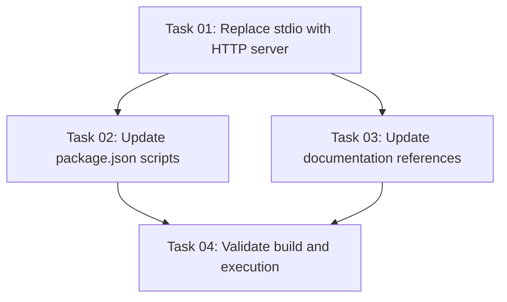

# Plan: Consolidate to HTTP Server as Default Entry Point

## Original Work Order

> I do not need the stdio variant of the server. I do not want it. Remove it and make the http
> server the default index.ts so it gets run when a user uses npx.

## Executive Summary

This plan consolidates the MCP server to a single HTTP-based implementation by removing the stdio
variant and making the HTTP server the default entry point. The current codebase maintains two
separate server implementations: a basic stdio-based server in `src/index.ts` and a full-featured
HTTP server with OAuth in `src/server-http.ts`. This creates unnecessary complexity and maintenance
burden.

The consolidation will streamline the codebase by replacing the stdio implementation with the HTTP
server as the primary entry point. This approach provides better functionality (OAuth support, HTTP
transport, device flow) while simplifying the project structure. Users executing the package via npx
will automatically launch the HTTP server instead of the stdio variant.

Key benefits include reduced code complexity, single implementation to maintain, and the HTTP
server's superior feature set becoming the default user experience.

## Context

### Current State

The project currently maintains two separate MCP server implementations:

1. **Stdio Server** (`src/index.ts`):
   - Basic MCP server using StdioServerTransport
   - Minimal functionality (health_check tool only)
   - 163 lines of code
   - Referenced in package.json bin configuration
   - No OAuth or authentication capabilities

2. **HTTP Server** (`src/server-http.ts`):
   - Full-featured MCP server using StreamableHTTPServerTransport
   - OAuth 2.1 authentication support
   - Device authorization grant flow
   - Multiple tools (health_check, auth_status, device_flow_test)
   - Express-based HTTP server with CORS support
   - 588 lines of code with comprehensive functionality

The package.json configuration points the bin entry to `dist/index.js` (stdio variant), making it
the default when users run npx. The HTTP variant is accessed via separate scripts (`start:http`,
`dev:http`). This dual-server approach creates:

- Maintenance overhead for two separate implementations
- Confusion about which server to use
- Underutilization of the HTTP server's superior capabilities

### Target State

After implementation, the project will have:

1. **Single HTTP Server Implementation**:
   - `src/index.ts` will contain the HTTP server code (current server-http.ts content)
   - Stdio server code completely removed
   - HTTP server becomes the default when running npx

2. **Updated Package Configuration**:
   - package.json bin still points to `dist/index.js` (now HTTP server)
   - Scripts simplified (no separate :http variants)
   - Clear single entry point for all users

3. **Cleaner Codebase**:
   - ~425 fewer lines of redundant code removed
   - Single server implementation to maintain
   - No confusion about which server variant to use

### Background

The stdio variant was likely created as an initial simple implementation before the HTTP server was
fully developed. The HTTP server now provides comprehensive functionality including OAuth
authentication, device flow, and HTTP transport - making it superior for production use. The stdio
variant has become obsolete and maintaining both variants adds unnecessary complexity without
providing value.

## Technical Implementation Approach

The implementation follows a straightforward file replacement and configuration update strategy,
ensuring minimal disruption while achieving the consolidation goal.

### Remove Stdio Server Implementation

**Objective**: Eliminate the stdio server code and clear the way for HTTP server to become the
default

The stdio server file (`src/index.ts`) will be deleted entirely. This removes:

- The `DrupalMCPServer` class with stdio transport
- StdioServerTransport configuration
- Basic tool handlers
- All stdio-specific initialization logic

This deletion is safe because the HTTP server provides all the same capabilities (and more). No code
from the stdio variant needs to be preserved as the HTTP implementation is more comprehensive.

### Replace with HTTP Server as Default

**Objective**: Make the HTTP server the primary and only server implementation

The HTTP server code from `src/server-http.ts` will be moved to `src/index.ts`:

1. Copy all content from `src/server-http.ts` to `src/index.ts`
2. Preserve the shebang (`#!/usr/bin/env node`) at the top for CLI execution
3. Ensure all imports, class definitions, and exports remain intact
4. Keep the module execution check (`if (import.meta.url === \`file://\${process.argv[1]}\``)

After the move, `src/server-http.ts` will be deleted as it's no longer needed. This consolidation
ensures:

- The bin entry in package.json (`dist/index.js`) now points to the HTTP server
- Users running npx automatically get the HTTP server
- All OAuth, device flow, and HTTP transport capabilities are available by default

### Update Package Scripts

**Objective**: Simplify npm scripts to reflect single server implementation

Package.json scripts will be streamlined:

- Remove redundant `:http` variants (`dev:http`, `start:http`)
- Update base scripts to use `index.ts`:
  - `dev`: `tsx --env-file=.env src/index.ts`
  - `start`: `node --env-file=.env dist/index.js`
- Keep build, type-check, and test scripts unchanged

This simplification removes confusion and makes it clear there's only one way to run the server.

### Update Documentation References

**Objective**: Ensure all documentation reflects the new single-server architecture

Search and update any documentation that references:

- The stdio variant or `server-http.ts`
- Instructions for running the HTTP server variant
- Architecture diagrams or descriptions mentioning dual servers

Common locations to check:

- README files (if any)
- OAuth documentation in `src/oauth/README.md`
- Plan documents in `.ai/task-manager/`
- Code comments referencing server variants

Update these to reflect that the HTTP server is now the only implementation and is accessible via
standard npm scripts.

## Risk Considerations and Mitigation Strategies

### Technical Risks

- **Breaking Changes for Existing Users**: Users who expect stdio transport may experience breakage
  - **Mitigation**: This is a major version change scenario. Given the package version (2.0.0) and
    proprietary license, this is acceptable as the HTTP server provides superior functionality.
    Document the change clearly in release notes.

- **Lost Functionality**: Stdio might have use cases in specific environments
  - **Mitigation**: HTTP server is actually more capable. In environments where HTTP isn't suitable,
    users can pin to the previous version. The HTTP server includes all stdio capabilities plus
    authentication, making it strictly superior.

### Implementation Risks

- **Incomplete File Updates**: Missing references to server-http.ts could cause import errors
  - **Mitigation**: Perform comprehensive search for all references to `server-http` in the
    codebase. Run type-check and build after changes to catch any broken imports immediately.

- **Script Configuration Errors**: Incorrect package.json script updates could break development
  workflow
  - **Mitigation**: Test all npm scripts after updates (dev, build, start, type-check). Verify that
    npx execution works correctly with the new configuration.

## Success Criteria

### Primary Success Criteria

1. Stdio server file (`src/index.ts` original content) is completely removed from the codebase
2. HTTP server code is the new `src/index.ts` and compiles successfully to `dist/index.js`
3. Running `npx @e0ipso/drupal-bridge-mcp` launches the HTTP server with OAuth capabilities
4. No references to `server-http.ts` remain in the codebase (except historical documentation like
   plan archives)

### Quality Assurance Metrics

1. TypeScript compilation completes without errors (`npm run type-check` passes)
2. Build process succeeds and produces `dist/index.js` from HTTP server code (`npm run build`
   passes)
3. All npm scripts execute correctly (dev, start, build, type-check)
4. Existing tests continue to pass (`npm test` passes)

## Resource Requirements

### Development Skills

- TypeScript and Node.js expertise
- Understanding of MCP server architecture
- Familiarity with npm package configuration
- Knowledge of Express.js and HTTP server patterns

### Technical Infrastructure

- Development environment with Node.js ≥20.0.0
- Access to package.json and source files
- Ability to run npm scripts and TypeScript compilation
- Version control system (git) for tracking changes

## Implementation Order

1. **Verify Current State**: Run all tests and type-check to ensure starting from clean state
2. **File Replacement**: Replace `src/index.ts` with `src/server-http.ts` content
3. **Cleanup**: Delete `src/server-http.ts`
4. **Update Scripts**: Modify package.json scripts
5. **Validation**: Run type-check, build, and test to verify
6. **Documentation Updates**: Update any references in documentation
7. **Final Verification**: Test npx execution and all npm scripts

## Notes

- The HTTP server's environment variable configuration (AUTH_ENABLED, HTTP_PORT, HTTP_HOST) will
  become the primary configuration interface
- Existing OAuth configuration and device flow functionality remains unchanged
- The package remains focused on HTTP transport, which is more suitable for the Drupal integration
  use case
- This change aligns with the package description: "Minimal Drupal MCP Server" - having one server
  is more minimal than two

## Task Dependencies

## Execution Blueprint

**Validation Gates:**

- Reference: `.ai/task-manager/config/hooks/POST_PHASE.md`

### ✅ Phase 1: Server Consolidation

**Parallel Tasks:**

- ✔️ Task 01: Replace stdio with HTTP server as default entry point

### Phase 2: Configuration Updates

**Parallel Tasks:**

- Task 02: Update package.json scripts to remove HTTP variants (depends on: 01)
- Task 03: Update documentation to reflect single HTTP server architecture (depends on: 01)

### Phase 3: Validation

**Parallel Tasks:**

- Task 04: Validate build process and server execution (depends on: 02, 03)

### Post-phase Actions

After each phase completes:

1. Verify all tasks in the phase are marked as "completed"
2. Run validation gates defined in POST_PHASE.md
3. Proceed to next phase only if all gates pass

### Execution Summary

- Total Phases: 3
- Total Tasks: 4
- Maximum Parallelism: 2 tasks (in Phase 2)
- Critical Path Length: 3 phases
