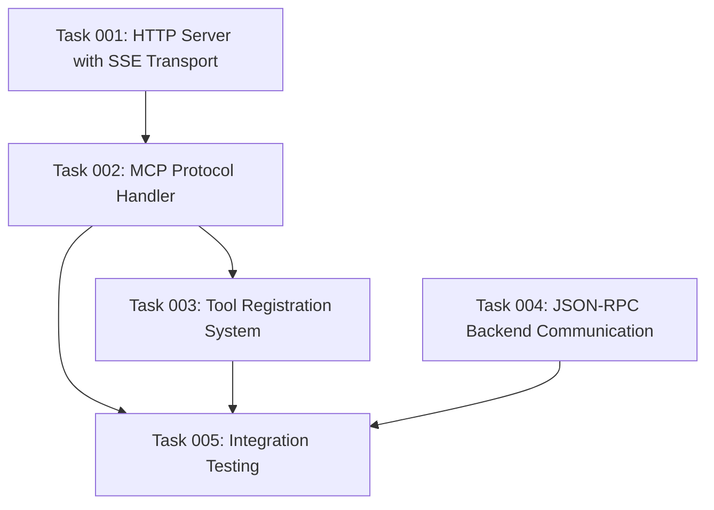

# MCP Protocol Implementation Plan

## Executive Summary

This plan implements the foundational MCP (Model Context Protocol) server components that will serve as the communication layer between Claude Code/LLM clients and the Drupalize.me Drupal backend. The implementation focuses on creating a robust, standards-compliant MCP server with Server-Sent Events (SSE) transport that can handle dynamic tool registration and JSON-RPC communication with comprehensive error handling.

## Project Context

This implementation serves as Phase 1 (Foundation) of the broader MCP server architecture project that connects to Drupalize.me's Drupal installation for RAG system enhancement. The server will leverage a simplified MVP architecture with direct API integration to establish baseline performance and validate core integration patterns.

## Detailed Implementation Requirements

### 1. MCP Server Core with SSE Transport

**Objective**: Establish the foundational MCP server infrastructure using Server-Sent Events as the primary transport mechanism.

**Technical Requirements**:
- Standards-compliant MCP protocol implementation
- SSE HTTP connection management
- Connection lifecycle handling (connect, maintain, disconnect)
- Per-connection state management
- Client message routing and response handling
- Connection pooling and resource cleanup

**Key Components**:
- HTTP server with SSE endpoint configuration
- Connection multiplexing for multiple simultaneous clients
- Heartbeat and keepalive mechanisms
- Graceful connection termination handling
- Transport-agnostic protocol layer for future transport support

### 2. Protocol Handler Implementation

**Objective**: Implement the core MCP protocol message handling, request/response patterns, and protocol state management.

**Technical Requirements**:
- MCP protocol version negotiation and compatibility handling
- Message parsing, validation, and serialization
- Protocol state machine implementation
- Request/response correlation and timeout handling
- Protocol-level error detection and recovery
- Support for both synchronous and asynchronous message patterns

**Key Components**:
- Protocol message parser and validator
- Protocol state management system
- Request routing and dispatch mechanism
- Response correlation and delivery system
- Protocol version management and negotiation

### 3. Tool Registration System

**Objective**: Create a dynamic tool registration and discovery system that allows tools to be registered, updated, and removed at runtime.

**Technical Requirements**:
- Dynamic tool registration and deregistration
- Tool schema validation and management
- Tool capability advertisement to clients
- Tool versioning and compatibility management
- Runtime tool availability checking
- Tool metadata and documentation management

**Key Components**:
- Tool registry with in-memory storage
- Tool schema validation engine
- Tool capability discovery and advertisement
- Tool lifecycle management (register/update/remove)
- Tool invocation routing and parameter validation

### 4. JSON-RPC Request/Response Handling

**Objective**: Implement robust JSON-RPC communication layer for backend API integration with comprehensive error handling and response processing.

**Technical Requirements**:
- JSON-RPC 2.0 specification compliance
- Request ID correlation and tracking
- Batch request processing support
- Error response handling and translation
- Connection pooling and reuse for backend calls
- Request/response logging and monitoring

**Key Components**:
- JSON-RPC client implementation with connection management
- Request/response correlation tracking system
- Error translation and standardization layer
- Connection pool management for backend APIs
- Request retry and timeout handling mechanisms

### 5. Error Handling Framework

**Objective**: Establish comprehensive error handling patterns that provide meaningful feedback while maintaining system stability and security.

**Technical Requirements**:
- Hierarchical error classification and handling
- Error recovery and retry mechanisms
- Error logging and monitoring integration
- Client-safe error message transformation
- System stability preservation during error conditions
- Error context preservation and propagation

**Key Components**:
- Error classification and hierarchy system
- Error recovery and retry logic
- Error logging and monitoring infrastructure
- Client error response standardization
- Error context tracking and propagation
- System health monitoring and alerting

## Implementation Architecture

### Core System Flow
```
Client (Claude Code) 
    ↓ (SSE HTTP)
MCP Protocol Handler 
    ↓ (Tool Invocation)
Tool Registration System 
    ↓ (Backend API Call)
JSON-RPC Request Handler 
    ↓ (HTTP/JSON-RPC 2.0)
Drupal Backend (content.search)
    ↓ (Response Processing)
Error Handling Framework
    ↓ (Response Delivery)
MCP Protocol Handler 
    ↓ (SSE Response)
Client (Claude Code)
```

### Technology Stack
- **Runtime**: Node.js with TypeScript
- **Transport**: HTTP with Server-Sent Events (SSE)
- **Protocol**: MCP specification compliance
- **API Communication**: JSON-RPC 2.0
- **Error Handling**: Structured error types with recovery mechanisms
- **Validation**: JSON Schema validation for all message types

## Success Criteria

### Functional Requirements
- MCP server successfully accepts and maintains SSE connections from Claude Code clients
- Protocol handler correctly processes all standard MCP message types
- Tool registration system allows dynamic registration and discovery of available tools
- JSON-RPC handler successfully communicates with Drupal backend APIs
- Error handling framework gracefully manages all error scenarios without system crashes

### Performance Requirements
- SSE connection establishment: < 100ms
- Protocol message processing: < 10ms per message
- Tool registration operations: < 50ms
- JSON-RPC request/response cycle: < 200ms (excluding backend processing)
- Error handling overhead: < 5ms per request

### Quality Requirements
- 100% MCP protocol specification compliance
- Zero memory leaks in connection handling
- Graceful degradation under error conditions
- Comprehensive error logging without sensitive data exposure
- Clean separation of concerns between all major components

## Risk Assessment and Mitigation

### High-Priority Risks
1. **MCP Protocol Compliance**: Risk of non-standard implementations causing client compatibility issues
   - *Mitigation*: Strict adherence to MCP specification with comprehensive testing
   
2. **SSE Connection Stability**: Risk of connection drops causing system instability
   - *Mitigation*: Robust connection lifecycle management with automatic recovery

3. **Tool Registration Race Conditions**: Risk of tool state corruption during concurrent operations
   - *Mitigation*: Proper synchronization mechanisms and atomic operations

### Medium-Priority Risks
1. **JSON-RPC Backend Integration**: Risk of protocol mismatches with Drupal backend
   - *Mitigation*: Thorough API contract validation and error handling
   
2. **Error Handling Complexity**: Risk of error handling logic becoming overly complex
   - *Mitigation*: Simple, hierarchical error classification with clear recovery patterns

## Dependencies and Constraints

### External Dependencies
- MCP protocol specification (latest stable version)
- Drupal JSON-RPC 2.x module availability
- Simple OAuth 5.x module for authentication (future integration)

### Technical Constraints
- Must maintain stateless operation where possible for scalability
- Error messages must not expose sensitive system information
- Protocol implementation must support future caching layer integration
- All components must be testable in isolation

### Integration Points
- Authentication system (OAuth flow) - planned for immediate follow-up
- Drupal backend APIs - must establish reliable communication patterns
- Client applications - must maintain MCP protocol compatibility

## Implementation Approach

This implementation follows the **Minimal Viable Integration** approach from the project's simplified MVP architecture:

1. **Direct Integration First**: Establish working end-to-end communication before adding complexity
2. **Standards Compliance**: Strict adherence to MCP protocol specifications
3. **Error-First Design**: Comprehensive error handling built into every component
4. **Testability**: Each component designed for isolated testing and validation
5. **Future-Ready**: Architecture supports planned caching and authentication enhancements

The implementation will create a solid foundation that validates core integration patterns and establishes baseline performance metrics for the broader system architecture.

## Architecture Decision Records (ADRs)

During implementation of this plan, create ADRs to document critical MCP protocol decisions:

- **ADR-013**: MCP Transport Layer Selection (SSE vs WebSocket)
- **ADR-014**: Tool Registration and Discovery Strategy
- **ADR-015**: Error Handling and Recovery Patterns for MCP Communication
- **ADR-016**: JSON-RPC Client Integration Architecture

These ADRs should be created in the `@architecture/adr/` directory following the established format and numbering sequence.

## Next Steps

Following completion of this MCP Protocol Implementation, the immediate next phase will be:
- OAuth Authentication Integration (Authorization Code Grant flow)
- Drupal JSON-RPC Method Development (`content.search`)
- End-to-end Integration Testing
- Performance Baseline Establishment

This foundational implementation enables all subsequent phases of the MCP server architecture project.

## Task Dependency Visualization



## Execution Blueprint

**Validation Gates:**
- Reference: `@.ai/task-manager/VALIDATION_GATES.md`

### Phase 1: Foundation Setup
**Parallel Tasks:**
- Task 001: HTTP Server with SSE Transport
- Task 004: JSON-RPC Backend Communication

### Phase 2: Protocol Implementation
**Parallel Tasks:**
- Task 002: MCP Protocol Handler (depends on: 001)

### Phase 3: Tool Management
**Parallel Tasks:**
- Task 003: Tool Registration System (depends on: 002)

### Phase 4: Integration Validation
**Parallel Tasks:**
- Task 005: Integration Testing (depends on: 002, 003, 004)

### Execution Summary
- Total Phases: 4
- Total Tasks: 5
- Maximum Parallelism: 2 tasks (in Phase 1)
- Critical Path Length: 4 phases