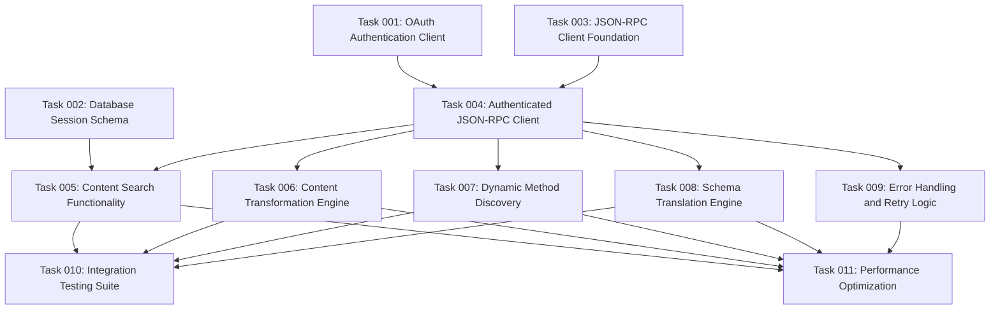

# Drupal Integration Layer Implementation Plan

## Executive Summary

This plan outlines the development of a comprehensive Drupal Integration Layer that serves as the primary interface between the MCP server and Drupalize.me's Drupal installation. The layer will provide seamless JSON-RPC communication, intelligent content discovery and transformation, and dynamic API adaptation capabilities to support the RAG (Retrieval Augmented Generation) system.

## Project Context

The Drupal Integration Layer is a critical component of the MCP (Model Context Protocol) server architecture designed to enhance LLM interactions with Drupalize.me content. This layer abstracts the complexity of Drupal's JSON-RPC API and provides optimized content for RAG consumption.

### Key Architecture Principles
- **LLM-Free Design**: Leverages the connected LLM via MCP protocol rather than separate API connections
- **Direct Content Transformation**: Drupal converts content to RAG-optimized Markdown before transmission
- **OAuth Authentication**: Individual Authorization Code Grant flow for subscription-level content access
- **Dynamic API Discovery**: Automatically adapts to available Drupal JSON-RPC methods

## Requirements Analysis

### Functional Requirements

#### JSON-RPC Client Implementation
- **Purpose**: Establish reliable, authenticated communication with Drupal's JSON-RPC endpoints
- **Authentication**: OAuth 2.0 integration with Simple OAuth module
- **Transport**: HTTP/HTTPS with proper error handling and retries
- **Session Management**: Handle token refresh and user session persistence
- **Connection Pooling**: Optimize performance for concurrent requests

#### Content Search Functionality
- **Multi-Modal Search**: Support text, taxonomy, and metadata-based queries
- **Subscription Awareness**: Respect user subscription levels for content access
- **Performance Optimization**: Implement efficient search algorithms and result caching
- **Result Filtering**: Apply content type, publication status, and access permission filters
- **Pagination Support**: Handle large result sets with proper pagination

#### Content Transformation to RAG Markdown
- **Structured Processing**: Convert Drupal's structured content to RAG-optimized Markdown
- **Metadata Preservation**: Maintain essential content metadata for context
- **Link Resolution**: Transform internal Drupal links to accessible formats
- **Media Handling**: Process images, videos, and other media attachments
- **Content Enrichment**: Add contextual information for improved RAG performance

#### Dynamic Method Discovery
- **API Introspection**: Automatically discover available JSON-RPC methods
- **Schema Caching**: Cache method signatures and documentation
- **Version Adaptation**: Handle API version changes gracefully
- **Method Validation**: Verify method availability before invocation
- **Documentation Integration**: Extract and utilize method documentation

#### Schema Translation Engine
- **Drupal to MCP Mapping**: Translate Drupal content schemas to MCP tool schemas
- **Type System Integration**: Handle TypeScript/JSON Schema conversions
- **Validation Framework**: Implement comprehensive input/output validation
- **Schema Evolution**: Support schema changes without breaking compatibility
- **Documentation Generation**: Auto-generate tool documentation from Drupal schemas

### Non-Functional Requirements

#### Performance
- **Response Time**: < 500ms for typical content queries
- **Throughput**: Support 100+ concurrent requests
- **Memory Efficiency**: Optimized memory usage for large content processing
- **Caching Strategy**: Implement multi-level caching for improved performance

#### Reliability
- **Error Handling**: Comprehensive error handling with graceful degradation
- **Retry Logic**: Exponential backoff for failed requests
- **Circuit Breaker**: Protect against cascading failures
- **Monitoring**: Detailed logging and metrics collection

#### Security
- **Authentication**: Secure OAuth 2.0 implementation
- **Authorization**: Enforce Drupal's permission system
- **Data Protection**: Secure handling of user credentials and content
- **Input Validation**: Prevent injection attacks and data corruption

#### Maintainability
- **Clean Architecture**: Clear separation of concerns and responsibilities
- **TypeScript**: Full type safety throughout the implementation
- **Testing**: Comprehensive unit, integration, and end-to-end tests
- **Documentation**: Detailed code documentation and API references

## Technical Specifications

### Technology Stack
- **Runtime**: Node.js with TypeScript
- **HTTP Client**: Axios or similar with advanced features
- **Authentication**: OAuth 2.0 client library
- **Data Storage**: PostgreSQL for session and cache management
- **Testing**: Jest for unit/integration testing
- **Validation**: Zod or similar schema validation library

### Integration Points
- **Drupal JSON-RPC API**: Primary data source and API interface
- **MCP Protocol**: Tool registration and communication
- **PostgreSQL Database**: User sessions and caching storage
- **OAuth Provider**: Drupal's Simple OAuth module

### Data Flow Architecture
1. **Authentication Flow**: OAuth 2.0 Authorization Code Grant
2. **Method Discovery**: JSON-RPC introspection and schema caching
3. **Content Query**: Search request processing and result filtering
4. **Content Transformation**: Drupal content to RAG Markdown conversion
5. **Schema Translation**: Drupal schemas to MCP tool definitions
6. **Response Delivery**: Optimized content delivery to requesting LLM

## Risk Analysis and Mitigation

### Technical Risks
- **API Changes**: Drupal JSON-RPC API modifications
  - *Mitigation*: Dynamic discovery and graceful degradation
- **Performance Bottlenecks**: Large content processing delays
  - *Mitigation*: Streaming processing and efficient caching
- **Authentication Issues**: OAuth token management complexity
  - *Mitigation*: Robust token refresh and error handling

### Business Risks
- **Content Access**: Subscription-based content restrictions
  - *Mitigation*: Proper permission checking and user communication
- **Data Quality**: Inconsistent content structures
  - *Mitigation*: Flexible transformation engine with fallback handling

## Success Criteria

### Primary Success Metrics
1. **Functional Completeness**: All five core components fully implemented and tested
2. **Performance Targets**: Meet specified response time and throughput requirements
3. **Integration Success**: Seamless operation within the MCP server architecture
4. **Content Quality**: High-quality RAG Markdown generation from Drupal content

### Secondary Success Metrics
1. **Developer Experience**: Clear APIs and comprehensive documentation
2. **Operational Reliability**: Stable operation under production loads
3. **Extensibility**: Easy addition of new Drupal content types and methods
4. **Monitoring Coverage**: Complete observability of system performance

## Dependencies and Prerequisites

### External Dependencies
- **Drupal Installation**: Drupalize.me with JSON-RPC and Simple OAuth modules
- **Database Access**: PostgreSQL instance for session and cache storage
- **Network Connectivity**: Reliable connection to Drupal endpoints

### Internal Dependencies
- **MCP Server Framework**: Core MCP protocol implementation
- **Authentication System**: OAuth 2.0 client infrastructure
- **Database Schema**: User session and cache table structures

## Implementation Approach

### Development Methodology
- **Incremental Development**: Build components iteratively with continuous integration
- **Test-Driven Development**: Write tests before implementation for critical components
- **Code Review Process**: Peer review for all code changes
- **Documentation-First**: Document APIs and architecture before implementation

### Quality Assurance
- **Automated Testing**: Comprehensive test suite with CI/CD integration
- **Performance Testing**: Load testing to validate performance requirements
- **Security Auditing**: Regular security reviews and vulnerability assessments
- **Code Quality**: Static analysis and code quality metrics

## Timeline Considerations

This plan provides the foundation for detailed task breakdown and scheduling. The implementation will be organized into logical phases focusing on:

1. **Foundation Phase**: Basic JSON-RPC client and authentication
2. **Core Functionality**: Content search and transformation capabilities
3. **Advanced Features**: Dynamic discovery and schema translation
4. **Integration Phase**: MCP server integration and optimization
5. **Quality Assurance**: Testing, documentation, and deployment preparation

## Architecture Decision Records (ADRs)

During implementation of this plan, create ADRs to document critical Drupal integration decisions:

- **ADR-017**: JSON-RPC Client Implementation Strategy and Error Handling
- **ADR-018**: Content Transformation Approach (Server-side vs Client-side)
- **ADR-019**: Dynamic Tool Discovery and Schema Translation Patterns
- **ADR-020**: Drupal API Integration and Rate Limiting Strategy

These ADRs should be created in the `@architecture/adr/` directory following the established format and numbering sequence.

## Task Dependency Visualization

## Execution Blueprint

**Validation Gates:**
- Reference: `@.ai/task-manager/VALIDATION_GATES.md`

### Phase 1: Foundation Setup
**Parallel Tasks:**
- Task 001: OAuth Authentication Client (OAuth 2.0 client implementation)
- Task 002: Database Session Schema (PostgreSQL schema design)  
- Task 003: JSON-RPC Client Foundation (Basic JSON-RPC transport)

### Phase 2: Core Integration
**Parallel Tasks:**
- Task 004: Authenticated JSON-RPC Client (depends on: 001, 003)

### Phase 3: Feature Implementation  
**Parallel Tasks:**
- Task 005: Content Search Functionality (depends on: 004)
- Task 006: Content Transformation Engine (depends on: 004)
- Task 007: Dynamic Method Discovery (depends on: 004) 
- Task 008: Schema Translation Engine (depends on: 004)
- Task 009: Error Handling and Retry Logic (depends on: 004)

### Phase 4: Quality Assurance and Optimization
**Parallel Tasks:**
- Task 010: Integration Testing Suite (depends on: 005, 006, 007, 008)
- Task 011: Performance Optimization (depends on: 005, 006, 007, 008, 009)

### Post-phase Actions
- Conduct comprehensive system testing with real Drupal API
- Performance benchmarking against specified targets (<500ms, 100+ concurrent)
- Security audit of OAuth implementation and data handling
- Documentation review and API reference generation

### Execution Summary
- Total Phases: 4
- Total Tasks: 11
- Maximum Parallelism: 5 tasks (in Phase 3)
- Critical Path Length: 4 phases
- Foundation components enable parallel development in later phases