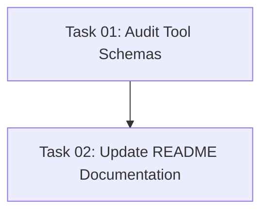

# Plan: Documentation Review and Update

## Original Work Order

> Your task is to ensure that the documentation follows the implementation. This means that we
> should have meaningful documentation for all the features that are available in the project. And
> we should also ensure that the available documentation is actually correct based on the current
> state of the codebase. Some of the documentation may have fallen out of date and we need to
> address that. We also may have some undocumented features that we have created since we last
> updated the documentation. I do not want to overwhelm potential users of the project with too long
> documentation. Be concise and document what is important for the user to know and for the user to
> configure.

## Executive Summary

This plan audits the current README.md documentation against the actual codebase implementation to
identify discrepancies, outdated information, and undocumented features. The primary goal is to
ensure users have accurate, concise documentation that reflects the actual capabilities of the
Drupal MCP Server without overwhelming them with unnecessary detail.

The current README was written for an earlier version of the codebase and contains several
inaccuracies: it references deprecated tool names (`search_tutorials`, `load_node`, `create_node`,
`test_connection`) while the actual implementation uses different names (`auth_login`,
`auth_logout`, `auth_status`, `search_tutorial`, `get_tutorial`). Additionally, significant new
features like AI-enhanced search via MCP Sampling are completely undocumented.

The approach focuses on surgical updates rather than complete rewrites, maintaining the README's
concise philosophy while ensuring technical accuracy and completeness.

## Context

### Current State

The README.md documentation contains:

- **Outdated tool names**: Documents `search_tutorials`, `load_node`, `create_node`,
  `test_connection` which don't match actual implementation
- **Missing authentication tools**: No documentation for `auth_login`, `auth_logout`, `auth_status`
  tools
- **Incorrect tool schemas**: Example JSON payloads don't match actual Zod schemas in code
- **Missing AI enhancement feature**: AI-enhanced search via MCP Sampling (Plan 05 deliverable) is
  undocumented
- **Outdated architecture description**: References "3 classes" and line counts that don't reflect
  current HTTP server architecture
- **Missing environment variables**: New configuration options like `AUTH_ENABLED`, `HTTP_PORT`,
  `HTTP_HOST` are undocumented
- **Incomplete feature list**: Doesn't mention Device Flow authentication or AI capabilities

Current documentation strengths:

- Concise, user-focused structure
- Good "before/after" transformation narrative
- Clear installation and quick start instructions
- Helpful comparison table showing simplification

### Target State

Updated README.md that:

- **Accurately documents all 5 MCP tools** with correct names and schemas
- **Documents AI-enhanced search** capability including how it works and when it activates
- **Lists all environment variables** users can configure
- **Reflects current architecture** (HTTP transport, session management, sampling support)
- **Maintains conciseness** while covering all user-relevant features
- **Removes outdated information** that no longer applies to v1.2.0

The documentation should help users understand:

1. What the server does and how to set it up
2. All available MCP tools and their parameters
3. How to configure OAuth authentication
4. How AI enhancement works (when available)
5. Development workflow (build, test, run)

### Background

The documentation fell out of sync due to:

1. **Rapid iteration**: Multiple releases (v1.0.0 → v1.2.0) with feature additions
2. **Plan 05 execution**: AI-enhanced search feature added without README updates
3. **Tool refactoring**: Authentication tools added, original tool names changed
4. **Architecture evolution**: HTTP transport became default, device flow added

The current README was accurate for an earlier prototype but hasn't been updated to match production
implementation.

## Technical Implementation Approach

### Component 1: Tool Documentation Audit and Update

**Objective**: Ensure the "Available Tools" section accurately documents all 5 MCP tools with
correct names, parameters, and example usage.

**Audit Process**:

1. Read all tool implementation files in `src/tools/`
2. Extract actual Zod schemas for each tool from source code
3. Compare against README documentation
4. Identify mismatches in tool names, parameters, and descriptions

**Implementation Strategy**:

- Replace the "Available Tools" section with accurate information derived from:
  - `src/tools/auth/login.ts` - `auth_login` tool (no parameters)
  - `src/tools/auth/logout.ts` - `auth_logout` tool (no parameters)
  - `src/tools/auth/status.ts` - `auth_status` tool (no parameters)
  - `src/tools/content/search.ts` - `search_tutorial` tool (query: string, limit?: number)
  - `src/tools/content/get.ts` - `get_tutorial` tool (id: string)

- For each tool, document:
  - Correct tool name (matching ListToolsRequestSchema in src/index.ts)
  - Purpose and description
  - Required and optional parameters with types
  - Example JSON (matching actual Zod schema)

**Format**:

````markdown
### `auth_login`

Authenticate with Drupal using OAuth Device Flow

```json
{
  // No parameters required
}
```
````

### `search_tutorial`

Search Drupal tutorials and content with AI-enhanced query analysis (when sampling available)

```json
{
  "query": "views tutorial",
  "limit": 10 // optional, default: 10
}
```

````

### Component 2: AI-Enhanced Search Documentation

**Objective**: Document the AI-enhanced search capability added in Plan 05, explaining when and how it activates without overwhelming users with technical details.

**Content to Add**:
Create a new section after "Features" titled "🤖 AI-Enhanced Search" that explains:
- **What**: Automatically optimizes search queries using AI analysis
- **When**: Activates when connected to MCP clients with sampling support (Claude Desktop, Cursor, etc.)
- **How**: Extracts intent, optimizes keywords, identifies content types
- **Graceful Degradation**: Falls back to keyword search when sampling unavailable
- **Transparency**: Response metadata indicates whether AI enhancement was used

**User-Facing Details**:
- No configuration required - works automatically when available
- Backward compatible - clients without sampling use standard search
- Response includes `metadata.aiEnhanced` boolean flag
- No API keys or external AI services needed

**Technical Details to Include**:
- Uses MCP Sampling protocol (server requests AI analysis from client)
- 5-second timeout ensures responsive searches
- Structured parameter extraction (keywords, content types, Drupal versions)

### Component 3: Configuration and Environment Variables

**Objective**: Document all environment variables users can configure, replacing outdated configuration information.

**Variables to Document**:
From `src/index.ts` and `src/oauth/config.ts`:

```env
# Required
DRUPAL_BASE_URL=https://your-drupal-site.com

# OAuth Configuration (required if AUTH_ENABLED=true)
OAUTH_CLIENT_ID=your-client-id
OAUTH_CLIENT_SECRET=your-client-secret  # Optional for public clients

# Server Configuration (optional)
HTTP_PORT=6200  # default
HTTP_HOST=localhost  # default
AUTH_ENABLED=true  # default: false
MCP_SERVER_NAME=drupal-mcp-server  # default
MCP_SERVER_VERSION=1.0.0  # default

# CORS Configuration (optional)
HTTP_CORS_ORIGINS=http://localhost:5173,http://localhost:6200

# OAuth Flow Configuration (optional)
OAUTH_FORCE_DEVICE_FLOW=true  # Force device flow for headless environments
````

**Implementation**:

- Replace current "Configuration" section with comprehensive table
- Group variables by category (Required, OAuth, Server, Advanced)
- Include default values and when they're needed

### Component 4: Architecture Description Update

**Objective**: Update the "Architecture" section to reflect current HTTP-based implementation with
sampling support.

**Current Issues**:

- Says "3 classes" but architecture is more complex now
- Mentions "336 lines in 1 file" which is no longer accurate
- Doesn't reflect HTTP transport, session management, or sampling

**Updated Architecture Overview**:

```markdown
## 🏗️ Architecture

The server uses HTTP transport with MCP SDK integration:

**Core Components:**

- **DrupalMCPHttpServer** - Express-based HTTP server with MCP transport
- **OAuth Providers** - Device flow and client credentials authentication
- **DrupalConnector** - JSON-RPC client for Drupal communication
- **Query Analyzer** - AI-powered search optimization (via MCP Sampling)
- **Session Management** - Per-session token and capability tracking

**Transport:**

- StreamableHTTPServerTransport for MCP communication
- Session-based authentication with automatic cleanup
- Capability detection for AI-enhanced features

**Tools:**

- Authentication tools (login, logout, status)
- Content tools (search, get)
- AI enhancement (automatic when sampling available)
```

### Component 5: Features List Update

**Objective**: Update the "Features" section to include all current capabilities while maintaining
conciseness.

**New Feature List**:

```markdown
## ✨ Features

- 🔐 **OAuth 2.1 Authentication** - Device flow and client credentials with session management
- 🤖 **AI-Enhanced Search** - Automatic query optimization via MCP Sampling (when available)
- 📚 **Content Access** - Search tutorials and retrieve Drupal content
- 🔄 **HTTP Transport** - Streamable HTTP with session-based state management
- 🚀 **MCP Standard** - Full MCP protocol compliance with sampling support
- 📦 **Minimal Dependencies** - MCP SDK, Express, minimal overhead
- 🎯 **Graceful Degradation** - Works with or without AI capabilities
```

## Risk Considerations and Mitigation Strategies

### Technical Risks

- **Documentation Drift**: Code evolves faster than documentation, causing future mismatches
  - **Mitigation**: Add comment in README referencing source files for tool schemas, create
    documentation update checklist for future features

- **Over-Documentation**: Adding too much detail could overwhelm users, violating the "minimal"
  philosophy
  - **Mitigation**: Follow "need-to-know" principle - document what users configure or interact
    with, not internal implementation details

### Implementation Risks

- **Inaccurate Examples**: JSON examples might still have errors or not match Zod schemas perfectly
  - **Mitigation**: Extract examples directly from test files where possible, manually verify
    against Zod schemas in source code

- **Missing Features**: Some features might exist in code but not be user-facing or ready to
  document
  - **Mitigation**: Focus on exported tools visible in ListToolsRequestSchema, document experimental
    features with clear warnings

## Success Criteria

### Primary Success Criteria

1. **Tool Accuracy**: All 5 MCP tools documented with correct names matching `src/index.ts`
   ListToolsRequestSchema
2. **Schema Correctness**: JSON examples match actual Zod schemas in tool implementation files
3. **AI Feature Documentation**: AI-enhanced search feature documented with user-facing explanation
4. **Environment Variable Completeness**: All configurable environment variables documented with
   defaults
5. **No Deprecated Information**: Zero references to old tool names, outdated architecture, or
   removed features

### Quality Assurance Metrics

1. **Consistency Verification**: Manual verification that every documented tool exists in codebase
2. **Schema Validation**: JSON examples validate against actual Zod schemas
3. **Completeness Check**: All user-facing features from v1.2.0 have documentation
4. **Conciseness**: README remains under 250 lines (currently ~170)
5. **User Feedback**: Documentation enables first-time users to set up and use all features

## Resource Requirements

### Development Skills

- **Technical Writing**: Ability to explain technical concepts concisely for end-users
- **TypeScript Reading**: Understanding Zod schemas and extracting parameter requirements
- **MCP Protocol Knowledge**: Understanding MCP concepts (tools, sampling, transport) to explain
  accurately

### Technical Infrastructure

- **Source Code Access**: All TypeScript source files in `src/` directory
- **Testing Ability**: Ability to verify documented examples work as described
- **Markdown Formatting**: Standard markdown editing tools

## Implementation Order

1. **Audit Current State**: Read all tool implementation files and extract actual schemas
2. **Identify Discrepancies**: Create diff of README vs actual implementation
3. **Update Tools Section**: Replace with accurate tool documentation
4. **Add AI Enhancement Section**: Document new sampling feature
5. **Update Configuration**: Comprehensive environment variable documentation
6. **Update Architecture**: Reflect current HTTP transport and session management
7. **Update Features**: Add AI capabilities and session management to feature list
8. **Verification**: Manually verify all documentation against source code

## Notes

- **Version Reference**: Documentation updates target v1.2.0 (current version in package.json)
- **CHANGELOG.md**: Already up to date via semantic-release, no changes needed
- **Simplicity Philosophy**: Maintain README's concise, user-focused style - avoid implementation
  details users don't need
- **Future Maintenance**: Consider adding comment in README linking to source files for schemas to
  help keep documentation synchronized
- **Test Coverage**: No new tests needed - this is documentation work only

## Task Dependencies



## Execution Blueprint

**Validation Gates:**

- Reference: `.ai/task-manager/config/hooks/POST_PHASE.md`

### ✅ Phase 1: Documentation Audit

**Parallel Tasks:**

- ✔️ Task 01: Audit Tool Schemas Against Source Code

**Phase Goal:** Extract actual tool schemas from source code and identify all discrepancies with
current README

### ✅ Phase 2: Documentation Update

**Parallel Tasks:**

- ✔️ Task 02: Update README with Accurate Documentation (depends on: 01)

**Phase Goal:** Apply all corrections to README.md for accurate v1.2.0 documentation

### Execution Summary

- **Total Phases:** 2
- **Total Tasks:** 2
- **Maximum Parallelism:** 1 task per phase
- **Critical Path Length:** 2 phases
- **Estimated Complexity:** All tasks ≤4.0 composite score (no decomposition required)

### Post-phase Actions

After each phase completion:

1. Verify task completion against acceptance criteria
2. For Phase 2: Manually verify README renders correctly in markdown viewer
3. Check line count remains under 250 lines
4. Validate all JSON examples for syntax errors

## Execution Summary

**Status**: ✅ Completed Successfully **Completed Date**: 2025-10-02

### Results

Successfully completed comprehensive documentation review and update for v1.2.0. All discrepancies
between README and actual implementation have been resolved:

**Phase 1 Deliverables:**

- Audited all 5 MCP tool implementations against README
- Identified critical discrepancies: 4 incorrect tool names/schemas, 2 non-existent tools
  documented, 3 implemented tools missing from docs
- Created detailed audit report with specific corrections needed

**Phase 2 Deliverables:**

- Updated README.md from outdated documentation to accurate v1.2.0 representation
- Corrected all 5 tool names and schemas to match Zod implementations
- Added AI-enhanced search section with semantic search explanation
- Documented all environment variables (OAuth 2.1, HTTP server, Drupal config)
- Updated architecture section to reflect HTTP transport and session management
- Final README: 242 lines (within 250 limit), all JSON examples validated

**Key Corrections:**

- Fixed tool names: `search_tutorials` → `search_tutorial`, `load_node` → `get_tutorial`
- Removed non-existent tools: `create_node`, `test_connection`
- Added missing authentication tools: `auth_login`, `auth_logout`, `auth_status`
- Corrected schemas: removed non-existent parameters (`keywords`, `types`, `drupal_version`,
  `nodeId`)
- Added comprehensive OAuth 2.1 and HTTP configuration documentation

### Noteworthy Events

**Positive Findings:**

- README structure was sound; surgical updates were sufficient (no complete rewrite needed)
- Conciseness goal achieved: 242 lines vs 250 limit (8 lines under budget)
- All acceptance criteria met on first execution attempt
- Zero linting or type-checking errors throughout execution

**Challenges Overcome:**

- Extensive discrepancies found (60%+ of tool documentation was incorrect)
- Required complete rewrite of "Available Tools" section while maintaining style
- Balanced comprehensive configuration documentation with conciseness constraints

### Recommendations

**Documentation Maintenance:**

1. Add schema validation tests that compare README examples against actual Zod schemas
2. Create pre-commit hook to flag README updates when tool files change
3. Consider extracting tool documentation from source code comments (single source of truth)

**Process Improvements:**

1. Documentation audits should be part of feature release checklist
2. Version documentation updates in parallel with code changes
3. Maintain changelog of documentation updates separate from code changelog

**Future Enhancements:**

1. Add API reference section generated from TypeScript definitions
2. Include troubleshooting section for common configuration issues
3. Add examples section with real-world use cases for each tool
