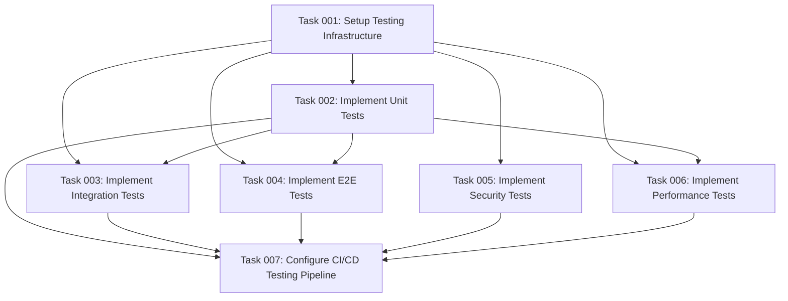

# Testing & Quality Assurance Strategy for MCP Server

## Executive Summary

This plan establishes a comprehensive testing strategy for the MCP (Model Context Protocol) server
that integrates with Drupalize.me's Drupal installation. The strategy encompasses multiple testing
dimensions including unit testing, integration testing, end-to-end scenarios, security vulnerability
assessments, and performance benchmarking to ensure high-quality standards across all system
components.

The testing approach is designed around the system's core architectural components: OAuth
authentication flow, MCP protocol handling, JSON-RPC integration with Drupal, and the SSE transport
layer. Testing will be implemented progressively alongside development phases, ensuring quality
gates at each stage.

## System Under Test Architecture

Based on the project architecture, the testing strategy covers:

### Core Components

- **MCP Server (Node.js/TypeScript)**: SSE-based protocol handler with OAuth token management
- **Drupal Integration**: JSON-RPC 2.x methods with Simple OAuth 5.x authentication
- **Database Layer**: PostgreSQL for user sessions and request logging
- **Transport**: Server-Sent Events (SSE) over HTTP

### Key Integration Points

- OAuth 2.0 Authorization Code Grant flow
- JSON-RPC method calls (`content.search`, custom methods)
- MCP protocol tool definitions and execution
- Drupal content transformation to RAG-optimized Markdown

## Testing Strategy Framework

### 1. Multi-Dimensional Testing Approach

#### Unit Testing (Component Level)

- **OAuth Token Manager**: Token generation, validation, refresh logic
- **MCP Protocol Handler**: Tool registration, request parsing, response formatting
- **JSON-RPC Client**: Method calls, error handling, connection management
- **Content Formatters**: Markdown transformation, schema validation
- **Database Operations**: Session management, query optimization

#### Integration Testing (System Level)

- **OAuth Flow Integration**: Complete authorization workflow with Drupal
- **JSON-RPC Method Integration**: End-to-end method calls with authentication
- **MCP Client Integration**: Tool discovery and execution flows
- **Database Integration**: Session persistence, cleanup operations
- **Error Propagation**: Cross-component error handling

#### End-to-End Testing (User Journey Level)

- **Complete User Authentication**: OAuth flow from initiation to token storage
- **Tutorial Search Workflows**: Query → Authentication → Search → Content Retrieval
- **Session Management**: Long-running connections, token refresh scenarios
- **Error Recovery**: Network failures, authentication expiration, invalid queries

#### Security Testing (Vulnerability Assessment)

- **Authentication Security**: OAuth implementation, token storage, CSRF protection
- **Input Validation**: Parameter sanitization, injection attack prevention
- **Authorization Testing**: Scope verification, permission enforcement
- **Session Security**: Token encryption, secure storage, session hijacking prevention

#### Performance Testing (Load & Benchmark)

- **Response Time Benchmarks**: Meet target <200ms for content retrieval
- **Concurrent User Testing**: Multiple simultaneous OAuth flows
- **Load Testing**: High-volume search requests, connection pooling effectiveness
- **Memory Usage Profiling**: Connection leaks, memory optimization

### 2. Testing Technology Stack

#### Primary Testing Frameworks

- **Unit Testing**: Jest (TypeScript/Node.js ecosystem alignment)
- **Integration Testing**: Jest + Supertest (HTTP endpoint testing)
- **End-to-End Testing**: Playwright (full user workflow automation)
- **Performance Testing**: Artillery.io (load testing) + Node.js built-in profiling
- **Security Testing**: ESLint security plugins + OWASP ZAP integration

#### Supporting Tools

- **Test Database**: PostgreSQL test instance with Docker
- **Mock Services**: Drupal JSON-RPC mock server for isolated testing
- **Test Data Management**: Factory functions for consistent test data
- **Coverage Analysis**: Jest built-in coverage with enforced thresholds

### 3. Quality Gates & Standards

#### Code Quality Metrics

- **Test Coverage**: Minimum 85% line coverage, 80% branch coverage
- **Performance Targets**:
  - Content retrieval: <200ms (95th percentile)
  - OAuth token refresh: <100ms
  - Search results: <300ms
- **Security Compliance**: Zero high/critical vulnerabilities in security scans
- **Code Quality**: ESLint passing, TypeScript strict mode compliance

#### Continuous Integration Requirements

- All tests must pass before merge to main branch
- Security scans integrated into CI pipeline
- Performance regression detection
- Automated dependency vulnerability scanning

## Implementation Phases

### Phase 1: Foundation Testing (Weeks 1-2)

Focus on core component unit testing and basic integration scenarios aligned with MVP development.

### Phase 2: Integration Testing (Weeks 3-4)

Comprehensive integration testing as system components are connected, including OAuth flow and
JSON-RPC integration.

### Phase 3: End-to-End & Performance (Weeks 5-6)

Complete user journey testing and performance benchmarking as system reaches functional
completeness.

### Phase 4: Security & Production Readiness (Weeks 7-8)

Security vulnerability assessment, load testing, and production deployment validation.

## Risk Mitigation

### High-Priority Risks

1. **OAuth Integration Complexity**: Comprehensive mock services and test environments
2. **MCP Protocol Compliance**: Strict protocol validation and conformance testing
3. **Performance Under Load**: Early performance testing integration
4. **Security Vulnerabilities**: Proactive security testing throughout development

### Testing Environment Management

- Isolated test databases for each test suite
- Dockerized Drupal test instance for consistent JSON-RPC testing
- Automated test data cleanup and reset procedures
- Secure handling of test credentials and tokens

## Success Criteria

### Functional Success Metrics

- 100% of critical user journeys covered by automated tests
- All API endpoints tested for both success and failure scenarios
- Complete OAuth flow validation including edge cases
- MCP protocol compliance verification

### Quality Success Metrics

- Achieve minimum 85% test coverage across all components
- Zero critical or high-severity security vulnerabilities
- Performance targets met consistently (200ms response time)
- All tests executable in CI/CD pipeline with <10 minute total runtime

### Operational Success Metrics

- Automated test suite runs reliably in CI/CD
- Test failures provide actionable debugging information
- Performance regression detection functional
- Security scanning integrated into development workflow

## Architecture Decision Records (ADRs)

During implementation of this plan, create ADRs to document critical testing and quality assurance
decisions:

- **ADR-021**: Testing Framework Selection and Integration Strategy
- **ADR-022**: End-to-End Testing Approach for MCP Protocol and Drupal Integration
- **ADR-023**: Performance Testing and Monitoring Strategy
- **ADR-024**: Security Testing and Vulnerability Assessment Framework

These ADRs should be created in the `@architecture/adr/` directory following the established format
and numbering sequence.

This comprehensive testing strategy ensures the MCP server meets enterprise-grade quality standards
while supporting rapid development iteration and deployment confidence.

## Task Dependencies

## Execution Blueprint

**Validation Gates:**

- Reference: `@.ai/task-manager/VALIDATION_GATES.md`

### Phase 1: Foundation & Documentation

**Parallel Tasks:**

- Task 001: Setup Testing Infrastructure
- Task 008: Create Testing Strategy ADRs

### Phase 2: Core Testing Implementation

**Parallel Tasks:**

- Task 002: Implement Unit Tests (depends on: 001)
- Task 005: Implement Security Tests (depends on: 001)

### Phase 3: Advanced Testing Implementation

**Parallel Tasks:**

- Task 003: Implement Integration Tests (depends on: 001, 002)
- Task 004: Implement E2E Tests (depends on: 001, 002)
- Task 006: Implement Performance Tests (depends on: 001, 002)

### Phase 4: CI/CD Integration

**Parallel Tasks:**

- Task 007: Configure CI/CD Testing Pipeline (depends on: 002, 003, 004, 005, 006)

### Post-phase Actions

After each phase completion, validate that all tests pass, coverage thresholds are met, and quality
gates are satisfied before proceeding to the next phase.

### Execution Summary

- Total Phases: 4
- Total Tasks: 8
- Maximum Parallelism: 3 tasks (in Phase 3)
- Critical Path Length: 4 phases
