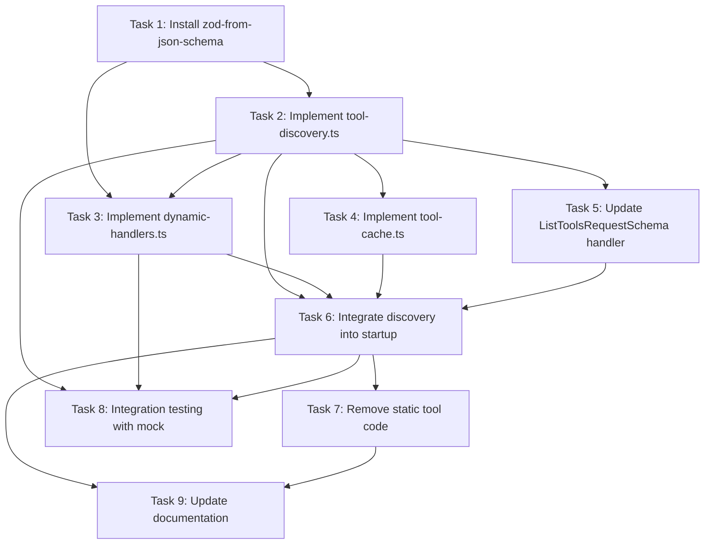

# Plan: MCP Tool Auto-Discovery Implementation

## Original Work Order

> take @.ai/task-manager/docs/specs/04--mcp-tool-auto-discovery.md and use tools to create a plan
> from that and the relevant bits in @.ai/task-manager/docs/aspirations.md

## Executive Summary

This plan implements dynamic tool discovery for the Drupal MCP Server by querying the
`/mcp/tools/list` endpoint at startup and dynamically registering discovered tools using JSON Schema
to Zod conversion. This enables the MCP server to support new Drupal-side tools without code changes
or redeployment, following the emerging community standard for agent-to-agent (A2A) tool
integration.

The implementation transforms the current static tool registration system (5 hardcoded tools) into a
dynamic discovery system capable of supporting 5-100+ tools with zero manual configuration. Tools
are discovered via HTTP request, validated with Zod schemas converted from JSON Schema definitions,
and proxied to Drupal JSON-RPC endpoints with OAuth authentication.

Key technical components include:

- **Discovery Layer**: HTTP client that queries `/mcp/tools/list` at server startup
- **Schema Converter**: `zod-from-json-schema` npm package for runtime validation
- **Dynamic Handler Registration**: `setRequestHandler` integration with MCP SDK for discovered
  tools
- **Authentication Flow**: OAuth Bearer token propagation through discovered tool invocations

The approach completely replaces static tool registration with dynamic discovery. Since this MCP
server has never been deployed to production, there is no backward compatibility requirement and no
need for fallback to static tools.

## Context

### Current State

The MCP server currently uses **static tool registration** in `src/index.ts`:

**Tool Registration Pattern** (lines 228-289):

```typescript
// Static tool imports
import {
  authLogin,
  authLoginSchema,
  authLogout,
  authLogoutSchema,
  authStatus,
  authStatusSchema,
} from './tools/auth/index.js';
import {
  searchTutorial,
  searchTutorialSchema,
  getTutorial,
  getTutorialSchema,
} from './tools/content/index.js';

// Hardcoded ListToolsRequestSchema handler
server.setRequestHandler(ListToolsRequestSchema, async () => ({
  tools: [
    {
      name: 'auth_login',
      description: 'Authenticate with Drupal using OAuth Device Flow',
      inputSchema: zodToJsonSchema(authLoginSchema),
    },
    // ... 4 more tools manually listed
  ],
}));
```

**Limitations**:

- Adding new tools requires code changes and server restart
- Tool definitions duplicated between Drupal backend and MCP server
- No way for Drupal admins to expose new capabilities to AI agents
- Manual schema synchronization between backend and server

**Systems to Preserve**:

- OAuth authentication (Device Flow, Client Credentials)
- Session management (per-user state, token storage)
- MCP Sampling integration (AI-enhanced search)
- HTTP transport with Express

### Target State

**Dynamic Tool Discovery Architecture**:

```typescript
// Startup sequence
async function initializeServer() {
  const discoveredTools = await discoverTools(); // Query /mcp/tools/list
  registerDynamicHandlers(discoveredTools); // Schema conversion happens inside
  // Ready to serve tools - no fallback needed
}
```

**User Experience**:

1. Drupal admin adds new tool via backend configuration
2. MCP server restarts and discovers new tool automatically
3. Tool immediately available to Claude Desktop, Cursor, etc.
4. No MCP server code changes or deployments required

**Implementation Approach**:

- Remove all static tool registration code
- Server startup depends on successful discovery
- Clear error messages if discovery fails (fail fast)
- OAuth and session management continue working unchanged

### Background

**Community Standard Context**: The `/mcp/tools/list` endpoint follows an **emerging community
standard** for agent-to-agent (A2A) framework, not an official MCP specification. This pattern
enables backend systems (Drupal) to advertise capabilities to MCP servers dynamically.

**Three-Step Pattern**:

1. **Discovery**: MCP Server queries `GET /mcp/tools/list` at startup
2. **Description**: Backend responds with JSON tool definitions (name, schema, endpoint, method)
3. **Invocation**: MCP Server registers handlers that proxy calls to backend JSON-RPC endpoints

**Reference Implementations**:

- DevTurtle Blog -
  [Agentic A2A Framework MCP](https://www.devturtleblog.com/agentic-a2a-framework-mcp/)
- Drupal Implementation - [jsonrpc_mcp module](https://github.com/e0ipso/jsonrpc_mcp)

**Why This Matters**:

- **Drupal sites can customize AI capabilities** without touching MCP server code
- **Scales to enterprise use cases** with 100+ specialized tools
- **Reduces deployment friction** for adding new AI-enabled features
- **Enables permission-based tool access** via OAuth user context

## Technical Implementation Approach

### Component 1: Discovery Service

**Objective**: Query Drupal `/mcp/tools/list` endpoint at startup and parse tool definitions.

**Implementation Location**: `src/discovery/tool-discovery.ts` (new file)

**Drupal Backend**: The `/mcp/tools/list` endpoint is implemented by the `jsonrpc_mcp` Drupal
module. See https://github.com/e0ipso/jsonrpc_mcp for backend implementation details.

**Core Function**:

```typescript
interface ToolDefinition {
  name: string;
  description: string;
  inputSchema: JSONSchema;
  endpoint: string;
  method: string;
  requiresAuth: boolean;
}

interface ToolDiscoveryResponse {
  tools: ToolDefinition[];
}

async function discoverTools(
  drupalBaseUrl: string,
  accessToken?: string
): Promise<ToolDefinition[]> {
  const url = `${drupalBaseUrl}/mcp/tools/list`;
  const response = await fetch(url, {
    headers: accessToken ? { Authorization: `Bearer ${accessToken}` } : {},
  });

  if (!response.ok) {
    console.warn(`Tool discovery failed: ${response.statusText}`);
    return [];
  }

  const data: ToolDiscoveryResponse = await response.json();
  return data.tools;
}
```

**Error Handling**:

- HTTP errors throw exception with clear message (fail fast)
- Invalid JSON throws exception with response body details
- Network timeouts (5s) throw exception
- Missing required fields throw exception with validation details
- Server startup fails if discovery fails (no silent fallback)

**Performance Targets**:

- Discovery endpoint response: <500ms
- Total startup overhead: <100ms per tool
- Cache discovery results in memory for session lifetime

### Component 2: JSON Schema to Zod Converter

**Objective**: Convert JSON Schema Draft 2020-12 definitions to Zod schemas for runtime validation
using existing npm package.

**Implementation Location**: Use `zod-from-json-schema` npm package (no custom file needed)

**Recommended Package**: `zod-from-json-schema` v0.5.0

**Why This Package**:

- **Runtime-first**: Designed specifically for runtime conversion (not codegen)
- **JSON Schema Draft 2020-12 support**: Most comprehensive draft support
- **100% test coverage**: Validated against official JSON Schema Test Suite
- **No dependency conflicts**: Works with existing Zod installation from MCP SDK
- **Active maintenance**: Latest release 0.5.0

**Alternative Packages Considered**:

- `json-schema-to-zod` (v2.6.1): Codegen approach, explicitly "not meant for runtime use"
- `@dmitryrechkin/json-schema-to-zod` (v1.0.1): Runtime support but less mature
- `@n8n/json-schema-to-zod` (v1.1.0): Fork of codegen package, unclear runtime guarantees

**Installation**:

```bash
npm install zod-from-json-schema
```

**Usage Example**:

```typescript
import { convertJsonSchemaToZod } from 'zod-from-json-schema';

// Tool definition from /mcp/tools/list
const toolDefinition = {
  name: 'search_content',
  inputSchema: {
    $schema: 'https://json-schema.org/draft/2020-12/schema',
    type: 'object',
    properties: {
      query: { type: 'string', minLength: 1 },
      limit: { type: 'integer', minimum: 1, maximum: 100, default: 10 },
    },
    required: ['query'],
  },
};

// Convert to Zod schema
const zodSchema = convertJsonSchemaToZod(toolDefinition.inputSchema);

// Use for validation
const validatedParams = zodSchema.parse({ query: 'tutorials', limit: 20 });
```

**Advanced Usage - Raw Shape Extraction**:

```typescript
import { jsonSchemaObjectToZodRawShape } from 'zod-from-json-schema';
import { z } from 'zod';

// Extract raw shape for custom refinements
const rawShape = jsonSchemaObjectToZodRawShape(toolDefinition.inputSchema);
const customSchema = z
  .object({
    ...rawShape,
    // Add runtime context fields
    _sessionId: z.string().optional(),
  })
  .refine(data => data.limit <= 50 || hasAdminRole(data._sessionId), {
    message: 'Non-admin users limited to 50 results',
  });
```

**Supported JSON Schema Features**:

- All JSON Schema Draft 2020-12 features
- Object types with properties, additionalProperties
- Required field enforcement
- Default values
- String constraints: minLength, maxLength, pattern
- Number constraints: minimum, maximum, multipleOf
- Array constraints: minItems, maxItems, items, uniqueItems
- Combinators: oneOf, anyOf, allOf
- References: $ref (with proper resolution)

**Error Handling**:

- Invalid schemas return error details via result object
- Conversion errors include JSON pointer to problematic schema location
- Graceful degradation: skip tools with invalid schemas, log warnings
- No startup crashes from malformed JSON Schema

### Component 3: Dynamic Handler Registration

**Objective**: Register MCP tool handlers dynamically for discovered tools using
`setRequestHandler`.

**Implementation Location**: `src/discovery/dynamic-handlers.ts` (new file)

**Core Function**:

```typescript
import { Server } from '@modelcontextprotocol/sdk/server/index.js';
import { CallToolRequestSchema } from '@modelcontextprotocol/sdk/types.js';
import { DrupalConnector } from '../drupal-connector.js';
import { convertJsonSchemaToZod } from 'zod-from-json-schema';
import type { z } from 'zod';

interface DynamicToolContext {
  tool: ToolDefinition;
  schema: z.ZodTypeAny;
  connector: DrupalConnector;
}

function registerDynamicTools(server: Server, tools: ToolDefinition[], connector: DrupalConnector) {
  const toolContexts: Map<string, DynamicToolContext> = new Map();

  // Convert schemas and store tool contexts
  for (const tool of tools) {
    try {
      const zodSchema = convertJsonSchemaToZod(tool.inputSchema);
      toolContexts.set(tool.name, { tool, schema: zodSchema, connector });
    } catch (error) {
      console.warn(`Skipping tool ${tool.name}: schema conversion failed`, error);
      continue;
    }
  }

  // Register CallToolRequest handler with dynamic routing
  server.setRequestHandler(CallToolRequestSchema, async request => {
    const toolName = request.params.name;
    const context = toolContexts.get(toolName);

    if (!context) {
      throw new Error(`Unknown tool: ${toolName}`);
    }

    // Validate parameters with Zod
    const validatedParams = context.schema.parse(request.params.arguments);

    // Proxy to Drupal JSON-RPC
    const result = await context.connector.request(context.tool.method, validatedParams);

    return {
      content: [{ type: 'text', text: JSON.stringify(result, null, 2) }],
    };
  });

  console.log(`Registered ${toolContexts.size} dynamic tools`);
}
```

**Integration with Existing Code**:

- Replaces static `CallToolRequestSchema` handler in `src/index.ts`
- Removes all static tool imports and registration code
- OAuth tokens passed through existing `DrupalConnector` session context
- Session management handles per-user tool access permissions

**Startup Integration**:

```typescript
async function initializeTools(server: Server, connector: DrupalConnector) {
  const discovered = await discoverTools(DRUPAL_BASE_URL);

  if (discovered.length === 0) {
    throw new Error('No tools discovered from /mcp/tools/list - server cannot start');
  }

  registerDynamicTools(server, discovered, connector);
  console.log(`Successfully registered ${discovered.length} dynamic tools`);
}
```

### Component 4: Tool Listing Integration

**Objective**: Update `ListToolsRequestSchema` handler to return discovered tools instead of static
definitions.

**Implementation Location**: `src/index.ts` (modify existing handler)

**Updated Handler**:

```typescript
let discoveredToolDefinitions: ToolDefinition[] = [];

// Store discovered tools during startup
function setDiscoveredTools(tools: ToolDefinition[]) {
  discoveredToolDefinitions = tools;
}

// Handler returns discovered tools only
server.setRequestHandler(ListToolsRequestSchema, async () => {
  return {
    tools: discoveredToolDefinitions.map(tool => ({
      name: tool.name,
      description: tool.description,
      inputSchema: tool.inputSchema, // Already JSON Schema from discovery
    })),
  };
});
```

**Startup Integration**:

```typescript
async function startServer() {
  // ... existing Express/MCP setup

  const tools = await discoverTools(DRUPAL_BASE_URL);

  if (tools.length === 0) {
    throw new Error('Tool discovery returned no tools - cannot start server');
  }

  setDiscoveredTools(tools);
  registerDynamicTools(server, tools, connector);

  console.log(`MCP server ready with ${tools.length} tools`);
  // ... start HTTP server
}
```

### Component 5: OAuth Token Propagation

**Objective**: Ensure discovered tools receive OAuth tokens from session context when
`requiresAuth: true`.

**Implementation Location**: `src/discovery/dynamic-handlers.ts` (enhance handler)

**Enhanced Handler**:

```typescript
server.setRequestHandler(CallToolRequestSchema, async (request, extra) => {
  const toolName = request.params.name;
  const context = toolContexts.get(toolName);

  if (!context) {
    throw new Error(`Unknown tool: ${toolName}`);
  }

  // Check authentication requirement
  if (context.tool.requiresAuth) {
    const sessionId = extra?.meta?.sessionId;
    if (!sessionId) {
      throw new Error(`Tool ${toolName} requires authentication`);
    }

    const session = await getSession(sessionId);
    if (!session?.accessToken) {
      throw new Error('Not authenticated. Use auth_login first.');
    }

    // Pass token to connector
    context.connector.setAccessToken(session.accessToken);
  }

  // Validate and execute
  const validatedParams = context.schema.parse(request.params.arguments);
  const result = await context.connector.request(context.tool.method, validatedParams);

  return {
    content: [{ type: 'text', text: JSON.stringify(result, null, 2) }],
  };
});
```

**Session Integration**:

- Reuses existing `SessionManager` from `src/session-manager.ts`
- No changes to OAuth flows (Device Flow, Client Credentials)
- Session cleanup and token refresh work unchanged

### Component 6: Startup Caching and Performance

**Objective**: Minimize startup latency by caching discovered tools in memory for session lifetime.

**Implementation Location**: `src/discovery/tool-cache.ts` (new file)

**Cache Implementation**:

```typescript
interface ToolCache {
  tools: ToolDefinition[];
  timestamp: number;
  ttl: number; // milliseconds
}

let toolCache: ToolCache | null = null;

async function getDiscoveredTools(
  drupalBaseUrl: string,
  forceFresh = false
): Promise<ToolDefinition[]> {
  const now = Date.now();

  if (!forceFresh && toolCache && now - toolCache.timestamp < toolCache.ttl) {
    console.log('Using cached tool definitions');
    return toolCache.tools;
  }

  const tools = await discoverTools(drupalBaseUrl);
  toolCache = {
    tools,
    timestamp: now,
    ttl: 3600000, // 1 hour
  };

  return tools;
}

function clearToolCache() {
  toolCache = null;
}
```

**Performance Optimizations**:

- Cache valid for 1 hour (configurable via env var)
- Manual cache clear via admin endpoint (future enhancement)
- Parallel discovery + schema conversion during startup
- Lazy loading: discover on first client connection instead of server startup (optional)

## Risk Considerations and Mitigation Strategies

### Technical Risks

**Risk 1: Discovery Endpoint Unavailable**

- **Impact**: MCP server cannot start
- **Probability**: Medium (network issues, Drupal downtime, misconfigured DRUPAL_BASE_URL)
- **Mitigation**: Clear error message with troubleshooting steps, fail fast at startup
- **Detection**: HTTP error, timeout, or empty tool list
- **Recovery**: Fix Drupal endpoint or configuration, restart server

**Risk 2: JSON Schema to Zod Conversion Errors**

- **Impact**: Tool validation fails, causing runtime errors during tool invocation
- **Probability**: Low (using battle-tested `zod-from-json-schema` with 100% test coverage)
- **Mitigation**: Skip individual tools with invalid schemas, log warnings, continue with valid
  tools
- **Detection**: Schema conversion wrapped in try-catch with detailed error logging
- **Recovery**: Use `zod-from-json-schema` error handling to identify specific schema issues

**Risk 3: OAuth Token Leakage in Logs**

- **Impact**: Security vulnerability if tokens logged during debugging
- **Probability**: Low (careful logging implementation)
- **Mitigation**: Never log full tokens, only token status (present/absent)
- **Detection**: Code review of all logging statements
- **Recovery**: Token rotation if leakage detected

**Risk 4: Performance Degradation with Many Tools**

- **Impact**: Slow startup or high memory usage with 100+ tools
- **Probability**: Low (most deployments <20 tools)
- **Mitigation**: Lazy handler registration, schema caching, parallel discovery
- **Detection**: Monitor startup time metrics
- **Recovery**: Implement pagination for tool discovery if needed

### Implementation Risks

**Risk 1: Incomplete Drupal Backend Implementation**

- **Impact**: Cannot test or validate discovery without working Drupal endpoint, server won't start
- **Probability**: High (backend implementation not in scope)
- **Mitigation**: Mock `/mcp/tools/list` endpoint for testing, document expected response format
  clearly
- **Detection**: HTTP 404 or malformed JSON response during startup
- **Recovery**: Implement Drupal endpoint or use mock server for development

**Risk 2: Schema Mismatch Between Discovery and Invocation**

- **Impact**: Tool validation passes but Drupal rejects parameters
- **Probability**: Medium (schema drift between systems)
- **Mitigation**: Log full validation errors from Drupal, include example valid requests in error
  messages
- **Detection**: Drupal JSON-RPC error responses
- **Recovery**: Update JSON Schema on Drupal side, restart MCP server

**Risk 3: MCP Client Compatibility**

- **Impact**: MCP clients fail if tool definitions have unexpected format
- **Probability**: Low (MCP protocol is stable, JSON Schema is standard)
- **Mitigation**: Ensure JSON Schema output from Drupal follows MCP tool definition spec
- **Detection**: Integration tests with Claude Desktop and Cursor
- **Recovery**: Fix Drupal endpoint to return correct JSON Schema format

## Success Criteria

### Primary Success Criteria

1. **Dynamic Tool Discovery Works**
   - MCP server successfully queries `/mcp/tools/list` endpoint at startup
   - 5+ tools discovered and registered without errors
   - Tool list available via `ListToolsRequestSchema` matches discovered tools

2. **JSON Schema to Zod Conversion Accurate**
   - All discovered tools converted to Zod schemas via `zod-from-json-schema`
   - Required fields enforced, optional fields work correctly
   - Parameter validation catches type mismatches before Drupal invocation
   - Supports JSON Schema Draft 2020-12 features (combinators, references, constraints)

3. **Dynamic Tool Invocation Functional**
   - Discovered tools callable via MCP `CallToolRequest`
   - Parameters validated with Zod, passed to Drupal JSON-RPC correctly
   - OAuth tokens propagated for tools with `requiresAuth: true`
   - Tool responses formatted correctly for MCP clients

4. **Error Handling Clear**
   - Discovery failure (404, timeout, malformed JSON) fails server startup with clear error
   - Error messages include troubleshooting steps (check DRUPAL_BASE_URL, verify endpoint)
   - No silent failures or degraded states

5. **Performance Targets Met**
   - Discovery endpoint responds in <500ms
   - Tool registration overhead <100ms per tool
   - Server startup time increases by <2 seconds with 10 tools

### Quality Assurance Metrics

1. **Test Coverage**
   - Unit tests for discovery service (success, failure, timeout cases)
   - Integration tests for dynamic handler registration
   - End-to-end tests with mocked Drupal endpoint
   - Note: No custom schema converter tests needed (using `zod-from-json-schema` with 100% coverage)

2. **Error Handling**
   - All discovery errors logged with actionable messages
   - Validation errors include example valid requests
   - No unhandled promise rejections during startup

3. **Security Validation**
   - No OAuth tokens in logs (manual audit)
   - Authorization headers only sent to trusted Drupal URL
   - HTTPS enforced for production discovery endpoints

4. **Documentation Completeness**
   - README updated with discovery configuration instructions
   - Environment variables documented (DRUPAL_BASE_URL, etc.)
   - Troubleshooting guide for common discovery failures

5. **No Regression in Existing Systems**
   - OAuth flow (Device Flow, Client Credentials) works unchanged
   - Session management continues working correctly
   - MCP client integrations (Claude Desktop, Cursor) unaffected
   - HTTP transport and Express server remain stable

## Resource Requirements

### Development Skills

- **TypeScript Development**: Implementing discovery service and dynamic handlers
- **MCP Protocol Knowledge**: Understanding `setRequestHandler`, tool registration patterns
- **HTTP/REST APIs**: Fetching and parsing JSON from discovery endpoint
- **OAuth 2.1**: Propagating bearer tokens through discovered tool calls
- **Error Handling**: Graceful degradation and fallback strategies
- **npm Package Integration**: Using `zod-from-json-schema` for runtime schema conversion

### Technical Infrastructure

- **Node.js Environment**: v18+ with ES modules support
- **TypeScript Compiler**: v5.0+ for strict type checking
- **Testing Framework**: Vitest or Jest for unit/integration tests
- **Mocking Tools**: nock or msw for HTTP mocking
- **Drupal Test Instance**: Optional for end-to-end validation (can use mocks)

### External Dependencies

- **@modelcontextprotocol/sdk**: Already in use (v1.17.5), no changes needed
- **zod**: Already in use via MCP SDK, no version conflicts expected
- **zod-from-json-schema**: New dependency (v0.5.0) - install via `npm install zod-from-json-schema`
- **node-fetch** or native `fetch`: HTTP client (native fetch preferred, Node.js 18+ has built-in
  support)

## Implementation Order

1. **Task 1: Install Dependencies**
   - Add `zod-from-json-schema` to package.json dependencies
   - Run `npm install` to install the package
   - Verify no version conflicts with existing Zod installation
   - Update package-lock.json

2. **Task 2: Create Discovery Service**
   - Implement `src/discovery/tool-discovery.ts`
   - Query `/mcp/tools/list` endpoint with authentication support
   - Error handling and timeout logic
   - Unit tests with mocked HTTP responses

3. **Task 3: Build Dynamic Handler Registration**
   - Create `src/discovery/dynamic-handlers.ts`
   - Import `convertJsonSchemaToZod` from `zod-from-json-schema`
   - Register `CallToolRequestSchema` handler with dynamic routing
   - Zod validation before Drupal invocation
   - OAuth token propagation for `requiresAuth` tools
   - Integration tests with mocked tools

4. **Task 4: Update Tool Listing Handler**
   - Modify `ListToolsRequestSchema` handler in `src/index.ts`
   - Return discovered tools instead of static definitions
   - Fallback to static tools if discovery empty
   - Maintain existing JSON Schema format

5. **Task 5: Integrate Discovery into Startup**
   - Call discovery service during server initialization
   - Store discovered tools for handler registration
   - Add error handling and logging
   - Implement graceful fallback

6. **Task 6: Add Caching Layer**
   - Create `src/discovery/tool-cache.ts`
   - Cache discovered tools for 1 hour
   - Environment variable for TTL configuration
   - Cache invalidation on server restart

7. **Task 7: End-to-End Testing and Documentation**
   - Integration tests with full discovery flow
   - Mock Drupal `/mcp/tools/list` endpoint
   - Update README with configuration instructions
   - Document `zod-from-json-schema` usage
   - Troubleshooting guide for discovery failures

## Task Dependencies



## Execution Blueprint

**Validation Gates:**

- Reference: `.ai/task-manager/config/hooks/POST_PHASE.md`

### Phase 1: Dependency Setup

**Parallel Tasks:**

- Task 1: Install zod-from-json-schema (npm package installation)

**Completion Criteria:**

- Package successfully installed with no version conflicts
- TypeScript can import from the package

### Phase 2: Core Discovery Implementation

**Parallel Tasks:**

- Task 2: Implement tool-discovery.ts (depends on: 1)

**Completion Criteria:**

- Discovery service queries `/mcp/tools/list` endpoint
- Error handling throws exceptions with clear messages
- Returns validated `ToolDefinition[]` array

### Phase 3: Parallel Component Development

**Parallel Tasks:**

- Task 3: Implement dynamic-handlers.ts (depends on: 1, 2)
- Task 4: Implement tool-cache.ts (depends on: 2)
- Task 5: Update ListToolsRequestSchema handler (depends on: 2)

**Completion Criteria:**

- Dynamic handlers register tools with schema conversion
- Cache layer stores tools with TTL
- ListTools handler returns discovered tools

### ✅ Phase 4: Server Integration

**Parallel Tasks:**

- ✔️ Task 6: Integrate discovery into startup (depends on: 2, 3, 4, 5)

**Completion Criteria:**

- ✅ Server discovers tools at startup
- ✅ Discovery failures cause server to exit with clear errors
- ✅ Dynamic handlers registered before server starts

### Phase 5: Cleanup and Validation

**Parallel Tasks:**

- Task 7: Remove static tool code (depends on: 6)
- Task 8: Integration testing with mock (depends on: 2, 3, 6)

**Completion Criteria:**

- Static tool imports and handlers removed
- Integration tests pass with >80% coverage
- Server starts and runs without static tools

### Phase 6: Documentation

**Parallel Tasks:**

- Task 9: Update documentation (depends on: 6, 7)

**Completion Criteria:**

- README.md updated with discovery documentation
- TROUBLESHOOTING.md created with common issues
- Examples provided for tool definitions

### Execution Summary

- **Total Phases**: 6
- **Total Tasks**: 9
- **Maximum Parallelism**: 3 tasks (in Phase 3)
- **Critical Path Length**: 6 phases
- **Critical Path**: 1 → 2 → 3 → 6 → 7 → 9

## Notes

- **Community Standard Caveat**: `/mcp/tools/list` is an emerging pattern, not official MCP spec.
  Document this clearly in code comments and README.
- **Drupal Backend Requirement**: This implementation assumes Drupal provides the endpoint via the
  `jsonrpc_mcp` module (https://github.com/e0ipso/jsonrpc_mcp). Coordinate with Drupal team or
  create mock for testing. **Server will not start without working endpoint**.
- **Version Compatibility**: Using `zod-from-json-schema` v0.5.0 which supports JSON Schema Draft
  2020-12 (most comprehensive standard).
- **Future Enhancements**: Consider real-time tool updates via WebSocket instead of startup-only
  discovery.
- **Testing Strategy**: Prioritize unit tests for discovery service and integration tests for
  dynamic handlers. No custom schema converter tests needed (using battle-tested npm package). Use
  mock HTTP server for testing since real Drupal endpoint may not exist.
- **No Fallback Mode**: Since this server has never been deployed to production, there's no need to
  maintain backward compatibility with static tools. The server fails fast if discovery fails.
- **Package Selection Rationale**: `zod-from-json-schema` chosen over alternatives
  (`json-schema-to-zod`, `@dmitryrechkin/json-schema-to-zod`, `@n8n/json-schema-to-zod`) due to
  runtime-first design, comprehensive JSON Schema Draft 2020-12 support, 100% test coverage, and
  validation against official JSON Schema Test Suite.
