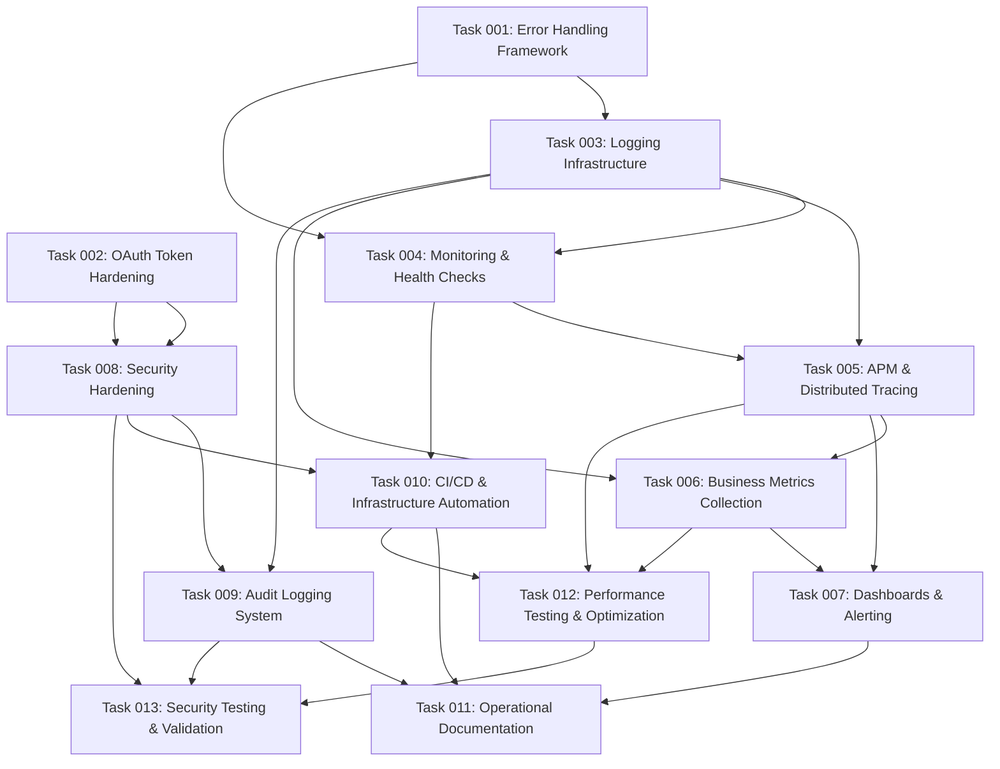

# Production Hardening & Monitoring Plan

## Executive Summary

This plan transforms the MCP server for Drupalize.me integration from development prototype to
production-ready system. The approach focuses on three critical pillars: **Resilience** (robust
error handling and recovery), **Observability** (comprehensive monitoring and alerting), and
**Security** (hardening and compliance).

The implementation prioritizes the unique challenges of long-running MCP connections, OAuth token
lifecycle management, multi-system error propagation, and maintaining service availability across
Drupal, JSON-RPC, and PostgreSQL dependencies.

## System Context & Architecture

### Current System Overview

The MCP server architecture consists of:

- **MCP Server (Node.js/TypeScript)**: SSE-based protocol handler with OAuth management
- **Drupal Backend**: Simple OAuth 5.x + JSON-RPC 2.x for content delivery
- **PostgreSQL Database**: User sessions and request analytics
- **Authentication Flow**: Per-user Authorization Code Grant with automatic token refresh

### Critical Production Requirements

Based on the architecture analysis, production deployment must address:

1. **Long-Running Connection Stability**: MCP connections persist for days/weeks
2. **OAuth Token Lifecycle**: Proactive refresh, graceful recovery, session persistence
3. **Multi-System Error Handling**: Drupal → JSON-RPC → Solr → PostgreSQL error chains
4. **Performance Under Load**: Direct API calls without caching (MVP baseline)
5. **Security Compliance**: OAuth best practices, token storage security
6. **Operational Visibility**: Comprehensive monitoring across all system layers

## Detailed Implementation Scope

### 1. Advanced Error Handling & Resilience

#### Circuit Breaker Pattern Implementation

- **Service Health Monitoring**: Real-time health checks for Drupal, PostgreSQL, OAuth endpoints
- **Automatic Failover**: Graceful degradation when services become unavailable
- **Recovery Detection**: Automatic service restoration when health improves
- **Request Isolation**: Prevent cascade failures across system boundaries

#### Robust OAuth Token Management

- **Proactive Token Refresh**: Background refresh 5 minutes before expiration
- **Token Storage Security**: Encrypted token storage with rotation capabilities
- **Connection Recovery**: Seamless MCP session restoration after token refresh
- **Error Recovery Flows**: Clear user guidance for authorization failures

#### Multi-Layer Error Translation

- **Production Mode**: User-friendly error messages with actionable guidance
- **Debug Mode**: Comprehensive error context for development/troubleshooting
- **Error Categorization**: Authentication, search, content, system-level error classification
- **Recovery Suggestions**: Automated retry strategies and manual intervention guidance

### 2. Comprehensive Observability & Monitoring

#### Application Performance Monitoring (APM)

- **Request Tracing**: End-to-end request flow visibility across MCP → OAuth → JSON-RPC
- **Performance Metrics**: Response time percentiles, throughput, error rates
- **Database Monitoring**: Connection pooling efficiency, query performance, session management
- **OAuth Flow Analytics**: Token refresh frequency, authentication success rates

#### Business Metrics & Analytics

- **User Engagement**: Search query patterns, content access frequency
- **Content Performance**: Most requested tutorials, search result relevance
- **Subscription Impact**: Free vs. subscriber usage patterns, access denial rates
- **System Utilization**: Peak usage periods, resource consumption patterns

#### Real-Time Alerting System

- **Service Degradation**: Response time thresholds, error rate spikes
- **Authentication Issues**: Token refresh failures, OAuth service unavailability
- **Resource Exhaustion**: Database connection limits, memory usage alerts
- **Security Events**: Unusual access patterns, repeated authentication failures

### 3. Security Hardening & Compliance

#### OAuth Security Implementation

- **PKCE Implementation**: Proof Key for Code Exchange for enhanced security
- **Token Security**: Secure storage with encryption at rest, token rotation policies
- **Session Management**: Secure session handling, automatic cleanup of expired sessions
- **Scope Validation**: Granular permission checking, subscription-level access controls

#### Infrastructure Security

- **Environment Isolation**: Production environment hardening, secrets management
- **Network Security**: HTTPS enforcement, secure communication channels
- **Input Validation**: Comprehensive request parameter validation and sanitization
- **Rate Limiting**: API rate limiting, abuse prevention mechanisms

#### Compliance & Audit

- **Audit Logging**: Comprehensive audit trails for all user actions and system events
- **Data Privacy**: User data handling compliance, retention policies
- **Security Scanning**: Automated vulnerability scanning, dependency auditing
- **Incident Response**: Security incident response procedures and documentation

### 4. Deployment & Infrastructure Automation

#### Production Deployment Pipeline

- **Containerization**: Docker-based deployment with optimized production images
- **Infrastructure as Code**: Automated infrastructure provisioning and configuration
- **Blue-Green Deployment**: Zero-downtime deployment strategy
- **Rollback Capabilities**: Automated rollback procedures for deployment failures

#### Environment Management

- **Configuration Management**: Environment-specific configuration handling
- **Secret Management**: Secure handling of OAuth credentials, database passwords
- **Health Checks**: Comprehensive health check endpoints for load balancers
- **Scaling Strategy**: Horizontal scaling configuration and auto-scaling policies

#### Operational Documentation

- **Runbook Creation**: Detailed operational procedures and troubleshooting guides
- **Monitoring Playbooks**: Alert response procedures and escalation paths
- **Disaster Recovery**: Backup and recovery procedures, RTO/RPO definitions
- **Performance Baselines**: Baseline performance metrics and capacity planning

## Success Metrics & KPIs

### Performance Targets (Production)

| Metric              | Target                    | Measurement                 | Alert Threshold |
| ------------------- | ------------------------- | --------------------------- | --------------- |
| Content Retrieval   | < 300ms (95th percentile) | End-to-end response time    | > 500ms         |
| Token Refresh       | < 100ms (99th percentile) | Background refresh duration | > 200ms         |
| OAuth Flow          | < 2s (95th percentile)    | Complete authorization flow | > 5s            |
| System Availability | 99.5% uptime              | Service availability        | < 99% (24h)     |

### Reliability Targets

| Metric                | Target                   | Measurement                  | Alert Threshold |
| --------------------- | ------------------------ | ---------------------------- | --------------- |
| Error Recovery        | > 95% automatic recovery | Error handling effectiveness | < 90%           |
| Token Refresh Success | > 99% success rate       | Background refresh success   | < 95%           |
| Connection Stability  | > 99% session continuity | MCP connection persistence   | < 95%           |
| Database Connection   | > 99.5% availability     | Connection pool health       | < 99%           |

### Security & Compliance Metrics

| Metric                 | Target                        | Measurement             | Alert Threshold |
| ---------------------- | ----------------------------- | ----------------------- | --------------- |
| Authentication Success | > 98% success rate            | OAuth flow completion   | < 95%           |
| Token Security         | 0 token exposures             | Security audit findings | Any exposure    |
| Access Control         | 100% authorization compliance | Permission enforcement  | Any bypass      |
| Audit Coverage         | 100% critical events logged   | Audit log completeness  | < 100%          |

## Risk Assessment & Mitigation

### High-Priority Risks

1. **OAuth Token Cascade Failures**: Mass token expiration causing service disruption
   - _Mitigation_: Staggered token refresh, graceful degradation patterns
2. **Database Connection Exhaustion**: High user load overwhelming PostgreSQL
   - _Mitigation_: Connection pooling, query optimization, read replicas
3. **Drupal Backend Unavailability**: JSON-RPC service failures
   - _Mitigation_: Circuit breaker implementation, cached fallbacks

### Medium-Priority Risks

1. **Memory Leaks in Long-Running Connections**: MCP session resource accumulation
   - _Mitigation_: Memory monitoring, automatic connection cycling
2. **Search Performance Degradation**: Solr service performance under load
   - _Mitigation_: Query optimization, result caching, timeout handling
3. **Security Vulnerabilities**: OAuth implementation or dependency vulnerabilities
   - _Mitigation_: Regular security audits, dependency monitoring

## Implementation Roadmap

### Phase 1: Foundation Hardening (Week 1-2)

- Implement robust error handling framework
- Set up comprehensive logging infrastructure
- Deploy basic monitoring and alerting
- Harden OAuth token management

### Phase 2: Observability Implementation (Week 3-4)

- Deploy APM and distributed tracing
- Implement business metrics collection
- Create monitoring dashboards
- Set up automated alerting

### Phase 3: Security & Compliance (Week 5-6)

- Implement security hardening measures
- Deploy audit logging system
- Conduct security testing and validation
- Create compliance documentation

### Phase 4: Deployment Automation (Week 7-8)

- Build CI/CD pipeline
- Implement infrastructure automation
- Create operational documentation
- Perform load testing and optimization

### Phase 5: Production Readiness Validation (Week 9-10)

- Conduct comprehensive testing
- Performance optimization and tuning
- Final security audit and penetration testing
- Production deployment and monitoring validation

## Technology Stack & Tools

### Monitoring & Observability

- **APM**: Sentry for error tracking and performance monitoring
- **Metrics**: Custom metrics collection with time-series database
- **Logging**: Structured logging with log aggregation and search
- **Alerting**: Multi-channel alerting (email, Slack, PagerDuty)

### Security & Compliance

- **Secret Management**: Environment-based secret handling
- **Security Scanning**: Automated vulnerability scanning in CI/CD
- **Audit Logging**: Comprehensive audit trail system
- **Encryption**: Data encryption at rest and in transit

### Deployment & Infrastructure

- **Containerization**: Docker with production-optimized images
- **Orchestration**: Railway deployment platform
- **Database**: PostgreSQL with connection pooling and monitoring
- **Load Balancing**: Application load balancing with health checks

## Architecture Decision Records (ADRs)

During implementation of this plan, create ADRs to document critical production hardening decisions:

- **ADR-025**: Production Monitoring and Observability Strategy
- **ADR-026**: Security Hardening and Compliance Framework
- **ADR-027**: Error Handling and Recovery Patterns for Production
- **ADR-028**: Performance Optimization and Scaling Strategy

These ADRs should be created in the `@architecture/adr/` directory following the established format
and numbering sequence.

This production hardening plan ensures the MCP server transitions from prototype to enterprise-ready
system with comprehensive resilience, observability, and security measures appropriate for
production workloads.

## Task Dependencies

## Execution Blueprint

**Validation Gates:**

- Reference: `@.ai/task-manager/VALIDATION_GATES.md`

### Phase 1: Foundation Infrastructure

**Parallel Tasks:**

- Task 001: Error Handling Framework (skills: error-handling, typescript)
- Task 002: OAuth Token Hardening (skills: authentication, security)

### Phase 2: Core Infrastructure

**Parallel Tasks:**

- Task 003: Logging Infrastructure (depends on: 001) (skills: logging, observability)
- Task 008: Security Hardening (depends on: 002) (skills: security, input-validation)

### Phase 3: Monitoring Foundation

**Parallel Tasks:**

- Task 004: Monitoring & Health Checks (depends on: 001, 003) (skills: monitoring, health-checks)
- Task 009: Audit Logging System (depends on: 003, 008) (skills: audit-logging, compliance)

### Phase 4: Advanced Observability

**Parallel Tasks:**

- Task 005: APM & Distributed Tracing (depends on: 003, 004) (skills: apm, distributed-tracing)
- Task 010: CI/CD & Infrastructure Automation (depends on: 004, 008) (skills: ci-cd,
  infrastructure-as-code)

### Phase 5: Business Intelligence

**Parallel Tasks:**

- Task 006: Business Metrics Collection (depends on: 003, 005) (skills: analytics, database)

### Phase 6: Operational Visibility

**Parallel Tasks:**

- Task 007: Dashboards & Alerting (depends on: 005, 006) (skills: dashboards, alerting)

### Phase 7: Documentation & Testing Preparation

**Parallel Tasks:**

- Task 011: Operational Documentation (depends on: 007, 009, 010) (skills: documentation,
  operational-procedures)
- Task 012: Performance Testing & Optimization (depends on: 005, 006, 010) (skills: load-testing,
  performance-optimization)

### Phase 8: Final Validation

**Parallel Tasks:**

- Task 013: Security Testing & Validation (depends on: 008, 009, 012) (skills: security-testing,
  penetration-testing)

### Post-phase Actions

- Complete validation gates for each phase before progression
- Document any issues or deviations in task completion
- Update performance baselines and security posture documentation

### Execution Summary

- Total Phases: 8
- Total Tasks: 13
- Maximum Parallelism: 2 tasks (in Phases 1, 2, 3, 4, 6, 7, 8)
- Critical Path Length: 8 phases
- Estimated Duration: 8-10 weeks based on phase complexity and validation requirements
