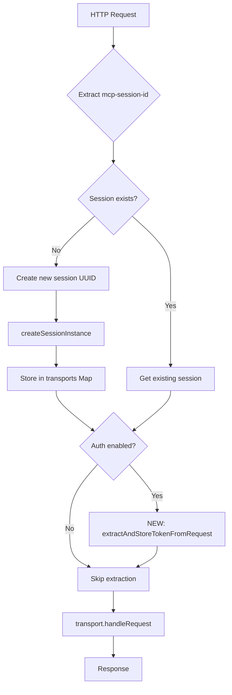

# Integrate Token Extraction in MCP Endpoint Handler

## Objective

Integrate the `extractAndStoreTokenFromRequest()` helper method into the `/mcp` endpoint handler
within `setupMcpEndpoint()`, adding conditional OAuth checking and calling the extraction before
routing requests to transport layer.

## Skills Required

- **TypeScript**: Modify Express route handler with conditional logic and method calls
- **Express**: Understand Express request flow and middleware-like integration patterns

## Acceptance Criteria

- [ ] Token extraction called in both "new session" and "existing session" code paths
- [ ] Extraction happens AFTER session ID is determined/created
- [ ] Extraction happens BEFORE `transport.handleRequest(req, res)` call
- [ ] Extraction is conditional on `this.config.enableAuth === true`
- [ ] Unauthenticated requests (no Authorization header) continue to work normally
- [ ] No changes to session creation logic
- [ ] No changes to transport routing logic
- [ ] Code compiles without TypeScript errors

## Technical Requirements

**File**: `src/index.ts`

**Method**: `setupMcpEndpoint()` (line ~601-652)

**Integration Points**:

1. New session path (line ~614-627): After `createSessionInstance()`, before
   `transport.handleRequest()`
2. Existing session path (line ~628-631): After retrieving transport, before
   `transport.handleRequest()`

**Conditional Check**: Only extract if `this.config.enableAuth` is true

## Input Dependencies

- Task 1 completion: `extractAndStoreTokenFromRequest()` method exists and works correctly
- Existing `/mcp` endpoint handler structure (no structural changes)

## Output Artifacts

- Modified `setupMcpEndpoint()` method with integrated token extraction
- OAuth token extraction active for browser-based authentication flows

## Implementation Notes

<details>
<summary>Detailed Implementation Guide</summary>

### Current Code Structure (`src/index.ts:608-649`)

```typescript
this.app.all('/mcp', async (req, res) => {
  try {
    // Step 1: Extract session ID from header
    const sessionId = req.headers['mcp-session-id'] as string | undefined;

    // Step 2: Session routing logic
    if (!sessionId) {
      // Scenario 1: New session request
      const newSessionId = randomUUID();
      console.log(`Creating new session: ${newSessionId}`);

      const { server, transport } = await this.createSessionInstance(newSessionId);
      this.transports.set(newSessionId, { server, transport });

      console.log(`Session ${newSessionId} created. Active sessions: ${this.transports.size}`);

      await transport.handleRequest(req, res);
    } else if (sessionId && this.transports.has(sessionId)) {
      // Scenario 2: Existing session
      const { transport } = this.transports.get(sessionId)!;
      await transport.handleRequest(req, res);
    } else {
      // Scenario 3: Invalid session ID
      console.warn(`Invalid session ID: ${sessionId}`);
      res.status(404).json({
        error: 'Session not found',
        sessionId,
      });
    }
  } catch (error) {
    console.error('Error handling MCP request:', error);
    if (!res.headersSent) {
      res.status(500).json({
        error: 'Internal server error',
        message: error instanceof Error ? error.message : 'Unknown error',
      });
    }
  }
});
```

### Required Changes

**Add Token Extraction in New Session Path** (after line 625, before line 627):

```typescript
// Scenario 1: New session request
const newSessionId = randomUUID();
console.log(`Creating new session: ${newSessionId}`);

const { server, transport } = await this.createSessionInstance(newSessionId);
this.transports.set(newSessionId, { server, transport });

console.log(`Session ${newSessionId} created. Active sessions: ${this.transports.size}`);

// ⬅️ ADD THIS: Extract OAuth token if auth is enabled
if (this.config.enableAuth) {
  this.extractAndStoreTokenFromRequest(newSessionId, req);
}

await transport.handleRequest(req, res);
```

**Add Token Extraction in Existing Session Path** (after line 630, before line 631):

```typescript
// Scenario 2: Existing session
const { transport } = this.transports.get(sessionId)!;

// ⬅️ ADD THIS: Extract OAuth token if auth is enabled
if (this.config.enableAuth) {
  this.extractAndStoreTokenFromRequest(sessionId, req);
}

await transport.handleRequest(req, res);
```

### Integration Pattern



### Key Implementation Points

1. **Placement**: Add extraction immediately before `transport.handleRequest()` call in both code
   paths

2. **Conditional Check**: Wrap extraction in `if (this.config.enableAuth) { ... }` to respect server
   configuration

3. **No Await**: Method is synchronous (returns void), don't use `await`

4. **Error Handling**: No try-catch needed here - helper method handles all errors internally

5. **Session ID Usage**:
   - New session path: Use `newSessionId` variable
   - Existing session path: Use `sessionId` variable

### Before and After

**BEFORE** (line ~627):

```typescript
await transport.handleRequest(req, res);
```

**AFTER** (line ~627-630):

```typescript
// Extract OAuth token if auth is enabled
if (this.config.enableAuth) {
  this.extractAndStoreTokenFromRequest(newSessionId, req);
}

await transport.handleRequest(req, res);
```

**BEFORE** (line ~631):

```typescript
const { transport } = this.transports.get(sessionId)!;
await transport.handleRequest(req, res);
```

**AFTER** (line ~631-636):

```typescript
const { transport } = this.transports.get(sessionId)!;

// Extract OAuth token if auth is enabled
if (this.config.enableAuth) {
  this.extractAndStoreTokenFromRequest(sessionId, req);
}

await transport.handleRequest(req, res);
```

### Validation

After implementation:

1. Run `npm run build` - TypeScript should compile without errors
2. Start server with `AUTH_ENABLED=true npm start`
3. Check that unauthenticated requests still work (no Authorization header)
4. Verify no regressions in session creation or routing logic

</details>
