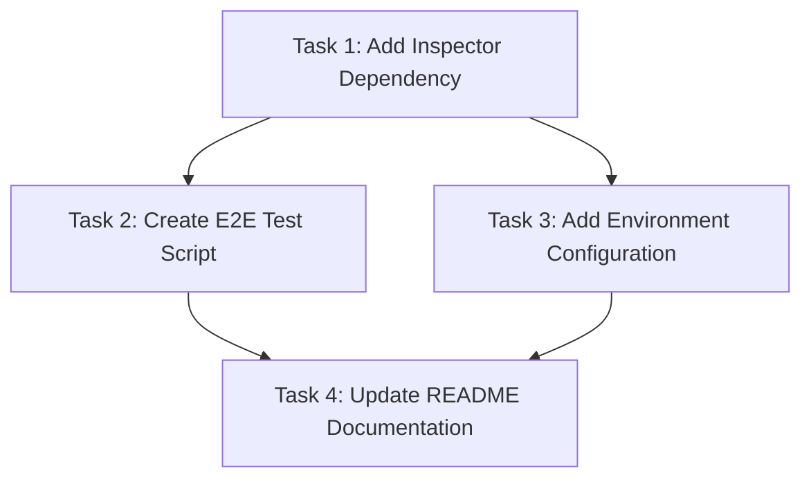

# Plan: OAuth Flow End-to-End Testing Implementation

## Original Work Order

> using the investigation above and the methodology recorded in
> @.ai/testing/oauth-flow-test-methodology.md I want you to create an e2e test for the MCP server.
> This test only makes sense to kick it off manually because it has a dependency on a Drupal
> website. Add documentation on how to run this test in the @README.md

## Executive Summary

This plan implements an automated end-to-end (e2e) test suite for the MCP server's OAuth
authentication flow using the `@modelcontextprotocol/inspector` CLI tool. The test suite will
validate the complete OAuth authentication lifecycle documented in the manual investigation,
including session creation, OAuth authorization, reconnection, and authenticated tool execution.

The implementation leverages the MCP Inspector's CLI mode to programmatically interact with the MCP
server and verify expected behaviors at each step of the OAuth flow. This approach provides
automated validation of the session management and token persistence features while maintaining the
flexibility of manual execution due to external Drupal dependencies.

The plan addresses three key deliverables: creating a comprehensive e2e test script using the
Inspector CLI, integrating it into the project's test infrastructure with proper configuration, and
documenting the test setup and execution process in the README.

## Context

### Current State

The MCP server currently has:

- **Manual OAuth flow testing** documented in `.ai/testing/oauth-flow-test-methodology.md` that was
  performed using the browser-based MCP Inspector
- **Unit tests** for session reconnection logic in `src/__tests__/session-reconnection.test.ts` that
  validate JWT decoding and token reuse patterns
- **OAuth implementation** that supports device flow authentication with Drupal OAuth servers
- **Session management** architecture using user-level token storage to enable reconnection without
  re-authentication
- **No automated e2e tests** that validate the complete OAuth flow against a real server

The manual testing methodology identified a critical issue where OAuth tokens are not properly
associated with sessions created after OAuth redirect, resulting in 403 errors when executing
authenticated tools.

### Target State

After completing this plan, the project will have:

- **Automated e2e test suite** using `@modelcontextprotocol/inspector` CLI to programmatically test
  OAuth flows
- **Reproducible test scenarios** covering the 7-step OAuth flow documented in the methodology
- **Test infrastructure** supporting manual execution with proper environment configuration
- **Comprehensive documentation** in README explaining test prerequisites, setup, and execution
- **Validation framework** to verify session lifecycle, token persistence, and authenticated
  operations

The e2e tests will serve as regression detection for OAuth-related issues and provide confidence
when making session management changes.

### Background

The OAuth flow investigation revealed a disconnect between session creation and token persistence
during the OAuth callback redirect. The manual testing methodology provides a detailed specification
of expected behaviors at each step, which forms the foundation for automated test scenarios.

The MCP Inspector's CLI mode provides the necessary tooling for automated testing with its
`--method` commands (tools/list, tools/call, etc.) and JSON output format. However, the tests
require a running Drupal OAuth server, making fully automated CI/CD integration impractical.
Therefore, the tests are designed for manual execution in development environments.

The existing unit tests validate the core session management logic in isolation, but e2e tests are
needed to verify the complete integration with actual OAuth servers and MCP protocol flows.

## Technical Implementation Approach

### E2E Test Script Development

**Objective**: Create a Node.js/TypeScript test script that uses the MCP Inspector CLI to automate
the 7-step OAuth flow from the methodology document.

The test script will use child process execution to invoke `@modelcontextprotocol/inspector --cli`
commands and validate responses. Each test step corresponds to a manual action from the methodology:

1. **Connection Test**: Validate server startup and session creation using tools/list
2. **OAuth Initiation**: Trigger OAuth flow and verify authorization endpoint access
3. **Manual OAuth Approval**: Pause for user interaction with authorization server
4. **Reconnection Validation**: Verify new session creation after OAuth callback
5. **Token Association**: Validate that reconnected session can access user tokens
6. **Authenticated Tool Execution**: Execute tools requiring authentication and verify success
7. **Session State Verification**: Check health/debug endpoints for proper session mappings

The script will use assertions to validate JSON responses from the Inspector CLI, checking for
expected status codes, session IDs, and tool execution results. Interactive prompts will guide the
user through steps requiring manual browser interaction.

### Test Infrastructure and Configuration

**Objective**: Integrate the e2e test into the project with proper environment configuration and
dependency management.

The implementation will:

- Add `@modelcontextprotocol/inspector` as a dev dependency for CLI access
- Create a dedicated test directory structure under `src/__tests__/e2e/` for e2e tests
- Provide `.env.test.example` with required OAuth server configuration variables
- Add an npm script (e.g., `npm run test:e2e:oauth`) for easy test execution
- Implement environment validation to check for required Drupal server availability
- Use the existing Jest test framework with custom configuration for e2e scenarios

Environment variables needed:

- `DRUPAL_BASE_URL`: Target Drupal OAuth server URL
- `OAUTH_CLIENT_ID`: OAuth client identifier
- `OAUTH_CLIENT_SECRET`: OAuth client secret (if required)
- `E2E_TEST_TIMEOUT`: Extended timeout for manual interactions (default: 120s)

### README Documentation

**Objective**: Provide clear, comprehensive documentation for setting up and running the OAuth e2e
tests.

The README updates will include:

- New "OAuth E2E Testing" section explaining the purpose and scope of the tests
- Prerequisites checklist (Node.js version, Drupal OAuth server setup, environment configuration)
- Step-by-step setup instructions for configuring the test environment
- Test execution commands with expected output examples
- Troubleshooting guide for common issues (connection failures, token errors, session mismatches)
- Architecture explanation of how the test uses Inspector CLI
- Links to the OAuth flow methodology document for detailed test specifications

The documentation will emphasize that these are manual-run tests requiring an active Drupal server,
distinguishing them from fully automated unit/integration tests.

## Risk Considerations and Mitigation Strategies

### Technical Risks

- **Inspector CLI API Changes**: The `@modelcontextprotocol/inspector` CLI interface may change in
  future versions, breaking test compatibility
  - **Mitigation**: Pin the Inspector version in package.json, add version compatibility checks in
    tests, document the supported Inspector version in README

- **Asynchronous OAuth Flow Timing**: The OAuth callback redirect timing is unpredictable, making
  automated validation challenging
  - **Mitigation**: Implement configurable timeouts, use polling mechanisms to detect session state
    changes, provide clear interactive prompts for manual steps

- **JSON Parsing Failures**: Inspector CLI output format may vary or include unexpected content
  - **Mitigation**: Use robust JSON parsing with error handling, validate response structure before
    assertions, log raw output for debugging

### Implementation Risks

- **Environment Configuration Complexity**: Users may struggle to configure the required Drupal
  OAuth server and environment variables
  - **Mitigation**: Provide detailed setup documentation with examples, create environment
    validation script, offer troubleshooting guide for common configuration errors

- **Test Flakiness**: Network issues, server timeouts, or OAuth server unavailability may cause
  intermittent failures
  - **Mitigation**: Implement retry logic for network operations, add connection health checks
    before test execution, provide clear error messages distinguishing infrastructure vs. test
    failures

### Quality Risks

- **Incomplete Test Coverage**: The e2e test may not cover all edge cases or error scenarios in the
  OAuth flow
  - **Mitigation**: Base test scenarios directly on the documented methodology, add negative test
    cases (invalid tokens, expired sessions), use the existing unit tests to complement e2e coverage

- **Maintenance Burden**: E2e tests requiring manual execution may become neglected or outdated
  - **Mitigation**: Document the tests' purpose and value in preventing regressions, integrate test
    execution into development workflow checklist, schedule periodic test runs

## Success Criteria

### Primary Success Criteria

1. **E2E test script successfully validates all 7 steps** from the OAuth flow methodology document
   using Inspector CLI commands
2. **Automated assertions detect the documented OAuth token association bug** (403 error on tool
   execution after reconnection)
3. **README documentation enables a developer unfamiliar with the codebase** to set up and run the
   e2e tests within 15 minutes
4. **Test execution provides clear pass/fail indicators** with actionable error messages for each
   step

### Quality Assurance Metrics

1. **Test script handles both success and failure scenarios** gracefully with appropriate error
   reporting
2. **Environment validation checks prevent confusing failures** due to missing configuration
3. **Documentation includes troubleshooting section** addressing at least 5 common failure scenarios
4. **Test output matches the format and detail level** of the manual methodology document

## Resource Requirements

### Development Skills

- TypeScript/Node.js proficiency for test script development
- Understanding of child process execution and command-line tool automation
- Knowledge of OAuth 2.0 device flow and JWT token structure
- Familiarity with MCP protocol and Inspector CLI capabilities
- Experience with asynchronous test patterns and interactive CLI tools

### Technical Infrastructure

- Node.js 20+ runtime environment
- `@modelcontextprotocol/inspector` package for CLI automation
- Jest test framework for test structure and assertions
- Access to a Drupal instance with OAuth 2.0 server configured
- Environment configuration tools (dotenv) for test settings

## Implementation Order

The implementation follows a logical progression from test script creation to infrastructure
integration to documentation:

1. **Test Script Foundation**: Develop the core e2e test script with Inspector CLI integration and
   basic flow validation
2. **Environment Configuration**: Add configuration management, environment validation, and
   dependency installation
3. **Test Refinement**: Enhance test assertions, error handling, and interactive prompts for manual
   steps
4. **Documentation**: Update README with comprehensive setup instructions, usage examples, and
   troubleshooting guide
5. **Validation**: Execute the complete test suite to verify all steps work as documented

## Notes

- The e2e tests are designed for **manual execution only** due to external Drupal server
  dependencies
- Tests serve as **regression detection** for the OAuth token association bug documented in the
  methodology
- The test script can be adapted for CI/CD integration if a persistent test Drupal environment
  becomes available
- Future enhancements could include mocking the OAuth server for fully automated testing, though
  this would sacrifice end-to-end validation authenticity

## Task Dependencies

## Execution Blueprint

**Validation Gates:**

- Reference: `.ai/task-manager/config/hooks/POST_PHASE.md`

### ✅ Phase 1: Foundation Setup

**Parallel Tasks:**

- ✔️ Task 1: Add Inspector Dependency

**Objective**: Install required testing infrastructure dependencies

### ✅ Phase 2: Core Implementation

**Parallel Tasks:**

- ✔️ Task 2: Create E2E Test Script (depends on: 1)
- ✔️ Task 3: Add Environment Configuration (depends on: 1)

**Objective**: Implement test suite and configuration in parallel

### Phase 3: Documentation

**Parallel Tasks:**

- Task 4: Update README Documentation (depends on: 2, 3)

**Objective**: Complete user-facing documentation with all implementation details

### Execution Summary

- **Total Phases**: 3
- **Total Tasks**: 4
- **Maximum Parallelism**: 2 tasks (in Phase 2)
- **Critical Path Length**: 3 phases
- **Estimated Complexity**: Low-Medium (all tasks ≤5.5 complexity score)
