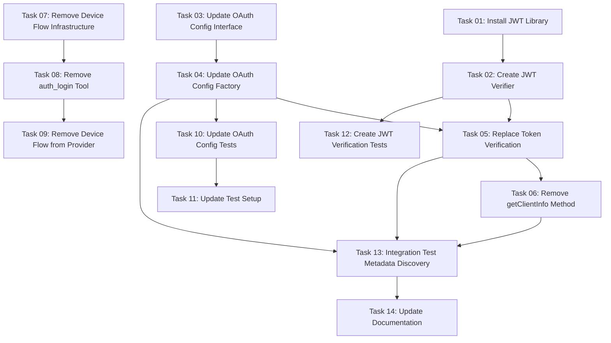

# Plan: Enable OAuth Metadata Discovery for Claude Code Authentication

## Original Work Order

> Fix OAuth Authentication for Claude Code
>
> Problem: Claude Code's "Authenticate" button fails with 404 on /register endpoint
>
> Solution: Implement OAuth 2.0 Dynamic Client Registration (RFC 7591)

## Executive Summary

The issue is not that the MCP server lacks dynamic client registration - **Drupal already implements
RFC 7591** at `/oauth/register`. The actual problem is that OAuth initialization fails due to
missing `OAUTH_CLIENT_ID`/`OAUTH_CLIENT_SECRET` in `.env`, preventing the metadata router from
advertising Drupal's registration endpoint to Claude Code.

The solution is to make these credentials **optional** and allow OAuth initialization to succeed
even without pre-configured client credentials. Once the metadata router is active, Claude Code will
discover Drupal's `registration_endpoint` (already present in Drupal's metadata) and register
directly with Drupal.

This is a minimal fix that leverages Drupal's existing RFC 7591 implementation instead of
duplicating it in the MCP server.

## Context

### Current State

The MCP server has OAuth 2.1 infrastructure but it's **inactive** because:

- `AUTH_ENABLED=true` in `.env`
- But `OAUTH_CLIENT_ID` and `OAUTH_CLIENT_SECRET` are **not set**
- `createOAuthConfigFromEnv()` throws error: "OAUTH_CLIENT_ID environment variable is required"
- OAuth initialization fails and falls back to no authentication
- `mcpAuthMetadataRouter` is never set up
- Claude Code cannot discover OAuth endpoints

Drupal provides full OAuth 2.1 + RFC 7591 support:

```json
{
  "registration_endpoint": "https://drupal-contrib.ddev.site/oauth/register",
  "authorization_endpoint": "http://drupal-contrib.ddev.site/oauth/authorize",
  "token_endpoint": "http://drupal-contrib.ddev.site/oauth/token",
  "device_authorization_endpoint": "http://drupal-contrib.ddev.site/oauth/device_authorization",
  ...
}
```

The metadata is fetched but never served to clients because OAuth init fails before reaching
`mcpAuthMetadataRouter` setup.

### Target State

After implementation:

- OAuth initialization succeeds even without pre-configured client credentials
- `mcpAuthMetadataRouter` serves Drupal's metadata at `/.well-known/oauth-authorization-server`
- Claude Code discovers `registration_endpoint` pointing to Drupal
- Claude Code registers directly with Drupal via `/oauth/register`
- Registered clients authenticate through Drupal's OAuth flow
- MCP server acts purely as a **resource server**, not an authorization server

Success criteria:

- Server starts with `AUTH_ENABLED=true` and no client credentials
- `GET /.well-known/oauth-authorization-server` returns Drupal's metadata
- Claude Code "Authenticate" button completes registration with Drupal
- Authenticated sessions can invoke MCP tools

### Background

**RFC 7591 in Drupal**: The `simple_oauth_21` module implements complete dynamic client
registration:

- `POST /oauth/register` - Register new client
- `GET /oauth/register/{client_id}` - Retrieve client metadata
- `PUT /oauth/register/{client_id}` - Update client metadata
- `DELETE /oauth/register/{client_id}` - Unregister client

The `registration_endpoint` is already included in Drupal's OAuth metadata discovery response.

**Current Architecture Issue**: The MCP server requires pre-configured OAuth credentials for a
specific use case - calling Drupal's token introspection endpoint to validate tokens. However, this
requirement prevents the entire OAuth subsystem from initializing, which blocks metadata discovery.

**Design Decision**: The MCP server should be a **pure resource server**, not an OAuth client.
Instead of using client credentials for token introspection, we'll implement **JWT signature
verification** using Drupal's JWKS endpoint (`/oauth/jwks`). This is the standard OAuth 2.0 pattern
for resource servers.

## Technical Implementation Approach

### Phase 1: Remove OAuth Client Credentials Requirement

**Objective**: Eliminate `OAUTH_CLIENT_ID`/`OAUTH_CLIENT_SECRET` from configuration entirely.

Current code in `src/oauth/config.ts:147-183`:

```typescript
export function createOAuthConfigFromEnv(): OAuthConfig {
  const clientId = process.env.OAUTH_CLIENT_ID;
  const clientSecret = process.env.OAUTH_CLIENT_SECRET;

  if (!clientId) {
    throw new Error('OAUTH_CLIENT_ID environment variable is required');
  }

  if (!clientSecret) {
    throw new Error('OAUTH_CLIENT_SECRET environment variable is required');
  }

  return {
    drupalUrl,
    clientId,
    clientSecret,
    scopes,
    resourceServerUrl,
  };
}
```

Change to:

```typescript
export function createOAuthConfigFromEnv(): OAuthConfig {
  return {
    drupalUrl,
    scopes,
    resourceServerUrl,
  };
}
```

Update `OAuthConfig` interface to remove credentials:

```typescript
export interface OAuthConfig {
  drupalUrl: string;
  scopes: string[];
  resourceServerUrl?: string;
  // clientId and clientSecret removed - not needed for resource server
}
```

### Phase 2: Implement JWT Signature Verification

**Objective**: Replace token introspection with JWT signature verification using Drupal's JWKS.

**Implementation**:

1. Install JWT library:

   ```bash
   npm install jose
   ```

2. Create JWT verification utility (`src/oauth/jwt-verifier.ts`):

   ```typescript
   import { createRemoteJWKSet, jwtVerify } from 'jose';
   import type { OAuthMetadata } from '@modelcontextprotocol/sdk/shared/auth.js';

   export async function verifyJWT(token: string, metadata: OAuthMetadata) {
     if (!metadata.jwks_uri) {
       throw new Error('JWKS URI not available in OAuth metadata');
     }

     // Use JWKS endpoint from discovered metadata (not hard-coded)
     const JWKS = createRemoteJWKSet(new URL(metadata.jwks_uri));

     const { payload } = await jwtVerify(token, JWKS, {
       issuer: metadata.issuer, // Use issuer from metadata
     });

     return payload;
   }
   ```

   **Important**: All OAuth endpoints (JWKS, token, authorization) come from Drupal's
   `/.well-known/oauth-authorization-server` metadata - never hard-code URLs.

3. Replace `verifyToken()` in `DrupalOAuthProvider`:

   ```typescript
   private async verifyToken(token: string): Promise<AuthInfo> {
     try {
       const metadata = await this.configManager.fetchMetadata();
       const payload = await verifyJWT(token, metadata);

       return {
         token,
         clientId: payload.client_id as string || 'unknown',
         scopes: (payload.scope as string)?.split(' ') || [],
         expiresAt: payload.exp,
       };
     } catch (error) {
       throw new Error(`Token verification failed: ${error.message}`);
     }
   }
   ```

4. Remove `getClientInfo()` method entirely - not needed for resource server

### Phase 3: Remove OAuth Client Code (Device Flow and `auth_login` Tool)

**Objective**: Remove all OAuth client functionality to make the MCP server a pure resource server.

The MCP server currently includes OAuth client code (`auth_login` tool, device flow infrastructure)
which is architecturally incorrect for a resource server. Claude Code already provides OAuth client
functionality.

**Files and code to remove**:

1. **Tool**: `src/tools/auth/login.ts` - Delete entire file
2. **Device Flow Infrastructure**:
   - `src/oauth/device-flow.ts` - Delete
   - `src/oauth/device-flow-handler.ts` - Delete
   - `src/oauth/device-flow-detector.ts` - Delete
   - `src/oauth/device-flow-types.ts` - Delete
   - `src/oauth/device-token-poller.ts` - Delete
   - `src/oauth/device-flow-ui.ts` - Delete

3. **OAuth Provider Methods**:
   - `DrupalOAuthProvider.authenticateDeviceFlow()` - Remove method
   - Any device flow related imports

4. **Server Registration**:
   - Remove `auth_login` tool registration from `src/index.ts`
   - Remove local tool handler for `auth_login`

5. **Tests**:
   - Remove device flow tests
   - Remove `auth_login` tool tests

**Rationale**:

- **Separation of concerns**: MCP server = Resource Server, Claude Code = OAuth Client, Drupal =
  Authorization Server
- **Better UX**: Claude Code's "Authenticate" button provides superior OAuth experience
- **Simpler codebase**: Removes ~500 lines of OAuth client code
- **Standards compliance**: Resource servers should not implement OAuth client flows

### Phase 4: Update Tests

**Objective**: Remove tests that rely on `OAUTH_CLIENT_ID`/`OAUTH_CLIENT_SECRET`.

Files to update:

- `tests/unit/oauth-config.test.ts` - Remove credential validation tests
- `tests/unit/setup.ts` - Remove test credential setup
- Any integration tests expecting client credentials

### Phase 5: Testing and Validation

**Objective**: Verify Claude Code authentication works end-to-end.

Test scenarios:

1. **Metadata Discovery**:
   - Start server with `AUTH_ENABLED=true`, no client credentials
   - Verify `GET http://localhost:6200/.well-known/oauth-authorization-server` returns Drupal
     metadata
   - Confirm `registration_endpoint` is present and points to Drupal

2. **Claude Code Authentication**:
   - Connect Claude Code to MCP server
   - Click "Authenticate" button
   - Verify Claude Code discovers registration endpoint
   - Confirm registration completes with Drupal
   - Test tool invocation with authenticated session

3. **Error Handling**:
   - Test with `AUTH_ENABLED=false` (metadata should not be served)
   - Test with invalid Drupal URL (init should fail gracefully)
   - Verify appropriate error messages

## Risk Considerations and Mitigation Strategies

### Security Risks

- **JWT Verification Dependencies**: Relying on external library (`jose`) for cryptographic
  operations
  - **Mitigation**: Use well-established library with active maintenance
  - **Benefit**: More secure than trusting tokens without validation

- **JWKS Caching**: Need to handle key rotation and caching properly
  - **Mitigation**: The `jose` library handles JWKS caching and refresh automatically
  - **Monitoring**: Log JWT verification failures to detect key rotation issues

### Implementation Risks

- **Breaking Existing Deployments**: Removing credential support is a breaking change
  - **Mitigation**: This is a major version change; document clearly in changelog
  - **Migration Path**: Existing deployments can remove credentials from .env

- **Device Flow Removal**: Removing `auth_login` tool removes alternative auth method
  - **Mitigation**: Claude Code's "Authenticate" button is better UX
  - **Alternative**: Keep device flow but implement auto-registration

### Integration Risks

- **Drupal Registration Failures**: Drupal's `/oauth/register` might have restrictions
  - **Mitigation**: Test registration flow; document any Drupal configuration requirements
  - **Fallback**: If Drupal registration fails, document need for manual client creation

## Success Criteria

### Primary Success Criteria

1. **OAuth Initialization Succeeds**: Server starts with `AUTH_ENABLED=true` and no client
   credentials
2. **Metadata Discovery Works**: `/.well-known/oauth-authorization-server` returns Drupal's complete
   metadata including `registration_endpoint`
3. **Claude Code Authentication Completes**: User can click "Authenticate" and complete OAuth flow
   via Drupal
4. **Authenticated Tool Access**: Registered clients can successfully invoke MCP tools

### Quality Assurance Metrics

1. **JWT Verification Works**: Tokens are properly validated using Drupal's public keys
2. **Clear Documentation**: README explains the resource server architecture
3. **Test Coverage**: JWT verification has comprehensive unit tests

## Resource Requirements

### Development Skills

- **OAuth 2.1 Understanding**: Knowledge of metadata discovery and client registration flows
- **TypeScript**: Refactoring config validation and optional parameters
- **Testing**: End-to-end OAuth flow testing with Claude Code

### Technical Infrastructure

- **Running Drupal Instance**: With `simple_oauth_21` module enabled
- **Claude Code Client**: For testing authentication flow
- **HTTP Debugging**: Tools to inspect metadata discovery requests

## Integration Strategy

**With Drupal OAuth Server**: MCP server acts as pure resource server, delegating all OAuth
operations (registration, authorization, token issuance) to Drupal.

**With Claude Code**: Standard OAuth 2.1 discovery → dynamic registration → authorization → token
exchange → authenticated API access.

**With Existing Deployments**: Backwards compatible - if credentials are configured, introspection
works as before.

## Implementation Order

1. Install `jose` library for JWT verification
2. Create JWT verification utility (`src/oauth/jwt-verifier.ts`)
3. Remove `clientId`/`clientSecret` from `OAuthConfig` interface
4. Update `createOAuthConfigFromEnv()` to not read credentials
5. Replace `verifyToken()` implementation with JWT verification
6. Remove `getClientInfo()` method from `DrupalOAuthProvider`
7. Remove or update `auth_login` tool
8. Update tests to remove credential dependencies
9. Test metadata discovery and authentication with Claude Code
10. Update documentation and .env.example

## Notes

**Scope**: This refactors the MCP server to be a pure OAuth 2.0 resource server using JWT signature
verification instead of token introspection.

**Security Improvement**: JWT verification is cryptographically secure and doesn't require the MCP
server to have OAuth client credentials.

**Alternative Approaches Considered**:

- **Make credentials optional**: Rejected because partial validation is worse than proper JWT
  verification
- **Keep introspection**: Rejected because it requires MCP server to be an OAuth client, which is
  architecturally wrong
- **Implement local RFC 7591**: Rejected because Drupal already provides this

**Production Recommendations**:

- Monitor JWT verification failures to detect key rotation issues
- Use Drupal's client management UI to review registered clients
- Consider implementing rate limiting on authenticated endpoints

## Task Dependencies



## Execution Blueprint

**Validation Gates:**

- Reference: `.ai/task-manager/config/hooks/POST_PHASE.md`

### ✅ Phase 1: Foundation Setup

**Parallel Tasks:**

- ✔️ Task 01: Install JWT Library
- ✔️ Task 03: Update OAuth Config Interface
- ✔️ Task 07: Remove Device Flow Infrastructure

**Rationale**: These tasks have no dependencies and can be executed simultaneously. Task 01 installs
dependencies, Task 03 updates TypeScript interfaces, and Task 07 removes obsolete files.

### ✅ Phase 2: Core Configuration Changes

**Parallel Tasks:**

- ✔️ Task 02: Create JWT Verifier (depends on: 01)
- ✔️ Task 04: Update OAuth Config Factory (depends on: 03)

**Rationale**: Task 02 requires the jose library from Phase 1. Task 04 requires the updated
interface from Phase 1. These can run in parallel since they modify different parts of the codebase.

### Phase 3: OAuth Provider Refactoring

**Parallel Tasks:**

- Task 05: Replace Token Verification (depends on: 02, 04)
- Task 08: Remove auth_login Tool (depends on: 07)

**Rationale**: Task 05 integrates JWT verification and updated config. Task 08 removes the tool that
depended on device flow. Both are independent and can run in parallel.

### Phase 4: Provider Cleanup

**Parallel Tasks:**

- Task 06: Remove getClientInfo Method (depends on: 05)
- Task 09: Remove Device Flow from Provider (depends on: 07, 08)

**Rationale**: Task 06 cleans up methods no longer needed after JWT verification. Task 09 removes
device flow code from the provider. Both are cleanup tasks that can run in parallel.

### Phase 5: Test Infrastructure Updates

**Parallel Tasks:**

- Task 10: Update OAuth Config Tests (depends on: 04)
- Task 12: Create JWT Verification Tests (depends on: 02)

**Rationale**: Task 10 updates tests for the new config structure. Task 12 adds tests for JWT
verification. Both are independent test updates.

### Phase 6: Test Finalization

**Parallel Tasks:**

- Task 11: Update Test Setup (depends on: 10)

**Rationale**: Task 11 updates global test configuration after individual test files are updated.

### Phase 7: Integration Testing

**Parallel Tasks:**

- Task 13: Integration Test Metadata Discovery (depends on: 04, 05, 06)

**Rationale**: This integration test validates the entire OAuth flow works correctly with all
changes in place.

### Phase 8: Documentation

**Parallel Tasks:**

- Task 14: Update Documentation (depends on: 13)

**Rationale**: Documentation is updated last after all implementation and testing is complete.

### Execution Summary

- Total Phases: 8
- Total Tasks: 14
- Maximum Parallelism: 3 tasks (in Phase 1)
- Critical Path Length: 8 phases
- Estimated Duration: The critical path follows: Task 01 → Task 02 → Task 05 → Task 06 → Task 13 →
  Task 14
