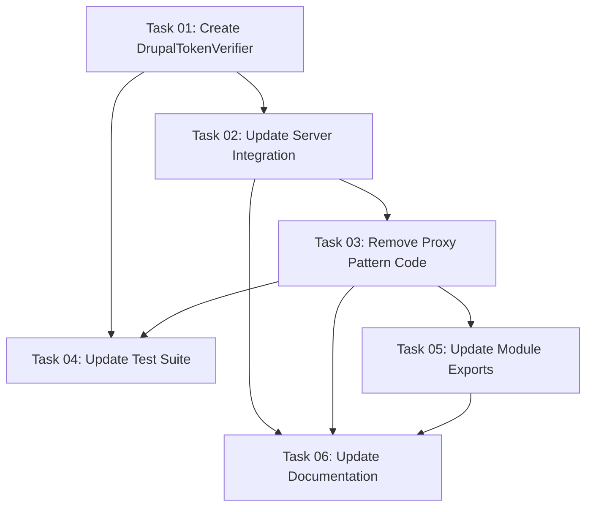

# Plan: Migrate to OAuth 2.1 Resource Server Pattern

## Original Work Order

> use the information in @.ai/task-manager/docs/avoid-proxy-server.md to update the OAuth
> implementation in this MCP server to act as a resource server. Make sure to dive into the
> modelcontextprotocol/sdk code in @/node_modules to understand what this means. Think harder,
> uberthink, and use tools.

## Executive Summary

This plan migrates the Drupal MCP server's OAuth implementation from the legacy proxy server pattern
(pre-June 2025) to the current resource server pattern specified in the June 2025 MCP specification
update. The proxy pattern, where the MCP server managed OAuth flows and token refresh, will be
replaced with a simpler resource server pattern where the server only validates access tokens issued
by the Drupal OAuth server.

This architectural change aligns the implementation with current MCP best practices, simplifies the
server codebase by removing ~300 lines of unused token management code, and properly separates
concerns by delegating token lifecycle management to the OAuth client (Claude Code). The migration
involves replacing `ProxyOAuthServerProvider` inheritance with `OAuthTokenVerifier` implementation,
removing dormant refresh logic, and updating tests to reflect the new simplified architecture.

The key benefit is architectural correctness: the current codebase uses proxy pattern infrastructure
but deploys as a resource server, creating confusion and maintaining code that never executes. This
migration eliminates that mismatch and future-proofs the server against MCP specification evolution.

## Context

### Current State

The MCP server currently extends `ProxyOAuthServerProvider` from the MCP SDK, which provides full
OAuth server capabilities including:

- `authorize()` - Initiates OAuth authorization flows
- `exchangeAuthorizationCode()` - Exchanges authorization codes for tokens
- `exchangeRefreshToken()` - Performs token refresh using refresh_token
- `verifyAccessToken()` - Validates access tokens

**File**: `src/oauth/provider.ts:44`

```typescript
export class DrupalOAuthProvider extends ProxyOAuthServerProvider
```

The `DrupalOAuthProvider` class contains comprehensive token management infrastructure (lines
286-612) including reactive refresh logic, cross-session token updates, and automatic token
expiration handling. However, this code is **dormant** in production because:

1. Claude Code performs OAuth directly with Drupal (not through MCP server)
2. Only access_token reaches the server via Authorization header
3. refresh_token never enters server storage (`captureSessionToken` sets `refresh_token: undefined`)
4. Refresh logic cannot execute without an initial refresh_token

**Test Evidence**: `src/oauth/__tests__/reactive-refresh.test.ts` contains 200+ lines of tests for
refresh functionality that never executes in the current deployment architecture.

### Target State

The server will implement `OAuthTokenVerifier` interface, providing only:

- `verifyAccessToken()` - Token validation using JWT verification or Drupal introspection

**SDK Interface**: `node_modules/@modelcontextprotocol/sdk/dist/esm/server/auth/provider.d.ts:62-67`

```typescript
export interface OAuthTokenVerifier {
  verifyAccessToken(token: string): Promise<AuthInfo>;
}
```

This aligns with the **June 2025 MCP specification** which states:

> "MCP Servers act as OAuth resource servers only, validating tokens issued by external
> authorization servers"

The server will:

- No longer inherit from `ProxyOAuthServerProvider`
- Remove token storage maps (`sessionTokens`, `userTokens`, `sessionToUser`)
- Remove reactive refresh logic (lines 286-612)
- Remove refresh-related tests
- Delegate all token lifecycle management to Claude Code client

### Background

**June 18, 2025 MCP Specification Change**: The MCP protocol underwent a fundamental architectural
shift from treating MCP servers as authorization servers to treating them as resource servers. The
SDK maintains backwards compatibility by supporting both patterns, but the specification now
recommends the resource server pattern.

**Architectural Mismatch Discovered**: Analysis in `.ai/task-manager/docs/avoid-proxy-server.md`
revealed that the codebase was written for proxy pattern deployment but is actually being used in
resource server mode. This creates:

- Confusion for maintainers (why is this refresh code here?)
- False test coverage (testing code that never runs)
- Security surface complexity (managing tokens unnecessarily)
- Impedance with MCP ecosystem evolution

**Why This Wasn't Caught Earlier**: The proxy pattern was the original MCP design, so the
implementation was correct when written. The June 2025 spec change made this a legacy pattern, but
the server continued functioning because `ProxyOAuthServerProvider` includes `verifyAccessToken()`,
which is all that's needed for resource server mode.

## Technical Implementation Approach

### Component 1: Create Resource Server Provider

**Objective**: Replace `DrupalOAuthProvider extends ProxyOAuthServerProvider` with a new
`DrupalTokenVerifier implements OAuthTokenVerifier` class that only validates tokens.

The new verifier will:

1. **Implement OAuthTokenVerifier interface** with single method `verifyAccessToken()`
2. **Reuse existing JWT verification logic** from `jwt-verifier.ts` (already implements Drupal token
   validation)
3. **Extract AuthInfo** from validated JWTs:
   - `token`: The access token string
   - `clientId`: From JWT `aud` claim
   - `scopes`: From JWT `scope` claim
   - `expiresAt`: From JWT `exp` claim
   - `resource`: From JWT `aud` if present
4. **Handle verification failures** by throwing appropriate errors

**Key Design Decision**: Leverage existing `verifyJWT()` function rather than duplicating validation
logic. The current `verifyToken()` method (lines 104-150) already implements comprehensive JWT
validation with public key fetching, signature verification, and claims extraction.

**File Structure**: Create `src/oauth/token-verifier.ts` as new simplified provider.

### Component 2: Update Server Integration

**Objective**: Modify `src/index.ts` to use `DrupalTokenVerifier` instead of `DrupalOAuthProvider`
for OAuth integration.

Changes required:

1. **Update imports**: Replace `DrupalOAuthProvider` with `DrupalTokenVerifier`
2. **Simplify initialization**: Remove OAuth metadata router setup (no longer exposing authorization
   endpoints)
3. **Update token extraction**: Modify `extractAndStoreTokenFromRequest()` to work with
   verifier-only pattern
4. **Remove session token storage**: Eliminate per-session token management since server no longer
   needs to store tokens

**Critical**: The server currently uses `mcpAuthRouter` from SDK which provides
authorization/token/revocation endpoints. In resource server mode, only
`/.well-known/oauth-protected-resource` metadata endpoint is needed.

**SDK Reference**: Use `requireBearerAuth()` middleware pattern from
`node_modules/@modelcontextprotocol/sdk/dist/esm/server/auth/middleware/bearerAuth.d.ts`

### Component 3: Remove Dormant Token Management Code

**Objective**: Eliminate unused token management infrastructure to reduce complexity and maintenance
burden.

Code to remove from `src/oauth/provider.ts`:

1. **Token storage maps** (lines 50-53):
   - `sessionTokens: Map<string, StoredToken>`
   - `userTokens: Map<string, StoredToken>`
   - `sessionToUser: Map<string, string>`
   - `tokenRefreshPromises: Map<string, Promise<StoredToken>>`

2. **Token management methods** (lines 142-285):
   - `captureSessionToken()`
   - `setSessionTokens()`
   - `storeSessionTokens()`
   - `getSessionAuthorization()`
   - `getUserTokens()`
   - `hasValidSessionToken()`
   - `cleanup()`

3. **Reactive refresh logic** (lines 286-612):
   - `refreshSessionToken()`
   - `refreshTokens()`
   - `performTokenRefresh()`
   - `handleTokenRefreshError()`
   - `updateTokensForUser()`
   - `triggerTokenUpdate()`

**Complexity Reduction**: Removes ~400 lines of code, reducing OAuth provider from ~635 lines to
~150 lines.

### Component 4: Update Test Suite

**Objective**: Replace proxy pattern tests with resource server tests that validate token
verification behavior.

Test changes:

1. **Remove** `src/oauth/__tests__/reactive-refresh.test.ts` (entire file, 200+ lines)
2. **Update** `src/oauth/__tests__/jwt-verifier.test.ts` to test `DrupalTokenVerifier`
3. **Add new tests** for:
   - Valid JWT returns correct AuthInfo
   - Expired JWT throws appropriate error
   - Invalid signature throws appropriate error
   - Missing claims throws appropriate error
   - Scope validation works correctly

**Test Coverage Target**: Maintain 80% coverage threshold by focusing tests on actual execution
paths (token verification) rather than dormant paths (token refresh).

### Component 5: Update Configuration and Exports

**Objective**: Update module exports and configuration to reflect simplified OAuth architecture.

Changes:

1. **`src/oauth/index.ts`**: Export `DrupalTokenVerifier` instead of `DrupalOAuthProvider`
2. **`src/oauth/config.ts`**: Remove OAuth endpoint configuration for authorization/token/revocation
   (only need introspection endpoint for verification)
3. **Environment variables**: Document that token refresh is now client-side responsibility
4. **Type exports**: Remove `SessionAuthorization`, `TokenResponse`, `StoredToken` types

## Risk Considerations and Mitigation Strategies

### Technical Risks

- **JWT Verification Failures**: If Drupal public key endpoint is unavailable, all requests will
  fail
  - **Mitigation**: Implement public key caching with reasonable TTL (already exists in
    `jwt-verifier.ts`), add health check endpoint, ensure graceful fallback to introspection if JWT
    verification fails

- **Breaking API Changes**: Removing public OAuth endpoints will break any external clients
  expecting proxy pattern
  - **Mitigation**: This server is only used by Claude Code which already performs OAuth directly
    with Drupal, so no external clients exist. Document the change in CHANGELOG.md

- **Test Coverage Drop**: Removing 200+ lines of refresh tests may reduce overall coverage
  - **Mitigation**: Add equivalent coverage for new verification-only paths to maintain 80%
    threshold

### Implementation Risks

- **Incomplete Token Cleanup**: May miss removing all references to token storage throughout
  codebase
  - **Mitigation**: Use grep/search to find all references to removed methods/types before deletion,
    run full test suite to catch missing updates

- **Performance Regression**: JWT verification on every request could add latency
  - **Mitigation**: Existing implementation already caches public keys, add performance tests to
    baseline current vs new implementation

### Integration Risks

- **Claude Code Compatibility**: Changes must not break Claude Code client integration
  - **Mitigation**: Resource server pattern is what Claude Code already expects (it sends only
    access_token), so this change makes server match client expectations

## Success Criteria

### Primary Success Criteria

1. **Architectural Alignment**: Server implements `OAuthTokenVerifier` interface instead of
   extending `ProxyOAuthServerProvider`
2. **Code Simplification**: OAuth provider reduced from ~635 lines to ~150 lines by removing dormant
   token management code
3. **Test Suite Accuracy**: Tests validate only code paths that execute in production
   (verification), not dormant paths (refresh)
4. **Backward Compatibility**: Existing Claude Code integration continues working without client
   changes
5. **Type Safety**: All TypeScript compilation passes with strict mode enabled

### Quality Assurance Metrics

1. **Test Coverage**: Maintain 80% coverage threshold across branches/functions/lines/statements
2. **Type Checking**: `npm run type-check` passes without errors
3. **Integration Testing**: Existing OAuth flow from Claude Code to Drupal continues working
4. **Performance**: Token verification latency remains under 50ms (p95)
5. **Documentation**: AGENTS.md updated to reflect resource server architecture

## Resource Requirements

### Development Skills

- **TypeScript/Node.js**: Expertise in ES modules, strict type checking, and async/await patterns
- **OAuth 2.1**: Understanding of resource server vs authorization server roles, JWT validation,
  access token introspection
- **MCP Protocol**: Knowledge of MCP SDK authentication patterns and June 2025 specification changes
- **Jest Testing**: Ability to write comprehensive unit tests with mocking strategies

### Technical Infrastructure

- **MCP SDK v1.17.5+**: Required for `OAuthTokenVerifier` interface support
- **JWT Libraries**: `jose` package for JWT verification and public key handling
- **Drupal OAuth Server**: Running instance with OAuth 2.1 support for integration testing
- **Development Environment**: Node.js 20+, TypeScript 5.9+, Jest 29+

## Implementation Order

1. **Create new token verifier** (`src/oauth/token-verifier.ts`) implementing `OAuthTokenVerifier`
   interface
2. **Update server integration** (`src/index.ts`) to use new verifier
3. **Remove dormant code** from `src/oauth/provider.ts` (token storage, refresh logic)
4. **Update test suite** (remove reactive-refresh tests, update jwt-verifier tests)
5. **Update module exports** (`src/oauth/index.ts`) and configuration
6. **Run full test suite** and fix any integration issues
7. **Update documentation** (AGENTS.md, README.md) to reflect resource server pattern

## Notes

**Why This Matters**: This migration is not just code cleanup—it's about architectural correctness
and future-proofing. The June 2025 MCP specification signals the ecosystem's direction toward
resource server patterns. Maintaining proxy pattern infrastructure creates technical debt that will
become harder to address as the ecosystem evolves.

**Alternative Considered**: We could have kept the proxy pattern infrastructure "just in case."
However, this violates YAGNI (You Aren't Gonna Need It) and maintains 400 lines of untested, unused
code. The resource server pattern is simpler, aligns with spec, and meets all current requirements.

**Drupal OAuth Configuration**: This migration does NOT require changes to Drupal. The server
receives the same access_token format before and after migration. The only difference is the server
no longer pretends it might receive refresh_token.

## Task Dependency Visualization



## Execution Blueprint

**Validation Gates:**

- Reference: `.ai/task-manager/config/hooks/POST_PHASE.md`

### ✅ Phase 1: Token Verifier Foundation

**Parallel Tasks:**

- ✔️ Task 01: Create DrupalTokenVerifier implementing OAuthTokenVerifier interface

**Objective**: Establish the new resource server OAuth provider as foundation for integration.
**Status**: Completed

### Phase 2: Server Integration & Cleanup

**Parallel Tasks:**

- Task 02: Update server integration to use DrupalTokenVerifier (depends on: 01)
- Task 03: Remove proxy pattern code from provider (depends on: 02)
- Task 05: Update module exports and configuration (depends on: 03)

**Objective**: Integrate new verifier, remove dormant code, update exports in parallel.

### Phase 3: Testing & Documentation

**Parallel Tasks:**

- Task 04: Update test suite for resource server pattern (depends on: 01, 03)
- Task 06: Update documentation for resource server architecture (depends on: 02, 03, 05)

**Objective**: Validate changes with tests and document the new architecture.

### Post-phase Actions

- Run full test suite: `npm test`
- Verify type checking: `npm run type-check`
- Verify build: `npm run build`
- Review test coverage: ensure 80%+ threshold maintained
- Manual integration test with Claude Code client

### Execution Summary

- Total Phases: 3
- Total Tasks: 6
- Maximum Parallelism: 3 tasks (in Phase 2)
- Critical Path Length: 3 phases (01 → 02 → 03 → 04)
