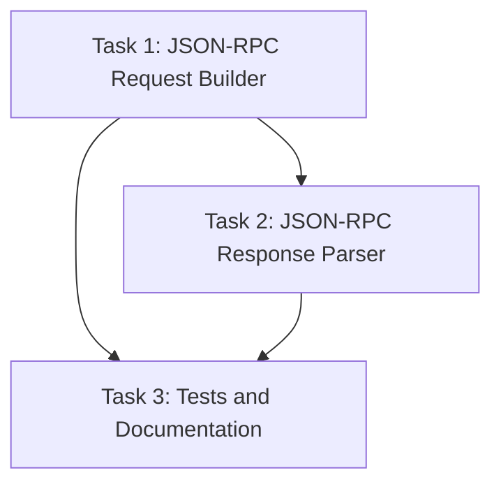

# Plan: Migrate to Standard Drupal JSON-RPC Endpoint

## Original Work Order

> Instead of using the `/mcp/tools/invoke` endpoint use the `/jsonrpc` endpoint. According to the
> project page https://www.drupal.org/project/jsonrpc this endpoint can use the standard POST, but
> also a GET. Since this MCP server may work with any drupal site, we should consider using GET.
> Think harder, uberthink, and use tools.

## Executive Summary

This plan migrates the MCP server's **tool invocation** from using the custom `/mcp/tools/invoke`
endpoint to the standard Drupal `/jsonrpc` endpoint. The `jsonrpc_mcp` module remains essential for
tool discovery (`/mcp/tools/list`) and MCP-specific annotations, but tool execution will go directly
through the standard JSON-RPC interface.

The current `/mcp/tools/invoke` endpoint requires manual routing modifications (adding
`_auth: ['oauth2']`) to support OAuth2 authentication, creating a deployment barrier. The standard
`/jsonrpc` endpoint already has proper OAuth2 configuration (`_auth: []`) in its routing definition,
eliminating this manual step while maintaining all functionality.

The standard `/jsonrpc` endpoint supports both POST and GET requests. GET requests offer significant
advantages for CDN caching and are explicitly recommended by the Drupal JSON-RPC documentation. The
migration will implement GET as the primary method while maintaining POST as a fallback for
compatibility.

**Key architectural change**: Discovery continues via `/mcp/tools/list` (jsonrpc_mcp module), but
invocation bypasses the `/mcp/tools/invoke` wrapper and calls JSON-RPC methods directly through
`/jsonrpc`. This resolves the 403 authentication errors without requiring routing file
modifications.

## Context

### Current State

The MCP server architecture has two components:

**Tool Discovery** (unchanged):

- Uses `/mcp/tools/list` endpoint from `jsonrpc_mcp` module
- Fetches tool definitions with MCP-specific annotations at server startup
- Provides `#[McpTool]` metadata including scopes, descriptions, schemas

**Tool Invocation** (to be changed):

- Currently uses `/mcp/tools/invoke` endpoint (src/index.ts:410)
- This endpoint is a thin wrapper around JSON-RPC that translates MCP format to JSON-RPC
- Requires manual routing modifications to add `_auth: ['oauth2']` for OAuth support
- Uses custom request format: `{"name": "tool.name", "arguments": {}}`
- Only supports POST requests
- Creates deployment friction due to required routing configuration

### Target State

After migration:

**Tool Discovery** (unchanged):

- Continues using `/mcp/tools/list` from `jsonrpc_mcp` module
- Still requires `jsonrpc_mcp` module for MCP annotations and discovery metadata
- No changes to discovery mechanism

**Tool Invocation** (migrated):

- Uses standard `/jsonrpc` endpoint from Drupal's base JSON-RPC module
- Supports both GET and POST requests, with GET as the primary method
- Uses standard JSON-RPC 2.0 request format:
  `{"jsonrpc": "2.0", "method": "tool.name", "params": {}, "id": 1}`
- Calls JSON-RPC methods directly (e.g., `examples.contentTypes.list`) instead of through wrapper
- Works without routing file modifications due to existing `_auth: []` configuration
- Maintains backward compatibility through environment variable configuration

### Background

The current 403 authentication error stems from the custom endpoint lacking proper OAuth2
configuration in its routing definition. While we fixed this by manually adding `_auth: ['oauth2']`,
this requirement creates a deployment barrier. The standard `/jsonrpc` endpoint already has
`_auth: []` configured (jsonrpc.routing.yml:10), which enables all configured authentication methods
including OAuth2, eliminating manual configuration steps.

The JSON-RPC module documentation explicitly recommends GET requests for better CDN caching: "many
CDNs only allow caching on GET requests so this is the recommended approach in most situations." GET
requests pass JSON-RPC payloads via URL-encoded `?query=` parameters.

## Technical Implementation Approach

```mermaid
graph TD
    A[MCP Server] --> B{Request Method}
    B -->|Primary| C[GET Request]
    B -->|Fallback| D[POST Request]
    C --> E[URL-encode JSON-RPC payload]
    E --> F[/jsonrpc?query=...]
    D --> G[JSON body with RPC payload]
    G --> H[/jsonrpc]
    F --> I[Drupal JSON-RPC Handler]
    H --> I
    I --> J[OAuth2 Authentication]
    J --> K[Method Plugin Execution]
    K --> L[Response]
```

### Request Format Transformation

**Objective**: Convert from custom MCP format to standard JSON-RPC 2.0 format

The current implementation sends:

```json
{
  "name": "examples.contentTypes.list",
  "arguments": { "param": "value" }
}
```

The standard JSON-RPC 2.0 format requires:

```json
{
  "jsonrpc": "2.0",
  "method": "examples.contentTypes.list",
  "params": { "param": "value" },
  "id": 1
}
```

**Key transformations**:

- Add `"jsonrpc": "2.0"` version field (required by spec)
- Rename `name` → `method` (JSON-RPC terminology)
- Rename `arguments` → `params` (JSON-RPC terminology)
- Generate unique `id` field (enables request/response correlation)

### GET Request Implementation

**Objective**: Implement GET as primary request method for CDN compatibility

For GET requests, the JSON-RPC payload must be:

1. Serialized to JSON string
2. URL-encoded
3. Passed as `?query=<encoded-payload>` parameter

Example:

```
GET /jsonrpc?query=%7B%22jsonrpc%22%3A%222.0%22%2C%22method%22%3A%22examples.contentTypes.list%22%2C%22params%22%3A%7B%7D%2C%22id%22%3A1%7D
Authorization: Bearer <token>
```

**Implementation details**:

- Use `encodeURIComponent()` for payload encoding
- Maintain Authorization header for OAuth tokens
- Set appropriate Accept header: `application/json`
- Generate unique request IDs (incremental counter or UUID)

### POST Request Fallback

**Objective**: Provide POST fallback for compatibility and large payloads

POST requests are simpler but less cache-friendly:

```
POST /jsonrpc
Content-Type: application/json
Authorization: Bearer <token>

{"jsonrpc": "2.0", "method": "examples.contentTypes.list", "params": {}, "id": 1}
```

**Use cases for POST fallback**:

- Large parameter payloads exceeding URL length limits
- Environments where GET caching is not beneficial
- User preference via configuration

### Configuration and Backward Compatibility

**Objective**: Enable smooth migration without breaking existing deployments

Add environment variables:

- `DRUPAL_JSONRPC_METHOD`: `"GET"` (default) | `"POST"` - Controls request method
- `DRUPAL_JSONRPC_ENDPOINT`: Defaults to `/jsonrpc` (was `/mcp/tools/invoke`)

Migration path:

1. Existing deployments continue using `/mcp/tools/invoke` via env override
2. New deployments automatically use `/jsonrpc` with GET
3. Gradual migration as sites update their Drupal configuration

### Response Handling

**Objective**: Parse and validate JSON-RPC 2.0 responses

Standard JSON-RPC 2.0 success response:

```json
{
  "jsonrpc": "2.0",
  "result": [...],
  "id": 1
}
```

Error response:

```json
{
  "jsonrpc": "2.0",
  "error": {
    "code": -32600,
    "message": "Invalid Request"
  },
  "id": 1
}
```

**Implementation requirements**:

- Validate `jsonrpc` field === "2.0"
- Check for presence of `error` field
- Match response `id` with request `id` for safety
- Extract `result` field for successful responses
- Map JSON-RPC error codes to MCP error types

### Code Structure Changes

**Objective**: Refactor request handling while maintaining existing architecture

Modify `src/index.ts`:

- Update `performRequest()` method (lines 395-443) to:
  - Generate JSON-RPC 2.0 request object
  - Choose GET vs POST based on config
  - Build appropriate URL or body
  - Add request ID tracking
- Update `makeRequest()` method (lines 338-385) to:
  - Parse JSON-RPC 2.0 responses
  - Validate response structure
  - Extract result from `result` field
  - Map JSON-RPC errors to MCP errors

Update environment variable documentation in:

- `.env.example`
- `AGENTS.md` (architecture documentation)
- `README.md` (if present)

## Risk Considerations and Mitigation Strategies

### Technical Risks

- **URL Length Limits**: GET requests with large parameter payloads may exceed browser/server URL
  length limits (typically 2048-8192 characters)
  - **Mitigation**: Implement automatic fallback to POST when encoded URL exceeds 2000 characters.
    Add logging when fallback occurs to track frequency.

- **Response Format Changes**: Drupal's `/jsonrpc` endpoint might return different error formats
  than `/mcp/tools/invoke`
  - **Mitigation**: Implement comprehensive response validation using Zod schemas. Add extensive
    error logging during migration period to identify format discrepancies.

- **Request ID Collision**: Using incremental IDs could cause collisions in concurrent requests
  - **Mitigation**: Use UUID v4 for request IDs to ensure uniqueness across concurrent requests and
    multiple server instances.

### Implementation Risks

- **Breaking Existing Deployments**: Sites currently using `/mcp/tools/invoke` will break if
  endpoint is changed without coordination
  - **Mitigation**: Default `DRUPAL_JSONRPC_ENDPOINT` remains `/jsonrpc` but can be overridden. Add
    migration guide and deprecation warnings. Implement gradual rollout strategy.

- **OAuth2 Configuration Differences**: The `/jsonrpc` endpoint might handle OAuth2 differently than
  the custom endpoint
  - **Mitigation**: Test with both token-in-header and token-in-query approaches. Verify against
    current Drupal Simple OAuth implementation. Document any discovered differences.

- **Incomplete Test Coverage**: Existing tests mock the old endpoint format
  - **Mitigation**: Update all test mocks to use JSON-RPC 2.0 format. Add integration tests for both
    GET and POST methods. Test against real Drupal instance.

### Integration Risks

- **Drupal JSON-RPC Module Versions**: Different module versions might have different capabilities
  - **Mitigation**: Document minimum required JSON-RPC module version (3.0.0 for Drupal 11). Add
    version detection if possible. Provide clear error messages for unsupported versions.

- **CDN Caching Behavior**: GET requests with Authorization headers might not cache as expected
  - **Mitigation**: Document CDN configuration requirements. Add optional support for
    token-in-query-param for environments that need header-free caching. Provide caching best
    practices guide.

## Success Criteria

### Primary Success Criteria

1. **Standard Endpoint Compatibility**: MCP server successfully invokes tools via `/jsonrpc`
   endpoint on a fresh Drupal installation with only the base JSON-RPC module installed (no custom
   modules required)

2. **GET Request Functionality**: Tool invocations work correctly using GET requests with
   URL-encoded JSON-RPC payloads, verified through MCP Inspector

3. **OAuth2 Authentication**: Bearer tokens in Authorization headers are properly validated by
   Drupal's OAuth2 system without 403 errors

4. **Backward Compatibility**: Existing deployments using `/mcp/tools/invoke` continue functioning
   via `DRUPAL_JSONRPC_ENDPOINT` environment variable override

### Quality Assurance Metrics

1. **Test Coverage**: All modified functions have updated unit tests with >80% coverage, including
   tests for both GET and POST methods

2. **Error Handling**: JSON-RPC error responses are correctly mapped to MCP error codes, with clear
   error messages for common failure scenarios

3. **Request/Response Validation**: Zod schemas validate all JSON-RPC 2.0 request and response
   structures, with helpful validation error messages

4. **Documentation Completeness**: Environment variables, migration steps, and troubleshooting
   guides are documented in AGENTS.md and .env.example

## Resource Requirements

### Development Skills

- **TypeScript/Node.js**: Modify existing request handling code, implement URL encoding logic
- **HTTP Protocol Knowledge**: Understanding of GET vs POST semantics, URL encoding, header handling
- **JSON-RPC 2.0 Specification**: Familiarity with the JSON-RPC 2.0 protocol format and error codes
- **OAuth 2.0**: Understanding of Bearer token authentication and header-based auth flows
- **Jest Testing**: Update existing test mocks and create new integration tests

### Technical Infrastructure

- **Drupal Test Instance**: Running Drupal 11 with JSON-RPC module 3.0.0+ for integration testing
- **MCP Inspector**: For manual verification of GET/POST request functionality
- **Network Debugging Tools**: curl, Postman, or similar for debugging HTTP requests during
  development
- **Node.js 18+**: For development and testing (existing requirement)

## Implementation Order

1. **Request Format Transformation**: Implement JSON-RPC 2.0 request object generation in
   `performRequest()`
2. **GET Request Support**: Add URL encoding and query parameter construction for GET method
3. **Response Parsing**: Update `makeRequest()` to parse JSON-RPC 2.0 responses and extract `result`
   field
4. **Error Mapping**: Implement JSON-RPC error code mapping to MCP error types
5. **Configuration**: Add environment variables and update defaults
6. **Testing**: Update existing tests and add new tests for GET/POST methods
7. **Documentation**: Update AGENTS.md, .env.example, and add migration guide

## Notes

### Authentication Header in GET Requests

Drupal's `/jsonrpc` endpoint routing shows `_auth: []` which enables all configured authentication
providers, including OAuth2. This means Bearer tokens in Authorization headers should work with GET
requests. However, some CDN configurations strip auth headers from cached responses. For maximum
cache compatibility, we may need to support token-as-query-parameter in future iterations, but this
is out of scope for initial implementation.

### JSON-RPC Error Code Reference

Standard error codes to handle:

- `-32700`: Parse error (invalid JSON)
- `-32600`: Invalid Request (malformed JSON-RPC)
- `-32601`: Method not found (tool doesn't exist)
- `-32602`: Invalid params (parameter validation failed)
- `-32603`: Internal error (Drupal-side execution error)

### Module Requirements

**Still Required**:

- `jsonrpc_mcp` module: Essential for MCP tool discovery, annotations, and metadata
- JSON-RPC base module: Required dependency of `jsonrpc_mcp`

**Why This Change Helps**:

- The `/jsonrpc` endpoint has proper OAuth2 routing configuration out-of-the-box
- No need to manually modify `jsonrpc_mcp.routing.yml` to add `_auth: ['oauth2']`
- Simplifies deployment: install modules → works immediately
- The `/mcp/tools/invoke` wrapper becomes optional infrastructure that adds no value for
  authentication

## Task Dependencies



## Execution Blueprint

**Validation Gates:**

- Reference: `.ai/task-manager/config/hooks/POST_PHASE.md`

### ✅ Phase 1: Request/Response Infrastructure

**Parallel Tasks:**

- ✔️ Task 1: Implement JSON-RPC Request Builder
- Task 2: Implement JSON-RPC Response Parser

### Phase 2: Quality Assurance

**Parallel Tasks:**

- Task 3: Update Tests and Documentation (depends on: 1, 2)

### Post-phase Actions

After each phase completes, validation gates from `POST_PHASE.md` will verify:

- Type checking passes
- Tests pass with >80% coverage
- Build succeeds

### Execution Summary

- Total Phases: 2
- Total Tasks: 3
- Maximum Parallelism: 2 tasks (in Phase 1)
- Critical Path Length: 2 phases
