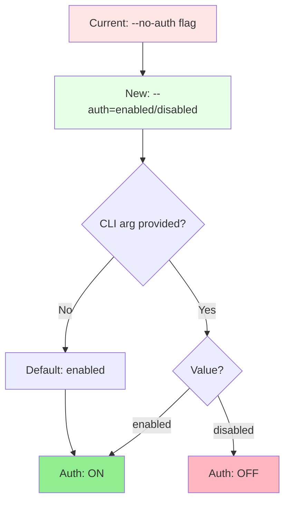
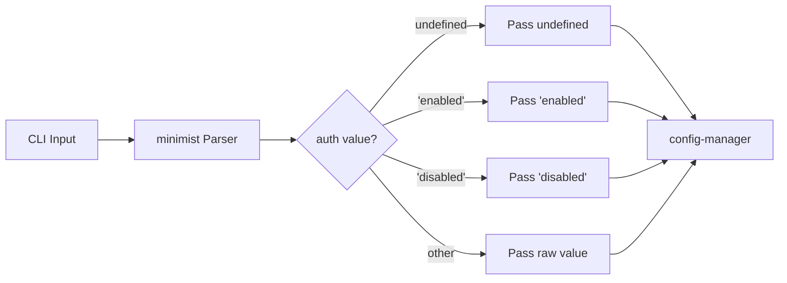
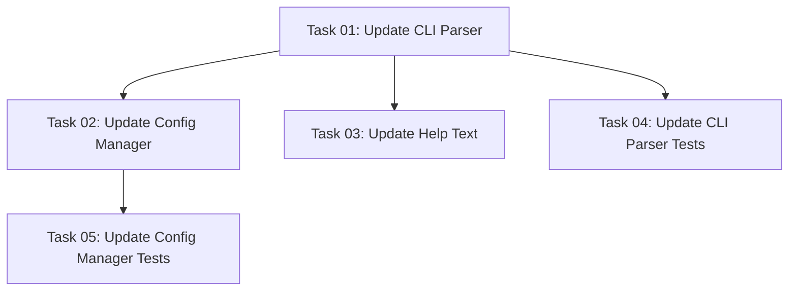

# Plan: Refactor CLI Authentication Flag

## Original Work Order

> I have changed my mind. Instead of the no auth flag in the CLI options, I would like to have an
> auth flag that takes either enabled or disabled. And make enabled the default value.

## Executive Summary

This plan refactors the CLI authentication flag interface from a boolean negation pattern
(`--no-auth`) to an explicit value-based pattern (`--auth=enabled|disabled`). The current
implementation uses minimist's boolean negation feature where `--no-auth` disables authentication,
while the absence of the flag enables it by default. The new interface will accept explicit values
(`--auth=enabled` or `--auth=disabled`), making the authentication state more explicit and easier to
reason about. The default behavior remains unchanged: authentication is enabled unless explicitly
disabled.

This approach improves CLI usability by making authentication configuration explicit rather than
implicit, reduces cognitive load for users who may be confused by double-negative patterns, and
maintains backward compatibility through environment variable handling.

## Context

### Current State

The MCP server uses a CLI flag `--no-auth` to disable OAuth authentication:

- `--no-auth` → sets `AUTH_ENABLED=false`
- No flag → defaults to `AUTH_ENABLED=true`
- Implementation uses minimist's boolean negation feature
- Current files: `cli-parser.ts`, `config-manager.ts`, `cli-help.ts`
- Test coverage: `cli-parser.test.ts`, `config-manager.test.ts`

This pattern requires users to think in double negatives ("no-auth" to disable) which can be
confusing.

### Target State

After implementation:

- `--auth=enabled` → explicitly enables authentication (default)
- `--auth=disabled` → explicitly disables authentication
- No flag → defaults to `enabled`
- Validation ensures only `enabled` or `disabled` values are accepted
- Help text clearly shows the value-based interface
- All tests updated to reflect new behavior

### Background

The current `--no-auth` flag was implemented as part of plan 23 (CLI argument support). The boolean
negation pattern was chosen for simplicity during initial implementation. However, explicit
value-based flags are more discoverable and self-documenting, which improves the user experience for
a CLI tool that may be used infrequently.

## Technical Implementation Approach

### Component 1: CLI Parser Update

**Objective**: Modify argument parsing to accept `--auth` with string values instead of boolean
negation

Update `src/utils/cli-parser.ts`:

- Change `auth` from boolean to string type in minimist configuration
- Remove `--no-auth` boolean handling
- Accept `--auth` as string argument
- Parse values: `enabled` or `disabled`
- Default to `undefined` (will be resolved to `enabled` in config-manager)

### Component 2: Configuration Manager Update

**Objective**: Validate auth values and apply correct environment variable mappings

Update `src/utils/config-manager.ts`:

- Add validation for `enabled` or `disabled` values
- Throw helpful error for invalid values
- Map `enabled` → `AUTH_ENABLED=true`
- Map `disabled` → `AUTH_ENABLED=false`
- Default `undefined` → `AUTH_ENABLED=true`

### Component 3: Help Text Update

**Objective**: Document the new flag syntax and available values

Update `src/utils/cli-help.ts`:

- Replace `--no-auth` documentation with `--auth <enabled|disabled>`
- Add example: `--auth=disabled`
- Update description to indicate default value
- Show both `--auth=enabled` and `--auth=disabled` examples

### Component 4: Test Suite Updates

**Objective**: Ensure comprehensive test coverage for new flag behavior

Update test files:

- `cli-parser.test.ts`: Test `--auth=enabled`, `--auth=disabled`, invalid values, default behavior
- `config-manager.test.ts`: Test validation, environment variable mapping, error messages

## Risk Considerations and Mitigation Strategies

### Implementation Risks

- **Breaking change for users using --no-auth**: While this changes the CLI interface, it's a minor
  breaking change
  - **Mitigation**: Document in changelog; most users rely on environment variables which remain
    unchanged

- **Invalid value handling**: Users may provide unexpected values like `--auth=yes` or `--auth=1`
  - **Mitigation**: Strict validation with clear error messages directing users to valid values

### Quality Risks

- **Test coverage gaps**: Existing tests heavily focused on `--no-auth` pattern
  - **Mitigation**: Comprehensive test updates covering all new value combinations and edge cases

## Success Criteria

### Primary Success Criteria

1. `--auth=enabled` explicitly enables authentication
2. `--auth=disabled` explicitly disables authentication
3. No flag defaults to enabled state
4. Invalid values produce clear error messages
5. All existing environment variable handling remains functional

### Quality Assurance Metrics

1. All existing tests pass with updated assertions
2. New test cases cover enabled/disabled/invalid/default scenarios
3. Type checking passes without errors
4. Help text accurately reflects new interface

## Resource Requirements

### Development Skills

- TypeScript type system knowledge
- minimist argument parsing library
- Jest testing framework
- CLI interface design principles

### Technical Infrastructure

- Node.js runtime
- TypeScript compiler
- Jest test runner
- minimist package (already installed)

## Task Dependencies

## Execution Blueprint

**Validation Gates:**

- Reference: `/config/hooks/POST_PHASE.md`

### Phase 1: Core Implementation

**Parallel Tasks:**

- Task 01: Update CLI Parser for Auth String Values

**Description:** Update the CLI parser to accept `--auth` as a string argument with `enabled` or
`disabled` values, replacing the boolean `--no-auth` flag.

### Phase 2: Downstream Updates

**Parallel Tasks:**

- Task 02: Update Config Manager Validation (depends on: 01)
- Task 03: Update Help Text (depends on: 01)
- Task 04: Update CLI Parser Tests (depends on: 01)

**Description:** Update all dependent components that consume the CLI parser output, including
validation logic, documentation, and tests.

### Phase 3: Validation Testing

**Parallel Tasks:**

- Task 05: Update Config Manager Tests (depends on: 02)

**Description:** Complete test coverage for the config manager validation logic.

### Post-phase Actions

After each phase completes, validation gates from `/config/hooks/POST_PHASE.md` will be executed to
ensure code quality and test coverage requirements are met before proceeding to the next phase.

### Execution Summary

- Total Phases: 3
- Total Tasks: 5
- Maximum Parallelism: 3 tasks (in Phase 2)
- Critical Path Length: 3 phases
