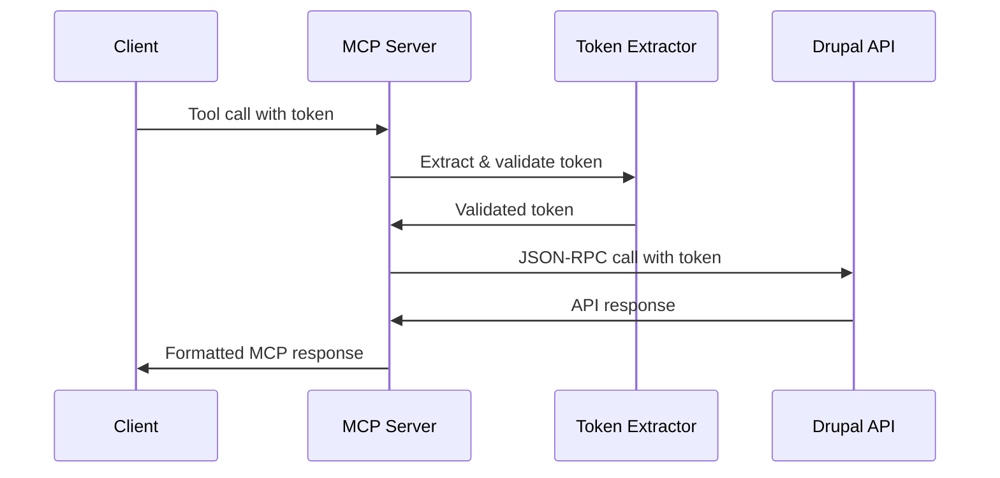

# Simplified MCP Server Implementation

This document describes the simplified MCP (Model Context Protocol) server architecture that
replaces complex session management with clean token pass-through approach.

## Architecture Overview

The simplified architecture implements direct token pass-through to Drupal without complex session
management, providing:

- **Stateless Operations**: Each MCP request is independently authenticated
- **Direct Token Pass-through**: OAuth tokens are passed directly to Drupal API calls
- **Clean Error Handling**: Simple authentication failures with clear error messages
- **No Session State**: No caching, no background processing, just direct API calls

## Core Components

### 1. Token Extractor (`src/mcp/token-extractor.ts`)

Handles token extraction and validation from MCP requests:

```typescript
// Extract token from Authorization header
const result = TokenExtractor.extractFromHeaders({
  authorization: 'Bearer your-token-here',
});

// Extract from request parameters as fallback
const result = TokenExtractor.extractFromParams({
  access_token: 'your-token-here',
});

// Extract from full request context
const result = TokenExtractor.extractFromRequest({
  headers: { authorization: 'Bearer token' },
  params: { access_token: 'fallback-token' },
});
```

**Key Features:**

- Case-insensitive header parsing
- Bearer prefix handling (optional/required)
- Format validation (length, characters)
- Safe token logging with masking
- Batch validation support

### 2. Drupal JSON-RPC Client (`src/drupal/json-rpc-client.ts`)

Direct communication with Drupal's JSON-RPC API endpoints:

```typescript
const client = createJsonRpcClient({
  baseUrl: 'https://drupalize.me/jsonrpc',
});

// Search content with user token
const results = await client.searchContent(
  {
    query: 'drupal development',
    content_type: 'tutorial',
    drupal_version: '10',
  },
  userToken
);

// Get specific tutorial
const tutorial = await client.getTutorial(
  {
    id: 'tutorial-123',
    include_content: true,
    format: 'markdown',
  },
  userToken
);
```

**Key Features:**

- Automatic retry logic with exponential backoff
- Comprehensive error handling and transformation
- Request/response logging with token masking
- Built-in timeout and network error handling
- Structured error responses

### 3. Simplified MCP Server (`src/mcp/server.ts`)

Main MCP server with direct token pass-through:

```typescript
const mcpServer = new SimplifiedMCPServer({
  baseUrl: 'https://drupalize.me/jsonrpc',
});

const server = mcpServer.getServer();
```

**Available Tools:**

- `search_content`: Search Drupalize.me tutorials and content
- `get_tutorial`: Retrieve specific tutorial with full content
- `discover_methods`: List available Drupal JSON-RPC methods
- `health_check`: Check Drupal API connectivity

### 4. Error Handler (`src/mcp/error-handler.ts`)

Centralized error handling with clean authentication failures:

```typescript
// Handle any error and convert to MCP format
const mcpError = MCPErrorHandler.handle(error, { tool: 'search_content' });

// Handle authentication-specific errors
const authError = MCPErrorHandler.handleAuthError(error, tokenValidationError);

// Check if error should be retried
const shouldRetry = MCPErrorHandler.isRetryable(error);
```

## Request Flow

1. **MCP Request Received**: Tool call comes in with potential token in headers/params
2. **Token Extraction**: Token is extracted and validated for format
3. **Direct API Call**: Token is passed directly to Drupal JSON-RPC endpoint
4. **Response Processing**: Drupal response is formatted for MCP client
5. **Error Handling**: Any errors are transformed to user-friendly MCP errors



## Authentication Flow

The simplified server uses direct token pass-through:

1. **Token Required**: Every tool call must include a valid OAuth token
2. **Format Validation**: Token format is validated (length, characters)
3. **Direct Pass-through**: Token is passed directly to Drupal for authentication
4. **Drupal Validation**: Drupal validates token and checks permissions
5. **Error Propagation**: Authentication errors are returned as user-friendly messages

## Example Usage

### Search Content

```json
{
  "method": "tools/call",
  "params": {
    "name": "search_content",
    "arguments": {
      "query": "drupal 10 development",
      "content_type": "tutorial",
      "drupal_version": "10",
      "limit": 10,
      "sort": "relevance"
    }
  },
  "meta": {
    "headers": {
      "authorization": "Bearer your-oauth-token"
    }
  }
}
```

### Get Tutorial

```json
{
  "method": "tools/call",
  "params": {
    "name": "get_tutorial",
    "arguments": {
      "id": "tutorial-123",
      "include_content": true,
      "format": "markdown"
    }
  },
  "meta": {
    "headers": {
      "authorization": "Bearer your-oauth-token"
    }
  }
}
```

## Error Handling

### Authentication Errors

```json
{
  "error": {
    "code": -32602,
    "message": "Missing authentication token. Please provide an OAuth access token in the Authorization header."
  }
}
```

### Permission Errors

```json
{
  "error": {
    "code": -32602,
    "message": "You do not have permission to access this content."
  }
}
```

### Network Errors

```json
{
  "error": {
    "code": -32603,
    "message": "The Drupalize.me service is temporarily unavailable. Please try again later."
  }
}
```

## Integration Testing

Run the provided integration tests:

```bash
# Run all MCP server tests
npm run test:integration

# Run specific token extractor tests
npm run test:unit -- --testPathPattern=token-extractor

# Run the demonstration script
npx tsx src/demo-simplified-server.ts
```

## Key Benefits

1. **Simplicity**: No complex session management or background processing
2. **Stateless**: Each request is independent and self-contained
3. **Security**: Tokens are validated and securely passed through
4. **Reliability**: Clean error handling and retry logic
5. **Maintainability**: Simple, focused codebase with clear responsibilities

## Comparison with Complex Architecture

| Feature               | Complex Architecture       | Simplified Architecture |
| --------------------- | -------------------------- | ----------------------- |
| Session Management    | Full session lifecycle     | Stateless requests      |
| Token Storage         | Encrypted database storage | Direct pass-through     |
| Background Processing | Token refresh, cleanup     | None                    |
| Error Recovery        | Complex retry mechanisms   | Simple retry logic      |
| Caching               | Multi-layer caching        | No caching              |
| Database Dependencies | PostgreSQL required        | None for MCP operations |

## Configuration

The simplified server requires minimal configuration:

```typescript
// Basic configuration
const server = new SimplifiedMCPServer({
  baseUrl: 'https://drupalize.me/jsonrpc',
});

// Advanced configuration
const server = new SimplifiedMCPServer({
  baseUrl: 'https://drupalize.me/jsonrpc',
  timeout: 30000,
  retryAttempts: 3,
  retryDelay: 1000,
});
```

## Security Considerations

- Tokens are validated for format but not content (Drupal handles authorization)
- Tokens are masked in logs to prevent exposure
- No token storage reduces attack surface
- Direct API calls minimize intermediate vulnerabilities
- Clear error messages don't expose sensitive information

## Future Enhancements

Possible enhancements while maintaining simplicity:

1. **Token Caching**: Brief in-memory token validation cache
2. **Rate Limiting**: Per-token request rate limiting
3. **Metrics**: Basic request/error metrics collection
4. **Health Monitoring**: Enhanced health check capabilities

The simplified architecture provides a clean, maintainable foundation for the MCP server while
demonstrating the core integration between MCP clients and Drupal's content API.
