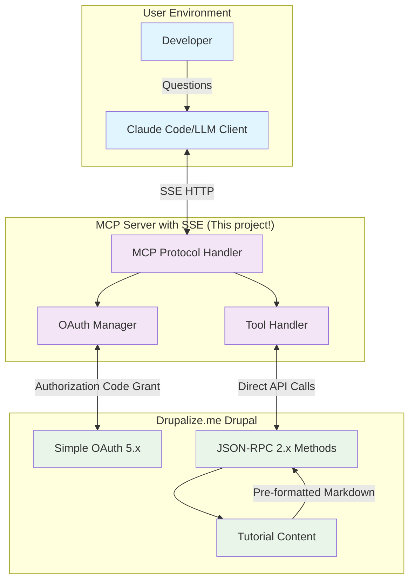
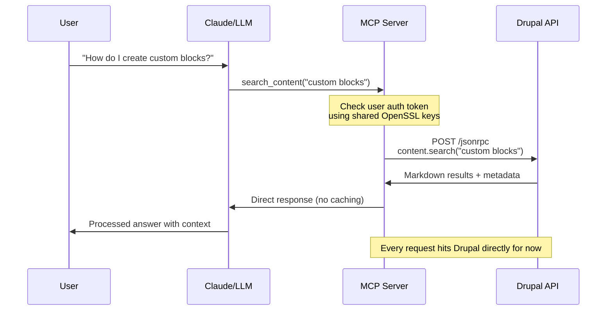

# MVP Feature Priorities

## 🎯 MVP Overview (Weeks 1-4)

### Core Requirements

#### 1. Authentication & Security

- **Per-User OAuth Authentication**: Complete OAuth 2.0 flow with Simple OAuth
- **Token Management**: Automatic OAuth token refresh
- **Basic Error Handling**: Simplified error messages (non-debug mode)

#### 2. Search Functionality

- **Basic Search Tool**: Single `search_content` MCP tool with parameters:
  - `query` (string, required)
  - `drupal_version` (enum: ["9", "10", "11"], optional)
  - `tags` (array of strings, optional)

#### 3. Transport & Integration

- **SSE Transport**: HTTP-based MCP server with `/mcp/sse` endpoint
- **Direct Pass-through**: No caching - direct API calls to understand performance baseline

### MVP Success Criteria

✅ User can authenticate and search tutorials  
✅ Search returns relevant results in clean Markdown  
✅ System handles token expiration gracefully  
✅ Basic error scenarios are handled

## 🎯 Implementation Strategy

### Recommended MVP Scope

Focus on these **4 core capabilities**:

1. **Authentication Flow**: OAuth setup and token management
2. **Basic Search**: Simple keyword search with basic filtering
3. **Content Retrieval**: Get individual tutorials as Markdown
4. **Error Handling**: Basic error scenarios with simple messages

### Tool Definition

```javascript
// MVP Tool Definitions (Static)
const mcpTools = [
  {
    name: 'search_tutorials',
    description: 'Search Drupalize.me tutorials',
    inputSchema: {
      type: 'object',
      properties: {
        query: { type: 'string' },
        drupal_version: { type: 'string', enum: ['9', '10', '11'] },
        tags: { type: 'array', items: { type: 'string' } },
      },
      required: ['query'],
    },
  },
];
```

### Integration-First Approach

**Why this approach works**:

- **Validate integration** across all components
- **Simplify debugging** during initial development
- **Reduce moving parts** while learning the system

## 🏗️ Simplified MVP Architecture



## 🏗️ Technical Architecture

### Core Components

#### MCP Server Implementation

```typescript
// Simplified MCP server - single tool, no caching layer
class SimpleMCPServer {
  async handleSearchRequest(query: string, filters: any) {
    // Direct pass-through to Drupal
    const token = await this.auth.getValidToken(this.currentUser);

    const response = await this.drupalClient.call(
      'content.search',
      {
        query,
        drupal_version: filters.drupal_version,
        tags: filters.tags,
      },
      {
        headers: { Authorization: `Bearer ${token}` },
      }
    );

    // Returns complete tutorial content as RAG-optimized Markdown
    return response;
  }
}
```

#### API Request Flow



## 💡 MVP Benefits & Validation

### Immediate Insights

- **Auth Flow Validation**: Ensure OAuth works perfectly
- **Content Quality**: Validate Markdown conversion effectiveness
- **Error Patterns**: Understand where failures occur

### Simplified Development Approach

```typescript
// Just pure integration testing:
const result = await jsonrpcClient.call('content.search', params);
return result; // That's it!
```

## 📋 Implementation Checklist

### Core Infrastructure

- [ ] Node.js project setup, with JS
- [ ] MCP server with SSE transport
- [ ] OAuth Authorization Code Grant flow
- [ ] Debug mode configuration
- [ ] Basic error handling system

### API Integration

- [ ] Drupal JSON-RPC method (`content.search`)
  - [ ] Research popular 3rd party projects for JSON-RPC clients.
- [ ] MCP tool definitions and handlers

### Validation Criteria

✅ User can authenticate via OAuth  
✅ Search queries return relevant Markdown content  
✅ Individual tutorials can be retrieved  
✅ Error scenarios are handled gracefully
