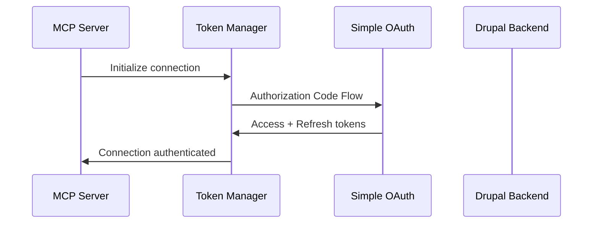

# ADR-003: OAuth 2.0 Authentication Strategy

## Status

**Accepted** - 2024-01-15

## Context

The MCP server needs to authenticate with the Drupalize.me Drupal installation to access protected
content and JSON-RPC methods. The Drupal site uses the Simple OAuth module
(https://www.drupal.org/project/simple_oauth) which implements OAuth 2.0 Authorization Framework.

Key authentication challenges for MCP servers:

- Long-running connections (stdio/SSE) vs stateless HTTP OAuth flows
- Token lifecycle management across persistent connections
- Scope granularity for different operations (discovery, search, content access)
- Rate limiting coordination
- Multi-context authentication for different user permissions

## Decision

Implement a **Hybrid Authentication Strategy** using OAuth 2.0 with connection-level token
management and automatic refresh capabilities.

## Rationale

### Simple OAuth Module Capabilities

- Full OAuth 2.0 Authorization Framework implementation
- Security-hardened (removed less secure grant types in v6.0.x)
- Designed for decoupled/headless Drupal architectures
- Token-based authentication with refresh token support
- SSL enforcement for secure token exchange

### Authentication Architecture

#### 1. Initial OAuth Flow



#### 2. Token Lifecycle Management

- **Access Token**: Short-lived (1-24 hours) for API requests
- **Refresh Token**: Long-lived for background token renewal
- **Connection Pooling**: Reuse authenticated connections
- **Preemptive Refresh**: Refresh tokens before expiration

#### 3. Required OAuth Scopes

```yaml
oauth_scopes:
  core_access:
    - jsonrpc:discovery # Method discovery via /jsonrpc/methods
    - jsonrpc:execute # Method execution via /jsonrpc

  content_access:
    - content:read # Tutorial content via JSON:API
    - search:content # Solr search index access
    - content:meta # Content metadata and relationships

  optional_scopes:
    - user:profile # User-specific content access
    - admin:cache # Cache management operations
```

## Consequences

### Positive Consequences

- **Standards Compliant**: Uses OAuth 2.0 best practices
- **Security Hardened**: Leverages Simple OAuth's security improvements
- **Scalable**: Connection pooling supports multiple concurrent requests
- **Resilient**: Automatic token refresh prevents connection drops
- **Granular Access**: Scope-based permission model

### Negative Consequences

- **Complexity**: Token management adds architectural complexity
- **Dependencies**: Requires Simple OAuth module configuration in Drupal
- **Rate Limiting**: OAuth constraints may limit request frequency
- **Error Handling**: Multiple failure modes (token, network, permissions)

### Risk Mitigation

#### Token Refresh Strategy

```javascript
class TokenManager {
  async ensureValidToken() {
    if (this.tokenExpiresWithin(5 * 60 * 1000)) {
      // 5 minutes
      await this.refreshToken();
    }
    return this.currentToken;
  }

  async refreshToken() {
    try {
      const response = await this.oauth.refresh(this.refreshToken);
      this.updateTokens(response);
      this.logTokenRefresh();
    } catch (error) {
      this.handleRefreshFailure(error);
    }
  }
}
```

#### Connection Recovery

```javascript
class ConnectionManager {
  async makeRequest(endpoint, params) {
    try {
      return await this.authenticatedRequest(endpoint, params);
    } catch (error) {
      if (error.status === 401) {
        await this.tokenManager.refreshToken();
        return await this.authenticatedRequest(endpoint, params);
      }
      throw error;
    }
  }
}
```

## Implementation Details

### Configuration Requirements

```yaml
# MCP Server Configuration
oauth_config:
  client_id: '${DRUPAL_OAUTH_CLIENT_ID}'
  client_secret: '${DRUPAL_OAUTH_CLIENT_SECRET}'
  server_url: '${DRUPAL_BASE_URL}'

  scopes:
    - 'jsonrpc:discovery'
    - 'jsonrpc:execute'
    - 'content:read'
    - 'search:content'

  token_management:
    refresh_threshold: 300 # seconds before expiry
    max_retries: 3
    backoff_strategy: 'exponential'
```

### Drupal OAuth Client Setup

```php
// Drupal OAuth client configuration
$oauth_client = [
  'label' => 'MCP Server for RAG',
  'client_id' => 'mcp-rag-server',
  'client_secret' => 'secure-generated-secret',
  'redirect_uri' => 'urn:ietf:wg:oauth:2.0:oob', // For server-to-server
  'scopes' => [
    'jsonrpc:discovery',
    'jsonrpc:execute',
    'content:read',
    'search:content'
  ],
  'grant_types' => ['authorization_code', 'refresh_token']
];
```

## Security Considerations

### Token Storage

- **Encrypted Storage**: Refresh tokens encrypted at rest
- **Memory Protection**: Access tokens not persisted to disk
- **Rotation Policy**: Regular refresh token rotation
- **Audit Logging**: Track all authentication events

### Network Security

- **TLS Required**: All OAuth flows over HTTPS
- **Certificate Validation**: Strict SSL certificate checking
- **Request Signing**: Consider request signing for high-security environments

### Access Control

- **Scope Minimization**: Request minimum required scopes
- **Permission Boundaries**: Server respects Drupal's permission system
- **User Context**: Different tokens for different user permission levels

## Alternatives Considered

### Alternative 1: API Key Authentication

**Pros**: Simpler implementation, no token refresh complexity **Cons**: Less secure, no standard
protocol, harder to manage permissions **Rejected**: Not compatible with Simple OAuth module

### Alternative 2: Session-Based Authentication

**Pros**: Familiar web pattern **Cons**: Not suitable for long-running server connections, CSRF
complexity **Rejected**: Poor fit for MCP server architecture

### Alternative 3: JWT Bearer Tokens

**Pros**: Stateless, includes permissions **Cons**: Simple OAuth doesn't natively support JWT, added
complexity **Rejected**: Would require custom implementation

## Related ADRs

- [ADR-001: LLM-Free Server Architecture](./ADR-001-llm-free-server-architecture.md)
- [ADR-002: JSON-RPC Markdown Transformation](./ADR-002-json-rpc-markdown-transformation.md)
