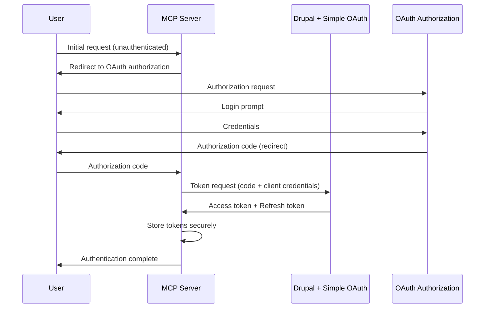
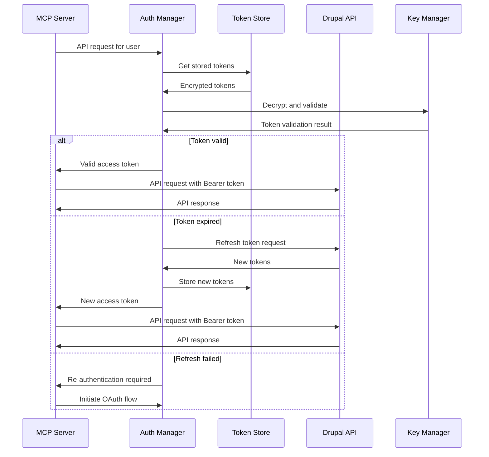

# Authentication Flow Capability

## Overview

The Authentication Flow capability implements a secure OAuth 2.0 authentication system for per-user
access to Drupalize.me tutorials through the MCP (Model Context Protocol) server. This capability
provides complete OAuth 2.0 Authorization Code Grant flow with automatic token refresh, integrated
with Drupal's Simple OAuth 5.x module for secure, standards-compliant authentication.

## Core Functionality

### Primary Features

- **Per-User OAuth Authentication**: Complete OAuth 2.0 Authorization Code Grant flow
- **Automatic Token Management**: Seamless OAuth token refresh with refresh token rotation
- **Simple OAuth 5.x Integration**: Native Drupal Simple OAuth module compatibility
- **Shared OpenSSL Keys**: Centralized token validation using RSA key pairs
- **Token Lifecycle Management**: Comprehensive token storage, validation, and expiration handling
- **Security-First Design**: Bearer token authentication with SSL enforcement

### Authentication Components

The authentication system consists of several key components:

- **OAuth Manager**: Handles complete OAuth 2.0 flow implementation
- **Token Store**: Secure storage for access and refresh tokens
- **Key Management**: OpenSSL RSA key pair management for token validation
- **Auth Middleware**: Request authentication and token validation
- **Error Handler**: Authentication-specific error handling and recovery

## OAuth 2.0 Authorization Code Grant Flow

### Flow Overview

The Authentication Flow implements the OAuth 2.0 Authorization Code Grant as specified in RFC 6749,
providing the most secure OAuth flow for server-to-server communication:



### Authorization Request

The OAuth flow begins with an authorization request to Drupal's Simple OAuth endpoint:

```typescript
// Authorization URL construction
const authUrl = new URL('/oauth/authorize', drupalBaseUrl);
authUrl.searchParams.set('response_type', 'code');
authUrl.searchParams.set('client_id', clientId);
authUrl.searchParams.set('redirect_uri', redirectUri);
authUrl.searchParams.set('scope', requestedScopes.join(' '));
authUrl.searchParams.set('state', generateSecureState());

// Redirect user to authorization endpoint
return authUrl.toString();
```

### Token Exchange

After receiving the authorization code, the MCP server exchanges it for access and refresh tokens:

```typescript
// Token exchange request
const tokenResponse = await fetch(`${drupalBaseUrl}/oauth/token`, {
  method: 'POST',
  headers: {
    'Content-Type': 'application/x-www-form-urlencoded',
    Accept: 'application/json',
  },
  body: new URLSearchParams({
    grant_type: 'authorization_code',
    code: authorizationCode,
    client_id: clientId,
    client_secret: clientSecret,
    redirect_uri: redirectUri,
  }),
});

const tokens = await tokenResponse.json();
// tokens.access_token, tokens.refresh_token, tokens.expires_in
```

## Simple OAuth 5.x Module Integration

### Module Configuration

The Simple OAuth 5.x module provides the OAuth 2.0 server implementation for Drupal. Key
configuration requirements:

#### OAuth Client Registration

```typescript
// OAuth client configuration in Drupal
const oauthClient = {
  label: 'MCP Tutorial Server',
  client_id: 'mcp-tutorial-client',
  client_secret: 'secure-client-secret',
  redirect_uri: 'http://localhost:3000/oauth/callback',
  grant_types: ['authorization_code', 'refresh_token'],
  scopes: ['tutorial:read', 'user:profile'],
};
```

#### Scope Definition

Define specific scopes for tutorial access:

- `tutorial:read`: Read access to tutorial content
- `user:profile`: Access to user profile information
- `tutorial:search`: Permission to search tutorial database

### Simple OAuth 5.x Features

#### Key Capabilities

- **OAuth 2.0 RFC Compliance**: Full implementation of OAuth 2.0 Authorization Framework
- **Grant Type Support**: Authorization Code Grant and Refresh Token Grant
- **OpenID Connect**: Extended authentication with user identity
- **Token Security**: JWT-based tokens with RSA signature validation
- **Refresh Token Rotation**: Enhanced security with token rotation
- **SSL Enforcement**: Mandatory HTTPS for production deployments

#### Version 5.x Improvements

- **Enhanced Security**: Removal of deprecated grant types (Implicit, Password Credentials)
- **Spec Compliance**: Better conformance to OAuth 2.0 best practices
- **JWT Claims**: Standardized JWT payload with proper claim naming
- **Error Handling**: RFC-compliant error responses

## Token Management System

### Token Storage Architecture

The MCP server implements a secure token storage system:

```typescript
class TokenManager {
  constructor(storage, keyManager) {
    this.storage = storage; // Secure storage backend
    this.keyManager = keyManager; // OpenSSL key management
  }

  async storeTokens(userId, tokens) {
    const encrypted = await this.encryptTokens(tokens);
    await this.storage.set(`tokens:${userId}`, {
      access_token: encrypted.access_token,
      refresh_token: encrypted.refresh_token,
      expires_at: Date.now() + tokens.expires_in * 1000,
      created_at: Date.now(),
    });
  }

  async getValidToken(userId) {
    const tokens = await this.storage.get(`tokens:${userId}`);

    if (!tokens) {
      throw new AuthenticationError('No tokens found for user');
    }

    if (this.isTokenExpired(tokens)) {
      return await this.refreshToken(userId, tokens.refresh_token);
    }

    return this.decryptToken(tokens.access_token);
  }
}
```

### Automatic Token Refresh

The system automatically handles token refresh before expiration:

```typescript
class AuthManager {
  async refreshToken(userId, refreshToken) {
    try {
      const response = await fetch(`${this.drupalBaseUrl}/oauth/token`, {
        method: 'POST',
        headers: {
          'Content-Type': 'application/x-www-form-urlencoded',
          Accept: 'application/json',
        },
        body: new URLSearchParams({
          grant_type: 'refresh_token',
          refresh_token: refreshToken,
          client_id: this.clientId,
          client_secret: this.clientSecret,
        }),
      });

      if (!response.ok) {
        throw new AuthenticationError('Token refresh failed');
      }

      const newTokens = await response.json();
      await this.tokenManager.storeTokens(userId, newTokens);

      return newTokens.access_token;
    } catch (error) {
      // Handle refresh failure - redirect to re-authentication
      await this.clearUserTokens(userId);
      throw new AuthenticationError('Re-authentication required');
    }
  }
}
```

### Token Lifecycle Management

```typescript
// Token validation before API requests
async validateAndRefreshToken(userId) {
  const tokens = await this.getStoredTokens(userId);

  // Check if token expires within 5 minutes
  const expiryBuffer = 5 * 60 * 1000; // 5 minutes
  const willExpireSoon = tokens.expires_at - Date.now() < expiryBuffer;

  if (willExpireSoon) {
    return await this.refreshToken(userId, tokens.refresh_token);
  }

  return tokens.access_token;
}
```

## Shared OpenSSL Keys for Token Validation

### Key Generation and Management

The authentication system uses RSA key pairs for token signature validation:

#### Key Generation

```bash
# Generate private key (2048-bit RSA)
openssl genrsa -out private.key 2048

# Extract public key
openssl rsa -in private.key -pubout -out public.key

# Store keys outside document root
# /etc/mcp-tutorial-server/keys/private.key
# /etc/mcp-tutorial-server/keys/public.key
```

#### Key Configuration

```typescript
class KeyManager {
  constructor(keysPath) {
    this.privateKeyPath = `${keysPath}/private.key`;
    this.publicKeyPath = `${keysPath}/public.key`;
    this.loadKeys();
  }

  loadKeys() {
    this.privateKey = fs.readFileSync(this.privateKeyPath, 'utf8');
    this.publicKey = fs.readFileSync(this.publicKeyPath, 'utf8');
  }

  validateTokenSignature(token) {
    try {
      const decoded = jwt.verify(token, this.publicKey, {
        algorithms: ['RS256'],
      });
      return decoded;
    } catch (error) {
      throw new AuthenticationError('Invalid token signature');
    }
  }
}
```

### Token Validation Flow

```typescript
// Middleware for token validation
class AuthMiddleware {
  async validateRequest(request) {
    const authHeader = request.headers.authorization;

    if (!authHeader || !authHeader.startsWith('Bearer ')) {
      throw new AuthenticationError('Missing or invalid authorization header');
    }

    const token = authHeader.substring(7); // Remove 'Bearer ' prefix

    try {
      // Validate token signature with public key
      const payload = this.keyManager.validateTokenSignature(token);

      // Additional validation
      if (payload.exp < Date.now() / 1000) {
        throw new AuthenticationError('Token expired');
      }

      return {
        userId: payload.sub,
        scopes: payload.scope?.split(' ') || [],
        clientId: payload.aud,
      };
    } catch (error) {
      throw new AuthenticationError('Token validation failed');
    }
  }
}
```

## Per-User Authentication Specifications

### User Session Management

The MCP server maintains separate authentication sessions for each user:

```typescript
class UserAuthManager {
  constructor() {
    this.userSessions = new Map(); // In-memory session store
    this.tokenManager = new TokenManager();
  }

  async authenticateUser(userId) {
    // Check existing session
    if (this.userSessions.has(userId)) {
      const session = this.userSessions.get(userId);
      if (this.isSessionValid(session)) {
        return session;
      }
    }

    // Create new authentication session
    const authSession = await this.initiateOAuthFlow(userId);
    this.userSessions.set(userId, authSession);

    return authSession;
  }

  async getAuthenticatedAPIClient(userId) {
    const token = await this.tokenManager.getValidToken(userId);

    return new AuthenticatedAPIClient({
      baseURL: this.drupalBaseUrl,
      token: token,
      userId: userId,
    });
  }
}
```

### Multi-User Token Isolation

```typescript
// Token storage with user isolation
class SecureTokenStorage {
  async storeUserTokens(userId, tokens) {
    const userKey = `auth:tokens:${userId}`;
    const encryptedTokens = await this.encrypt(tokens);

    await this.storage.setSecure(userKey, {
      ...encryptedTokens,
      created_at: new Date().toISOString(),
      last_used: new Date().toISOString(),
    });
  }

  async getUserTokens(userId) {
    const userKey = `auth:tokens:${userId}`;
    const stored = await this.storage.getSecure(userKey);

    if (!stored) {
      return null;
    }

    return await this.decrypt(stored);
  }
}
```

## Error Handling for Authentication Scenarios

### Authentication Error Types

The system handles various authentication error scenarios:

```typescript
class AuthenticationError extends Error {
  constructor(message, code, details = {}) {
    super(message);
    this.name = 'AuthenticationError';
    this.code = code;
    this.details = details;
  }
}

// Specific error types
class TokenExpiredError extends AuthenticationError {
  constructor() {
    super('Access token has expired', 'TOKEN_EXPIRED');
  }
}

class InvalidTokenError extends AuthenticationError {
  constructor(reason) {
    super('Invalid access token', 'INVALID_TOKEN', { reason });
  }
}

class RefreshTokenError extends AuthenticationError {
  constructor() {
    super('Refresh token is invalid or expired', 'REFRESH_FAILED');
  }
}
```

### Error Recovery Strategies

```typescript
class AuthErrorHandler {
  async handleAuthError(error, userId) {
    switch (error.code) {
      case 'TOKEN_EXPIRED':
        // Attempt automatic refresh
        try {
          return await this.authManager.refreshToken(userId);
        } catch (refreshError) {
          // Refresh failed - require re-authentication
          return await this.initiateReauth(userId);
        }

      case 'INVALID_TOKEN':
        // Token validation failed - clear and re-authenticate
        await this.authManager.clearUserTokens(userId);
        return await this.initiateReauth(userId);

      case 'REFRESH_FAILED':
        // Refresh token invalid - full re-authentication required
        await this.authManager.clearUserTokens(userId);
        return await this.initiateReauth(userId);

      default:
        throw error;
    }
  }

  async initiateReauth(userId) {
    const authUrl = await this.authManager.buildAuthorizationUrl(userId);
    throw new AuthenticationError('Re-authentication required', 'REAUTH_REQUIRED', { authUrl });
  }
}
```

### Graceful Degradation

```typescript
// Graceful error handling in API requests
class AuthenticatedAPIRequest {
  async makeRequest(endpoint, params, userId) {
    try {
      const token = await this.authManager.getValidToken(userId);

      const response = await this.httpClient.request({
        url: endpoint,
        data: params,
        headers: {
          Authorization: `Bearer ${token}`,
          'Content-Type': 'application/json',
        },
      });

      return response.data;
    } catch (error) {
      if (error.response?.status === 401) {
        // Handle authentication failure
        const recovered = await this.errorHandler.handleAuthError(error, userId);
        if (recovered) {
          // Retry request with new token
          return await this.makeRequest(endpoint, params, userId);
        }
      }

      throw error;
    }
  }
}
```

## API Request Authentication Flow

### Complete Request Flow



### Request Authentication Implementation

```typescript
class MCPAuthenticatedRequest {
  async executeWithAuth(userId, operation) {
    const maxRetries = 2;
    let attempt = 0;

    while (attempt < maxRetries) {
      try {
        const token = await this.authManager.getValidToken(userId);

        return await operation({
          headers: {
            Authorization: `Bearer ${token}`,
            'Content-Type': 'application/json',
            Accept: 'application/json',
          },
        });
      } catch (error) {
        if (error.response?.status === 401 && attempt < maxRetries - 1) {
          // Authentication failed - attempt token refresh
          try {
            await this.authManager.refreshToken(userId);
            attempt++;
            continue;
          } catch (refreshError) {
            throw new AuthenticationError('Authentication failed and refresh unsuccessful');
          }
        }
        throw error;
      }
    }
  }
}
```

## Integration with Basic Search

### Authenticated Search Flow

The Authentication Flow integrates seamlessly with the [Basic Search](./basic-search.md) capability:

```typescript
class AuthenticatedSearchHandler {
  async handleSearchRequest(query, filters, userId) {
    // Ensure user is authenticated
    const token = await this.authManager.getValidToken(userId);

    // Make authenticated search request
    const response = await this.drupalClient.call(
      'content.search',
      {
        query,
        drupal_version: filters.drupal_version,
        tags: filters.tags,
      },
      {
        headers: {
          Authorization: `Bearer ${token}`,
          'Content-Type': 'application/json',
        },
      }
    );

    return response;
  }
}
```

### Integration Points with Other Capabilities

- **MCP Tool Authentication**: Every tool request routed through the
  [MCP Server](./mcp-server-sse.md) requires token validation
- **Search Request Authorization**: The [Basic Search](./basic-search.md) capability depends on
  valid OAuth tokens for Drupal API access
- **Error Handling Coordination**: Authentication errors are managed through the
  [Error Handling](./error-handling.md) capability for consistent user experience

## Security Best Practices

### Token Security

- **Encryption at Rest**: All stored tokens are encrypted using AES-256
- **Secure Transport**: All OAuth communications use HTTPS/TLS
- **Token Rotation**: Refresh tokens are rotated on each use
- **Limited Scope**: Tokens are granted minimal required scopes
- **Expiration Management**: Short-lived access tokens with automatic refresh

### Key Management Security

- **Key Storage**: RSA keys stored outside document root
- **File Permissions**: Restrictive permissions (600) on key files
- **Key Rotation**: Regular key rotation schedule
- **Environment Separation**: Different keys for development/production

### General Security Measures

- **State Validation**: CSRF protection using state parameter
- **Client Authentication**: Secure client credential storage
- **SSL Enforcement**: Mandatory HTTPS for production
- **Error Information**: Limited error details to prevent information disclosure

## Success Criteria

### MVP Authentication Validation

- ✅ Complete OAuth 2.0 Authorization Code Grant flow implementation
- ✅ Simple OAuth 5.x module integration and configuration
- ✅ Automatic token refresh with graceful error handling
- ✅ Per-user authentication with session isolation
- ✅ Shared OpenSSL keys for token validation
- ✅ Bearer token authentication for API requests
- ✅ Authentication error scenarios handled appropriately

### Technical Validation

- ✅ OAuth client registration and configuration in Drupal
- ✅ RSA key pair generation and secure storage
- ✅ Token encryption and secure storage implementation
- ✅ Authentication middleware integration with MCP server
- ✅ Error recovery and re-authentication flows
- ✅ Integration testing with Basic Search capability

## Dependencies

### External Dependencies

- **Simple OAuth 5.x Module**: Drupal OAuth 2.0 server implementation
- **Node.js OAuth Libraries**: OAuth 2.0 client implementation
- **Cryptography Libraries**: RSA key management and JWT handling
- **Secure Storage**: Encrypted token storage backend

### Internal Dependencies

- **[MCP Server SSE](./mcp-server-sse.md)**: Transport layer for authentication requests and OAuth
  callback handling
- **[Basic Search](./basic-search.md)**: Provides authenticated API request context and token
  validation
- **[Error Handling](./error-handling.md)**: Authentication-specific error handling and recovery
  patterns

### Cross-Capability Integration

The Authentication Flow provides foundational security for all other capabilities:

- **MCP Server Integration**: Provides authentication middleware for all incoming MCP tool requests
- **Search Authentication**: Validates and refreshes tokens before Basic Search API calls to Drupal
- **Error Recovery Coordination**: Works with Error Handling to provide automatic token refresh and
  graceful authentication failure recovery
- **Session Management**: Maintains per-user authentication state across all capability interactions

## Implementation Notes

### Development Priorities

1. **Security First**: Implement all security measures from the beginning
2. **Token Management**: Focus on robust token lifecycle management
3. **Error Recovery**: Comprehensive error handling and recovery flows
4. **User Experience**: Seamless authentication flow for end users

### Production Considerations

- **SSL Certificate**: Valid SSL certificate for OAuth redirect URLs
- **Key Security**: Secure key generation and storage procedures
- **Monitoring**: Authentication metrics and error monitoring
- **Backup Strategy**: Secure backup of encryption keys

### Future Enhancements

- **Single Sign-On**: Integration with external identity providers
- **Multi-Factor Authentication**: Additional authentication factors
- **Session Management**: Advanced session monitoring and control
- **Audit Logging**: Comprehensive authentication audit trails
