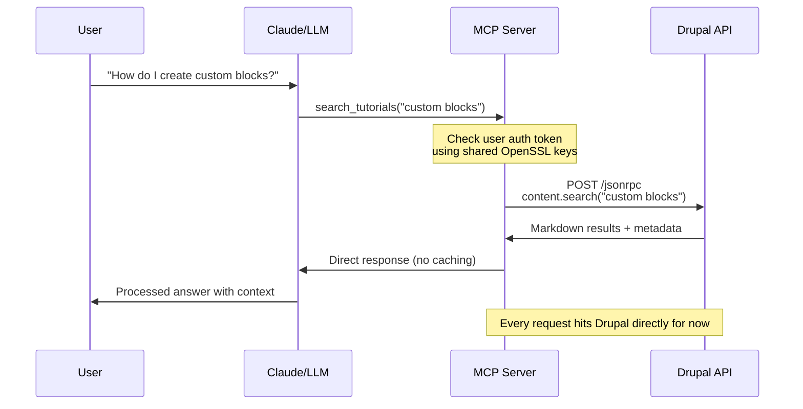

# Basic Search Capability

## Overview

The Basic Search capability provides a simple keyword search interface for Drupalize.me tutorials
through the MCP (Model Context Protocol) server. This capability implements a direct pass-through
approach to Drupal's JSON-RPC 2.x API without caching, focusing on establishing a reliable
integration baseline.

## Core Functionality

### Primary Features

- **Simple Keyword Search**: Basic text search across tutorial content
- **Version Filtering**: Filter results by Drupal version (9, 10, 11)
- **Tag-based Filtering**: Filter results by tutorial tags
- **Direct API Integration**: Real-time searches with no caching layer
- **Markdown Content Delivery**: Pre-formatted tutorial content optimized for RAG (Retrieval
  Augmented Generation)

### Search Parameters

The `search_tutorials` MCP tool accepts the following parameters:

- `query` (string, required): The search keywords or phrase
- `drupal_version` (enum: ["9", "10", "11"], optional): Filter by Drupal version
- `tags` (array of strings, optional): Filter by tutorial tags

## MCP Tool Definition

```javascript
// MCP Tool Definition for Basic Search
const searchTool = {
  name: 'search_tutorials',
  description: 'Search Drupalize.me tutorials',
  inputSchema: {
    type: 'object',
    properties: {
      query: {
        type: 'string',
        description: 'Search keywords or phrase',
      },
      drupal_version: {
        type: 'string',
        enum: ['9', '10', '11'],
        description: 'Filter by Drupal version',
      },
      tags: {
        type: 'array',
        items: { type: 'string' },
        description: 'Filter by tutorial tags',
      },
    },
    required: ['query'],
  },
};
```

## JSON-RPC 2.x Integration

### Drupal JSON-RPC Module Integration

The Basic Search capability integrates with Drupal's JSON-RPC 2.x module, which provides:

- **Standards Compliance**: Full JSON-RPC 2.0 specification support
- **Endpoint Structure**: Main RPC endpoint at `/jsonrpc`
- **Discovery Support**: Method discovery at `/jsonrpc/methods`
- **Request Methods**: Supports both POST and GET requests

### API Endpoint Configuration

**Primary Endpoint**: `/jsonrpc`

- **Protocol**: JSON-RPC 2.0
- **Methods**: POST (primary), GET (URL-encoded JSON)
- **Authentication**: Bearer token via OAuth 2.0

### JSON-RPC Request Format

```json
{
  "jsonrpc": "2.0",
  "method": "content.search",
  "params": {
    "query": "custom blocks",
    "drupal_version": "10",
    "tags": ["theming", "development"]
  },
  "id": "search-request-001"
}
```

### JSON-RPC Response Format

```json
{
  "jsonrpc": "2.0",
  "result": {
    "tutorials": [
      {
        "id": "12345",
        "title": "Creating Custom Blocks in Drupal 10",
        "content": "# Creating Custom Blocks...\n\nMarkdown content here...",
        "tags": ["theming", "development"],
        "drupal_version": "10",
        "url": "https://drupalize.me/tutorial/custom-blocks-drupal-10"
      }
    ],
    "total": 1,
    "page": 1
  },
  "id": "search-request-001"
}
```

## Implementation Architecture

### Direct Pass-through Approach

The Basic Search capability implements a simplified direct pass-through approach:

```typescript
// Simplified MCP Server Implementation
class SimpleMCPServer {
  async handleSearchRequest(query: string, filters: any) {
    // Direct pass-through to Drupal - no caching layer
    const token = await this.auth.getValidToken(this.currentUser);

    const response = await this.drupalClient.call(
      'content.search',
      {
        query,
        drupal_version: filters.drupal_version,
        tags: filters.tags,
      },
      {
        headers: { Authorization: `Bearer ${token}` },
      }
    );

    // Returns complete tutorial content as RAG-optimized Markdown
    return response;
  }
}
```

### Key Benefits of Direct Approach

- **Simplified Debugging**: Fewer moving parts during initial development
- **Real-time Data**: Always returns the latest tutorial content
- **Integration Validation**: Validates the complete authentication and API flow
- **Performance Baseline**: Establishes baseline metrics for future optimization

## API Request Flow



### Request Flow Steps

1. **User Query**: User asks Claude a Drupal-related question
2. **Tool Invocation**: Claude calls the `search_tutorials` MCP tool
3. **Authentication**: MCP server validates OAuth token
4. **API Call**: Direct JSON-RPC 2.0 call to Drupal `/jsonrpc` endpoint
5. **Content Retrieval**: Drupal returns pre-formatted Markdown content
6. **Response Delivery**: MCP server returns results directly to Claude
7. **User Response**: Claude processes and delivers answer to user

## Authentication Integration

### OAuth 2.0 Flow

- **Grant Type**: Authorization Code Grant
- **Token Management**: Automatic OAuth token refresh
- **Token Storage**: Secure token storage with shared OpenSSL keys
- **Request Authentication**: Bearer token in Authorization header

### Authentication Sequence

```typescript
// Authentication validation before each search request
const token = await this.auth.getValidToken(this.currentUser);
if (!token) {
  throw new Error('Authentication required');
}

// Include token in JSON-RPC request
const response = await this.drupalClient.call('content.search', searchParams, {
  headers: {
    Authorization: `Bearer ${token}`,
    'Content-Type': 'application/json',
  },
});
```

## Error Handling Integration

### Search-Specific Error Scenarios

The Basic Search capability handles errors in coordination with the
[Error Handling](./error-handling.md) capability:

- **Authentication Failures**: Delegated to Authentication Flow for token refresh attempts
- **Search Validation Errors**: Query parameter validation and user-friendly messaging
- **API Timeouts**: Drupal server response delays with retry suggestions
- **Network Issues**: Connection failures with graceful degradation

### Error Response Integration

Search errors utilize the standardized error format defined in the Error Handling capability:

```json
{
  "jsonrpc": "2.0",
  "error": {
    "code": -32602,
    "message": "Invalid search parameters",
    "data": {
      "type": "VALIDATION_ERROR",
      "details": "Search query must be at least 2 characters",
      "field": "query"
    }
  },
  "id": "search-request-001"
}
```

See [Error Handling](./error-handling.md) for complete error response specifications and
cross-capability error patterns.

## Content Format Specifications

### Markdown Output Format

Search results return tutorial content as RAG-optimized Markdown:

- **Headers**: Properly structured H1-H6 headers
- **Code Blocks**: Syntax-highlighted code examples
- **Links**: Preserved tutorial navigation links
- **Metadata**: Tutorial tags, version info, and source URLs
- **Clean Formatting**: Optimized for LLM processing

### Content Structure Example

````markdown
# Creating Custom Blocks in Drupal 10

## Overview

This tutorial covers the basics of creating custom blocks...

## Prerequisites

- Drupal 10 installation
- Basic PHP knowledge

## Step 1: Create Block Plugin

```php
<?php
// Block plugin code here
```
````

## Resources

- [Official Documentation](https://drupal.org/docs)
- Tags: theming, development, blocks
- Version: Drupal 10

```

## Performance Considerations

### Direct API Approach

The MVP implementation prioritizes integration validation over performance:

- **No Caching**: Every search hits Drupal directly
- **Real-time Results**: Always returns fresh content
- **Baseline Metrics**: Establishes performance baselines for optimization
- **Simple Architecture**: Minimal complexity for debugging

### Future Optimization Opportunities

- **Response Caching**: Cache search results for improved performance
- **Query Optimization**: Implement search query preprocessing
- **Connection Pooling**: Optimize HTTP connections to Drupal
- **Rate Limiting**: Implement request throttling for API protection

## Success Criteria

### MVP Validation Points

- ✅ User can authenticate and search tutorials
- ✅ Search returns relevant results in clean Markdown
- ✅ System handles token expiration gracefully
- ✅ Basic error scenarios are handled appropriately

### Technical Validation

- ✅ JSON-RPC 2.0 integration works correctly
- ✅ OAuth authentication flow completes successfully
- ✅ Search parameters filter results appropriately
- ✅ Markdown content is properly formatted for LLM consumption

## Implementation Notes

### Development Priorities

1. **Integration First**: Focus on end-to-end functionality
2. **Simple Architecture**: Minimize complexity during initial development
3. **Validation Focus**: Ensure all components work together correctly
4. **Error Handling**: Implement basic error scenarios for production readiness

### Internal Dependencies

- **[MCP Server SSE](./mcp-server-sse.md)**: Transport layer and tool request routing
- **[Authentication Flow](./authentication-flow.md)**: OAuth token validation and automatic refresh
- **[Error Handling](./error-handling.md)**: Search-specific error handling and validation messages

### Technical Dependencies

- **Node.js**: JavaScript runtime environment
- **MCP Protocol**: Model Context Protocol server implementation
- **OAuth 2.0**: Simple OAuth module integration
- **JSON-RPC Client**: Third-party JSON-RPC client library
- **SSE Transport**: Server-Sent Events for MCP communication

### Cross-Capability Integration

The Basic Search capability integrates with other capabilities as follows:

- **MCP Server Integration**: Receives search tool requests through the MCP Server's tool routing mechanism
- **Authentication Dependency**: Requires valid OAuth tokens from the Authentication Flow before executing searches
- **Error Response Integration**: Utilizes the Error Handling capability for consistent error messaging during search failures, validation errors, and API timeouts
- **Token Refresh Coordination**: Coordinates with Authentication Flow for automatic token refresh when API calls fail due to expired tokens

## Future Enhancements

### Post-MVP Improvements

- **Advanced Search**: Implement full-text search with ranking
- **Content Caching**: Add intelligent caching layer
- **Search Analytics**: Track search patterns and performance
- **Bulk Operations**: Support batch content retrieval
- **Search Suggestions**: Provide query auto-completion

### Architecture Evolution

- **Caching Layer**: Implement Redis or in-memory caching
- **Load Balancing**: Support multiple Drupal instances
- **Monitoring**: Add comprehensive logging and metrics
- **API Versioning**: Support multiple API versions simultaneously
```
