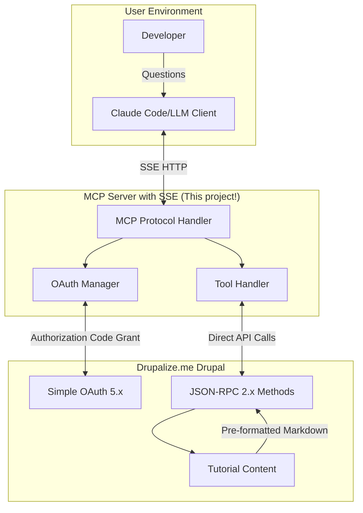
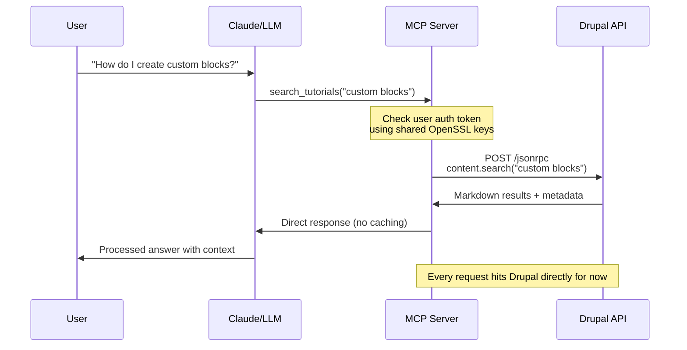

# MCP Server with SSE Transport Capability

## Overview

The MCP (Model Context Protocol) Server with Server-Sent Events (SSE) transport provides the
foundational communication layer between Claude Code/LLM clients and the Drupalize.me tutorial
system. This capability implements a simplified HTTP-based MCP server with a dedicated `/mcp/sse`
endpoint for real-time bidirectional communication.

## Core Requirements

### Transport Layer

- **SSE Transport**: HTTP-based MCP server with `/mcp/sse` endpoint
- **Direct Pass-through**: No caching layer - direct API calls to understand performance baseline
- **Real-time Communication**: Bidirectional message exchange between Claude and the tutorial system

### Integration Points

- **Claude Code/LLM Client**: Receives questions and tool requests via SSE
- **Tool Handler**: Routes MCP tool calls to appropriate handlers

## Technical Architecture

### MCP Protocol Handler

The core MCP server implementation follows a simplified architecture focused on direct integration:

```typescript
// Simplified MCP server - single tool, no caching layer
class SimpleMCPServer {
  async handleSearchRequest(query: string, filters: any) {
    // Direct pass-through to Drupal
    const token = await this.auth.getValidToken(this.currentUser);

    const response = await this.drupalClient.call(
      'content.search',
      {
        query,
        drupal_version: filters.drupal_version,
        tags: filters.tags,
      },
      {
        headers: { Authorization: `Bearer ${token}` },
      }
    );

    // Returns complete tutorial content as RAG-optimized Markdown
    return response;
  }
}
```

### SSE Endpoint Specifications

- **Endpoint**: `/mcp/sse`
- **Protocol**: HTTP-based Server-Sent Events
- **Message Format**: JSON-structured MCP protocol messages
- **Connection Management**: Persistent connections with automatic reconnection

## Component Integration



## Implementation Requirements

### Node.js Project Setup

- **Runtime**: Node.js with TypeScript
- **HTTP Server**: Express.js or similar for SSE endpoint handling
- **Dependencies**:
  - MCP protocol libraries
  - SSE implementation packages
  - HTTP client for JSON-RPC integration

### Core Infrastructure Components

- [ ] Node.js project setup with JavaScript
- [ ] MCP server with SSE transport
- [ ] Protocol handler for message routing
- [ ] Debug mode configuration
- [ ] Basic error handling system

## API Request Flow



## Tool Definitions

The MCP server exposes tools through standardized definitions:

```javascript
// MVP Tool Definitions (Static)
const mcpTools = [
  {
    name: 'search_tutorials',
    description: 'Search Drupalize.me tutorials',
    inputSchema: {
      type: 'object',
      properties: {
        query: { type: 'string' },
        drupal_version: { type: 'string', enum: ['9', '10', '11'] },
        tags: { type: 'array', items: { type: 'string' } },
      },
      required: ['query'],
    },
  },
];
```

## Integration Benefits

### Simplified Development Approach

- **Pure Integration Testing**: Direct API calls without abstraction layers
- **Reduced Moving Parts**: Minimal components during initial development
- **Clear Debugging**: Straightforward request flow for troubleshooting

### Validation Approach

```typescript
// Just pure integration testing:
const result = await jsonrpcClient.call('content.search', params);
return result; // That's it!
```

## Dependencies

## Success Criteria

- ✅ SSE endpoint `/mcp/sse` operational
- ✅ MCP protocol messages properly formatted and routed
- ✅ Direct pass-through to Drupal APIs working
- ✅ Real-time communication between Claude and server established
- ✅ Debug mode and basic error handling implemented

## Implementation Notes

This capability focuses on the foundational transport layer without optimization. The direct
pass-through approach intentionally avoids caching to establish performance baselines and validate
the complete integration stack. Future iterations may introduce caching, connection pooling, and
other optimizations based on observed performance patterns.
