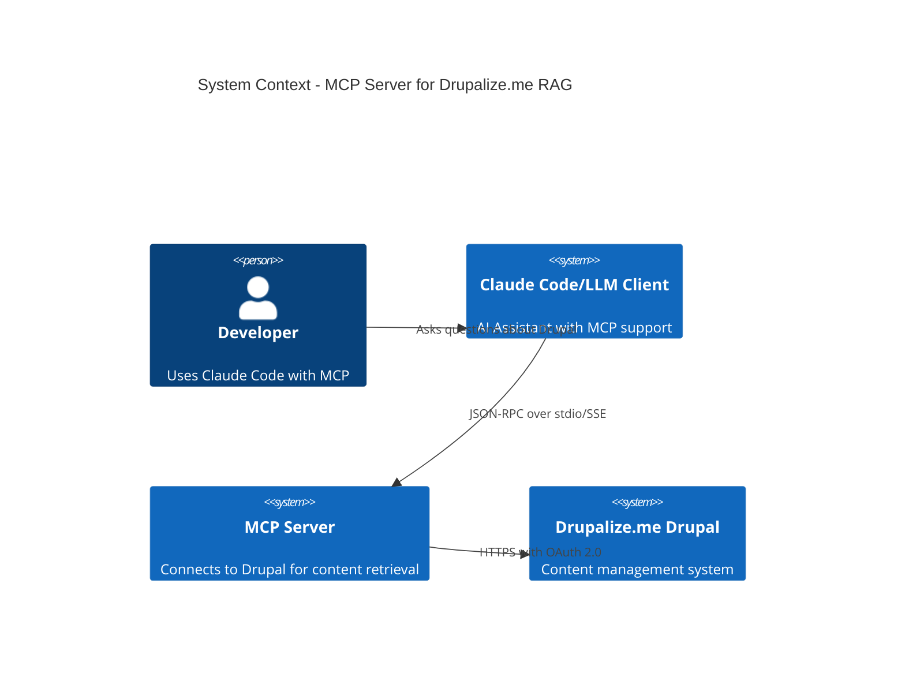
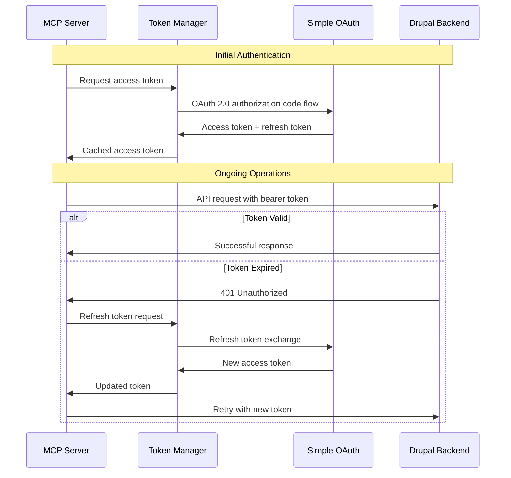
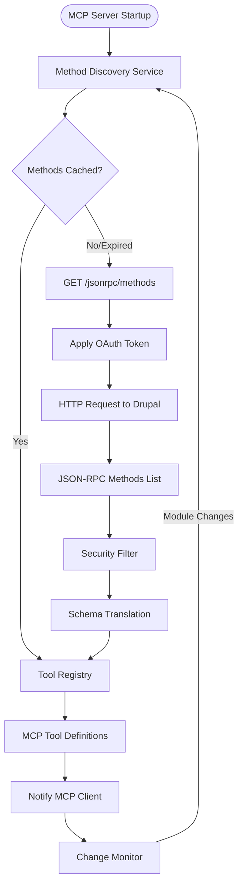
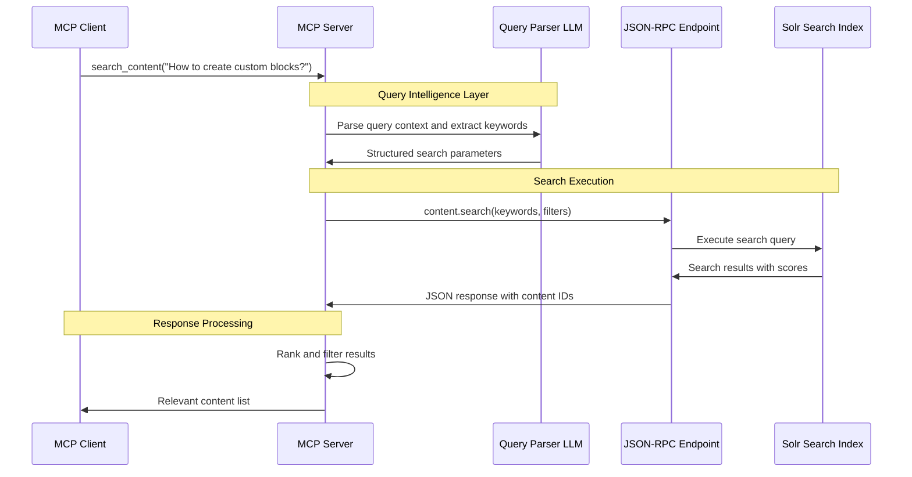
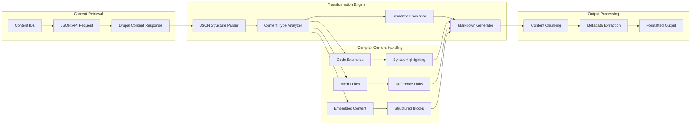
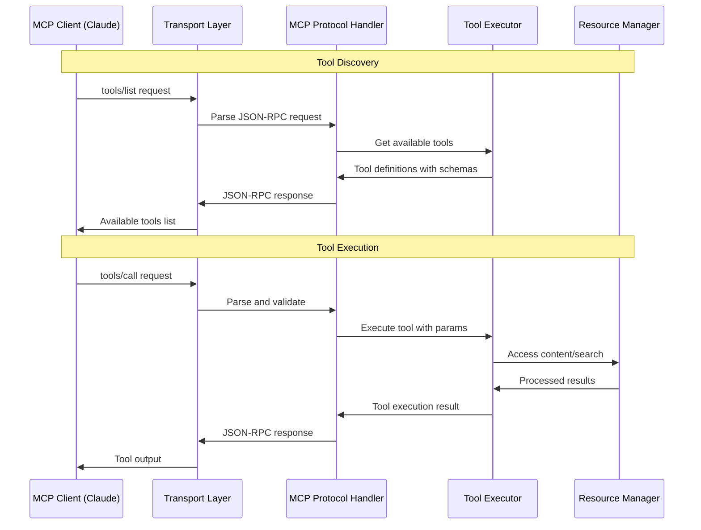
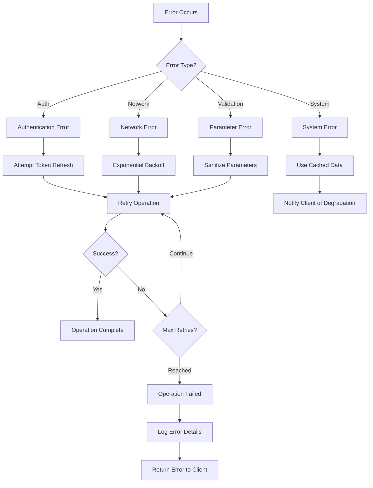

# Architecture Component Diagrams

## 1. High-Level System Context

## 2. Authentication Flow

## 3. Discovery and Tool Registration Flow

## 4. Search Query Processing Flow

## 5. Content Transformation Flow

## 6. MCP Protocol Communication Flow

## 7. Error Handling and Recovery Flow

These focused diagrams make the architecture much clearer by separating concerns and showing specific interaction patterns within each component.