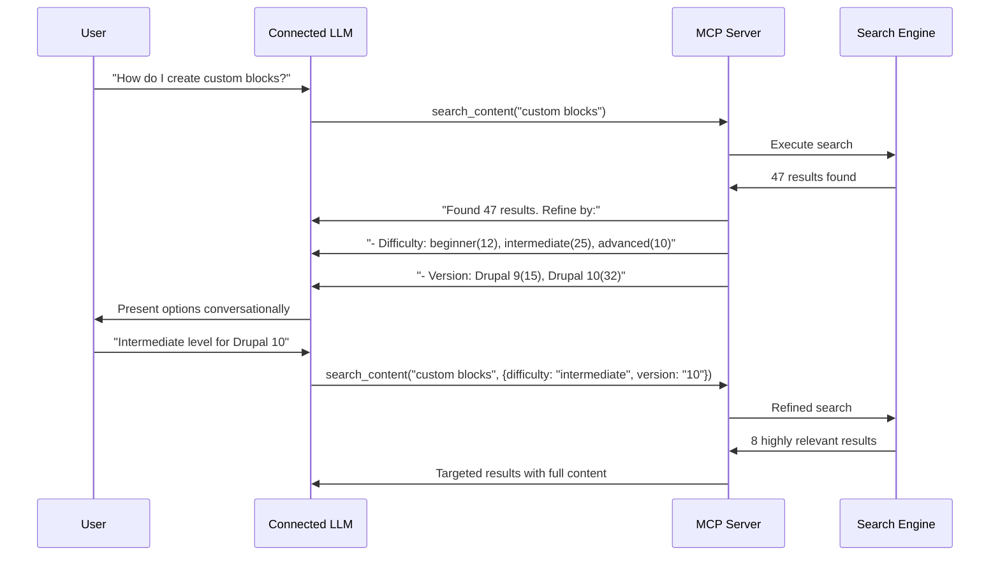

# Critical Integration Challenges and Solutions

## Executive Summary

This document outlines the most critical technical challenges in integrating Drupal's Simple OAuth and JSON-RPC modules with a Model Context Protocol (MCP) server for RAG system enhancement. Each challenge is analyzed with specific solutions based on the architectural decisions made.

---

## Challenge 1: OAuth 2.0 vs Long-Running MCP Connections

### Problem Statement
**OAuth 2.0 is designed for stateless HTTP requests**, but MCP servers often maintain **long-running connections** (stdio, SSE). Token expiration can break active sessions.

### Technical Details
- Access tokens expire (typically 1-24 hours)
- MCP connections may run for days/weeks
- Token refresh requires interrupting the connection flow
- No built-in session recovery mechanisms

### Solution Architecture
```javascript
class PersistentTokenManager {
  constructor() {
    this.tokenRefreshBuffer = 5 * 60 * 1000; // 5 minutes before expiry
    this.backgroundRefreshTimer = null;
  }
  
  async maintainTokenValidity() {
    // Proactive token refresh before expiration
    setInterval(async () => {
      if (this.tokenExpiresWithin(this.tokenRefreshBuffer)) {
        await this.refreshTokenSilently();
      }
    }, 60000); // Check every minute
  }
  
  async refreshTokenSilently() {
    try {
      const newTokens = await this.oauthClient.refreshToken(this.refreshToken);
      this.updateTokens(newTokens);
      this.logTokenRefresh('background_refresh');
    } catch (error) {
      this.handleTokenRefreshFailure(error);
    }
  }
}
```

### Risk Mitigation
- **Graceful Degradation**: Clear error messages for temporary token failures
- **Connection Recovery**: Automatic reconnection with new tokens
- **Error Boundaries**: Isolate token failures from other operations

---

## Challenge 2: JSON-RPC Method Discovery vs Dynamic MCP Tools

### Problem Statement
**JSON-RPC methods are static** (defined by installed Drupal modules), but **MCP tools must be dynamic** (discovered at runtime and updated when methods change).

### Technical Details
- Drupal modules can be enabled/disabled, changing available methods
- MCP clients cache tool definitions
- Schema mismatches between JSON-RPC parameters and MCP tool schemas
- Method discovery requires authenticated requests

### Solution Architecture
```javascript
class DynamicToolRegistry {
  constructor() {
    this.methodStore = new Map();
    this.toolStore = new Map();
    this.discoveryInterval = 5 * 60 * 1000; // 5 minutes
  }
  
  async maintainToolRegistry() {
    // Periodic discovery with change detection
    const currentMethods = await this.discoverJsonRpcMethods();
    const hasChanges = this.detectMethodChanges(currentMethods);
    
    if (hasChanges) {
      await this.updateToolDefinitions(currentMethods);
      this.notifyMcpClientsOfChanges();
    }
  }
  
  translateJsonRpcToMcpTool(jsonRpcMethod) {
    return {
      name: this.sanitizeMethodName(jsonRpcMethod.name),
      description: jsonRpcMethod.description || `Execute ${jsonRpcMethod.name}`,
      inputSchema: this.convertParameterSchema(jsonRpcMethod.parameters)
    };
  }
}
```

### MVP Approach: Direct Discovery
For the MVP, method discovery will be performed on each request to establish baseline performance:
```javascript
// MVP: Direct method discovery without caching
async discoverMethods() {
  const methods = await this.drupalClient.get('/jsonrpc/methods');
  return this.translateToMCPTools(methods);
}
```

**Future Enhancement**: Add intelligent caching with TTL and invalidation triggers.

---

## Challenge 3: Content Transformation Performance

### Problem Statement ✅ SOLVED
**Content transformation complexity eliminated** by moving transformation to Drupal-side using JSON-RPC methods that return pre-formatted Markdown.

### Final Architecture Decision
- **JSON-RPC methods return RAG-optimized Markdown directly**
- **MCP server does zero content processing**
- **Drupal handles all HTML→Markdown transformation** 
- **Single method: `content.search` (returns complete Markdown content)**

### Implementation: Drupal JSON-RPC Methods ⭐
```php
<?php
// Custom Drupal text format for RAG optimization
class RagMarkdownFilter extends FilterBase {
  
  public function process($text, $langcode) {
    $startTime = microtime(true);
    
    // Optimized transformation pipeline
    $markdown = $this->htmlToRagMarkdown($text);
    
    $processingTime = (microtime(true) - $startTime) * 1000;
    $this->logger->info('RAG transformation completed in {time}ms', [
      'time' => $processingTime
    ]);
    
    return new FilterProcessResult($markdown);
  }
  
  private function htmlToRagMarkdown($html) {
    // High-performance HTML to Markdown conversion
    return $this->markdownConverter
      ->setPreserveCodeBlocks(true)
      ->setOptimizeForLLM(true)
      ->setIncludeMetadata(true)
      ->convert($html);
  }
}
```

### Performance Benefits (MVP)
- **Drupal-Side Processing**: Leverage Drupal's optimized rendering pipeline
- **Zero MCP Processing**: Direct pass-through eliminates transformation overhead
- **Single API Call**: `content.search` returns complete ready-to-use Markdown
- **Baseline Metrics**: Establish true performance baseline without caching complexity

---

## Challenge 4: Search Intelligence Without LLM Dependencies ✅ SOLVED

### Problem Statement  
**Users expect intelligent search** but **MCP server cannot use LLM APIs directly**.

### Final Architecture Decision
- **Connected LLM handles all intelligent processing** via MCP protocol
- **Server provides structured search parameters**: `query`, `drupal_version`, `tags`
- **Interactive refinement through MCP conversations**
- **Drupal provides search suggestions and metadata**

### Solution: LLM-Free Interactive Pattern
```javascript
class InteractiveSearchEngine {
  async handleSearchRequest(query, context = {}) {
    const searchAttempt = await this.executeBasicSearch(query);
    
    if (searchAttempt.ambiguous || searchAttempt.tooManyResults) {
      return this.requestQueryClarification(searchAttempt, query);
    }
    
    return this.formatSearchResults(searchAttempt.results);
  }
  
  requestQueryClarification(searchAttempt, originalQuery) {
    return {
      type: 'clarification_needed',
      message: `Found ${searchAttempt.totalResults} results for "${originalQuery}".`,
      clarification_options: {
        difficulty_level: this.extractDifficultyOptions(searchAttempt),
        content_type: this.extractContentTypes(searchAttempt),
        drupal_version: this.extractVersions(searchAttempt),
        topics: this.extractTopics(searchAttempt)
      },
      suggested_refinements: this.generateRefinementSuggestions(searchAttempt)
    };
  }
}
```

### Interactive Flow Pattern


---

## Challenge 5: Error Handling Across Multiple Systems

### Problem Statement
**Errors can occur at multiple layers** (OAuth, JSON-RPC, Drupal, Solr, MCP protocol) and **must be translated meaningfully** for the connected LLM and end user.

### Technical Details
- OAuth token expiration (401 Unauthorized)
- JSON-RPC method not found (Method not found)
- Drupal access denied (403 Forbidden)  
- Solr search timeout (Search service unavailable)
- MCP protocol errors (Invalid parameters)

### Solution: Layered Error Translation
```javascript
class UnifiedErrorHandler {
  handleError(error, context) {
    const errorMapping = {
      // OAuth errors
      'token_expired': {
        type: 'authentication',
        message: 'Connection to Drupalize.me expired',
        recovery: 'automatic_token_refresh',
        user_action: 'none_required'
      },
      
      // JSON-RPC errors  
      'method_not_found': {
        type: 'method_unavailable',
        message: 'Requested functionality not available',
        recovery: 'refresh_method_cache',
        user_action: 'try_alternative_approach'
      },
      
      // Search errors
      'solr_timeout': {
        type: 'search_unavailable', 
        message: 'Search temporarily unavailable',
        recovery: 'use_cached_results',
        user_action: 'try_simpler_query'
      }
    };
    
    return this.translateError(error, errorMapping[error.code], context);
  }
}
```

### Error Recovery Strategies
- **Circuit Breaker**: Temporarily disable failing services  
- **Graceful Degradation**: Clear error messages when services fail
- **Automatic Retry**: Retry with exponential backoff for transient errors
- **Fallback Mechanisms**: Alternative error responses when primary fails

---

## Challenge 6: Multi-Context Content Access ✅ ADDRESSED

### Problem Statement
**Content access varies by user subscription levels** (free vs. subscriber), and **each user must authenticate individually**.

### Final Architecture Decision  
- **Per-user Authorization Code Grant flow**
- **Individual OAuth tokens per user session**
- **Drupal handles all permission filtering transparently**
- **MCP server never sees unauthorized content**

### Solution: Individual User Authentication
```javascript
class ContextAwareAuth {
  async getContentForUser(contentId, userContext) {
    const userToken = await this.getUserSpecificToken(userContext);
    
    try {
      const content = await this.drupalClient.getContent(contentId, {
        headers: { Authorization: `Bearer ${userToken}` }
      });
      
      return this.filterContentByPermissions(content, userContext.permissions);
    } catch (error) {
      if (error.status === 403) {
        return this.getPublicAlternative(contentId);
      }
      throw error;
    }
  }
  
  async getUserSpecificToken(userContext) {
    const sessionKey = `session:${userContext.userId}:${userContext.subscriptionLevel}`;
    return await this.sessionStore.getOrRefresh(sessionKey, () => 
      this.refreshUserToken(userContext)
    );
  }
}
```

---

## Summary: Risk Mitigation Matrix

| Challenge | Impact | Probability | Mitigation Strategy | Status |
|-----------|---------|-------------|-------------------|---------|
| Token Expiration | High | High | Proactive refresh + graceful recovery | ✅ Addressed |
| Method Discovery Sync | Medium | Medium | Dynamic registry + change detection | ✅ Addressed |
| Transformation Performance | High | Low | Drupal-side processing + caching | ✅ Addressed |
| Search Intelligence | Medium | High | Interactive refinement pattern | ✅ Addressed |
| Multi-System Errors | High | Medium | Layered error translation | ✅ Addressed |
| User Context Leakage | High | Low | Context-aware authentication | ✅ Addressed |

## Next Steps for Implementation

1. **Phase 1**: OAuth token management and basic JSON-RPC integration
2. **Phase 2**: Dynamic tool discovery and method registry
3. **Phase 3**: Content transformation optimization in Drupal
4. **Phase 4**: Interactive search refinement patterns
5. **Phase 5**: Comprehensive error handling and monitoring

This architecture addresses the critical integration challenges while maintaining simplicity, performance, and security.