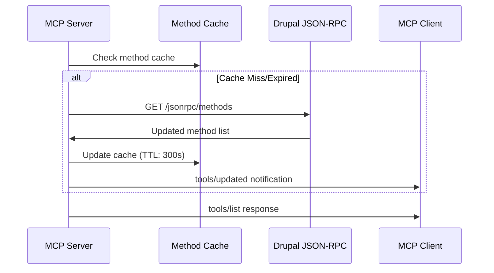

# JSON-RPC Discovery Integration Analysis

## Drupal JSON-RPC Module Capabilities

### Discovery Mechanism

- **Endpoint**: `/jsonrpc/methods` (requires `jsonrpc_discovery` sub-module)
- **Method**: HTTP GET request returns available methods with metadata
- **Format**: JSON response with method names, descriptions, and parameter schemas
- **Security**: Respects Drupal permissions and access controls

### Method Execution

- **POST Execution**: `/jsonrpc` with JSON-RPC 2.0 specification body
- **GET Execution**: `/jsonrpc?query=<url-encoded-json>`
- **Stateless**: Each request is independent, no session state
- **Built-in Methods**: Exposes Drupal internals (permissions, modules, cache operations)

## Critical Integration Challenges

### 1. Schema Translation Complexity

#### Drupal → JSON Schema Mapping

**Challenge**: Drupal field types and validation rules must be translated to JSON Schema **Complex
Mappings**:

- `entity_reference` → JSON Schema with entity validation
- `datetime` → JSON Schema with ISO 8601 format
- `text_formatted` → Complex object with value/format properties
- `file` → Media/file reference with validation
- Custom field types → Extensible schema translation

**Example Translation**:

```json
// Drupal JSON-RPC Method Schema
{
  "method": "content.search",
  "params": {
    "query": {"type": "string", "required": true},
    "bundle": {"type": "entity_reference", "target": "node_type"},
    "published": {"type": "boolean", "default": true},
    "created": {"type": "datetime", "format": "drupal_date"}
  }
}

// Required MCP Tool Schema
{
  "name": "content_search",
  "description": "Search Drupalize.me content",
  "inputSchema": {
    "type": "object",
    "properties": {
      "query": {"type": "string", "description": "Search terms"},
      "bundle": {"type": "string", "enum": ["tutorial", "guide", "reference"]},
      "published": {"type": "boolean", "default": true},
      "created": {"type": "string", "format": "date-time"}
    },
    "required": ["query"]
  }
}
```

### 2. Method Filtering and Security

#### Security-First Filtering

**Challenge**: Not all JSON-RPC methods should become MCP tools **Filtering Criteria**:

- **Permission-based**: User access level vs method requirements
- **Content-relevance**: Focus on content discovery/retrieval methods
- **Performance impact**: Exclude expensive administrative operations
- **Rate limiting**: Methods that could overwhelm the system

**Recommended Filters**:

```yaml
included_methods:
  - content.*          # Content operations
  - search.*          # Search operations
  - taxonomy.*        # Classification
  - media.*           # Media handling

excluded_methods:
  - system.cache_clear # Administrative
  - user.login        # Security sensitive
  - node.delete       # Destructive operations
  - *.admin.*         # Admin-only methods
```

### 3. Dynamic Tool Registration

#### Real-time Updates Challenge

**Problem**: Drupal modules can be enabled/disabled, changing available methods **Impact**: MCP tool
registry becomes stale, client confusion **Solution Architecture**:



### 4. Multi-layered Validation

#### Parameter Validation Challenges

**Problem**: Validation needed at MCP layer AND Drupal layer **Complexity**:

- MCP validates against JSON Schema
- Drupal validates against internal rules
- Mismatches cause confusing errors

**Validation Strategy**:

1. **Eager Validation**: MCP validates parameters before forwarding
2. **Schema Synchronization**: Keep MCP schemas in sync with Drupal reality
3. **Error Translation**: Convert Drupal validation errors to MCP format
4. **Fallback Handling**: Graceful degradation for schema mismatches

### 5. Performance and Caching

#### Caching Strategy Requirements

**Discovery Caching**:

- Method list cache: 5-10 minutes TTL
- Schema cache: Per-method with version tracking
- Permission cache: User-specific, shorter TTL

**Cache Invalidation**:

- Module enable/disable events
- Permission changes
- Schema updates
- Manual cache clear operations

**Performance Optimizations**:

- Lazy schema loading (fetch schema on first use)
- Batch method discovery
- Connection pooling for JSON-RPC requests
- Response compression

### 6. Error Handling Translation

#### JSON-RPC → MCP Error Mapping

**Challenge**: Different error formats and semantics

```javascript
// JSON-RPC Error
{
  "code": -32602,
  "message": "Invalid params",
  "data": {
    "field": "bundle",
    "error": "Invalid entity type"
  }
}

// MCP Error Response
{
  "error": {
    "code": "INVALID_PARAMS",
    "message": "Parameter 'bundle' contains invalid entity type",
    "data": {
      "parameter": "bundle",
      "expected": ["tutorial", "guide", "reference"],
      "received": "invalid_type"
    }
  }
}
```

## Recommended Discovery Architecture

### Discovery Engine Components

1. **Method Discovery Service**: Polls `/jsonrpc/methods` with intelligent caching
2. **Schema Translation Engine**: Converts Drupal schemas to JSON Schema
3. **Security Filter**: Applies permission-based method filtering
4. **Tool Registry**: Maintains MCP tool definitions with versioning
5. **Update Notification Service**: Pushes tool changes to MCP clients

### Integration Pattern

```
┌─────────────────────────────────────┐
│       Discovery Engine              │
├─────────────────────────────────────┤
│ Discovery → Translation → Filter    │
│      ↓         ↓          ↓        │
│   Cache → Registry → Notification   │
└─────────────────────────────────────┘
```

This architecture ensures robust, secure, and performant integration between Drupal's JSON-RPC
capabilities and MCP's tool system.
