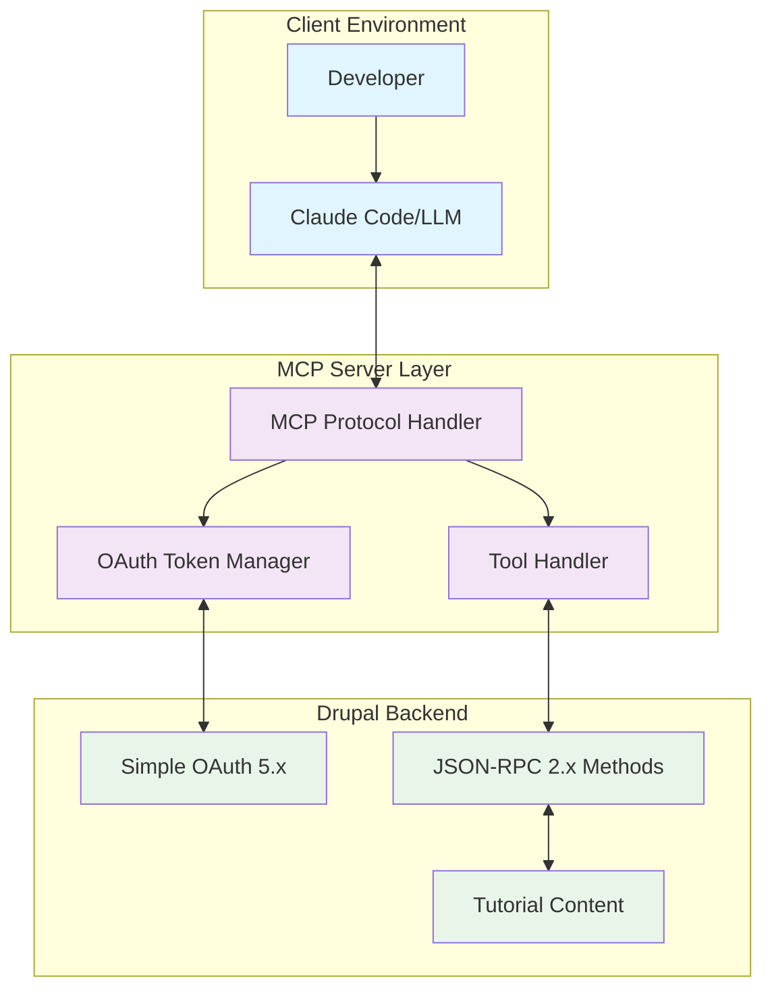

# MCP Server Architecture Project Summary

## Project Overview

**Objective**: Design an MCP (Model Context Protocol) server architecture that connects to Drupalize.me's Drupal installation to enhance RAG (Retrieval Augmented Generation) systems with high-quality tutorial content.

**Core Innovation**: LLM-free server architecture that leverages the connected LLM client for intelligent processing, eliminating API costs and configuration complexity.

## Key Architectural Decisions

### 🎯 Decision 1: LLM-Free Server Architecture
**Choice**: MCP server leverages connected LLM via protocol interactions rather than maintaining its own LLM connections.

**Benefits**:
- Zero additional LLM API costs
- Simplified configuration (no API keys)  
- Better MCP protocol alignment
- Enhanced user experience through conversational flow

### 🎯 Decision 2: JSON-RPC Direct Markdown Transformation  
**Choice**: Drupal's JSON-RPC module transforms content to RAG-optimized Markdown before returning to MCP server.

**Benefits**:
- Dramatically simplified MCP server (becomes direct pass-through)
- Better performance (single transformation step)
- Leverages Drupal's content rendering expertise
- Consistent output formatting

### 🎯 Decision 3: OAuth 2.0 with Persistent Token Management
**Choice**: Hybrid authentication using Simple OAuth with connection-level token management and automatic refresh.

**Benefits**:
- Standards-compliant security
- Handles long-running MCP connections
- Granular scope-based permissions
- Automatic recovery from token expiration

## System Architecture

## Core Components

### 1. LLM-Free Interactive Processing
- **Connected LLM Handles Intelligence**: Server leverages existing LLM via MCP protocol
- **Conversational Search**: Natural query refinement through MCP interactions
- **Context Preservation**: LLM maintains full conversation context across requests

### 2. Direct API Integration (MVP)
- **Single Tool Definition**: One core tool (`search_tutorials`) returns complete content
- **Single JSON-RPC Method**: `content.search` returns RAG-optimized Markdown 
- **Direct Pass-through**: No server-side processing or caching

### 3. Drupal-Side Content Processing
- **Pre-formatted Markdown**: Drupal returns RAG-optimized content
- **Zero MCP Transformation**: Server acts as authenticated proxy
- **Performance Baseline**: Establish true response times before optimization

## Critical Innovations

### 1. Zero-Configuration Intelligence
**Problem**: Traditional RAG systems require LLM API setup and management.
**Solution**: Leverage existing LLM connection through MCP protocol interactions.

### 2. Simplified Direct Integration
**Problem**: Complex multi-layered architectures create debugging challenges.
**Solution**: Direct API calls establish clear performance baselines and simple debugging.

### 3. Drupal-Native Content Processing  
**Problem**: Complex content transformation in external systems.
**Solution**: JSON-RPC method (`content.search`) returns complete tutorials as pre-formatted Markdown.

## Implementation Roadmap

### Phase 1: Foundation (Weeks 1-2)
- [ ] OAuth token management implementation
- [ ] Basic JSON-RPC integration
- [ ] MCP protocol handler setup
- [ ] Authentication flow testing

### Phase 2: Dynamic Discovery (Weeks 3-4)  
- [ ] Method discovery service
- [ ] Tool registry implementation
- [ ] Schema translation engine
- [ ] Change detection and notification

### Phase 3: Content Transformation (Weeks 5-6)
- [ ] RAG Markdown text format in Drupal
- [ ] Extended JSON-RPC methods
- [ ] Content optimization for LLM consumption
- [ ] Performance testing and tuning

### Phase 4: Interactive Search (Weeks 7-8)
- [ ] Query clarification patterns
- [ ] Search result ranking optimization
- [ ] Interactive refinement flows
- [ ] User experience testing

### Phase 5: Production Readiness (Weeks 9-10)
- [ ] Comprehensive error handling
- [ ] Performance monitoring
- [ ] Security audit and hardening
- [ ] Documentation and deployment guides

## Success Metrics

### Performance Targets
| Metric | Target | Measurement |
|--------|--------|-------------|
| Content Retrieval | < 200ms (95th percentile) | End-to-end response time |
| Token Refresh | < 100ms | Background refresh duration |
| Search Results | < 300ms | Query to results delivery |
| Cache Hit Ratio | > 80% | Cached vs. fresh requests |

### Quality Metrics
| Metric | Target | Measurement |
|--------|--------|-------------|
| Markdown Structure | 100% valid | Automated validation |
| Link Integrity | > 99% | Periodic link checking |
| Search Relevance | > 85% user satisfaction | User feedback scoring |
| Error Recovery | > 95% automatic recovery | Error handling effectiveness |

## Risk Assessment & Mitigation

### High-Priority Risks
1. **OAuth Token Expiration**: Mitigated by proactive refresh and graceful recovery
2. **Drupal Module Dependencies**: Mitigated by comprehensive testing and version pinning
3. **Performance Under Load**: Mitigated by aggressive caching and connection pooling
4. **Content Quality**: Mitigated by Drupal-side validation and formatting

### Medium-Priority Risks
1. **Schema Synchronization**: Mitigated by dynamic discovery and validation
2. **Search Result Relevance**: Mitigated by interactive refinement patterns
3. **Security Vulnerabilities**: Mitigated by OAuth best practices and regular audits

## Technical Documentation

### Architecture Artifacts Created
- [System Architecture Diagrams](./component-diagrams.md)
- [Authentication Analysis](./authentication-analysis.md) 
- [JSON-RPC Discovery Analysis](./jsonrpc-discovery-analysis.md)
- [Search Intelligence Architecture](./search-intelligence-analysis.md)
- [Content Transformation Analysis](./content-transformation-analysis.md)
- [LLM-Free Architecture Revision](./llm-free-architecture-revision.md)
- [Content Transformation Options](./content-transformation-options.md)
- [Critical Integration Challenges](./critical-integration-challenges.md)

### Architecture Decision Records
- [ADR-001: LLM-Free Server Architecture](./adr/ADR-001-llm-free-server-architecture.md)
- [ADR-002: JSON-RPC Markdown Transformation](./adr/ADR-002-json-rpc-markdown-transformation.md)
- [ADR-003: OAuth Authentication Strategy](./adr/ADR-003-oauth-authentication-strategy.md)

## Competitive Advantages

### 1. Cost Efficiency
- **No LLM API Costs**: Leverages existing user connections
- **Minimal Infrastructure**: Simple server with OAuth and caching
- **Reduced Complexity**: Fewer moving parts and dependencies

### 2. User Experience Excellence
- **Natural Interaction**: Conversational search and content discovery
- **Context Awareness**: Maintains conversation flow and user preferences
- **Real-time Refinement**: Interactive query improvement

### 3. Technical Innovation
- **Protocol-Native Design**: Proper MCP resource and tool patterns
- **Drupal Integration**: Leverages CMS strengths for content processing
- **Dynamic Capabilities**: Automatically adapts to available functionality

## Conclusion

This architecture delivers a sophisticated RAG enhancement system that:

- **Eliminates LLM costs** while providing intelligent behavior
- **Simplifies deployment** with minimal configuration requirements
- **Leverages existing systems** (Drupal, Simple OAuth, JSON-RPC) effectively  
- **Provides excellent UX** through conversational interaction patterns
- **Scales efficiently** with caching and connection pooling
- **Maintains security** through OAuth best practices

The design transforms complex RAG system challenges into elegant solutions by aligning with MCP protocol principles and leveraging the strengths of each component system.

**Ready for Implementation**: All architectural decisions documented, risks mitigated, and implementation roadmap defined.