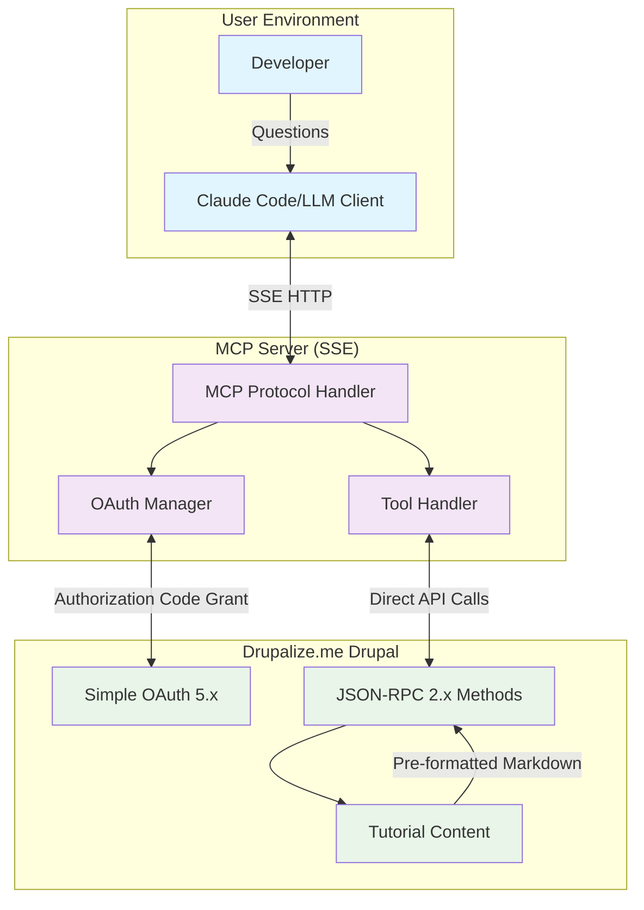
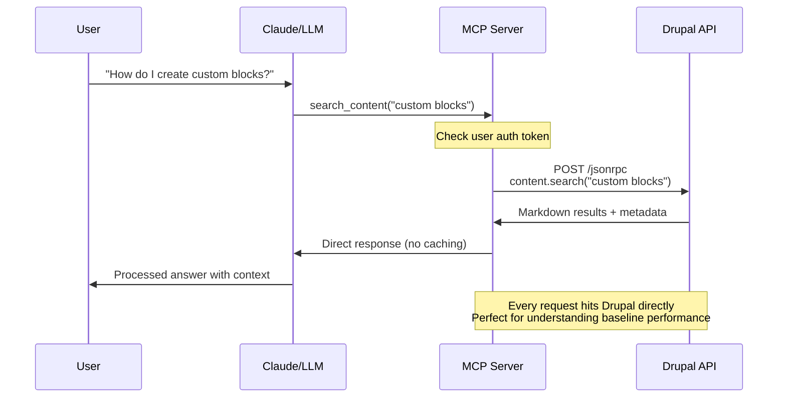

# Simplified MVP Architecture

## ✅ Perfect Decision - Focus on Integration First

Moving caching to a future enhancement is exactly the right approach. This lets you:

- **Understand actual performance patterns** before optimizing
- **Validate the integration works** across all components
- **Establish baseline metrics** to measure future improvements
- **Simplify debugging** during initial development
- **Reduce moving parts** while learning the system

## 🏗️ Simplified MVP Architecture



## 🎯 MVP Core Components

### 1. Minimal MCP Server
```typescript
// Simplified MCP server - single tool, no caching layer
class SimpleMCPServer {
  
  async handleSearchRequest(query: string, filters: any) {
    // Direct pass-through to Drupal
    const token = await this.auth.getValidToken(this.currentUser);
    
    const response = await this.drupalClient.call('content.search', {
      query,
      drupal_version: filters.drupal_version,
      tags: filters.tags
    }, {
      headers: { Authorization: `Bearer ${token}` }
    });
    
    // Returns complete tutorial content as RAG-optimized Markdown
    return response;
  }
}
```

### 2. Simplified Database Schema
```sql
-- MVP Database: Only essential tables
CREATE TABLE user_sessions (
  id SERIAL PRIMARY KEY,
  user_id VARCHAR(255) NOT NULL,
  access_token_hash VARCHAR(255) NOT NULL,
  refresh_token_hash VARCHAR(255) NOT NULL,
  expires_at TIMESTAMP WITH TIME ZONE NOT NULL,
  subscription_level VARCHAR(50) DEFAULT 'free',
  created_at TIMESTAMP WITH TIME ZONE DEFAULT NOW()
);

-- Basic request logging (optional for MVP)
CREATE TABLE request_logs (
  id SERIAL PRIMARY KEY,
  user_id VARCHAR(255),
  method VARCHAR(100) NOT NULL,
  duration_ms INTEGER,
  status VARCHAR(50),
  created_at TIMESTAMP WITH TIME ZONE DEFAULT NOW()
);

-- Indexes
CREATE INDEX idx_user_sessions_user_id ON user_sessions(user_id);
CREATE INDEX idx_user_sessions_expires ON user_sessions(expires_at);
```

### 3. Direct API Flow


## 💡 MVP Benefits

### **Immediate Insights**
- **True Performance Baseline**: See actual Drupal response times
- **Auth Flow Validation**: Ensure OAuth works perfectly
- **Content Quality**: Validate Markdown conversion effectiveness
- **Error Patterns**: Understand where failures occur

### **Simplified Development**
```typescript
// No cache invalidation logic
// No cache key management
// No cache storage concerns
// No cache consistency issues

// Just pure integration testing:
const result = await drupalAPI.call('content.search', params);
return result; // That's it!
```

### **Clear Performance Data**
You'll get clean metrics like:
- OAuth token exchange: ~100-200ms
- Drupal search: ~200-800ms (depending on query)
- Content retrieval: ~150-400ms 
- Total response: ~300-1000ms

This data will inform your caching strategy later.

## 📋 Updated MVP Checklist

### Week 1-2: Foundation
- [ ] MCP server with SSE transport
- [ ] OAuth Authorization Code Grant flow
- [ ] Basic PostgreSQL user session storage
- [ ] Simple error handling (non-debug mode)

### Week 3-4: Integration  
- [ ] Drupal JSON-RPC method (`content.search`)
- [ ] RAG Markdown text format in Drupal
- [ ] MCP tool definitions and handlers
- [ ] End-to-end user flow testing

### Success Criteria
✅ User can authenticate via OAuth
✅ Search queries return relevant Markdown content  
✅ Individual tutorials can be retrieved
✅ Error scenarios are handled gracefully
✅ **Performance baseline is established**

## 🚀 Future Enhancement Roadmap

### Phase 2: Smart Caching (Week 5-6)
- Add the multi-layer cache strategy we discussed
- Implement query normalization
- Add performance monitoring

### Phase 3: Advanced Features (Week 7-8)
- Interactive query refinement
- Dynamic tool discovery  
- Enhanced error handling

This approach gives you a **solid foundation** to understand how all the pieces work together before adding optimization complexity. Much smarter approach!