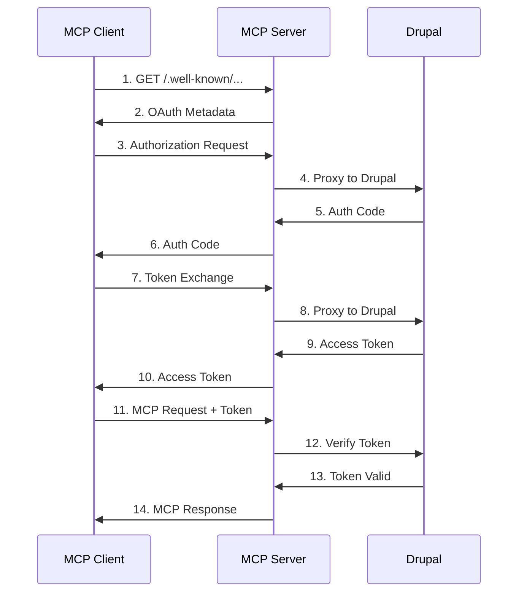

# OAuth 2.1 Integration for Drupal MCP Server

This module implements OAuth 2.1 authentication for the Model Context Protocol (MCP) server,
enabling secure integration with Drupal's Simple OAuth 2.1 module.

## Architecture

The OAuth integration consists of three main components:

### 1. OAuth Configuration Manager (`config.ts`)

Manages OAuth configuration and handles automatic metadata discovery:

- Validates environment variables and OAuth configuration
- Discovers OAuth endpoints from Drupal's `.well-known/oauth-authorization-server`
- Caches metadata to reduce discovery requests
- Provides type-safe configuration access

### 2. Drupal OAuth Provider (`provider.ts`)

Implements the OAuth server provider that proxies authentication to Drupal:

- Extends `ProxyOAuthServerProvider` from MCP SDK
- Handles token verification via Drupal's introspection endpoint
- Manages OAuth client information and caching
- Supports authorization code and refresh token flows

### 3. HTTP MCP Server (`../server-http.ts`)

OAuth-enabled HTTP server using StreamableHTTP transport:

- Integrates OAuth metadata router for discovery endpoints
- Manages per-session authentication state
- Provides health check and authentication status tools
- Supports CORS and DNS rebinding protection

## OAuth Flow



## Configuration

### Environment Variables

```bash
# Drupal Server
DRUPAL_URL=https://your-drupal-site.com

# OAuth Client Credentials (from Drupal Simple OAuth setup)
OAUTH_CLIENT_ID=mcp-server-client
OAUTH_CLIENT_SECRET=your-client-secret-from-drupal

# OAuth Scopes (space or comma-separated)
OAUTH_SCOPES="profile tutorial_read user_read tutorial_search"

# Enable/Disable OAuth Authentication
AUTH_ENABLED=true

# Optional: Override resource server URL (defaults to DRUPAL_URL)
OAUTH_RESOURCE_SERVER_URL=https://your-drupal-site.com

# HTTP Server Configuration
HTTP_PORT=6200
HTTP_HOST=localhost
HTTP_CORS_ORIGINS=http://localhost:6200,http://localhost:6201
```

### Drupal Simple OAuth Setup

On the Drupal side, you need to:

1. Install and enable the Simple OAuth module (OAuth 2.1)
2. Generate RSA keys for token signing
3. Create an OAuth client with:
   - Client ID matching `OAUTH_CLIENT_ID`
   - Client Secret matching `OAUTH_CLIENT_SECRET`
   - Appropriate redirect URIs
   - Required scopes enabled
4. Configure the `.well-known/oauth-authorization-server` endpoint

## Usage

### Starting the OAuth-Enabled Server

```bash
# Development mode
npm run dev:http

# Production mode
npm run build
npm run start:http
```

### Programmatic Usage

```typescript
import { DrupalMCPHttpServer } from './server-http.js';

const server = new DrupalMCPHttpServer({
  name: 'my-mcp-server',
  version: '1.0.0',
  port: 6200,
  host: 'localhost',
  enableAuth: true,
});

await server.start();
```

## Endpoints

The OAuth-enabled MCP server provides the following endpoints:

### MCP Protocol

- **POST/GET /mcp** - Main MCP endpoint for client connections

### Health Check

- **GET /health** - Server health status

### OAuth Discovery

- **GET /.well-known/oauth-protected-resource** - Protected resource metadata

## Security Features

1. **Token Introspection**: Access tokens are verified with Drupal on each request
2. **Session Isolation**: Each MCP client connection has its own session
3. **DNS Rebinding Protection**: Host and origin validation
4. **CORS Support**: Configurable cross-origin resource sharing
5. **Metadata Caching**: Reduces discovery requests while maintaining security

## Tools

The server provides these MCP tools:

### health_check

Returns server health status including OAuth configuration state.

**Request:**

```json
{
  "name": "health_check"
}
```

**Response:**

```json
{
  "status": "healthy",
  "server": "drupal-mcp-server",
  "version": "1.0.0",
  "authEnabled": true,
  "timestamp": "2025-09-29T23:00:00.000Z"
}
```

### auth_status

Returns OAuth authentication status.

**Request:**

```json
{
  "name": "auth_status"
}
```

**Response:**

```json
{
  "authEnabled": true,
  "message": "OAuth authentication is enabled"
}
```

## Type Safety

All OAuth components are fully type-safe with TypeScript:

- Strict null checks enabled
- Zod schema validation for OAuth metadata
- Comprehensive type definitions for all interfaces
- No use of `any` types

## Error Handling

The implementation includes comprehensive error handling:

- OAuth metadata discovery failures
- Token verification errors
- Network timeouts and failures
- Invalid configuration detection
- Session management errors

## Development

### Running Tests

```bash
npm test
```

### Type Checking

```bash
npm run type-check
```

### Building

```bash
npm run build
```

## Compliance

This implementation follows:

- **RFC 6749**: OAuth 2.0 Authorization Framework
- **RFC 8414**: OAuth 2.0 Authorization Server Metadata
- **RFC 8707**: Resource Indicators for OAuth 2.0
- **OAuth 2.1**: Latest OAuth security best practices
- **MCP Specification**: Model Context Protocol transport and auth requirements

## Troubleshooting

### OAuth Discovery Fails

- Verify `DRUPAL_URL` is correct and accessible
- Check that Drupal's `.well-known/oauth-authorization-server` endpoint returns valid metadata
- Ensure network connectivity to Drupal server

### Token Verification Fails

- Verify `OAUTH_CLIENT_ID` and `OAUTH_CLIENT_SECRET` match Drupal configuration
- Check that the access token is valid and not expired
- Ensure Drupal's introspection endpoint is accessible

### CORS Errors

- Add client origin to `HTTP_CORS_ORIGINS` environment variable
- Verify CORS headers are being set correctly

## Future Enhancements

Potential improvements for future versions:

1. Support for device authorization flow
2. Token refresh handling with automatic retry
3. JWT token validation for reduced introspection calls
4. Multiple OAuth provider support
5. Custom token storage backends
6. Rate limiting for OAuth endpoints
